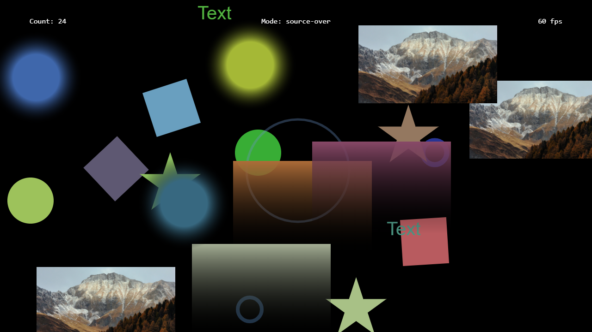

---
title: Drawing Plugin
category: Experts API - Benchmark
summary: Reference for the MSX drawing plugin benchmark test.
---

# Drawing Plugin

This is a special video plugin that has been developed to check the performance and capabilities of a TV device. You can use it to compare the performance/capabilities with other TV (or mobile/desktop) devices.

The plugin can be used with version **0.1.144** or higher.

## Example

### Screenshot



### Code

```json
{
    "type": "pages",
    "headline": "Drawing Plugin",
    "pages": [{  
            "items": [{           
                    "type": "default",
                    "layout": "0,0,12,6",
                    "color": "msx-glass",
                    "icon": "msx-white-soft:color-lens",
                    "iconSize": "large",
                    "title": "Start Drawing",                    
                    "playerLabel": "Drawing",
                    "action": "video:plugin:http://msx.benzac.de/plugins/drawing.html",
                    "live": {
                        "type": "playback",                        
                        "action": "player:show"
                    },
                    "properties": {
                        "control:return": "silent",
                        "control:action": "player:button:content:execute",
                        "control:dim": false,
                        "progress:type": "fix:",
                        "button:restart:enable": false,
                        "progress:marker:enable": false,
                        "button:forward:enable": false,
                        "button:rewind:enable": false,
                        "button:speed:enable": false,
                        "button:content:focus": true,
                        "button:content:icon": "palette",
                        "button:content:action": "player:auto:restart",
                        "label:position": "Select {ico:msx-white:palette} to perform drawing actions",
                        "label:duration": "Alternatively, press {txt:msx-white:OK} while drawing is in foreground",
                        "trigger:back": "player:stop",
                        "trigger:stop": "close:drawing"
                    }
                }]
        }]
}
```

### Demo

- [Launch via App](https://msx.benzac.de/?start=content:https://msx.benzac.de/info/xp/data/benchmark_test_2.json)
- [Launch via Demo Page](https://msx.benzac.de/info/?start=content:https://msx.benzac.de/info/xp/data/benchmark_test_2.json)

## See Also

- [Renderer Plugin](./renderer-plugin.md)
- [Particles Plugin](./particles-plugin.md)
