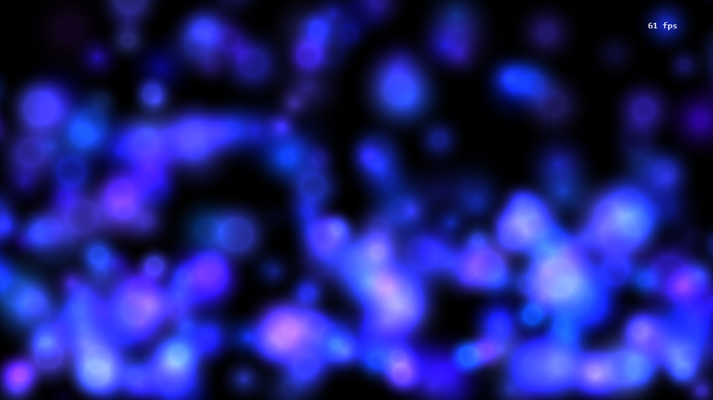

---
title: Particles Plugin
category: Experts API - Benchmark
summary: Reference for the MSX particles plugin benchmark test.
---

# Particles Plugin

This is a special video plugin that has been developed to check the performance and capabilities of a TV device. You can use it to compare the performance/capabilities with other TV (or mobile/desktop) devices.

The plugin can be used with version **0.1.74** or higher.

## Example

### Screenshot



### Code

```json
{
    "type": "pages",
    "headline": "Particles Plugin",
    "template": {
        "type": "separate",
        "layout": "0,0,2,3",
        "icon": "msx-white-soft:bubble-chart",
        "color": "msx-glass",
        "properties": {
            "control:dim": false,
            "progress:type": "fix:",
            "progress:marker:enable": false,
            "button:forward:enable": false,
            "button:rewind:enable": false,           
            "button:speed:enable": false,
            "trigger:back": "player:stop"
        }
    },
    "items": [{
            "title": "Blank",
            "playerLabel": "Particles - Blank",
            "action": "video:plugin:http://msx.benzac.de/plugins/particles.html?type=blank"
        }, {
            "title": "Simple",
            "playerLabel": "Particles - Simple",
            "action": "video:plugin:http://msx.benzac.de/plugins/particles.html?type=simple"
        }, {
            "title": "Light Ball",
            "playerLabel": "Particles - Light Ball",
            "action": "video:plugin:http://msx.benzac.de/plugins/particles.html?type=light_ball"
        }, {
            "title": "Lava Lamp",
            "playerLabel": "Particles - Lava Lamp",
            "action": "video:plugin:http://msx.benzac.de/plugins/particles.html?type=lava_lamp"
        }, {
            "title": "Blob",
            "playerLabel": "Particles - Blob",
            "action": "video:plugin:http://msx.benzac.de/plugins/particles.html?type=blob"
        }, {
            "title": "Space",
            "playerLabel": "Particles - Space",
            "action": "video:plugin:http://msx.benzac.de/plugins/particles.html?type=space"
        }, {
            "title": "Lights",
            "playerLabel": "Particles - Lights",
            "action": "video:plugin:http://msx.benzac.de/plugins/particles.html?type=lights"
        }, {
            "title": "Bubbles",
            "playerLabel": "Particles - Bubbles",
            "action": "video:plugin:http://msx.benzac.de/plugins/particles.html?type=bubbles"
        }, {
            "title": "Drops",
            "playerLabel": "Particles - Drops",
            "action": "video:plugin:http://msx.benzac.de/plugins/particles.html?type=drops"
        }, {
            "title": "Washing",
            "playerLabel": "Particles - Washing",
            "action": "video:plugin:http://msx.benzac.de/plugins/particles.html?type=washing"
        }, {
            "title": "Fountain",
            "playerLabel": "Particles - Fountain",
            "action": "video:plugin:http://msx.benzac.de/plugins/particles.html?type=fountain"
        }, {
            "title": "Fire Ball",
            "playerLabel": "Particles - Fire Ball",
            "action": "video:plugin:http://msx.benzac.de/plugins/particles.html?type=fire_ball"
        }]
}
```

### Demo

- [Launch via App](https://msx.benzac.de/?start=content:https://msx.benzac.de/info/xp/data/benchmark_test_3.json)
- [Launch via Demo Page](https://msx.benzac.de/info/?start=content:https://msx.benzac.de/info/xp/data/benchmark_test_3.json)

## See also

- [Renderer Plugin](./renderer-plugin.md)
- [Drawing Plugin](./drawing-plugin.md)
