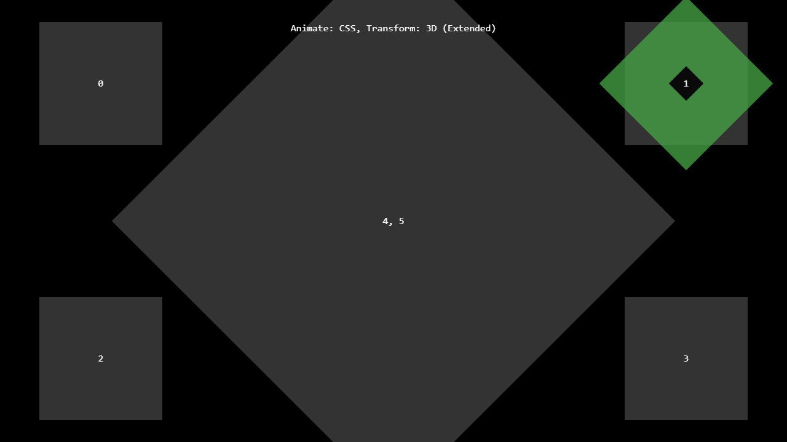

---
title: Renderer Plugin
category: Experts API - Benchmark
summary: Reference for the MSX renderer plugin benchmark test for measuring TV device performance.
---

# Renderer Plugin

This is a special video plugin that has been developed to check the performance and capabilities of a TV device. You can use it to compare the performance/capabilities with other TV (or mobile/desktop) devices.

The plugin can be used with version **0.1.74** or higher.

## Example

### Screenshot



### Code

```json
{
    "type": "pages",
    "headline": "Renderer Plugin",
    "template": {       
        "type": "separate",
        "layout": "0,0,2,3",
        "icon": "msx-white-soft:videocam",
        "color": "msx-glass",       
        "playerLabel": "Renderer",
        "properties": {
            "control:dim": false,
            "progress:type": "position:{POSITION} {ico:videocam}",
            "button:speed:enable": true,
            "trigger:back": "player:stop"            
        }
    },
    "items": [{
            "titleHeader": "Animate: JS",
            "titleFooter": "{txt:msx-white:Transform: Off}",
            "action": "video:plugin:http://msx.benzac.de/plugins/renderer.html?animate=1&transform=0"
        }, {
            "titleHeader": "Animate: JS",
            "titleFooter": "{txt:msx-white:Transform: 2D}",
            "action": "video:plugin:http://msx.benzac.de/plugins/renderer.html?animate=1&transform=1"
        }, {
            "titleHeader": "Animate: JS",
            "titleFooter": "{txt:msx-white:Transform: 3D}",
            "action": "video:plugin:http://msx.benzac.de/plugins/renderer.html?animate=1&transform=2"
        }, {
            "titleHeader": "Animate: CSS",
            "titleFooter": "{txt:msx-white:Transform: Off}",
            "action": "video:plugin:http://msx.benzac.de/plugins/renderer.html?animate=2&transform=0"
        }, {
            "titleHeader": "Animate: CSS",
            "titleFooter": "{txt:msx-white:Transform: 2D}",
            "action": "video:plugin:http://msx.benzac.de/plugins/renderer.html?animate=2&transform=1"
        }, {
            "titleHeader": "Animate: CSS",
            "titleFooter": "{txt:msx-white:Transform: 3D}",
            "action": "video:plugin:http://msx.benzac.de/plugins/renderer.html?animate=2&transform=2"
        }, {   
            "tag": "EXT",
            "titleHeader": "Animate: Off",
            "titleFooter": "{txt:msx-white:Transform: 3D}",
            "action": "video:plugin:http://msx.benzac.de/plugins/renderer.html?animate=0&transform=2&extended=1"
        }, { 
            "tag": "EXT",
            "titleHeader": "Animate: JS",
            "titleFooter": "{txt:msx-white:Transform: 3D}",
            "action": "video:plugin:http://msx.benzac.de/plugins/renderer.html?animate=1&transform=2&extended=1"
        }, {          
            "tag": "EXT",
            "titleHeader": "Animate: CSS",
            "titleFooter": "{txt:msx-white:Transform: 3D}",
            "action": "video:plugin:http://msx.benzac.de/plugins/renderer.html?animate=2&transform=2&extended=1"
        }, {
            "tag": "CF",
            "label": "{txt:msx-white-soft:10 Items}",
            "icon": "msx-white-soft:view-carousel",           
            "titleHeader": "Animate: CSS",
            "titleFooter": "{txt:msx-white:Transform: 3D}",
            "action": "video:plugin:http://msx.benzac.de/plugins/coverflow.html?animate=2&transform=2&count=10",
            "playerLabel": "Coverflow",
            "properties": {
                "control:dim": false,
                "progress:type": "number:{NUMBER} {ico:view-carousel}",
                "button:speed:enable": true,
                "trigger:back": "player:stop"
            }
        }, {
            "tag": "CF",
            "label": "{txt:msx-white-soft:100 Items}",
            "icon": "msx-white-soft:view-carousel",          
            "titleHeader": "Animate: CSS",
            "titleFooter": "{txt:msx-white:Transform: 3D}",
            "action": "video:plugin:http://msx.benzac.de/plugins/coverflow.html?animate=2&transform=2&count=100",
            "playerLabel": "Coverflow",
            "properties": {
                "control:dim": false,
                "progress:type": "number:{NUMBER} {ico:view-carousel}",
                "button:speed:enable": true,
                "trigger:back": "player:stop"
            }
        }, {
            "tag": "CF",
            "label": "{txt:msx-white-soft:1000 Items}",
            "icon": "msx-white-soft:view-carousel",
            "titleHeader": "Animate: CSS",
            "titleFooter": "{txt:msx-white:Transform: 3D}",
            "action": "video:plugin:http://msx.benzac.de/plugins/coverflow.html?animate=2&transform=2&count=1000",
            "playerLabel": "Coverflow",
            "properties": {
                "control:dim": false,
                "progress:type": "number:{NUMBER} {ico:view-carousel}",
                "button:speed:enable": true,
                "trigger:back": "player:stop"
            }
        }]
}
```

### Demo

- [Launch via App](https://msx.benzac.de/?start=content:https://msx.benzac.de/info/xp/data/benchmark_test_1.json)
- [Launch via Demo Page](https://msx.benzac.de/info/?start=content:https://msx.benzac.de/info/xp/data/benchmark_test_1.json)

## See also

- [Drawing Plugin](./drawing-plugin.md)
- [Particles Plugin](./particles-plugin.md)
