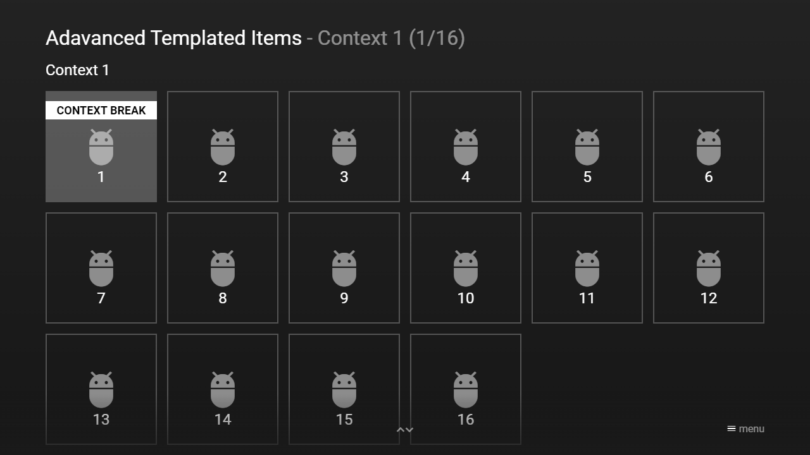

---
title: Advanced Templated Items
category: Experts API - Hidden Features
summary: Explains how to extend templated content items with context inserts and line/page/context breaks in MSX.
---

# Advanced Templated Items

This is not really a hidden feature, but a good-to-know information. It is possible to extend and structure templated content items with inserts and breaks. These features are available from version **0.1.156**. Please see following example.

## Example

### Screenshot



### Code

```json
{
    "type": "list",
    "headline": "Adavanced Templated Items",
    "header": {
        "headline": "Header",
        "items": [{
                "type": "default",
                "layout": "0,0,12,2",
                "headline": "Header",
                "color": "msx-glass"
            }]
    },
    "footer": {
        "headline": "Footer",
        "offset": "0,0.25,0,0",
        "items": [{
                "type": "default",
                "layout": "0,0,12,2",
                "headline": "Footer",
                "color": "msx-glass"
            }]
    },
    "inserts": [{
            "position": "context:context1",
            "offset": "0,0.25,0,-0.5",
            "area": "0,1,12,5",
            "template": {
                "offset": "0,-0.5,0,0"
            },
            "items": [{
                    "type": "space",
                    "layout": "0,0,12,1",
                    "headline": "Context 1"
                }]
        }, {
            "position": "context:context2",
            "offset": "0,0.25,0,-0.5",
            "area": "0,1,12,5",
            "template": {
                "offset": "0,-0.5,0,0"
            },
            "items": [{
                    "type": "space",
                    "layout": "0,0,12,1",
                    "headline": "Context 2"
                }]
        }, {
            "position": "context:context3",
            "offset": "0,0.25,0,-0.5",
            "area": "0,1,12,5",
            "template": {
                "offset": "0,-0.5,0,0"
            },
            "items": [{
                    "type": "space",
                    "layout": "0,0,12,1",
                    "headline": "Context 3"
                }]
        }],
    "template": {
        "type": "button",
        "icon": "msx-white-soft:adb",
        "layout": "0,0,2,2",
        "alignment": "badge-center",
        "group": "id:unknown",
        "context": "Unknown",
        "label": "-",
        "selection": {
            "headline": "{context:context}"
        }
    },
    "items": [{
            "break": "context:context1",
            "badge": "Context Break",
            "group": "id:context1",
            "context": "Context 1",
            "label": "1"
        }, {
            "group": "id:context1",
            "context": "Context 1",
            "label": "2"
        }, {
            "group": "id:context1",
            "context": "Context 1",
            "label": "3"
        }, {
            "group": "id:context1",
            "context": "Context 1",
            "label": "4"
        }, {
            "group": "id:context1",
            "context": "Context 1",
            "label": "5"
        }, {
            "group": "id:context1",
            "context": "Context 1",
            "label": "6"
        }, {
            "group": "id:context1",
            "context": "Context 1",
            "label": "7"
        }, {
            "group": "id:context1",
            "context": "Context 1",
            "label": "8"
        }, {
            "group": "id:context1",
            "context": "Context 1",
            "label": "9"
        }, {
            "group": "id:context1",
            "context": "Context 1",
            "label": "10"
        }, {
            "group": "id:context1",
            "context": "Context 1",
            "label": "11"
        }, {
            "group": "id:context1",
            "context": "Context 1",
            "label": "12"
        }, {
            "group": "id:context1",
            "context": "Context 1",
            "label": "13"
        }, {
            "group": "id:context1",
            "context": "Context 1",
            "label": "14"
        }, {
            "group": "id:context1",
            "context": "Context 1",
            "label": "15"
        }, {
            "group": "id:context1",
            "context": "Context 1",
            "label": "16"
        }, {
            "break": "context:context2",
            "badge": "Context Break",
            "group": "id:context2",
            "context": "Context 2",
            "label": "17"
        }, {
            "group": "id:context2",
            "context": "Context 2",
            "label": "18"
        }, {
            "group": "id:context2",
            "context": "Context 2",
            "label": "19"
        }, {
            "group": "id:context2",
            "context": "Context 2",
            "label": "20"
        }, {
            "break": "line",
            "badge": "Line Break",
            "group": "id:context2",
            "context": "Context 2",
            "label": "21"
        }, {
            "group": "id:context2",
            "context": "Context 2",
            "label": "22"
        }, {
            "group": "id:context2",
            "context": "Context 2",
            "label": "23"
        }, {
            "group": "id:context2",
            "context": "Context 2",
            "label": "24"
        }, {
            "group": "id:context2",
            "context": "Context 2",
            "label": "25"
        }, {
            "group": "id:context2",
            "context": "Context 2",
            "label": "26"
        }, {
            "group": "id:context2",
            "context": "Context 2",
            "label": "27"
        }, {
            "group": "id:context2",
            "context": "Context 2",
            "label": "28"
        }, {
            "group": "id:context2",
            "context": "Context 2",
            "label": "29"
        }, {
            "group": "id:context2",
            "context": "Context 2",
            "label": "30"
        }, {
            "group": "id:context2",
            "context": "Context 2",
            "label": "31"
        }, {
            "group": "id:context2",
            "context": "Context 2",
            "label": "32"
        }, {
            "break": "context:context3",
            "badge": "Context Break",
            "group": "id:context3",
            "context": "Context 3",
            "label": "33"
        }, {
            "group": "id:context3",
            "context": "Context 3",
            "label": "34"
        }, {
            "group": "id:context3",
            "context": "Context 3",
            "label": "35"
        }, {
            "group": "id:context3",
            "context": "Context 3",
            "label": "36"
        }, {
            "break": "page",
            "badge": "Page Break",
            "group": "id:context3",
            "context": "Context 3",
            "label": "37"
        }, {
            "group": "id:context3",
            "context": "Context 3",
            "label": "38"
        }, {
            "group": "id:context3",
            "context": "Context 3",
            "label": "39"
        }, {
            "group": "id:context3",
            "context": "Context 3",
            "label": "40"
        }, {
            "group": "id:context3",
            "context": "Context 3",
            "label": "41"
        }, {
            "group": "id:context3",
            "context": "Context 3",
            "label": "42"
        }, {
            "group": "id:context3",
            "context": "Context 3",
            "label": "43"
        }, {
            "group": "id:context3",
            "context": "Context 3",
            "label": "44"
        }, {
            "group": "id:context3",
            "context": "Context 3",
            "label": "45"
        }, {
            "group": "id:context3",
            "context": "Context 3",
            "label": "46"
        }, {
            "group": "id:context3",
            "context": "Context 3",
            "label": "47"
        }, {
            "group": "id:context3",
            "context": "Context 3",
            "label": "48"
        }]
}
```

### Demo

- [Launch via App](https://msx.benzac.de/?start=content:https://msx.benzac.de/info/xp/data/hidden_feature_19.json)
- [Launch via Demo Page](https://msx.benzac.de/info/?start=content:https://msx.benzac.de/info/xp/data/hidden_feature_19.json)

## See also

- [Common Misconceptions → Custom & unknown properties](../../reference/common-misconceptions.md#custom--unknown-properties) — `{context:{PROPERTY}}` can reference any custom field name, not just official properties
