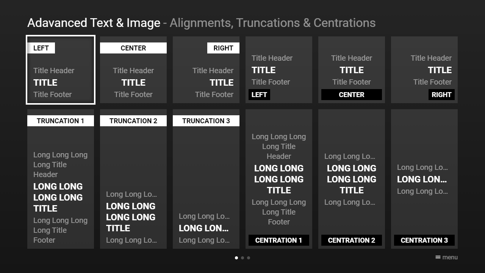

---
title: Advanced Text & Image
category: Experts API - Hidden Features
summary: Explains the MSX advanced text and image feature for complex combined text-image layouts.
---

# Advanced Text & Image

This is not really a hidden feature, but a good-to-know information. It is possible to align, truncate, and vertically center title and/or text properties. Additionally, it is possible to bind specific content properties to the image area. All features are available from version **0.1.146**. Since version **0.1.156**, it is also possible to perform content separations to prevent overlapping content. Please see following example.

## Example

### Screenshot



### Code

```json
{
    "type": "pages",
    "headline": "Adavanced Text & Image",
    "pages": [{     
            "headline": "Alignments, Truncations & Centrations",
            "items": [{
                    "badge": "Left",
                    "type": "default",
                    "layout": "0,0,2,2",
                    "color": "msx-glass",
                    "titleHeader": "Title Header",
                    "title": "Title",
                    "titleFooter": "Title Footer",
                    "alignment": "left|badge-left"
                }, {
                    "badge": "Center",
                    "type": "default",
                    "layout": "2,0,2,2",
                    "color": "msx-glass",
                    "titleHeader": "Title Header",
                    "title": "Title",
                    "titleFooter": "Title Footer",
                    "alignment": "center|badge-center"
                }, {
                    "badge": "Right",
                    "type": "default",
                    "layout": "4,0,2,2",
                    "color": "msx-glass",
                    "titleHeader": "Title Header",
                    "title": "Title",
                    "titleFooter": "Title Footer",
                    "alignment": "right|badge-right"
                }, {
                    "stamp": "Left",
                    "type": "default",
                    "layout": "6,0,2,2",
                    "color": "msx-glass",
                    "titleHeader": "Title Header",
                    "title": "Title",
                    "titleFooter": "Title Footer",                   
                    "alignment": "left|stamp-left",
                    "centration": "title"
                }, {
                    "stamp": "Center",
                    "type": "default",
                    "layout": "8,0,2,2",
                    "color": "msx-glass",
                    "titleHeader": "Title Header",
                    "title": "Title",
                    "titleFooter": "Title Footer",                   
                    "alignment": "center|stamp-center",
                    "centration": "title"
                }, {
                    "stamp": "Right",
                    "type": "default",
                    "layout": "10,0,2,2",
                    "color": "msx-glass",
                    "titleHeader": "Title Header",
                    "title": "Title",
                    "titleFooter": "Title Footer",                   
                    "alignment": "right|stamp-right",
                    "centration": "title"
                }, {       
                    "badge": "Truncation 1",
                    "type": "default",
                    "layout": "0,2,2,4",
                    "color": "msx-glass",
                    "titleHeader": "Long Long Long Long Title Header",
                    "title": "Long Long Long Long Title",
                    "titleFooter": "Long Long Long Long Title Footer",
                    "alignment": "badge-center"
                }, {
                    "badge": "Truncation 2",
                    "type": "default",
                    "layout": "2,2,2,4",
                    "color": "msx-glass",
                    "titleHeader": "Long Long Long Long Title Header",
                    "title": "Long Long Long Long Title",
                    "titleFooter": "Long Long Long Long Title Footer",
                    "alignment": "badge-center",
                    "truncation": "titleHeader|titleFooter"
                }, {
                    "badge": "Truncation 3",
                    "type": "default",
                    "layout": "4,2,2,4",
                    "color": "msx-glass",
                    "titleHeader": "Long Long Long Long Title Header",
                    "title": "Long Long Long Long Title",
                    "titleFooter": "Long Long Long Long Title Footer",
                    "alignment": "badge-center",
                    "truncation": "title|titleHeader|titleFooter"
                }, {
                    "stamp": "Centration 1",
                    "type": "default",
                    "layout": "6,2,2,4",
                    "color": "msx-glass",
                    "titleHeader": "Long Long Long Long Title Header",
                    "title": "Long Long Long Long Title",
                    "titleFooter": "Long Long Long Long Title Footer",
                    "alignment": "center|badge-center|stamp-center",
                    "centration": "title"
                }, {
                    "stamp": "Centration 2",
                    "type": "default",
                    "layout": "8,2,2,4",
                    "color": "msx-glass",
                    "titleHeader": "Long Long Long Long Title Header",
                    "title": "Long Long Long Long Title",
                    "titleFooter": "Long Long Long Long Title Footer",
                    "alignment": "center|badge-center|stamp-center",
                    "centration": "title",
                    "truncation": "titleHeader|titleFooter"
                }, {
                    "stamp": "Centration 3",
                    "type": "default",
                    "layout": "10,2,2,4",
                    "color": "msx-glass",
                    "titleHeader": "Long Long Long Long Title Header",
                    "title": "Long Long Long Long Title",
                    "titleFooter": "Long Long Long Long Title Footer",
                    "alignment": "center|badge-center|stamp-center",
                    "centration": "title",
                    "truncation": "title|titleHeader|titleFooter"
                }]
        }, {
            "headline": "Boundaries",
            "items": [{
                    "type": "default",
                    "layout": "0,0,4,3",
                    "badge": "Badge",
                    "tag": "Tag",
                    "stamp": "Stamp",   
                    "title": "Default Item",
                    "titleFooter": "Default Boundary",
                    "image": "http://msx.benzac.de/img/test.jpg",
                    "imageFiller": "cover"
                }, {
                    "type": "separate",
                    "layout": "4,0,4,3",
                    "badge": "Badge",
                    "tag": "Tag",
                    "stamp": "Stamp",
                    "title": "Separate Item",
                    "titleFooter": "Default Boundary",
                    "image": "http://msx.benzac.de/img/test.jpg",
                    "imageFiller": "cover"
                }, {
                    "type": "default",
                    "layout": "8,0,4,3",
                    "badge": "Long Long Long Long Badge",
                    "tag": "Tag",
                    "stamp": "Long Long Long Long Stamp",   
                    "title": "Wrapped Default Item",
                    "titleFooter": "{col:msx-green}Item Boundary{br}{br}{br}",
                    "image": "http://msx.benzac.de/img/test.jpg",
                    "imageFiller": "cover",
                    "imageWidth": 1.83,
                    "wrapperColor": "msx-glass"                
                }, {
                    "type": "default",
                    "layout": "0,3,4,3",
                    "badge": "Badge",
                    "tag": "Tag",
                    "stamp": "Stamp",
                    "title": "Wrapped Default Item",
                    "titleFooter": "{col:msx-green}Item Boundary",
                    "image": "http://msx.benzac.de/img/test.jpg",
                    "imageFiller": "cover",
                    "imageHeight": 1.83,
                    "wrapperColor": "msx-glass"
                }, {
                    "type": "default",
                    "layout": "4,3,4,3",
                    "badge": "Badge",
                    "tag": "Tag",
                    "stamp": "Stamp",
                    "title": "Wrapped Default Item",
                    "titleFooter": "{col:msx-yellow}Image Boundary",
                    "image": "http://msx.benzac.de/img/test.jpg",
                    "imageFiller": "cover",
                    "imageHeight": 1.83,
                    "imageBoundary": true,
                    "wrapperColor": "msx-glass"
                }, {
                    "type": "default",
                    "layout": "8,3,4,3",
                    "badge": "Long Long Long Long Badge",
                    "tag": "Tag",
                    "stamp": "Long Long Long Long Stamp",   
                    "title": "Wrapped Default Item",
                    "titleFooter": "{col:msx-yellow}Image Boundary",
                    "image": "http://msx.benzac.de/img/test.jpg",
                    "imageFiller": "cover",
                    "imageWidth": 1.83,
                    "imageBoundary": true,
                    "wrapperColor": "msx-glass"  
                }]
        }, {
            "headline": "Boundaries",
            "items": [{
                    "type": "default",
                    "layout": "0,0,4,3",
                    "badge": "Badge",
                    "tag": "Tag",
                    "stamp": "00:12:34",
                    "stampColor": "msx-red",
                    "progress": 0.5,
                    "progressColor": "msx-red",
                    "title": "Default Item With Progress",
                    "titleFooter": "Default Boundary",
                    "image": "http://msx.benzac.de/img/test.jpg",
                    "imageFiller": "cover"
                }, {
                    "type": "separate",
                    "layout": "4,0,4,3",
                    "badge": "Badge",
                    "tag": "Tag",
                    "stamp": "00:12:34",
                    "stampColor": "msx-red",
                    "progress": 0.5,
                    "progressColor": "msx-red",
                    "title": "Separate Item With Progress",
                    "titleFooter": "Default Boundary",
                    "image": "http://msx.benzac.de/img/test.jpg",
                    "imageFiller": "cover"
                }, {
                    "type": "default",
                    "layout": "8,0,4,3",
                    "badge": "Badge",
                    "tag": "Tag",
                    "stamp": "00:12:34",
                    "stampColor": "msx-red",
                    "progress": 0.5,
                    "progressColor": "msx-red",
                    "title": "Wrapped Default Item With Progress",
                    "titleFooter": "{col:msx-green}Item Boundary{br}{br}{br}",
                    "image": "http://msx.benzac.de/img/test.jpg",
                    "imageFiller": "cover",
                    "imageWidth": 1.83,
                    "wrapperColor": "msx-glass"
                }, {
                    "type": "default",
                    "layout": "0,3,4,3",
                    "badge": "Badge",
                    "tag": "Tag",
                    "stamp": "00:12:34",
                    "stampColor": "msx-red",
                    "progress": 0.5,
                    "progressColor": "msx-red",
                    "title": "Wrapped Default Item With Progress",
                    "titleFooter": "{col:msx-green}Item Boundary",
                    "truncation": "title",
                    "image": "http://msx.benzac.de/img/test.jpg",
                    "imageFiller": "cover",
                    "imageHeight": 1.83,
                    "wrapperColor": "msx-glass"
                }, {
                    "type": "default",
                    "layout": "4,3,4,3",
                    "badge": "Badge",
                    "tag": "Tag",
                    "stamp": "00:12:34",
                    "stampColor": "msx-red",
                    "progress": 0.5,
                    "progressColor": "msx-red",
                    "title": "Wrapped Default Item With Progress",
                    "titleFooter": "{col:msx-yellow}Image Boundary",
                    "truncation": "title",
                    "image": "http://msx.benzac.de/img/test.jpg",
                    "imageFiller": "cover",
                    "imageHeight": 1.83,
                    "imageBoundary": true,
                    "wrapperColor": "msx-glass"
                }, {
                    "type": "default",
                    "layout": "8,3,4,3",
                    "badge": "Badge",
                    "tag": "Tag",
                    "stamp": "00:12:34",
                    "stampColor": "msx-red",
                    "progress": 0.5,
                    "progressColor": "msx-red",
                    "title": "Wrapped Default Item With Progress",
                    "titleFooter": "{col:msx-yellow}Image Boundary",
                    "image": "http://msx.benzac.de/img/test.jpg",
                    "imageFiller": "cover",
                    "imageWidth": 1.83,
                    "imageBoundary": true,
                    "wrapperColor": "msx-glass"
                }]
        }, {
            "headline": "Separations (0.1.156+)",
            "items": [{
                    "tag": "0.25",
                    "separation": 0.25,
                    "type": "control",
                    "layout": "0,0,6,1",
                    "label": "Label label label label label label label label label label label",
                    "extensionLabel": "Extension extension extension extension extension extension extension"
                }, {
                    "tag": "0.25",
                    "separation": 0.25,
                    "type": "control",
                    "layout": "6,0,6,1",
                    "icon": "adb",
                    "label": "Label label label label label label label label label label label",
                    "extensionLabel": "Extension extension extension extension extension extension extension"
                }, {
                    "tag": "0.5",
                    "separation": 0.5,
                    "type": "control",
                    "layout": "0,1,6,1",
                    "label": "Label label label label label label label label label label label",
                    "extensionLabel": "Extension extension extension extension extension extension extension"
                }, {
                    "tag": "0.5",
                    "separation": 0.5,
                    "type": "control",
                    "layout": "6,1,6,1",
                    "icon": "adb",
                    "label": "Label label label label label label label label label label label",
                    "extensionLabel": "Extension extension extension extension extension extension extension"
                }, {
                    "tag": "0.75",
                    "separation": 0.75,
                    "type": "control",
                    "layout": "0,2,6,1",
                    "label": "Label label label label label label label label label label label",
                    "extensionLabel": "Extension extension extension extension extension extension extension"
                }, {
                    "tag": "0.75",
                    "separation": 0.75,
                    "type": "control",
                    "layout": "6,2,6,1",
                    "icon": "adb",
                    "label": "Label label label label label label label label label label label",
                    "extensionLabel": "Extension extension extension extension extension extension extension"
                }, {
                    "tag": "0.5",
                    "separation": 0.5,
                    "type": "default",
                    "layout": "0,3,6,3",
                    "alignment": "center|separation-text-right",
                    "centration": "text|title",
                    "headline": "Headline headline headline",
                    "text": "Text text text text text text text text text text text text text",
                    "title": "Title title title",
                    "titleHeader": "Header header header header header header header header",
                    "titleFooter": "Footer footer footer footer footer footer footer footer"
                }, {
                    "tag": "0.9",
                    "separation": 0.9,
                    "type": "default",
                    "layout": "6,3,6,1",
                    "image": "http://msx.benzac.de/img/test.jpg",
                    "imageFiller": "cover",
                    "imageWidth": 2,
                    "truncation": "titleHeader|titleFooter",
                    "titleHeader": "Header header header header header header header header",
                    "titleFooter": "Footer footer footer footer footer footer footer footer"
                }, {
                    "tag": "0.75",
                    "separation": 0.75,
                    "type": "default",
                    "layout": "6,4,6,1",
                    "image": "http://msx.benzac.de/img/test.jpg",
                    "imageFiller": "height-right",
                    "imageOverlay": 0,                  
                    "truncation": "titleHeader|titleFooter",
                    "titleHeader": "Header header header header header header header header",
                    "titleFooter": "Footer footer footer footer footer footer footer footer"
                }, {
                    "tag": "0.5",
                    "separation": 0.5,
                    "type": "default",
                    "layout": "6,5,6,1",
                    "image": "http://msx.benzac.de/img/test.jpg",
                    "imageFiller": "cover",
                    "imageWidth": 2,
                    "alignment": "separation-text-right",
                    "centration": "text",
                    "truncation": "titleHeader|titleFooter",
                    "titleHeader": "Header header header header header header header header",
                    "titleFooter": "Footer footer footer footer footer footer footer footer",
                    "headline": "{ico:msx-yellow:star} {ico:msx-yellow:star} {ico:msx-yellow:star} {ico:msx-yellow:star} {ico:msx-yellow:star}"
                }]
        }]
}
```

### Demo

- [Launch via App](https://msx.benzac.de/?start=content:https://msx.benzac.de/info/xp/data/hidden_feature_17.json)
- [Launch via Demo Page](https://msx.benzac.de/info/?start=content:https://msx.benzac.de/info/xp/data/hidden_feature_17.json)
