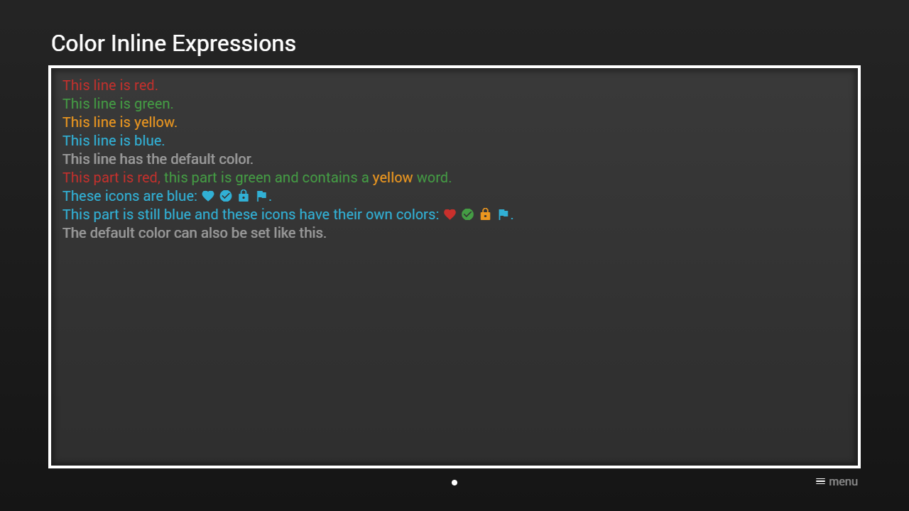

---
title: Color Inline Expressions
category: Experts API - Hidden Features
summary: Reference for MSX color inline expressions used to apply color to text segments.
---

# Color Inline Expressions

It is possible to change the default color in a text with inline expressions. The expression `{col:{COLOR}}` sets the color and the expression `{col}` switches back to the default color. Please see [Colors](../../main-api/common/colors.md) for possible values. This feature is available since version **0.1.91**.
Please see following example.

## Example

### Screenshot



### Code

```json
{
    "headline": "Color Inline Expressions",
    "pages": [{
            "items": [{
                    "layout": "0,0,12,6",
                    "color": "msx-glass",
                    "text": [
                        "{col:msx-red}This line is red.{br}",
                        "{col:msx-green}This line is green.{br}",
                        "{col:msx-yellow}This line is yellow.{br}",
                        "{col:msx-blue}This line is blue.{br}",
                        "{col}This line has the default color.{br}",
                        "{col:msx-red}This part is red, {col:msx-green}this part is green and contains a {txt:msx-yellow:yellow} word.{br}",
                        "{col:msx-blue}These icons are blue: ",
                        "{ico:favorite} {ico:check-circle} {ico:lock} {ico:flag}.{br}",
                        "This part is still blue and these icons have their own colors: ",
                        "{ico:msx-red:favorite} {ico:msx-green:check-circle} {ico:msx-yellow:lock} {ico:msx-blue:flag}.{br}",
                        "{col:default}The default color can also be set like this.{br}"
                    ]
                }]
        }]
}
```

### Demo

- [Launch via App](https://msx.benzac.de/?start=content:https://msx.benzac.de/info/xp/data/hidden_feature_7.json)
- [Launch via Demo Page](https://msx.benzac.de/info/?start=content:https://msx.benzac.de/info/xp/data/hidden_feature_7.json)
