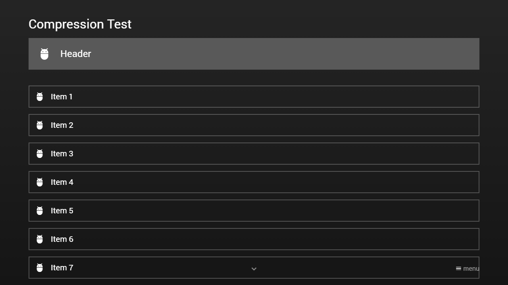

---
title: Compress Property
category: Experts API - Hidden Features
summary: Explains the MSX compress property hidden feature that expands the grid layout for more items per page.
---

# Compress Property

It is possible to set a `compress` property (of type `boolean`) to the content data to compress the content by 25%. The compression increases the layout grid size from 12x6 to 16x8 (or from 8x6 to 10x8 for panels). This allows you to display more content items per page. This feature is available since version **0.1.123**.

> **Warning:** Items placed using the extended grid coordinates (e.g., `layout` width of 16) will cause **'out of range' warnings** on MSX versions older than **0.1.123** that do not support the compress property. Ensure backward compatibility is not required before using extended coordinates.

**Note: Since the size of each content item is reduced, the font sizes of specific properties (e.g. `label`, `icon`, `headline`, etc.) are adjusted accordingly. Please note that only the font sizes that are larger than the minimum font size are adjusted (e.g. the font size of a `text` property is not adjusted as this is the minimum font size). If you set the `compress` property to `false` on a content page or item object, no font size adjustments are performed.**

Please see following example.

## Example

### Screenshot



### Code

```json
{
    "compress": true,
    "type": "list",
    "headline": "Compression Test",
    "template": {
        "type": "control",
        "layout": "0,0,16,1",
        "icon": "adb"
    },
    "header": {
        "compress": false,
        "offset": "0,0,0,0.666",
        "items": [{
                "type": "control",
                "layout": "0,0,16,1",
                "offset": "0,0,0,0.333",
                "icon": "adb",
                "label": "Header"
            }]
    },
    "footer": {
        "offset": "0,0.333,0,0",
        "items": [{
                "compress": false,
                "type": "space",
                "layout": "0,0,16,1",
                "headline": "Footer"
            }, {
                "compress": false,
                "badge": "Uncompressed",
                "type": "button",
                "layout": "0,1,4,4",
                "offset": "0,-0.333,0,0",
                "icon": "msx-green:check-circle",
                "label": "Success",
                "action": "success:This is a success message."
            }, {
                "compress": false,
                "badge": "Uncompressed",
                "type": "button",
                "layout": "4,1,4,4",
                "offset": "0,-0.333,0,0",
                "icon": "msx-blue:info",
                "label": "Info",
                "action": "info:This is an info message."
            }, {
                "compress": false,
                "badge": "Uncompressed",
                "type": "button",
                "layout": "8,1,4,4",
                "offset": "0,-0.333,0,0",
                "icon": "msx-yellow:warning",
                "label": "Warning",
                "action": "warn:This is a warning message."
            }, {
                "compress": false,
                "badge": "Uncompressed",
                "type": "button",
                "layout": "12,1,4,4",
                "offset": "0,-0.333,0,0",
                "icon": "msx-red:error",
                "label": "Error",
                "action": "error:This is an error message."
            }, {
                "compress": true,
                "badge": "Compressed",
                "type": "button",
                "layout": "0,5,3,3",
                "icon": "msx-green:check-circle",
                "label": "Success",
                "action": "success:This is a success message."
            }, {
                "compress": true,
                "badge": "Compressed",
                "type": "button",
                "layout": "3,5,3,3",
                "icon": "msx-blue:info",
                "label": "Info",
                "action": "info:This is an info message."
            }, {
                "compress": true,
                "badge": "Compressed",
                "type": "button",
                "layout": "6,5,3,3",
                "icon": "msx-yellow:warning",
                "label": "Warning",
                "action": "warn:This is a warning message."
            }, {
                "compress": true,
                "badge": "Compressed",
                "type": "button",
                "layout": "9,5,3,3",
                "icon": "msx-red:error",
                "label": "Error",
                "action": "error:This is an error message."
            }]
    },    
    "items": [{
            "label": "Item 1"
        }, {
            "label": "Item 2"
        }, {
            "label": "Item 3"
        }, {
            "label": "Item 4"
        }, {
            "label": "Item 5"
        }, {
            "label": "Item 6"
        }, {
            "label": "Item 7"
        }, {
            "label": "Item 8"
        }]
}
```

### Demo

- [Launch via App](https://msx.benzac.de/?start=content:https://msx.benzac.de/info/xp/data/hidden_feature_12.json)
- [Launch via Demo Page](https://msx.benzac.de/info/?start=content:https://msx.benzac.de/info/xp/data/hidden_feature_12.json)

## Additional Information

### MSX Screen Model

MSX targets TV screens, which are always **16:9** regardless of the physical resolution (720p, 1080p, 4K, 8K, etc.). The application automatically scales all rendering to fill the screen. Therefore, layouts are defined using logical grid units rather than pixels. The standard content grid consists of **12 columns x 6 rows** (plus a headline row). When compression is enabled, the logical grid increases to **16 columns x 8 rows**. The physical screen resolution and aspect ratio remain unchanged; only the logical cell size becomes smaller.

|  | Standard | Compressed |
|---|---|---|
| Content Grid | 12x6 | 16x8 |
| Panel Grid | 8x6 | 10x8 |
| Font Sizes | Standard | Reduced (above minimum size) |

### Where the `compress` property can be applied

| Location | Effect |
|---|---|
| Content Root | Determines the grid used by the entire content, including pages, items, header, footer, overlay and underlay. |
| Content Page / Header / Footer / Overlay / Underlay | Controls font size adjustments for that scope only. The grid itself is not changed. |
| Individual Content Item | Controls font size adjustments for the item only. The grid itself is not changed. |
| Template Object | Controls font size adjustments for templated items. Combined with `decompress`, automatic coordinate conversion can be enabled. |

**Note: The grid size is always uniform within a content. All pages, items, headers, footers, overlays and underlays share the same grid. Only the `compress` property on the content root determines the grid size. It is not possible to mix compressed and uncompressed grids within the same content.**

### The `decompress` property

Since version **0.1.155**, the template object supports the `decompress` property. When enabled, MSX automatically converts template coordinates from the standard grid to the compressed grid. This allows template layouts to be authored using standard grid coordinates while the content itself remains compressed. Please see following example code.

```json
{
    "compress": true,
    "type": "list",
    "headline": "Decompression Test",
    "template": {
        "decompress": true,
        "type": "control",
        "layout": "0,0,12,1",
        "icon": "adb"
    },
    "header": {
        "items": [{
                "type": "control",
                "layout": "0,0,16,1",
                "icon": "adb",
                "label": "Header"
            }]
    },  
    "items": [{
            "label": "Item 1"
        }, {
            "label": "Item 2"
        }, {
            "label": "Item 3"
        }, {
            "label": "Item 4"
        }, {
            "label": "Item 5"
        }, {
            "label": "Item 6"
        }, {
            "label": "Item 7"
        }, {
            "label": "Item 8"
        }]
}
```

## See Also

- [Common Misconceptions → Content & layout](../../reference/common-misconceptions.md#content--layout) — the exact 0-based "out of range" edge (column ≥ 12 or row ≥ 6) that older clients drop
- [JSON Building Guide → Step 5 — Compress Property](../../reference/json-building-guide.md#step-5--compress-property)
- [Best Practices & Good to Know → Sizing `image` sources for the grid vs. for full-screen](../../reference/best-practices.md#sizing-image-sources-for-the-grid-vs-for-full-screen) — the exact pixel formula for compressed vs. uncompressed grid cells
- [Best Practices & Good to Know → Making a compressed header/footer look uncompressed](../../reference/best-practices.md#making-a-compressed-headerfooter-look-uncompressed) — the `offset` scaling recipe worked through this page's own header example
- [Glossary → Grid](../../reference/glossary.md#grid) — the exact compress cell-shrink math
