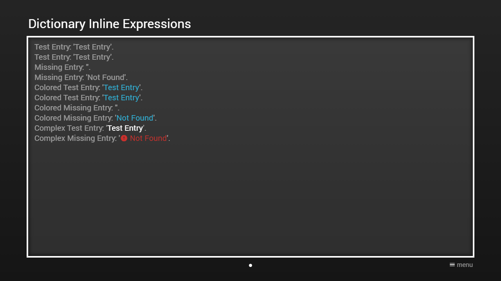

---
title: Dictionary Inline Expressions
category: Experts API - Hidden Features
summary: Reference for MSX dictionary inline expressions used to look up values from a dictionary.
---

# Dictionary Inline Expressions

It is possible to add entries from the dictionary with inline expressions. The expression has the syntax `{dic:{KEY}}` or `{dic:{KEY}|{DEFAULT_VALUE}}`. The `{KEY}` part must be replaced with the dictionary entry key and the `{DEFAULT_VALUE}` part can be replaced with the default value that is used if the entry is missing. If the entry is missing and no default value is indicated, the expression is removed. It is also possible to add colored dictionary entries with the expression syntax `{txt:{COLOR}:dic:{KEY}}` or `{txt:{COLOR}:dic:{KEY}|{DEFAULT_VALUE}}`. Please see [Colors](../../main-api/common/colors.md) for possible color values. This feature is available since version **0.1.120**.

Since version **0.1.123**, you can also wrap dictionary default values with this extended inline expression `{dix:{KEY}}{DEFAULT_VALUE}{dix}`. The suffix `{dix}` can also be omitted if it is at the end of the content string. This allows you to set complex default values that use other inline expressions.

Since version **0.1.160**, you can also insert strings into a translated or default value with this extended inline expression `{dix:{KEY}|{INSERTION_1}|{INSERTION_2}|{INSERTION_3}|...}{DEFAULT_VALUE}{dix}`. To reference the insertions, the inline expression `{#{INSERTION_POSITION}}` has to be used (e.g. `{dix:insertion|Insertion 1|Insertion 2|Insertion 3}This text contains 3 insertions: {#1}, {#2}, and {#3}.{dix}`). Please note that it is not possible to reference an insertion multiple times.

Please see following example.

## Example

### Screenshot



### Code

```json
{
    "headline": "Dictionary Inline Expressions",
    "dictionary": "http://msx.benzac.de/dic/test.json",
    "pages": [{
            "items": [{
                    "layout": "0,0,12,6",
                    "color": "msx-glass",
                    "text": [
                        "Test Entry: '{dic:test}'.{br}",
                        "Test Entry: '{dic:test|Not Found}'.{br}",
                        "Missing Entry: '{dic:missing}'.{br}",
                        "Missing Entry: '{dic:missing|Not Found}'.{br}",
                        "Colored Test Entry: '{txt:msx-blue:dic:test}'.{br}",
                        "Colored Test Entry: '{txt:msx-blue:dic:test|Not Found}'.{br}",
                        "Colored Missing Entry: '{txt:msx-blue:dic:missing}'.{br}",
                        "Colored Missing Entry: '{txt:msx-blue:dic:missing|Not Found}'.{br}",
                        "Complex Test Entry: '{col:msx-white}{dix:test}{ico:msx-red:error} {txt:msx-red:Not Found}{dix}{col}'.{br}",
                        "Complex Missing Entry: '{col:msx-white}{dix:missing}{ico:msx-red:error} {txt:msx-red:Not Found}{dix}{col}'.{br}",
                        "Insertion Test Entry: '{col:msx-white}{dix:insertion|Insertion 1|Insertion 2|Insertion 3}Missing entry with 3 insertions: {#1}, {#2}, and {#3}.{dix}{col}'.{br}",
                        "Insertion Missing Entry: '{col:msx-white}{dix:missing|Insertion 1|Insertion 2|Insertion 3}Missing entry with 3 insertions: {#1}, {#2}, and {#3}.{dix}{col}'.{br}"
                    ]
                }]
        }]
}
```

### Demo

- [Launch via App](https://msx.benzac.de/?start=content:https://msx.benzac.de/info/xp/data/hidden_feature_11.json)
- [Launch via Demo Page](https://msx.benzac.de/info/?start=content:https://msx.benzac.de/info/xp/data/hidden_feature_11.json)

## See Also

- [Dictionary Structure](../special/dictionary-structure.md)
- [In-App Settings Reference → What is not covered by any native setting](../../reference/settings-reference.md#6-what-is-not-covered-by-any-native-setting) — why MSX externalizes language handling into this mechanism instead of a native setting
