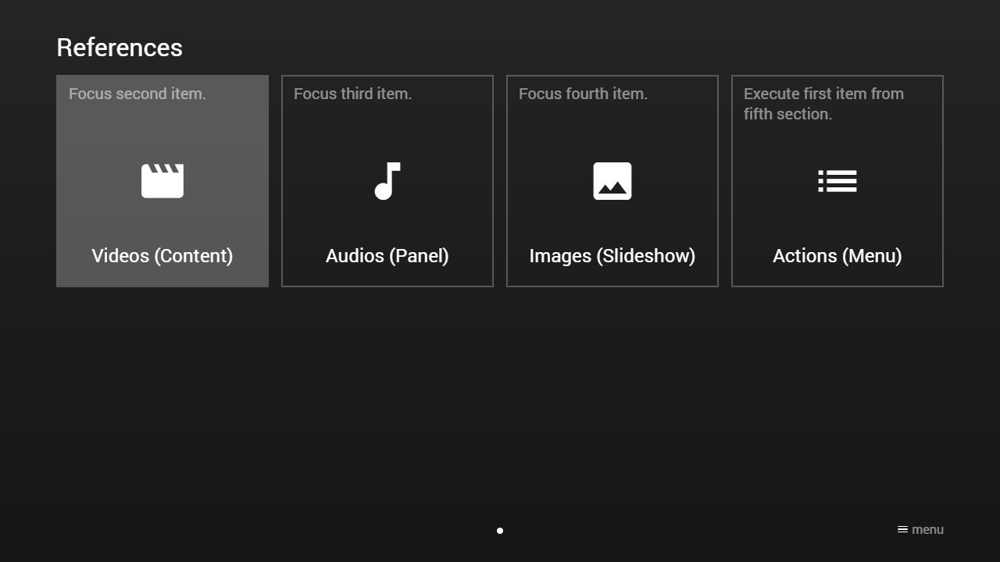

---
title: Focus Separator
category: Experts API - Hidden Features
summary: Explains the MSX focus separator hidden feature for focusing and executing items on load.
---

# Focus Separator

It is possible to focus (and execute) an item on load by using the focus separator `>` within the following actions.

- `menu:{URL}>{MENU_FOCUS}`
- `menu:{URL}>{MENU_FOCUS}>{CONTENT_FOCUS}`
- `menu:{URL}>{MENU_FOCUS}>{CONTENT_FOCUS}>execute`
- `content:{URL}>{CONTENT_FOCUS}`
- `content:{URL}>{CONTENT_FOCUS}>execute`
- `panel:{URL}>{CONTENT_FOCUS}`
- `panel:{URL}>{CONTENT_FOCUS}>execute`
- `playlist:{URL}>{CONTENT_FOCUS}`
- `slideshow:{URL}>{CONTENT_FOCUS}`

Since version **0.1.120**, the focus separator `>` can also be used within the following actions.

- `reload:menu>{MENU_FOCUS}`
- `reload:menu>{MENU_FOCUS}>{CONTENT_FOCUS}`
- `reload:menu>{MENU_FOCUS}>{CONTENT_FOCUS}>execute`
- `reload:content>{CONTENT_FOCUS}`
- `reload:content>{CONTENT_FOCUS}>execute`
- `reload:panel>{CONTENT_FOCUS}`
- `reload:panel>{CONTENT_FOCUS}>execute`

Since version **0.1.144**, the focus separator `>` can also be used within the following actions.

- `replace:menu:{CONTENT_FLAG}:{REQUEST_ACTION}>{MENU_FOCUS}`
- `replace:menu:{CONTENT_FLAG}:{REQUEST_ACTION}>{MENU_FOCUS}>{CONTENT_FOCUS}`
- `replace:menu:{CONTENT_FLAG}:{REQUEST_ACTION}>{MENU_FOCUS}>{CONTENT_FOCUS}>execute`
- `replace:content:{CONTENT_FLAG}:{REQUEST_ACTION}>{CONTENT_FOCUS}`
- `replace:content:{CONTENT_FLAG}:{REQUEST_ACTION}>{CONTENT_FOCUS}>execute`
- `replace:panel:{CONTENT_FLAG}:{REQUEST_ACTION}>{CONTENT_FOCUS}`
- `replace:panel:{CONTENT_FLAG}:{REQUEST_ACTION}>{CONTENT_FOCUS}>execute`

The `{MENU_FOCUS}` part must be replaced with a menu item ID (e.g. `menu_item_id`) or index (e.g. `index:0`). The `{CONTENT_FOCUS}` part must be replaced with a content item ID (e.g. `content_item_id`) or index (e.g. `index:0`). If the action ends with `execute`, the focused content item is also executed on load. This feature is available since version **0.1.0**.

**Note: Properties like `focus`, `execute`, and `refocus` are ignored if the focus separator is used. Since version 0.1.120, you can set the focus value to `item:default` to ensure that the `focus`, `execute`, and `refocus` properties are evaluated (when using reload actions). Please note that by default the current focused item is retained for reload actions. The item ID is used to retain the focus. If the item ID is not available, the item index is used. If you set the focus value to `item:current`, you will get the same behavior. Since version 0.1.120, you can set the focus value to `item:index` to ensure that the item index is used. It is also possible to leave the content on reload if you set the content focus value to `item:none`. Please also note that when using the item index for focusing items in a menu, content, or panel, a correction takes place if the item cannot be focussed (e.g. if the item is disabled or does not exist at the indicated index, the next/previous available index is used). In contrast, when using the item ID for focusing items and the item cannot be focussed, the default item is selected (and no execution is performed).**

Please see following example.

## Example

### Screenshot



### Code

```json
{
    "type": "pages",
    "headline": "References",
    "pages": [{
            "items": [{
                    "type": "button",
                    "layout": "0,0,3,3",
                    "icon": "movie",
                    "text": "Focus second item.",
                    "label": "Videos (Content)",
                    "action": "content:http://msx.benzac.de/info/data/guide/videos.json>index:1"
                }, {
                    "type": "button",
                    "layout": "3,0,3,3",
                    "icon": "music-note",
                    "text": "Focus third item.",
                    "label": "Audios (Panel)",
                    "action": "panel:http://msx.benzac.de/info/data/guide/audios.json>index:2"
                }, {
                    "type": "button",
                    "layout": "6,0,3,3",
                    "icon": "image",
                    "text": "Focus fourth item.",
                    "label": "Images (Slideshow)",
                    "action": "slideshow:http://msx.benzac.de/info/data/guide/images.json>index:3"
                }, {
                    "type": "button",
                    "layout": "9,0,3,3",
                    "icon": "list",
                    "text": "Execute first item from fifth section.",
                    "label": "Actions (Menu)",
                    "action": "menu:http://msx.benzac.de/info/data/guide/actions.json>index:4>index:0>execute"
                }]
        }]
}
```

### Demo

- [Launch via App](https://msx.benzac.de/?start=content:https://msx.benzac.de/info/xp/data/hidden_feature_4.json)
- [Launch via Demo Page](https://msx.benzac.de/info/?start=content:https://msx.benzac.de/info/xp/data/hidden_feature_4.json)
