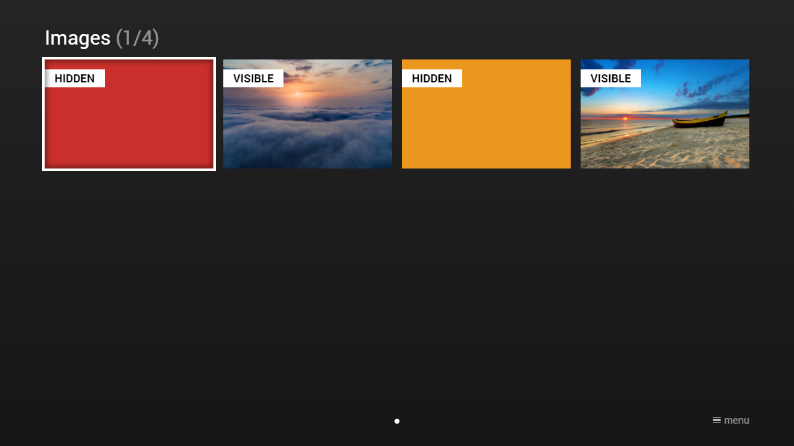

---
title: Hide Images
category: Experts API - Hidden Features
summary: Explains the MSX hide images hidden feature for suppressing image display.
---

# Hide Images

It is possible to hide images by setting the URL to `"none"`. This feature is available since version **0.1.74**.
Please see following example.

## Example

### Screenshot



### Code

```json
{
    "type": "pages",
    "headline": "Images",
    "template": {
        "type": "default",
        "layout": "0,0,3,2",       
        "imageFiller": "cover"
    },
    "items": [{
            "id": "image1",
            "color": "msx-red",
            "badge": "Hidden",
            "image": "none",
            "action": "update:content:image1",
            "data": {
                "badge": "Visible", 
                "image": "http://msx.benzac.de/img/bg1.jpg"
            }
        }, {
            "id": "image2",
            "color": "msx-green",
            "badge": "Visible",
            "image": "http://msx.benzac.de/img/bg2.jpg",
            "action": "update:content:image2",
            "data": {
                "badge": "Hidden", 
                "image": "none"
            }
        }, {
            "id": "image3",
            "color": "msx-yellow",
            "badge": "Hidden",
            "image": "none",
            "action": "update:content:image3",
            "data": {
                "badge": "Visible",
                "image": "http://msx.benzac.de/img/bg3.jpg"
            }
        }, {
            "id": "image4",
            "color": "msx-blue",
            "badge": "Visible",
            "image": "http://msx.benzac.de/img/test.jpg",
            "action": "update:content:image4",
            "data": {
                "badge": "Hidden", 
                "image": "none"
            }
        }]
}
```

### Demo

- [Launch via App](https://msx.benzac.de/?start=content:https://msx.benzac.de/info/xp/data/hidden_feature_5.json)
- [Launch via Demo Page](https://msx.benzac.de/info/?start=content:https://msx.benzac.de/info/xp/data/hidden_feature_5.json)
