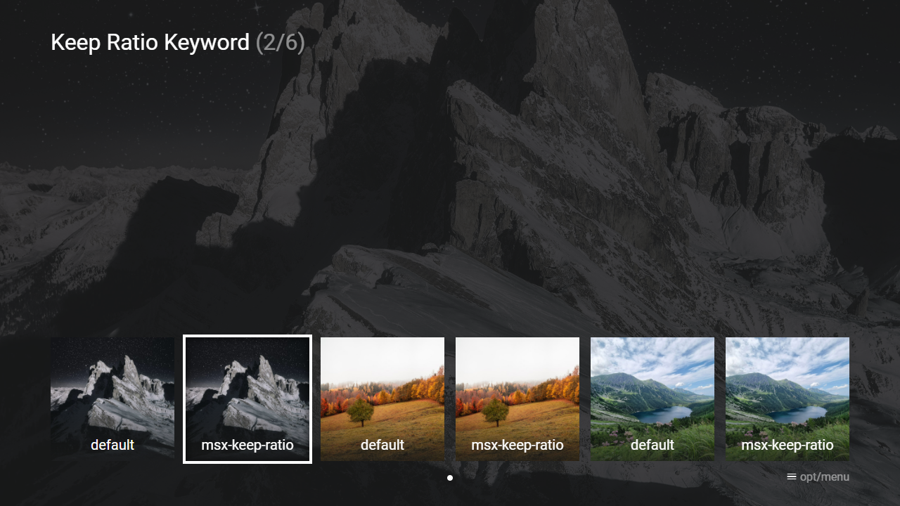

---
title: Keep Ratio Keyword
category: Experts API - Hidden Features
summary: Explains the MSX keep ratio keyword for maintaining image aspect ratios.
---

# Keep Ratio Keyword

It is possible to add the keyword `msx-keep-ratio` to a background image URL (at any position) to keep the aspect ratio. By default, the background image is stretched to fill the entire screen. By adding the keyword, the image is scaled up/down to fill the entire screen. This feature is available since version **0.1.150**.

**Note: Because of the immersive mode (introduced in version 0.1.150), the aspect ratio of backgrounds is not always 16:9 (like in previous versions) but can have any aspect ratio. Therefore, this keyword should also be used for backgrounds with an aspect ratio of 16:9 if stretching should be avoided.**

Please see following URL examples.

- `http://example.com/img/background_msx-keep-ratio.jpg`
- `http://example.com/img/msx-keep-ratio/background.jpg`
- `http://example.com/img/background.jpg?msx-keep-ratio`
- `http://example.com/img/background.jpg?w=1920&h=1080&msx-keep-ratio`
- `http://example.com/img/background.jpg#msx-keep-ratio`

Please see following code example.

## Example

### Screenshot



### Code

```json
{
    "type": "pages",
    "headline": "Keep Ratio Keyword",
    "options": {
        "items": [{
                "type": "control",
                "layout": "0,0,8,1",
                "label": "Enable Immersive Mode",
                "action": "[cleanup|settings:immersive_mode:1]"
            }, {
                "type": "control",
                "layout": "0,1,8,1",
                "label": "Disable Immersive Mode",
                "action": "[cleanup|settings:immersive_mode:0]"
            }, {
                "type": "space",
                "layout": "0,5,8,1",
                "text": [
                    "{ico:msx-blue:info} Please note that the immersive mode is (usually) only available on mobile and desktop devices.",
                    " If your device supports the immersive mode, you will find an entry in the settings where you can also enable/disable it."
                ]
            }]
    },
    "template": {
        "type": "default",
        "titleFooter": "{col:msx-white}default",
        "imageLabel": "default",
        "area": "0,4,12,2",
        "layout": "0,0,2,2",
        "color": "msx-glass",
        "imageFiller": "cover",
        "alignment": "center",
        "selection": {
            "important": true,
            "background": "{context:background}"
        },
        "properties": {
            "image:action": "slider:stop",
            "image:trigger": "slider:sync"
        }
    },
    "items": [{
            "image": "http://msx.benzac.de/media/thumbs/square1.jpg",
            "background": "http://msx.benzac.de/media/square1.jpg",
            "action": "image:http://msx.benzac.de/media/square1.jpg"
        }, {
            "titleFooter": "{col:msx-white}msx-keep-ratio",
            "imageLabel": "msx-keep-ratio",
            "image": "http://msx.benzac.de/media/thumbs/square1.jpg",
            "background": "http://msx.benzac.de/media/square1.jpg#msx-keep-ratio",
            "action": "image:http://msx.benzac.de/media/square1.jpg"
        }, {
            "image": "http://msx.benzac.de/media/thumbs/square2.jpg",
            "background": "http://msx.benzac.de/media/square2.jpg",
            "action": "image:http://msx.benzac.de/media/square2.jpg"
        }, {
            "titleFooter": "{col:msx-white}msx-keep-ratio",
            "imageLabel": "msx-keep-ratio",
            "image": "http://msx.benzac.de/media/thumbs/square2.jpg",
            "background": "http://msx.benzac.de/media/square2.jpg#msx-keep-ratio",
            "action": "image:http://msx.benzac.de/media/square2.jpg"
        }, {
            "image": "http://msx.benzac.de/media/thumbs/square3.jpg",
            "background": "http://msx.benzac.de/media/square3.jpg",
            "action": "image:http://msx.benzac.de/media/square3.jpg"
        }, {
            "titleFooter": "{col:msx-white}msx-keep-ratio",
            "imageLabel": "msx-keep-ratio",
            "image": "http://msx.benzac.de/media/thumbs/square3.jpg",
            "background": "http://msx.benzac.de/media/square3.jpg#msx-keep-ratio",
            "action": "image:http://msx.benzac.de/media/square3.jpg"
        }]
}
```

### Demo

- [Launch via App](https://msx.benzac.de/?start=content:https://msx.benzac.de/info/xp/data/hidden_feature_18.json)
- [Launch via Demo Page](https://msx.benzac.de/info/?start=content:https://msx.benzac.de/info/xp/data/hidden_feature_18.json)
