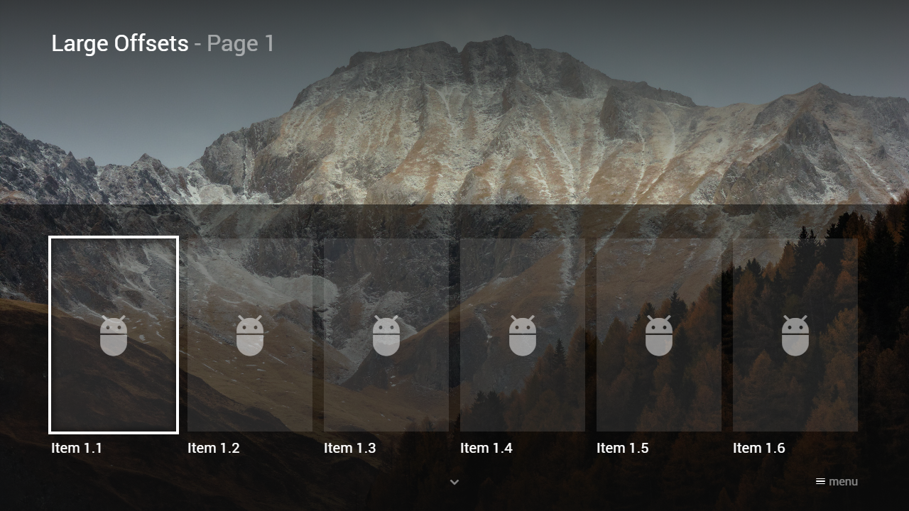

---
title: Large Offsets
category: Experts API - Hidden Features
summary: Explains the MSX large offsets hidden feature for positioning items beyond default grid bounds.
---

# Large Offsets

This is not really a hidden feature, but a good-to-know information. It is possible to stretch an image to the entire screen size by using large offsets. This feature is available since version **0.1.110**.
Please see following example.

## Example

### Screenshot



### Code

```json
{
    "type": "list",
    "headline": "Large Offsets",
    "pages": [{
            "headline": "Page 1",
            "offset": "0,0,0,1.5",
            "items": [{
                    "type": "space",
                    "layout": "0,0,12,6",
                    "offset": "-0.75,-1,1.5,1.67",
                    "color": "msx-glass",
                    "image": "http://msx.benzac.de/img/bg1.jpg",
                    "imageOverlay": 4,
                    "round": false
                }, {
                    "type": "space",
                    "layout": "0,1,12,4",
                    "offset": "-0.75,1,1.5,0.67",
                    "color": "msx-black-soft",
                    "round": false
                }, {
                    "type": "separate",
                    "layout": "0,2,2,4",
                    "offset": "0,0.5,0,0",
                    "icon": "msx-white-soft:adb",
                    "color": "msx-glass",
                    "title": "Item 1.1"
                }, {
                    "type": "separate",
                    "layout": "2,2,2,4",
                    "offset": "0,0.5,0,0",
                    "icon": "msx-white-soft:adb",
                    "color": "msx-glass",
                    "title": "Item 1.2"
                }, {
                    "type": "separate",
                    "layout": "4,2,2,4",
                    "offset": "0,0.5,0,0",
                    "icon": "msx-white-soft:adb",
                    "color": "msx-glass",
                    "title": "Item 1.3"
                }, {
                    "type": "separate",
                    "layout": "6,2,2,4",
                    "offset": "0,0.5,0,0",
                    "icon": "msx-white-soft:adb",
                    "color": "msx-glass",
                    "title": "Item 1.4"
                }, {
                    "type": "separate",
                    "layout": "8,2,2,4",
                    "offset": "0,0.5,0,0",
                    "icon": "msx-white-soft:adb",
                    "color": "msx-glass",
                    "title": "Item 1.5"
                }, {
                    "type": "separate",
                    "layout": "10,2,2,4",
                    "offset": "0,0.5,0,0",
                    "icon": "msx-white-soft:adb",
                    "color": "msx-glass",
                    "title": "Item 1.6"
                }]
        }, {
            "headline": "Page 2",
            "offset": "0,0,0,1.5",
            "items": [{
                    "type": "space",
                    "layout": "0,0,12,6",
                    "offset": "-0.75,-1,1.5,1.67",
                    "color": "msx-glass",
                    "image": "http://msx.benzac.de/img/bg2.jpg",
                    "imageOverlay": 4,
                    "round": false
                }, {
                    "type": "space",
                    "layout": "0,1,12,4",
                    "offset": "-0.75,1,1.5,0.67",
                    "color": "msx-black-soft",
                    "round": false
                }, {
                    "type": "separate",
                    "layout": "0,2,2,4",
                    "offset": "0,0.5,0,0",
                    "icon": "msx-white-soft:adb",
                    "color": "msx-glass",
                    "title": "Item 2.1"
                }, {
                    "type": "separate",
                    "layout": "2,2,2,4",
                    "offset": "0,0.5,0,0",
                    "icon": "msx-white-soft:adb",
                    "color": "msx-glass",
                    "title": "Item 2.2"
                }, {
                    "type": "separate",
                    "layout": "4,2,2,4",
                    "offset": "0,0.5,0,0",
                    "icon": "msx-white-soft:adb",
                    "color": "msx-glass",
                    "title": "Item 2.3"
                }, {
                    "type": "separate",
                    "layout": "6,2,2,4",
                    "offset": "0,0.5,0,0",
                    "icon": "msx-white-soft:adb",
                    "color": "msx-glass",
                    "title": "Item 2.4"
                }, {
                    "type": "separate",
                    "layout": "8,2,2,4",
                    "offset": "0,0.5,0,0",
                    "icon": "msx-white-soft:adb",
                    "color": "msx-glass",
                    "title": "Item 2.5"
                }, {
                    "type": "separate",
                    "layout": "10,2,2,4",
                    "offset": "0,0.5,0,0",
                    "icon": "msx-white-soft:adb",
                    "color": "msx-glass",
                    "title": "Item 2.6"
                }]
        }]
}
```

### Demo

- [Launch via App](https://msx.benzac.de/?start=content:https://msx.benzac.de/info/xp/data/hidden_feature_9.json)
- [Launch via Demo Page](https://msx.benzac.de/info/?start=content:https://msx.benzac.de/info/xp/data/hidden_feature_9.json)
