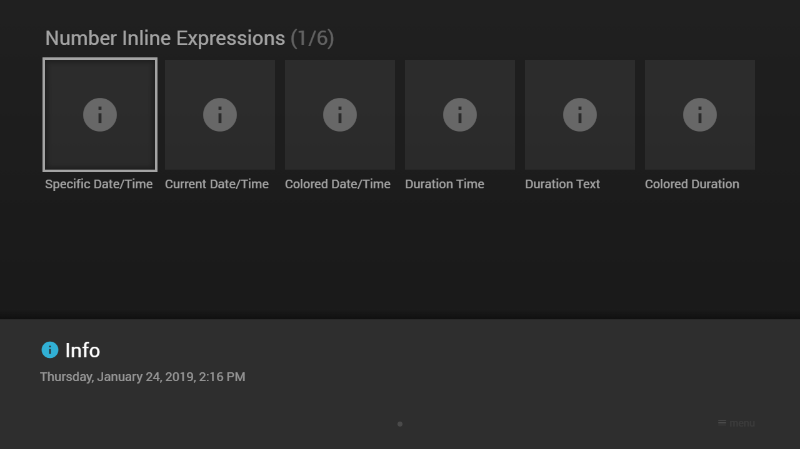

---
title: Number Inline Expressions
category: Experts API - Hidden Features
summary: Reference for MSX number inline expressions used for numeric formatting in text values.
---

# Number Inline Expressions

It is possible to convert numbers (indicated in milliseconds) with inline expressions into date, time, or duration values. The expressions are similar to the [Live Inline Expressions](../live/live-inline-expressions.md) and look like this: `{num:{NUMBER}:{TYPE}:{FORMAT}}`. It is also possible to add colored values with the expression syntax `{txt:{COLOR}:num:{NUMBER}:{TYPE}:{FORMAT}}`. Please see [Colors](../../main-api/common/colors.md) for possible color values. This feature is available since version **0.1.91**. Since version **0.1.160**, a number can also be basically formatted by using the syntax `{num:{NUMBER}:format}` or `{num:{NUMBER}:format:{FORMAT}}`. In the first case, the number format is taken from the dictionary. Please see [Basic Number Format Expressions](#basic-number-format-expressions) for examples.

> **Date, time, duration formats and formatter IDs are identical to the [Live Inline Expressions](../live/live-inline-expressions.md).** The examples below only show a few; the complete vocabulary lives on that page and applies unchanged to `{num:…}`:
> - `date:{FORMAT}` → [Live Date Format](../live/live-inline-expressions.md#live-date-format) (e.g. `DD, MM d, yyyy`)
> - `time:{FORMAT}` → [Live Time Format](../live/live-inline-expressions.md#live-time-format) (e.g. `h:mm/ampm`)
> - `duration:time:{FORMAT}` → [Live Duration Format](../live/live-inline-expressions.md#live-duration-format) (e.g. `hh:mm:ss`)
> - `duration:text:{FORMAT}` → [Live Duration Text](../live/live-inline-expressions.md#live-duration-text) (e.g. `dhms`)
> - `formatter:{FORMATTER_ID}` → all **14** [Live Formatter IDs](../live/live-inline-expressions.md#live-formatter-id) (`time`, `time_long`, `time_day`, `time_day_long`, `day`, `day_long`, `day_full`, `day_time`, `day_time_long`, `day_time_full`, `date`, `date_long`, `date_time`, `date_time_long`) — not just `day_full`.

## Basic Number Format Expressions

Expression syntax of basic number format expressions.

| Expression | Example | Output | Since Version |
|---|---|---|---|
| `{num:{NUMBER}:format}`<br> | `{num:123:format}`<br>`{num:1234:format}`<br>`{num:12345.12345:format}`<br> | `123`<br>`1,234`<br>`12,345.12345`<br> | **0.1.160** |
| `{num:{NUMBER}:format:{DECIMAL_DIGITS}}`<br>`{num:{NUMBER}:format:{DECIMAL_DIGITS}{DECIMAL_TRIMMING}}`<br> | `{num:123:format:0}`<br>`{num:123:format:1}`<br>`{num:123:format:2}`<br>`{num:123:format:02}`<br>`{num:123:format:12}`<br>`{num:123:format:21}`<br><br>`{num:1234.1:format:0}`<br>`{num:1234.1:format:1}`<br>`{num:1234.1:format:3}`<br>`{num:1234.1:format:03}`<br>`{num:1234.1:format:23}`<br>`{num:1234.1:format:32}`<br><br>`{num:12345.12345:format:0}`<br>`{num:12345.12345:format:1}`<br>`{num:12345.12345:format:4}`<br>`{num:12345.12345:format:04}`<br>`{num:12345.12345:format:24}`<br>`{num:12345.12345:format:42}`<br> | `123`<br>`123.0`<br>`123.00`<br>`123`<br>`123.0`<br>`123.00`<br><br>`1,234`<br>`1,234.1`<br>`1,234.100`<br>`1,234.1`<br>`1,234.10`<br>`1,234.100`<br><br>`12,345`<br>`12,345.1`<br>`12,345.1234`<br>`12,345.1234`<br>`12,345.1234`<br>`12,345.1200`<br> | **0.1.160** |
| `{num:{NUMBER}:format:{THOUSANDS_SEPARATOR}}`<br>`{num:{NUMBER}:format:{THOUSANDS_SEPARATOR}{DECIMAL_SEPARATOR}}`<br>`{num:{NUMBER}:format:{THOUSANDS_SEPARATOR}{DECIMAL_SEPARATOR}{DECIMAL_DIGITS}}`<br>`{num:{NUMBER}:format:{THOUSANDS_SEPARATOR}{DECIMAL_SEPARATOR}{DECIMAL_DIGITS}{DECIMAL_TRIMMING}}`<br> | `{num:12345.12345:format:.,}`<br>`{num:12345.12345:format: .}`<br>`{num:12345.12345:format: ,}`<br>`{num:12345.12345:format:.,0}`<br>`{num:12345.12345:format: .1}`<br>`{num:12345.12345:format: ,24}`<br> | `12.345,12345`<br>`12 345.12345`<br>`12 345,12345`<br>`12.345`<br>`12 345.1`<br>`12 345,1234`<br> | **0.1.160** |

## Example

### Screenshot



### Code

```json
{
    "type": "pages",
    "headline": "Number Inline Expressions",
    "template": {
        "type": "separate",
        "layout": "0,0,2,3",
        "icon": "msx-white-soft:info",
        "color": "msx-glass"
    },
    "items": [{
            "title": "Specific Date/Time",
            "action": "info:{num:1548335764000:date:DD, MM d, yyyy}, {num:1548335764000:time:h:mm/ampm}"
        }, {
            "title": "Current Date/Time",
            "action": "info:{num:now:date:DD, MM d, yyyy}, {num:now:time:h:mm/ampm}"
        }, {
            "title": "Colored Date/Time",
            "action": "info:{txt:msx-blue:num:1548335764000:date:DD, MM d, yyyy}, {txt:msx-blue:num:1548335764000:time:h:mm/ampm}"
        }, {
            "title": "Duration Time",
            "action": "info:{num:5640000:duration:time:hh:mm:ss}"
        }, {
            "title": "Duration Text",
            "action": "info:{num:5640000:duration:text:dhms}"
        }, {
            "title": "Colored Duration",
            "action": "info:{txt:msx-blue:num:5640000:duration:text:dhms}"
        }, {
            "badge": "Formatter",
            "title": "Specific Date/Time",
            "titleFooter": "0.1.160+",
            "action": "info:{num:1548335764000:formatter:day_full}"
        }, {
            "badge": "Formatter",
            "title": "Current Date/Time",
            "titleFooter": "0.1.160+",
            "action": "info:{num:now:formatter:day_full}"
        }, {
            "badge": "Formatter",
            "title": "Colored Date/Time",
            "titleFooter": "0.1.160+",
            "action": "info:{txt:msx-blue:num:1548335764000:formatter:day_full}"
        }, {
            "badge": "Format",
            "title": "Default Number",
            "titleFooter": "0.1.160+",
            "action": "info:{num:12345.12345:format}"
        }, {
            "badge": "Format",
            "title": "Rounded Number",
            "titleFooter": "0.1.160+",
            "action": "info:{num:12345.12345:format:0}"
        }, {
            "badge": "Format",
            "title": "Colored Number",
            "titleFooter": "0.1.160+",
            "action": "info:{txt:msx-blue:num:12345.12345:format: ,24}"
        }]
}
```

### Demo

- [Launch via App](https://msx.benzac.de/?start=content:https://msx.benzac.de/info/xp/data/hidden_feature_6.json)
- [Launch via Demo Page](https://msx.benzac.de/info/?start=content:https://msx.benzac.de/info/xp/data/hidden_feature_6.json)
