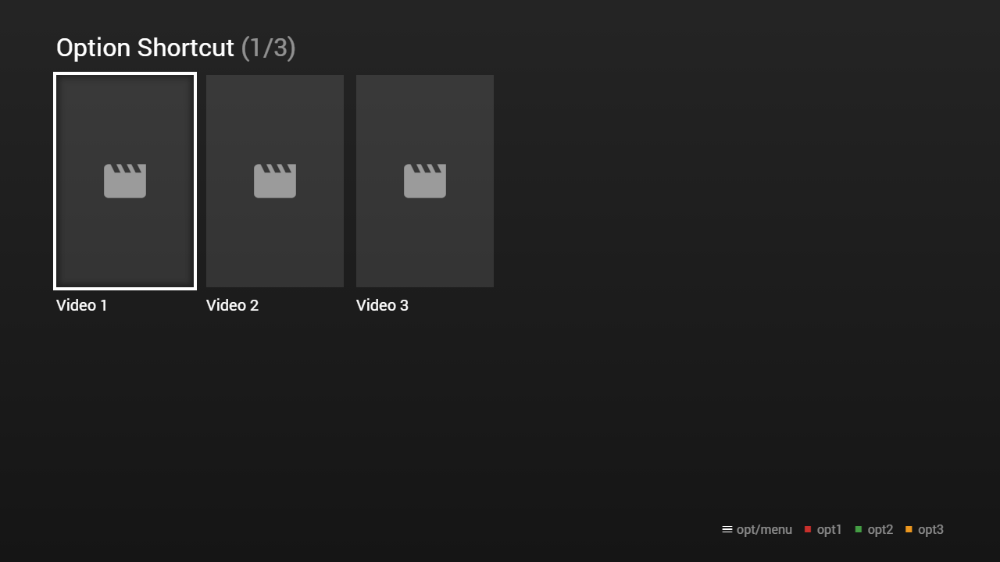

---
title: Option Shortcut
category: Experts API - Hidden Features
summary: Explains the MSX option shortcut hidden feature for quick option access.
---

# Option Shortcut

It is possible to create a shortcut for an option item by setting the `key` property. For more information about the `key` property, please see [Key Property](key-property.md). It is also possible to deactivate the shortcut feature by setting a `shortcut` property (of type `boolean`) to `false` for the corresponding option item. This feature is available since version **0.1.132**.

**Note: A template object is not evaluated for option shortcut items. Therefore, properties like `key`, `action`, `display`, `enable`, or `shortcut` must be set directly on the item. Please also note that header and footer pages are not searched for option shortcut items.**

Please see following example.

## Example

This example also shows the feature of setting up shortcut keys for player buttons.
If you would like to test this example on a desktop device, please use the number key `1` for `red`, `2` for `green`, and `3` for `yellow`.

### Screenshot



### Code

```json
{
    "type": "list",
    "headline": "Option Shortcut",    
    "template": {
        "type": "separate",
        "layout": "0,0,2,4",
        "icon": "msx-white-soft:movie",
        "color": "msx-glass",
        "options": {
            "headline": "{context:title} Options",
            "caption": "opt/menu{tb}{ico:msx-red:stop} opt1{tb}{ico:msx-green:stop} opt2{tb}{ico:msx-yellow:stop} opt3",
            "template": {
                "enumerate": false,
                "type": "control",
                "layout": "0,0,8,1"
            },
            "items": [{
                    "key": "red|1",
                    "icon": "msx-red:stop",
                    "label": "Option 1",
                    "action": "[cleanup|info:{txt:msx-white:Option 1} for {txt:msx-white:{context:title}} executed.]"
                }, {
                    "key": "green|2",
                    "icon": "msx-green:stop",
                    "label": "Option 2",
                    "action": "[cleanup|info:{txt:msx-white:Option 2} for {txt:msx-white:{context:title}} executed.]"
                }, {
                    "key": "yellow|3",
                    "icon": "msx-yellow:stop",
                    "label": "Option 3",
                    "action": "[cleanup|info:{txt:msx-white:Option 3} for {txt:msx-white:{context:title}} executed.]"
                }]   
        },
        "properties": {
            "button:content:key": "red|1",
            "button:restart:key": "green|2",
            "button:next:key": "yellow|3",
            "label:extension": "{ico:msx-red:pageview} {ico:msx-green:replay} {ico:msx-yellow:skip-next}"
        }
    },
    "items": [{
            "title": "Video 1",
            "playerLabel": "Video 1",
            "action": "video:http://msx.benzac.de/media/video1.mp4"
        }, {
            "title": "Video 2",
            "playerLabel": "Video 2",
            "action": "video:http://msx.benzac.de/media/video2.mp4"
        }, {
            "title": "Video 3",
            "playerLabel": "Video 3",
            "action": "video:http://msx.benzac.de/media/video3.mp4"
        }]
}
```

### Demo

- [Launch via App](https://msx.benzac.de/?start=content:https://msx.benzac.de/info/xp/data/hidden_feature_14.json)
- [Launch via Demo Page](https://msx.benzac.de/info/?start=content:https://msx.benzac.de/info/xp/data/hidden_feature_14.json)

## Related Hidden Features

- [Key Property](key-property.md)
