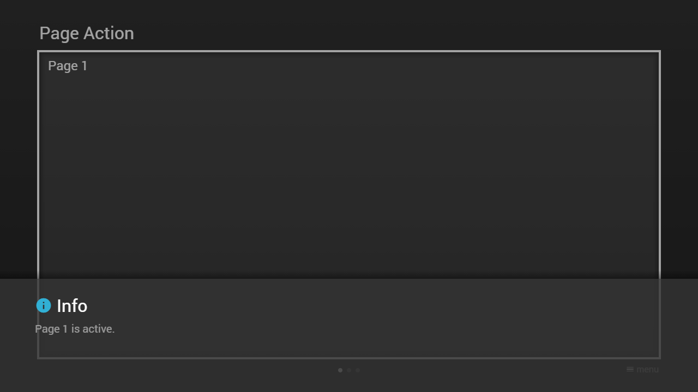

---
title: Page Action
category: Experts API - Hidden Features
summary: Explains the MSX page action hidden feature for executing actions on page navigation.
---

# Page Action

It is possible to execute an action if a content page becomes active by setting an `action` property (of type `string`) to a content page object. An action-related `data` property (of type `object`) can also be set. Please see [Internal Actions](../special/internal-actions.md) for possible values. This feature is available since version **0.1.112**.

**Note: A page action is executed before a selection action (which is executed if a content item becomes the focus). If the content page is displayed as overlay page, the action is executed when the entire content becomes active and it is executed before a common page action. If the content page is displayed as underlay page, the action is executed when the entire content becomes visible and it is executed before an overlay page action. Since version 0.1.130, the underlay page action is also executed if the content becomes inactive (i.e. if a corresponding menu becomes active and the content is still visible).**

Please see following example.

## Example

### Screenshot



### Code

```json
{
    "type": "pages",
    "headline": "Page Action",    
    "underlay": {
        "action": "logger:debug:Content is visible."
    },
    "overlay": {
        "action": "logger:debug:Content is active."
    },
    "pages": [{
            "action": "info:Page 1 is active.",
            "items": [{
                    "layout": "0,0,12,6",
                    "color": "msx-glass",
                    "headline": "Page 1"
                }]
        }, {
            "action": "info:Page 2 is active.",
            "items": [{
                    "layout": "0,0,12,6",
                    "color": "msx-glass",
                    "headline": "Page 2"
                }]
        }, {
            "action": "info:Page 3 is active.",
            "items": [{
                    "layout": "0,0,12,6",
                    "color": "msx-glass",
                    "headline": "Page 3"
                }]
        }]
}
```

### Demo

- [Launch via App](https://msx.benzac.de/?start=content:https://msx.benzac.de/info/xp/data/hidden_feature_10.json)
- [Launch via Demo Page](https://msx.benzac.de/info/?start=content:https://msx.benzac.de/info/xp/data/hidden_feature_10.json)

## See also

- [Common Misconceptions → Right property, wrong object](../../reference/common-misconceptions.md#right-property-wrong-object) — using an underlay page action to reset a selection `action`'s lasting effect once focus moves away, since there is no built-in "on focus leaves" action
