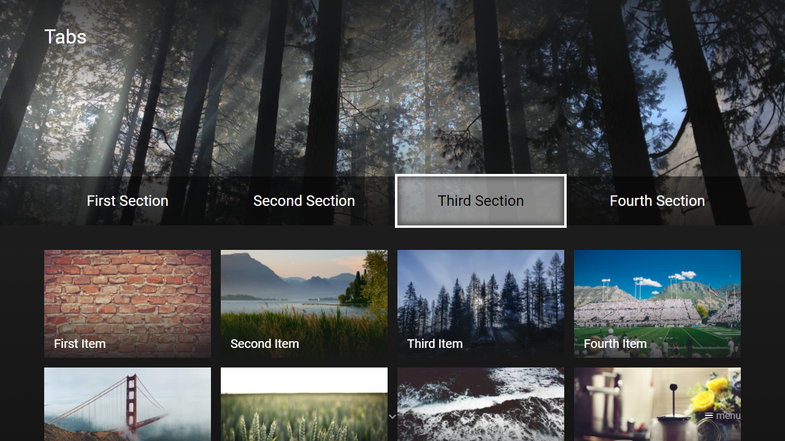

---
title: Replace Action
category: Experts API - Hidden Features
summary: Explains the MSX replace action hidden feature for replacing content items dynamically.
---

# Replace Action

It is possible to replace (and reload) the current menu, content, or panel data at runtime. This feature is available since version **0.1.144** and allows you to implement session-less tabs, filters, sortings, pagings, and more.

**Note: The current menu/content/panel data `flag` property must match the indicated flag (within the action), otherwise the data will not be replaced. This ensures that the correct data is being replaced. This also means that only data that has a `flag` property can be replaced. Please note that if the content of a menu item is replaced, the corresponding menu item will retain the replacement when the menu is reloaded/replaced (if the corresponding content is visible). If this behavior is not desired, please execute the action `release:content` before reloading/replacing the menu (e.g. `[release:content|reload:menu]`). For dynamic menus, it is recommended to set the `id` property of the corresponding menu item to ensure that the correct data is being retained, otherwise the menu item index is used (which might change after a reload/replace).**

Please see following example code.

## Example

### Screenshot



### Code

```json
{
    "type": "list",
    "headline": "Tabs",
    "preload": "next",
    "flag": "tabs",
    "header": {
        "offset": "0,0,0,0.25",
        "items": [{
                "type": "space",
                "round": false,
                "layout": "0,0,12,3",
                "offset": "-1.25,-1,2,1",
                "color": "msx-glass",
                "image": "https://picsum.photos/seed/msx_665e1e1c_bg/1992/552",
                "imageFiller": "cover",
                "imageOverlay": 4
            }, {
                "type": "space",
                "round": false,
                "layout": "0,1,12,1",
                "offset": "-1.25,1,2,0",
                "color": "msx-black-soft"
            }, {
                "type": "default",
                "layout": "0,2,3,1",
                "focus": true,
                "color": "msx-white-soft",
                "label": "{col:msx-black}First Section",
                "action": "replace:content:tabs:http://msx.benzac.de/info/xp/data/hidden_feature_15_section1.json"
            }, {
                "type": "default",
                "layout": "3,2,3,1",
                "color": "transparent",
                "label": "Second Section",
                "action": "replace:content:tabs:http://msx.benzac.de/info/xp/data/hidden_feature_15_section2.json"
            }, {
                "type": "default",
                "layout": "6,2,3,1",
                "color": "transparent",
                "label": "Third Section",
                "action": "replace:content:tabs:http://msx.benzac.de/info/xp/data/hidden_feature_15_section3.json"
            }, {
                "type": "default",
                "layout": "9,2,3,1",
                "color": "transparent",
                "label": "Fourth Section",
                "action": "replace:content:tabs:http://msx.benzac.de/info/xp/data/hidden_feature_15_section4.json"
            }]
    },
    "template": {
        "type": "default",
        "layout": "0,0,3,2",
        "color": "msx-glass",
        "imageFiller": "cover"
    },
    "items": [{
            "titleHeader": "{col:msx-white}First Item",
            "image": "https://picsum.photos/seed/msx_903ff95d_item0/408/264",
            "action": "image:https://picsum.photos/seed/msx_903ff95d_item0/1920/1080",
            "properties": {
                "image:extension": "| {col:msx-white}First Item"
            }
        }, {
            "titleHeader": "{col:msx-white}Second Item",
            "image": "https://picsum.photos/seed/msx_903ff95d_item1/408/264",
            "action": "image:https://picsum.photos/seed/msx_903ff95d_item1/1920/1080",
            "properties": {
                "image:extension": "| {col:msx-white}Second Item"
            }
        }, {
            "titleHeader": "{col:msx-white}Third Item",
            "image": "https://picsum.photos/seed/msx_903ff95d_item2/408/264",
            "action": "image:https://picsum.photos/seed/msx_903ff95d_item2/1920/1080",
            "properties": {
                "image:extension": "| {col:msx-white}Third Item"
            }
        }, {
            "titleHeader": "{col:msx-white}Fourth Item",
            "image": "https://picsum.photos/seed/msx_903ff95d_item3/408/264",
            "action": "image:https://picsum.photos/seed/msx_903ff95d_item3/1920/1080",
            "properties": {
                "image:extension": "| {col:msx-white}Fourth Item"
            }
        }, {
            "titleHeader": "{col:msx-white}Fifth Item",
            "image": "https://picsum.photos/seed/msx_903ff95d_item4/408/264",
            "action": "image:https://picsum.photos/seed/msx_903ff95d_item4/1920/1080",
            "properties": {
                "image:extension": "| {col:msx-white}Fifth Item"
            }
        }, {
            "titleHeader": "{col:msx-white}Sixth Item",
            "image": "https://picsum.photos/seed/msx_903ff95d_item5/408/264",
            "action": "image:https://picsum.photos/seed/msx_903ff95d_item5/1920/1080",
            "properties": {
                "image:extension": "| {col:msx-white}Sixth Item"
            }
        }, {
            "titleHeader": "{col:msx-white}Seventh Item",
            "image": "https://picsum.photos/seed/msx_903ff95d_item6/408/264",
            "action": "image:https://picsum.photos/seed/msx_903ff95d_item6/1920/1080",
            "properties": {
                "image:extension": "| {col:msx-white}Seventh Item"
            }
        }, {
            "titleHeader": "{col:msx-white}Eighth Item",
            "image": "https://picsum.photos/seed/msx_903ff95d_item7/408/264",
            "action": "image:https://picsum.photos/seed/msx_903ff95d_item7/1920/1080",
            "properties": {
                "image:extension": "| {col:msx-white}Eighth Item"
            }
        }, {
            "titleHeader": "{col:msx-white}Ninth Item",
            "image": "https://picsum.photos/seed/msx_903ff95d_item8/408/264",
            "action": "image:https://picsum.photos/seed/msx_903ff95d_item8/1920/1080",
            "properties": {
                "image:extension": "| {col:msx-white}Ninth Item"
            }
        }, {
            "titleHeader": "{col:msx-white}Tenth Item",
            "image": "https://picsum.photos/seed/msx_903ff95d_item9/408/264",
            "action": "image:https://picsum.photos/seed/msx_903ff95d_item9/1920/1080",
            "properties": {
                "image:extension": "| {col:msx-white}Tenth Item"
            }
        }, {
            "titleHeader": "{col:msx-white}Eleventh Item",
            "image": "https://picsum.photos/seed/msx_903ff95d_item10/408/264",
            "action": "image:https://picsum.photos/seed/msx_903ff95d_item10/1920/1080",
            "properties": {
                "image:extension": "| {col:msx-white}Eleventh Item"
            }
        }, {
            "titleHeader": "{col:msx-white}Twelfth Item",
            "image": "https://picsum.photos/seed/msx_903ff95d_item11/408/264",
            "action": "image:https://picsum.photos/seed/msx_903ff95d_item11/1920/1080",
            "properties": {
                "image:extension": "| {col:msx-white}Twelfth Item"
            }
        }]
}
```

### Demo

- [Launch via App](https://msx.benzac.de/?start=content:https://msx.benzac.de/info/xp/data/hidden_feature_15_section1.json)
- [Launch via Demo Page](https://msx.benzac.de/info/?start=content:https://msx.benzac.de/info/xp/data/hidden_feature_15_section1.json)

## See also

- [Actions Reference → Replace Actions (since `0.1.144`)](../../reference/actions-reference.md#replace-actions-since-01144)
- [Glossary → Replace](../../reference/glossary.md#replace)
