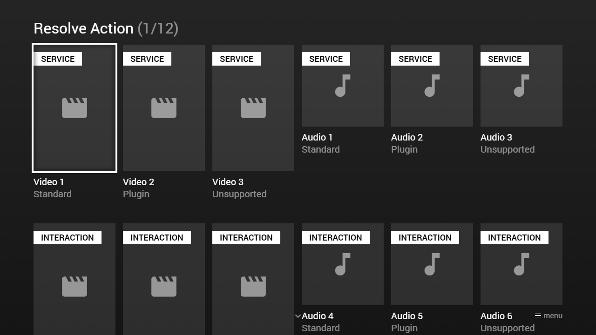

---
title: Resolve Action
category: Experts API - Hidden Features
summary: Explains the MSX resolve action hidden feature for dynamically resolving a video/audio/image/background URL via a server request at runtime.
---

# Resolve Action

Each platform supports different video/audio formats and codecs. This means that some videos/audios can be played with the standard player, others require a plugin, others do not work at all. To deal with this, the `resolve` action can be used, which has been developed to return a suitable format/codec depending on the current platform/player. This feature is available since version **0.1.107**.

The response data from a `resolve` action must contain a `url` property (of type `string`). If the resolve process failed, it should contain an `error` property (of type `string`). Since version **0.1.145**, the response data can also contain a `label` property (of type `string`), a `background` property (of type `string`), and a `properties` property (of type `object`) to extend/override the corresponding video/audio info (e.g. to set up player buttons for specific plugins). Please note that indicated `properties` extend/override existing `properties` and do not completely replace them.

**Note: The `resolve` action can also be used for images (that are loaded on the fly). Additionally, it can be used to generate temporary links or links with access tokens at runtime.**

Please see following example.

## Example

This example uses a web service and an interaction plugin to resolve the assets. For the interaction plugin, please have a look at this implementation script: [https://msx.benzac.de/interaction/js/resolve.js](https://msx.benzac.de/interaction/js/resolve.js).

### Screenshot



### Code

```json
{
    "type": "list",
    "headline": "Resolve Action",
    "template": {       
        "type": "separate",
        "layout": "0,0,2,4",
        "color": "msx-glass"
    },
    "items": [{
            "badge": "Service",
            "icon": "msx-white-soft:movie",
            "title": "Video 1",
            "titleFooter": "Standard",
            "playerLabel": "Video 1",
            "action": "video:resolve:http://msx.benzac.de/services/resolve.php?type=video&platform={PLATFORM}&player={PLAYER}"
        }, {
            "badge": "Service",
            "icon": "msx-white-soft:movie",
            "title": "Video 2 ",
            "titleFooter": "Plugin",
            "playerLabel": "Video 2",
            "action": "video:resolve:http://msx.benzac.de/services/resolve.php?type=plugin:video&platform={PLATFORM}&player={PLAYER}"
        }, {
            "badge": "Service",
            "icon": "msx-white-soft:movie",
            "title": "Video 3",
            "titleFooter": "Unsupported",
            "playerLabel": "Video 3",
            "action": "video:resolve:http://msx.benzac.de/services/resolve.php?type=unsupported"
        }, {
            "badge": "Service",
            "offset": "0,0,0,-1",
            "icon": "msx-white-soft:music-note",
            "background": "resolve:http://msx.benzac.de/services/resolve.php?type=image",
            "title": "Audio 1",
            "titleFooter": "Standard",
            "playerLabel": "Audio 1",
            "action": "audio:resolve:http://msx.benzac.de/services/resolve.php?type=audio&platform={PLATFORM}&player={PLAYER}"
        }, {
            "badge": "Service",
            "offset": "0,0,0,-1",
            "icon": "msx-white-soft:music-note",
            "background": "resolve:http://msx.benzac.de/services/resolve.php?type=image",
            "title": "Audio 2",
            "titleFooter": "Plugin",
            "playerLabel": "Audio 2",
            "action": "audio:resolve:http://msx.benzac.de/services/resolve.php?type=plugin:audio&platform={PLATFORM}&player={PLAYER}"
        }, {
            "badge": "Service",
            "offset": "0,0,0,-1",
            "icon": "msx-white-soft:music-note",
            "background": "resolve:http://msx.benzac.de/services/resolve.php?type=unsupported",
            "title": "Audio 3",
            "titleFooter": "Unsupported",
            "playerLabel": "Audio 3",
            "action": "audio:resolve:http://msx.benzac.de/services/resolve.php?type=unsupported"
        }, {
            "badge": "Interaction",
            "icon": "msx-white-soft:movie",
            "title": "Video 4",
            "titleFooter": "Standard",
            "playerLabel": "Video 4",
            "action": "video:resolve:request:interaction:video@http://msx.benzac.de/interaction/resolve.html"
        }, {
            "badge": "Interaction",
            "icon": "msx-white-soft:movie",
            "title": "Video 5",
            "titleFooter": "Plugin",
            "playerLabel": "Video 5",
            "action": "video:resolve:request:interaction:plugin:video@http://msx.benzac.de/interaction/resolve.html"
        }, {
            "badge": "Interaction",
            "icon": "msx-white-soft:movie",
            "title": "Video 6",
            "titleFooter": "Unsupported",
            "playerLabel": "Video 6",
            "action": "video:resolve:request:interaction:unsupported@http://msx.benzac.de/interaction/resolve.html"
        }, {
            "badge": "Interaction",
            "offset": "0,0,0,-1",
            "icon": "msx-white-soft:music-note",
            "background": "resolve:request:interaction:image@http://msx.benzac.de/interaction/resolve.html",
            "title": "Audio 4",
            "titleFooter": "Standard",
            "playerLabel": "Audio 4",
            "action": "audio:resolve:request:interaction:audio@http://msx.benzac.de/interaction/resolve.html"
        }, {
            "badge": "Interaction",
            "offset": "0,0,0,-1",
            "icon": "msx-white-soft:music-note",
            "background": "resolve:request:interaction:image@http://msx.benzac.de/interaction/resolve.html",
            "title": "Audio 5",
            "titleFooter": "Plugin",
            "playerLabel": "Audio 5",
            "action": "audio:resolve:request:interaction:plugin:audio@http://msx.benzac.de/interaction/resolve.html"
        }, {
            "badge": "Interaction",
            "offset": "0,0,0,-1",
            "icon": "msx-white-soft:music-note",
            "background": "resolve:request:interaction:unsupported@http://msx.benzac.de/interaction/resolve.html",
            "title": "Audio 6",
            "titleFooter": "Unsupported",
            "playerLabel": "Audio 6",
            "action": "audio:resolve:request:interaction:unsupported@http://msx.benzac.de/interaction/resolve.html"
        }]
}
```

### Demo

- [Launch via App](https://msx.benzac.de/?start=content:https://msx.benzac.de/info/xp/data/hidden_feature_13.json)
- [Launch via Demo Page](https://msx.benzac.de/info/?start=content:https://msx.benzac.de/info/xp/data/hidden_feature_13.json)

## See Also

- [Actions Reference → Resolve Action (since `0.1.107`)](../../reference/actions-reference.md#resolve-action-since-01107) — why it keeps its `0.1.107` minimum instead of the Internal Actions' `0.1.160+` blanket, including its `request:interaction:` sub-variant
- [Common Misconceptions → Actions](../../reference/common-misconceptions.md#actions) and [→ Server responses](../../reference/common-misconceptions.md#server-responses) — the exact `response.data.url`/`response.data.error` shape
- [Cookbook → Adaptive & dynamic playback](../../reference/cookbook.md#adaptive--dynamic-playback) — real examples using Resolve to serve a platform-specific codec or a token-protected link, including the Play Plugin's runtime player-selection pattern
