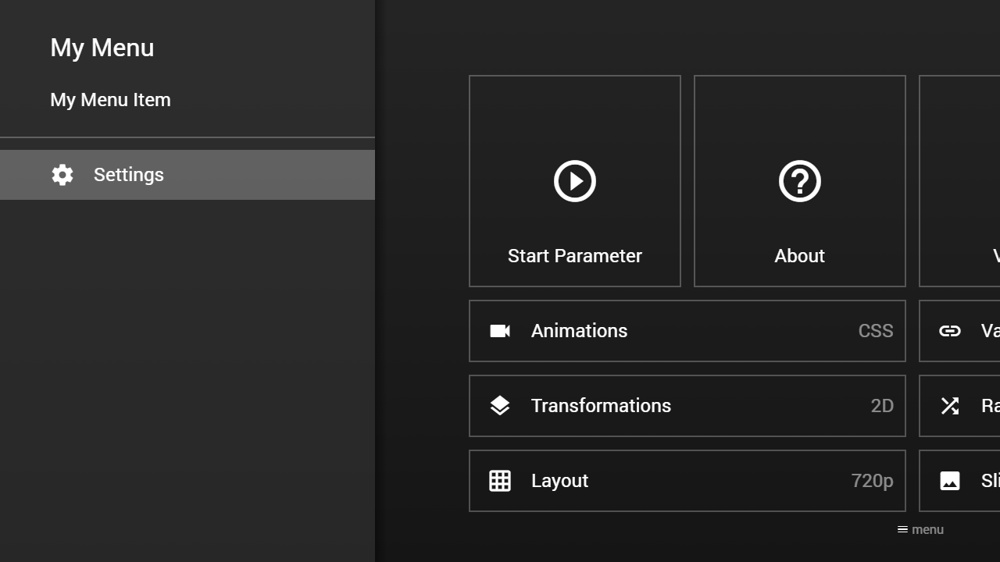

---
title: Settings Menu Item
category: Experts API - Hidden Features
summary: Explains the MSX settings menu item hidden feature for embedding settings in menus.
---

# Settings Menu Item

It is possible to add the application settings to your menu by setting the `type` property of a menu item to `"settings"`. This feature is available since version **0.1.0**.
Please see following example.

## Example

### Screenshot



### Code

```json
{
    "headline": "My Menu",
    "menu": [{
            "label": "My Menu Item"
        }, {
            "type": "separator"
        }, {
            "type": "settings"
        }]
}
```

### Demo

- [Launch via App](https://msx.benzac.de/?start=menu:https://msx.benzac.de/info/xp/data/hidden_feature_2.json)
- [Launch via Demo Page](https://msx.benzac.de/info/?start=menu:https://msx.benzac.de/info/xp/data/hidden_feature_2.json)

## See also

- [In-App Settings Reference](../../reference/settings-reference.md) — full map of every panel this menu item opens into, its allowed values, and how it relates to JSON-driven actions
