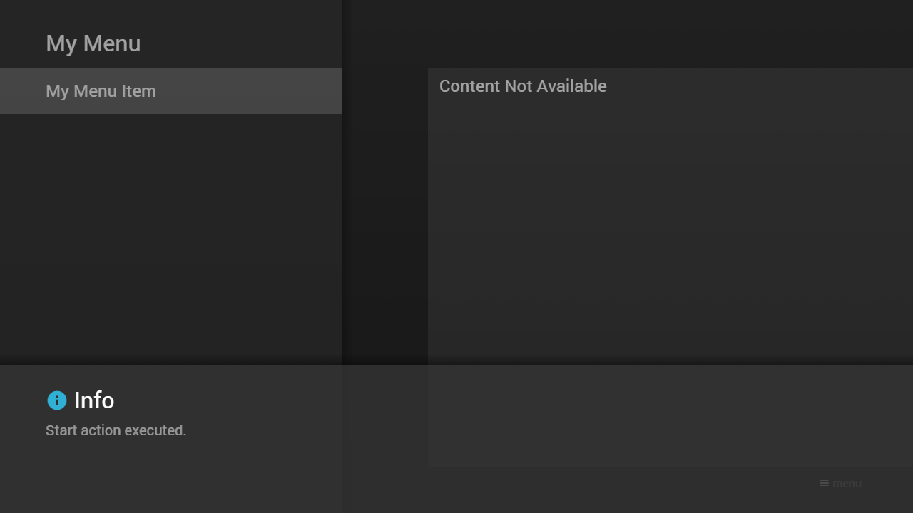

---
title: Start Action
category: Experts API - Hidden Features
summary: Explains the MSX start action hidden feature for executing a startup action.
---

# Start Action

It is possible to execute a start action by setting an `action` property (of type `string`) to the menu or content data that is loaded at startup. An action-related `data` property (of type `object`) can also be set. By default, the action `home` is executed. Please see [Internal Actions](../special/internal-actions.md) for possible values. This feature is available since version **0.1.0**.

**Note: The default action is not executed if a start action is set. For example, if you set an empty action, a blank screen is displayed during startup until the user makes an interaction. Please also note that the start action is skipped if the context menu is opened during startup or the start data is restored (when the application returns from a link action).**

Please see following example.

## Example

### Screenshot



### Code

```json
{
    "action": "info:Start action executed.",
    "headline": "My Menu",
    "menu": [{
            "label": "My Menu Item"
        }]
}
```

### Demo

- [Launch via App](https://msx.benzac.de/?start=menu:https://msx.benzac.de/info/xp/data/hidden_feature_1.json)
- [Launch via Demo Page](https://msx.benzac.de/info/?start=menu:https://msx.benzac.de/info/xp/data/hidden_feature_1.json)

## See also

- [Actions Reference → Start Action (since `0.1.0`)](../../reference/actions-reference.md#start-action-since-010)
- [Common Misconceptions → Actions](../../reference/common-misconceptions.md#actions) — why this is not the same thing as the `start` Main Action (`0.1.30`), which sets a *new* start parameter at runtime instead
- [Glossary → Start Action](../../reference/glossary.md#start-action)
