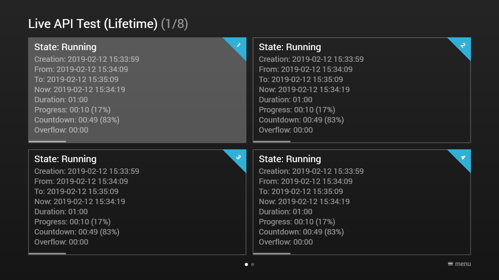
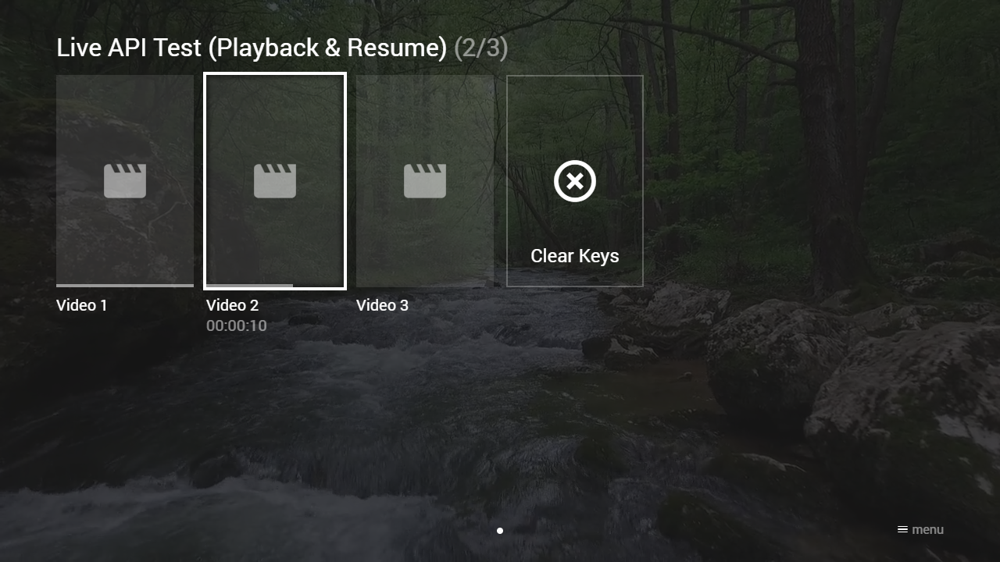
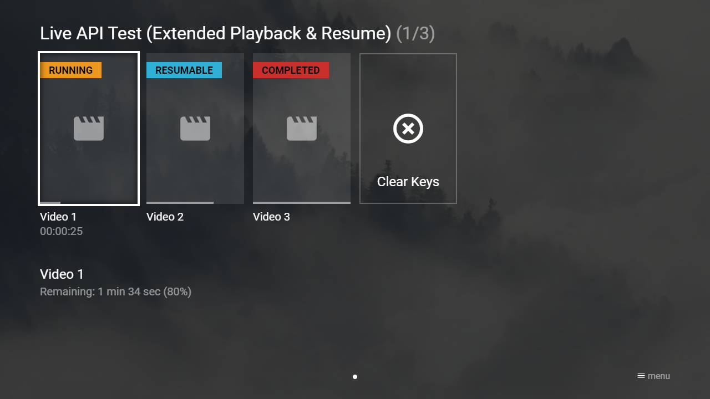
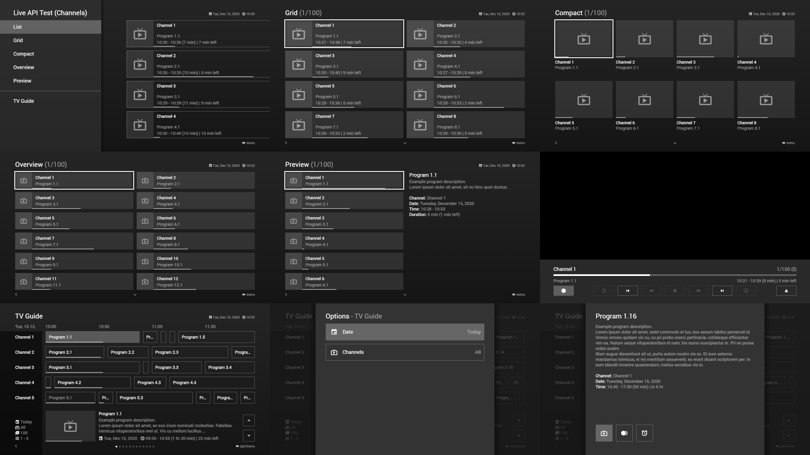

---
title: Live Examples
category: Experts API - Live
summary: Code examples demonstrating live data update configurations in MSX.
---

# Live Examples

## Example 1 (Lifetime)

### Screenshot



### Code

```json
{
    "type": "pages",
    "headline": "Live API Test (Lifetime)",
    "template": {
        "type": "button",
        "layout": "0,0,6,3",
        "headline": "State: Init",
        "text": "...",
        "progress": -1,
        "action": "live",
        "live": {
            "type": "lifetime",
            "duration": 60000,
            "delay": 10000,
            "coming": {
                "headline": "State: Coming",
                "execute": {
                    "action": "info:Content is coming."
                }
            },
            "running": {
                "headline": "State: Running",
                "execute": {
                    "action": "info:Content is running."
                }
            },
            "over": {
                "headline": "State: Over",
                "execute": {
                    "action": "info:Content is over."
                }
            },
            "text": [
                "Creation: {creation:date:yyyy-mm-dd} {creation:time:hh:mm:ss}{br}",
                "From: {from:date:yyyy-mm-dd} {from:time:hh:mm:ss}{br}",
                "To: {to:date:yyyy-mm-dd} {to:time:hh:mm:ss}{br}",
                "Now:  {now:date:yyyy-mm-dd} {now:time:hh:mm:ss}{br}",
                "Duration: {duration:time:mm:ss}{br}",
                "Progress: {progress:time:mm:ss} ({progress:percentage}){br}",
                "Countdown: {countdown:time:mm:ss} ({countdown:percentage}){br}",
                "Overflow: {overflow:time:mm:ss}{br}"
            ]
        }
    },
    "items": [{
            "tag": "1"
        }, {
            "tag": "2"
        }, {
            "tag": "3"
        }, {
            "tag": "4"
        }, {
            "tag": "5"
        }, {
            "tag": "6"
        }, {
            "tag": "7"
        }, {
            "tag": "8"
        }]
}
```

### Demo

- [Launch via App](https://msx.benzac.de/?start=content:https://msx.benzac.de/info/xp/data/live_test_1.json)
- [Launch via Demo Page](https://msx.benzac.de/info/?start=content:https://msx.benzac.de/info/xp/data/live_test_1.json)

## Example 2 (Playback & Resume)

**Note: For the resume feature, version 0.1.74 or higher is needed. A content can only be resumed if at least 10 seconds remain, otherwise it is started from the beginning.**

### Screenshot



### Code

```json
{
    "type": "pages",
    "headline": "Live API Test (Playback & Resume)",
    "template": {
        "type": "separate",
        "layout": "0,0,2,4",
        "icon": "msx-white-soft:movie",
        "color": "msx-glass",       
        "titleFooter": "",
        "progress": -1,
        "live": {
            "type": "playback",
            "titleFooter": "",
            "running": {
                "titleFooter": "{progress:time:hh:mm:ss}"  
            },
            "action": "player:show"
        },
        "properties": {
            "resume:key": "url"
        }
    },
    "items": [{
            "title": "Video 1",
            "action": "video:http://msx.benzac.de/media/video1.mp4"
        }, {
            "title": "Video 2",
            "action": "video:http://msx.benzac.de/media/video2.mp4"
        }, {
            "title": "Video 3",
            "action": "video:http://msx.benzac.de/media/video3.mp4"
        }, {
            "enumerate": false,
            "type": "button",
            "offset": "0,0,0,-1",
            "icon": "highlight-off",
            "label": "Clear Keys",
            "action": "data",
            "data": {
                "actions": [{
                        "action": "resume:clear:http://msx.benzac.de/media/video1.mp4"
                    }, {
                        "action": "resume:clear:http://msx.benzac.de/media/video2.mp4"
                    }, {
                        "action": "resume:clear:http://msx.benzac.de/media/video3.mp4"
                    }]
            }
        }]
}
```

### Demo

- [Launch via App](https://msx.benzac.de/?start=content:https://msx.benzac.de/info/xp/data/live_test_2.json)
- [Launch via Demo Page](https://msx.benzac.de/info/?start=content:https://msx.benzac.de/info/xp/data/live_test_2.json)

## Example 3 (Extended Playback & Resume)

**Note: For this example, version 0.1.153 or higher is needed.**

### Screenshot



### Code

```json
{
    "type": "pages",
    "headline": "Live API Test (Extended Playback & Resume)",
    "overlay": {
        "items": [{
                "id": "info",
                "type": "space",
                "layout": "0,4,12,2",
                "headline": "",
                "text": ""
            }]
    },
    "template": {
        "type": "separate",
        "layout": "0,0,2,4",
        "area": "0,0,12,4",
        "icon": "msx-white-soft:movie",
        "color": "msx-glass",
        "badge": "",
        "titleFooter": "",
        "progress": -1,
        "live": {
            "type": "playback",
            "coming": {
                "badge": "Resumable",
                "badgeColor": "msx-blue",
                "complete": {
                    "badge": "Completed",
                    "badgeColor": "msx-red"
                }
            },
            "running": {
                "badge": "Running",
                "badgeColor": "msx-yellow",
                "titleFooter": "{progress:time:hh:mm:ss}"
            },
            "action": "player:show"
        },
        "selection": {
            "action": "update:content:overlay:info",
            "data": {
                "headline": "{context:title}",
                "live": {
                    "type": "playback",
                    "source": "resume:key:{context:resumeKey}",
                    "over": {
                        "text": "Not started yet"
                    },
                    "coming": {
                        "text": "Remaining: {countdown:text:hms} ({countdown:percentage})",
                        "complete": {
                            "text": "Completed"
                        }
                    }
                }
            }
        },
        "properties": {
            "resume:key": "{context:resumeKey}",
            "resume:context": "live_test"
        }
    },
    "items": [{
            "resumeKey": "video1",
            "title": "Video 1",
            "action": "video:http://msx.benzac.de/media/video1.mp4"
        }, {
            "resumeKey": "video2",
            "title": "Video 2",
            "action": "video:http://msx.benzac.de/media/video2.mp4"
        }, {
            "resumeKey": "video3",
            "title": "Video 3",
            "action": "video:http://msx.benzac.de/media/video3.mp4"
        }, {
            "enumerate": false,
            "type": "button",
            "offset": "0,0,0,-1",
            "icon": "highlight-off",
            "label": "Clear Keys",
            "action": "resume:clear:context:live_test",     
            "selection": {
                "action": "update:content:overlay:info",
                "data": {
                    "headline": "",
                    "text": "{ico:msx-blue:info} Clear resumable keys for all videos in this example",
                    "live": {}
                }
            }
        }]
}
```

### Demo

- [Launch via App](https://msx.benzac.de/?start=content:https://msx.benzac.de/info/xp/data/live_test_3.json)
- [Launch via Demo Page](https://msx.benzac.de/info/?start=content:https://msx.benzac.de/info/xp/data/live_test_3.json)

## Example 4 (Channels)

For this example, the `"setup"` and `"schedule"` type is used to create a list of channels with live programs in different appearance styles (i.e. list, grid, compact, overview, and preview). A corresponding live service creates test programs with random `from` and `to` values. The `execute:service:{URL}` with the `update:content:{ITEM_ID}` action is used to update each channel item with the current live program. Please have a look at following example links.

- List: [http://msx.benzac.de/services/live.php?type=list](http://msx.benzac.de/services/live.php?type=list)
- Grid: [http://msx.benzac.de/services/live.php?type=grid](http://msx.benzac.de/services/live.php?type=grid)
- Compact: [http://msx.benzac.de/services/live.php?type=compact](http://msx.benzac.de/services/live.php?type=compact)
- Overview: [http://msx.benzac.de/services/live.php?type=overview](http://msx.benzac.de/services/live.php?type=overview)
- Preview [http://msx.benzac.de/services/live.php?type=preview](http://msx.benzac.de/services/live.php?type=preview)

A more complex example is the TV guide, which shows how you can display channel programs as classic EPG (Electronic Program Guide) timeline. For this purpose, the `from` and `to` values of a program are mapped to the `layout` and `offset` values of a content item. Please have a look at the following example link.

- TV Guide: [http://msx.benzac.de/services/guide.php](http://msx.benzac.de/services/guide.php)

**Note: For the preview style, version 0.1.110 or higher is needed. For the TV guide, version 0.1.123 or higher is needed.**

### Screenshot



### Code

```json
{
    "headline": "Live API Test (Channels)",
    "extension": "{ico:msx-white:event} {now:date:D, M d, yyyy}{tb}{ico:msx-white:access-time} {now:time:hh:mm}",
    "menu": [{
            "label": "List",
            "data": "http://msx.benzac.de/services/live.php?type=list"
        }, {
            "label": "Grid",
            "data": "http://msx.benzac.de/services/live.php?type=grid"
        }, {
            "label": "Compact",
            "data": "http://msx.benzac.de/services/live.php?type=compact"
        }, {
            "label": "Overview",
            "data": "http://msx.benzac.de/services/live.php?type=overview"
        }, {
            "label": "Preview",
            "data": "http://msx.benzac.de/services/live.php?type=preview"
        }, {
            "type": "separator"
        }, {
            "label": "TV Guide",
            "data": "user:http://msx.benzac.de/services/guide.php"
        }]
}
```

### Demo

- [Launch via App](https://msx.benzac.de/?start=menu:https://msx.benzac.de/info/xp/data/live_test_4.json)
- [Launch via Demo Page](https://msx.benzac.de/info/?start=menu:https://msx.benzac.de/info/xp/data/live_test_4.json)

## See also

- [Live Object](./live-object.md)
- [Live Inline Expressions](./live-inline-expressions.md)
