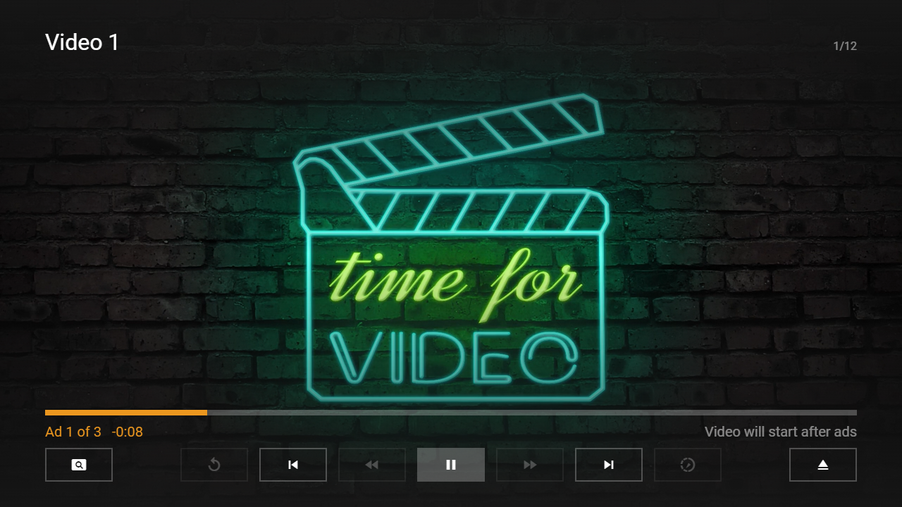

---
title: Ad Plugin
category: Experts API - Plugin
summary: Reference for the MSX ad plugin that integrates advertisement display.
---

# Ad Plugin

This is a special video plugin that integrates example ads (i.e. pre-rolls, mid-rolls, and post-rolls) into a video. It can be used as a template for integrating different ad providers. The plugin can be used with version **0.1.146** or higher.

## Usage

The plugin must be loaded with a video URL. Optionally, the content type and GUID can be indicated. Please see following action syntax example.

- `video:plugin:http://msx.benzac.de/plugins/ad.html?url={URL}&type={TYPE}&guid={GUID}`

If you would like to use the plugin as reference to implement your own plugin, please have a look at these implementation scripts:
- [http://msx.benzac.de/plugins/js/ad.js](http://msx.benzac.de/plugins/js/ad.js)
- [http://msx.benzac.de/plugins/js/ad-manager.js](http://msx.benzac.de/plugins/js/ad-manager.js)

## Syntax

Parameter syntax of ad plugin.

| Parameter | Type | Default Value | Mandatory | Description |
|-----------|------|---------------|-----------|-------------|
| `url` | `string` | `null` | **Yes** | The URL of the video. It is recommended to encode the value to ensure that it is evaluated correctly (e.g. `"http://msx.benzac.de/media/video1.mp4"` → `"http%3A%2F%2Fmsx.benzac.de%2Fmedia%2Fvideo1.mp4"`). |
| `type` | `string` | `"video"` | No | The type of the content.<br>- `"video"`: Video content.<br>- `"audio"`: Audio content. If this type is set, the plugin will not serve any ads. |
| `guid` | `string` | `null` | No | The GUID of the content that can be used for tracking. |

## Example

Please note that this example uses the MRSS Feeds interaction plugin to load example content.

### Screenshot



### Code

```json
{
    "reference": "request:interaction:http://msx.benzac.de/info/data/mrss/example.xml|||http://msx.benzac.de/plugins/ad.html?url={URL}&type={TYPE}&guid={GUID}@http://msx.benzac.de/interaction/mrss.html",
    "pages": []
}
```

### Demo

- [Launch via App](https://msx.benzac.de/?start=content:https://msx.benzac.de/info/xp/data/plugin_test_7.json)
- [Launch via Demo Page](https://msx.benzac.de/info/?start=content:https://msx.benzac.de/info/xp/data/plugin_test_7.json)

**Note: This demo will only work properly if ad blockers are disabled.**

## See also

- [Video/Audio Plugin](./video-audio-plugin.md)
- [IMA Plugin](./ima-plugin.md)
- [Plugin API Reference](./plugin-api-reference.md)
- [Cookbook → Plugins (media, immersive, platform, ads)](../../reference/cookbook.md#plugins-media-immersive-platform-ads)
