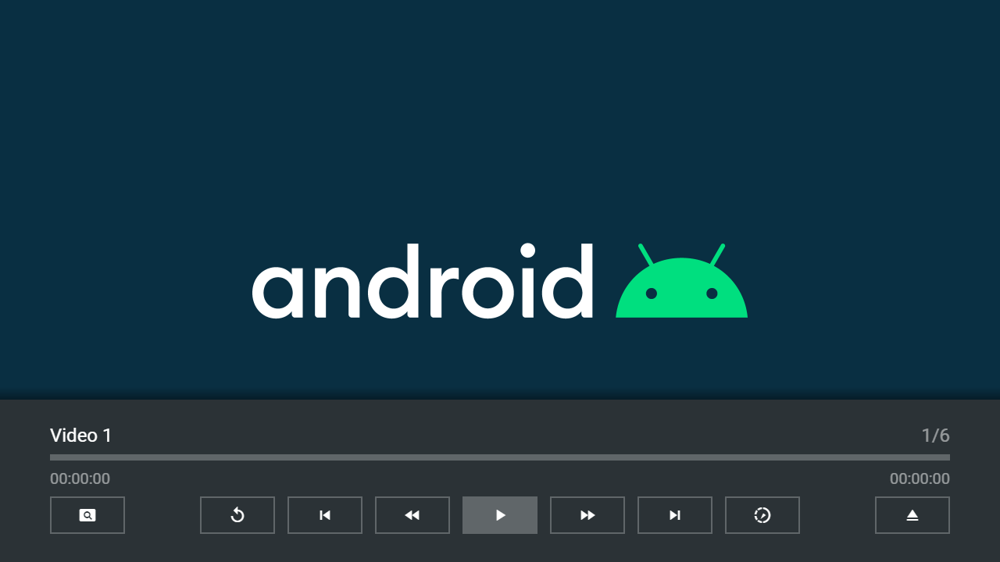

---
title: Android Plugin
category: Experts API - Plugin
summary: Reference for the MSX Android-specific plugin capabilities.
---

# Android Plugin

This video plugin allows you to use the Android Player with a video plugin action (i.e. `video:plugin:{URL}`). It uses a generic launch action (i.e. `system:tvx:launch`) to select any system player. However, VLC or MX Player should be used for resume functions. The plugin can be used with version **0.1.136** or higher.

## Usage

The plugin can be loaded with a video URL or ID. If a video ID is used, the interaction plugin is used to request the corresponding URL. Please see following action syntax examples.

- `video:plugin:http://msx.benzac.de/plugins/android.html?url={URL}`
- `video:plugin:http://msx.benzac.de/plugins/android.html?id={ID}`

If you would like to use the plugin with Google Drive MSX, OneDrive MSX, or Dropbox MSX, please use the `index.json` file feature and reference all video files with the inline expression `{asset:id:{NAME}}` (e.g. `{asset:id:video1.mp4}`). For more information, please see **Credits & Hints** from the corresponding service.

**Note: For Google Drive MSX, all referenced files must be publicly shared and smaller than 100 MB.**

If you would like to use the plugin as reference to implement your own plugin, please have a look at this implementation script: [http://msx.benzac.de/plugins/js/android.js](http://msx.benzac.de/plugins/js/android.js).

## Syntax

Parameter syntax of Android plugin.

| Parameter | Type | Default Value | Mandatory | Description |
|-----------|------|---------------|-----------|-------------|
| `id` | `string` | `null` | No | The ID of the video. This ID is used to request the corresponding URL from the interaction plugin. |
| `url` | `string` | `null` | **Only if video ID is not set** | The URL of the video. It is recommended to encode the value to ensure that it is evaluated correctly (e.g. `"http://msx.benzac.de/media/video1.mp4"` → `"http%3A%2F%2Fmsx.benzac.de%2Fmedia%2Fvideo1.mp4"`). |

## Example

### Screenshot



### Code

```json
{
    "type": "list",
    "headline": "Android Plugin Test",
    "template": {
        "type": "separate",
        "layout": "0,0,2,4",
        "icon": "msx-white-soft:adb",
        "color": "msx-glass",
        "titleFooter": "",
        "progress": -1,
        "live": {
            "type": "playback",            
            "titleFooter": "{progress:time:hh:mm:ss}",  
            "action": "player:show"
        },
        "properties": {
            "resume:key": "url"
        }
    },
    "items": [{
            "title": "Video 1",
            "playerLabel": "Video 1",
            "action": "video:plugin:http://msx.benzac.de/plugins/android.html?url=http://msx.benzac.de/media/video1.mp4"
        }, {
            "title": "Video 2",
            "playerLabel": "Video 2",
            "action": "video:plugin:http://msx.benzac.de/plugins/android.html?url=http://msx.benzac.de/media/video2.mp4"
        }, {
            "title": "Video 3",
            "playerLabel": "Video 3",
            "action": "video:plugin:http://msx.benzac.de/plugins/android.html?url=http://msx.benzac.de/media/video3.mp4"
        }, {
            "title": "Video 4",
            "playerLabel": "Video 4",
            "action": "video:plugin:http://msx.benzac.de/plugins/android.html?url=http://msx.benzac.de/media/video4.mp4"
        }, {
            "title": "Video 5",
            "playerLabel": "Video 5",
            "action": "video:plugin:http://msx.benzac.de/plugins/android.html?url=http://msx.benzac.de/media/video5.mp4"
        }, {
            "title": "Video 6",
            "playerLabel": "Video 6",
            "action": "video:plugin:http://msx.benzac.de/plugins/android.html?url=http://msx.benzac.de/media/video6.mp4"
        }]
}
```

### Demo

- [Launch via App](https://msx.benzac.de/?start=content:https://msx.benzac.de/info/xp/data/plugin_test_9.json)
- [Launch via Demo Page](https://msx.benzac.de/info/?start=content:https://msx.benzac.de/info/xp/data/plugin_test_9.json)

## See also

- [Video/Audio Plugin](./video-audio-plugin.md)
- [Plugin API Reference](./plugin-api-reference.md)
- [Cookbook → Plugins (media, immersive, platform, ads)](../../reference/cookbook.md#plugins-media-immersive-platform-ads)
