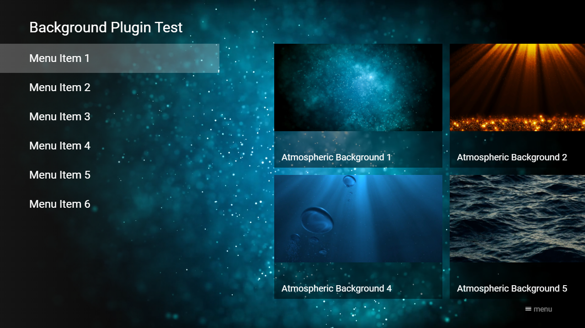

---
title: Background Plugin
category: Experts API - Plugin
summary: Reference for the MSX background plugin that sets a custom video background for content pages.
---

# Background Plugin

This is a special video plugin that plays a video in an endless loop. The plugin can be used with version **0.1.74** or higher.

## Usage

The plugin can be loaded with a video URL or ID. If a video ID is used, the interaction plugin is used to request the corresponding URL. Please see following action syntax examples.

- `video:plugin:http://msx.benzac.de/plugins/background.html?url={URL}`
- `video:plugin:http://msx.benzac.de/plugins/background.html?id={ID}`

If you would like to use the plugin with Google Drive MSX, OneDrive MSX, or Dropbox MSX, please use the `index.json` file feature and reference all video files with the inline expression `{asset:id:{NAME}}` (e.g. `{asset:id:video1.mp4}`). For more information, please see **Credits & Hints** from the corresponding service.

**Note: For Google Drive MSX, all referenced files must be publicly shared and smaller than 100 MB.**

If you would like to use the plugin as reference to implement your own plugin, please have a look at this implementation script: [http://msx.benzac.de/plugins/js/background.js](http://msx.benzac.de/plugins/js/background.js).

## Syntax

Parameter syntax of background plugin.

| Parameter | Type | Default Value | Mandatory | Description |
|-----------|------|---------------|-----------|-------------|
| `id` | `string` | `null` | No | The ID of the background video. This ID is used to request the corresponding URL from the interaction plugin. |
| `url` | `string` | `null` | **Only if video ID is not set** | The URL of the background video. It is recommended to encode the value to ensure that it is evaluated correctly (e.g. `"http://msx.benzac.de/media/atmos1.mp4"` → `"http%3A%2F%2Fmsx.benzac.de%2Fmedia%2Fatmos1.mp4"`). |

## Example

Please note that this example uses some properties that are only available in version **0.1.142** or higher. Please also note that the service [http://msx.benzac.de/services/background.php](http://msx.benzac.de/services/background.php) is not part of the plugin. It is just a helper service to return a background video plugin action if no other video/audio is running.

### Screenshot



### Code

```json
{
    "headline": "Background Plugin Test",
    "style": "overlay",
    "transparent": 2,
    "ready": {
        "action": "execute:service:video:data:http://msx.benzac.de/services/background.php",
        "data": {
            "url": "http://msx.benzac.de/media/atmos1.mp4",
            "label": "Atmospheric Background 1",
            "transparent": true
        }
    },
    "menu": [{
            "label": "Menu Item 1",
            "data": "http://msx.benzac.de/info/xp/data/plugin_test_6_content.json"
        }, {
            "label": "Menu Item 2",
            "data": "http://msx.benzac.de/info/xp/data/plugin_test_6_content.json"
        }, {
            "label": "Menu Item 3",
            "data": "http://msx.benzac.de/info/xp/data/plugin_test_6_content.json"
        }, {
            "label": "Menu Item 4",
            "data": "http://msx.benzac.de/info/xp/data/plugin_test_6_content.json"
        }, {
            "label": "Menu Item 5",
            "data": "http://msx.benzac.de/info/xp/data/plugin_test_6_content.json"
        }, {
            "label": "Menu Item 6",
            "data": "http://msx.benzac.de/info/xp/data/plugin_test_6_content.json"
        }]
}
```

### Demo

- [Launch via App](https://msx.benzac.de/?start=menu:https://msx.benzac.de/info/xp/data/plugin_test_6_menu.json)
- [Launch via Demo Page](https://msx.benzac.de/info/?start=menu:https://msx.benzac.de/info/xp/data/plugin_test_6_menu.json)

## See Also

- [Video/Audio Plugin](./video-audio-plugin.md)
- [Plugin API Reference](./plugin-api-reference.md)
- [Cookbook → Plugins (media, immersive, platform, ads)](../../reference/cookbook.md#plugins-media-immersive-platform-ads)
