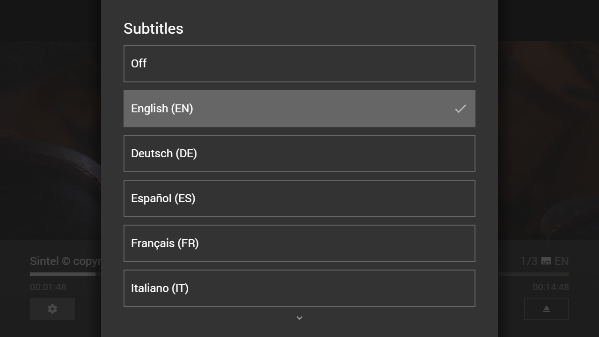

---
title: HTML5X Plugin
category: Experts API - Plugin
summary: Reference for the MSX HTML5X plugin that enables extended HTML5 video content.
---

# HTML5X Plugin

HTML5X stands for HTML5 Extended and is a special video plugin that supports the following features.

- Setup subtitle tracks.
- Preselect subtitle track.
- Preselect audio track.
- Switch subtitle track at playback time.
- Switch audio track at playback time.
- Load video and/or subtitle tracks from the interaction plugin (this allows you to use the plugin with Google Drive MSX, OneDrive MSX, Dropbox MSX, and other services).
- Switch to fullscreen mode with native player controls (currently, this feature is only available for iOS/Mac devices)

**Note: Subtitle tracks should be specified in the Web Video Text Tracks (WebVTT) format. Please also note the selection of audio tracks may not work on each platform.**

The plugin can be used with version **0.1.117** or higher and is configured via the [Extended Properties](../../experts-api/special/extended-properties.md) of a content item.

## Usage

The plugin can be loaded with a video URL or ID. If a video ID is used, the interaction plugin is used to request the corresponding URL. Please see following action syntax examples.

- `video:plugin:http://msx.benzac.de/plugins/html5x.html?url={URL}`
- `video:plugin:http://msx.benzac.de/plugins/html5x.html?id={ID}`

If you would like to use the plugin with Google Drive MSX, OneDrive MSX, or Dropbox MSX, please use the `index.json` file feature and reference all video and subtitle files with the inline expression `{asset:id:{NAME}}` (e.g. `{asset:id:sintel.mp4}`). For more information, please see **Credits & Hints** from the corresponding service.

**Note: For Google Drive MSX, CORS support must be disabled and all referenced files must be publicly shared and smaller than 100 MB.**

If you would like to use the plugin as reference to implement your own plugin, please have a look at this implementation script: [http://msx.benzac.de/plugins/js/html5x.js](http://msx.benzac.de/plugins/js/html5x.js).

In order to get access to the audio/subtitle track selection, you have to set up a custom content action in the extended properties (i.e. by setting the `button:content:icon` and `button:content:action` property).

## Syntax

Property syntax of extended properties for HTML5X plugin.

| Property | Value | Example | Description |
|----------|-------|---------|-------------|
| `html5x:audiotrack` | `{LANGUAGE}` | `"html5x:audiotrack": "en"`<br>`"html5x:audiotrack": "de"`<br>`"html5x:audiotrack": "es"`<br>`"html5x:audiotrack": "fr"`<br>`"html5x:audiotrack": "it"`<br>`"html5x:audiotrack": "nl"`<br>`"html5x:audiotrack": "pl"`<br>`"html5x:audiotrack": "pt"`<br>`"html5x:audiotrack": "ru"`<br>`"html5x:audiotrack": "default"` | Preselects an audio track. If this property is not set, the last selected audio track is used. If the audio track does not exist or is set to `"default"`, the first audio track is used. |
| `html5x:content` | `{BOOLEAN_VALUE}` | `"html5x:content": "true"`<br>`"html5x:content": "false"` | Adds/Removes the related content button (i.e. the button with the action `player:content`). By default, the related content button is removed. |
| `html5x:cors` | `{BOOLEAN_VALUE}` | `"html5x:cors": "true"`<br>`"html5x:cors": "false"` | Enables/Disables CORS support. By default, CORS support is enabled. If CORS support is enabled, the video URL and subtitle track URLs must contain the CORS headers. If CORS support is disabled, an online proxy is used for the subtitle track URLs, which means that these URLs must be publicly available. |
| `html5x:subtitle` | `{LANGUAGE}` | `"html5x:subtitle": "en"`<br>`"html5x:subtitle": "de"`<br>`"html5x:subtitle": "es"`<br>`"html5x:subtitle": "fr"`<br>`"html5x:subtitle": "it"`<br>`"html5x:subtitle": "nl"`<br>`"html5x:subtitle": "pl"`<br>`"html5x:subtitle": "pt"`<br>`"html5x:subtitle": "ru"`<br>`"html5x:subtitle": "default"` | Preselects a subtitle track. If this property is not set, the last selected subtitle track is used. If the subtitle track does not exist or is set to `"default"`, the subtitles are initially switched off. |
| `html5x:subtitle:{LANGUAGE}:{LABEL}` | `{URL}`\|`{ID}` | `"html5x:subtitle:en:English": "http://msx.benzac.de/media/sintel/en.vtt"`<br>`"html5x:subtitle:de:Deutsch": "http://msx.benzac.de/media/sintel/de.vtt"`<br>`"html5x:subtitle:es:Español": "http://msx.benzac.de/media/sintel/es.vtt"`<br>`"html5x:subtitle:fr:Français": "http://msx.benzac.de/media/sintel/fr.vtt"`<br>`"html5x:subtitle:it:Italiano": "http://msx.benzac.de/media/sintel/it.vtt"`<br>`"html5x:subtitle:nl:Nederlands": "http://msx.benzac.de/media/sintel/nl.vtt"`<br>`"html5x:subtitle:pl:Język polski": "http://msx.benzac.de/media/sintel/pl.vtt"`<br>`"html5x:subtitle:pt:Português": "http://msx.benzac.de/media/sintel/pt.vtt"`<br>`"html5x:subtitle:ru:Pусский": "http://msx.benzac.de/media/sintel/ru.vtt"` | Sets up a subtitle track. If the value is not an HTTP/HTTPS URL, the interaction plugin is used to request the corresponding URL. |
| `html5x:subtitle:order` | `{ORDER}` | `"html5x:subtitle:order": "label"`<br>`"html5x:subtitle:order": "language"` | Orders the subtitle tracks by label or language. If this property is not set, the order remains as it appears in the extended properties. |

## Example

### Screenshot



### Code

```json
{
    "type": "pages",
    "headline": "HTML5X Plugin Test",    
    "template": {       
        "type": "separate",
        "layout": "0,0,2,4",
        "icon": "msx-white-soft:extension",
        "color": "msx-glass",        
        "playerLabel": "Sintel © copyright Blender Foundation | durian.blender.org",
        "action": "video:plugin:http://msx.benzac.de/plugins/html5x.html?url=http://msx.benzac.de/media/sintel/sintel.mp4",
        "properties": {
            "resume:position": "102",
            "button:content:icon": "{context:contentIcon}",
            "button:content:action": "{context:contentAction}",
            "html5x:subtitle:en:English": "http://msx.benzac.de/media/sintel/en.vtt",
            "html5x:subtitle:de:Deutsch": "http://msx.benzac.de/media/sintel/de.vtt",				
            "html5x:subtitle:es:Español": "http://msx.benzac.de/media/sintel/es.vtt",
            "html5x:subtitle:fr:Français": "http://msx.benzac.de/media/sintel/fr.vtt",
            "html5x:subtitle:it:Italiano": "http://msx.benzac.de/media/sintel/it.vtt",
            "html5x:subtitle:nl:Nederlands": "http://msx.benzac.de/media/sintel/nl.vtt",
            "html5x:subtitle:pl:Język polski": "http://msx.benzac.de/media/sintel/pl.vtt",
            "html5x:subtitle:pt:Português": "http://msx.benzac.de/media/sintel/pt.vtt",
            "html5x:subtitle:ru:Pусский": "http://msx.benzac.de/media/sintel/ru.vtt"			
        }
    },
    "items": [{     
            "title": "Sintel 1",
            "titleFooter": "Audio & Subtitles",
            "contentIcon": "settings",
            "contentAction": "panel:request:player:options"         
        }, {         
            "title": "Sintel 2",
            "titleFooter": "Audio only",
            "contentIcon": "audiotrack",
            "contentAction": "panel:request:player:audiotrack"
        }, {    
            "title": "Sintel 3",
            "titleFooter": "Subtitles only",
            "contentIcon": "subtitles",
            "contentAction": "panel:request:player:subtitle"
        }]
}
```

### Demo

- [Launch via App](http://msx.benzac.de/?start=content:http://msx.benzac.de/info/xp/data/plugin_test_4.json)
- [Launch via Demo Page](http://msx.benzac.de/info/?start=content:http://msx.benzac.de/info/xp/data/plugin_test_4.json)

**Note: These demo links are opened in an insecure context (i.e. via `http://`) to avoid mixed content issues.**

## See also

- [Video/Audio Plugin](./video-audio-plugin.md)
- [Plugin API Reference](./plugin-api-reference.md)
- [Cookbook → Deep dive — building a video plugin (`plugin_test_4`, HTML5X)](../../reference/cookbook.md#deep-dive--building-a-video-plugin-plugin_test_4-html5x) — property-by-property walkthrough of this exact example
- [In-App Settings Reference → What is not covered by any native setting](../../reference/settings-reference.md#6-what-is-not-covered-by-any-native-setting) — subtitle preferences are handled here (`html5x:subtitle:*`), not by a native app setting
