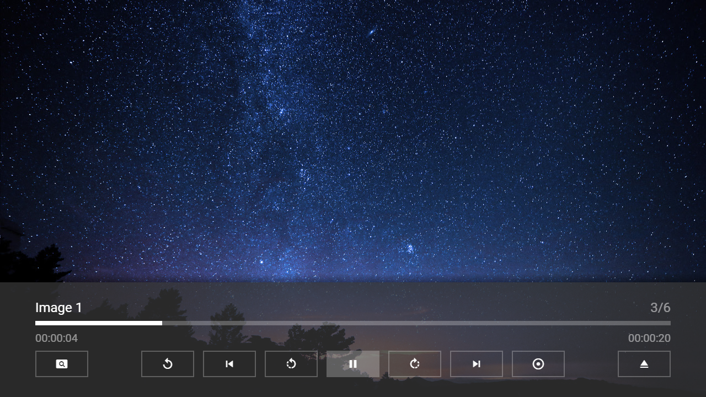

---
title: Image Plugin
category: Experts API - Plugin
summary: Reference for using the MSX image plugin to load and display images inline with videos and audios.
---

# Image Plugin

This is a special video plugin that displays an image for a specific time. It can be used to create a mixed playlist of videos, audios, and images. Additionally, this plugin contains functions for rotating the image. The plugin can be used with version **0.1.74** or higher.

## Usage

The plugin must be loaded with an image URL. Optionally, the display duration, the filler type, the background color, and the initial rotation of the image can be indicated. Please see following action syntax example.

- `video:plugin:http://msx.benzac.de/plugins/image.html?url={URL}&duration={DURATION}&filler={FILLER}&color={COLOR}&rotation={ROTATION}`

If you would like to use the plugin as reference to implement your own plugin, please have a look at this implementation script: [http://msx.benzac.de/plugins/js/image.js](http://msx.benzac.de/plugins/js/image.js).

## Syntax

Parameter syntax of image plugin.

| Parameter | Type | Default Value | Mandatory | Description |
|-----------|------|---------------|-----------|-------------|
| `url` | `string` | `null` | **Yes** | The URL of the image. It is recommended to encode the value to ensure that it is evaluated correctly (e.g. `"http://msx.benzac.de/img/bg1.jpg"` → `"http%3A%2F%2Fmsx.benzac.de%2Fimg%2Fbg1.jpg"`). |
| `duration` | `number`\|`string` | `20` | No | The display duration of the image in seconds. You can also set this parameter to `"slideshow"` to use the slideshow interval settings from the application (**Settings** → **Slideshow Interval**). The following interval values can be set.<br><br>- **Very Fast**: 1 sec<br>- **Fast**: 5 sec<br>- **Normal**: 10 sec<br>- **Slow**: 20 sec<br>- **Very Slow**: 40 sec |
| `filler` | `string` | `"fit"` | No | The filler type of the image.<br><br>- `"fit"`: The image is sized (by keeping the ratio) to fit into the size and is positioned in the center.<br>- `"cover"`: The image is sized (by keeping the ratio) to cover the entire size and is positioned in the center.<br>- `"smart"`: If the ratio of the image and the size is the same, `"cover"` is used, otherwise `"fit"` is used. |
| `color` | `string` | `"black"` | No | The background color of the image in CSS syntax. It is recommended to encode the value to ensure that it is evaluated correctly (e.g. `"#000000"` → `"%23000000"`). |
| `rotation` | `number` | `0` | No | The initial rotation of the image in degrees. During runtime, it is possible to rotate the image by using the action `player:commit:message:rotate:{ROTATION_VALUE}`. In this case, a direction or a number can be indicated as rotation value. Please see following examples.<br><br>- `player:commit:message:rotate:right`<br>- `player:commit:message:rotate:left`<br>- `player:commit:message:rotate:full`<br>- `player:commit:message:rotate:full-right`<br>- `player:commit:message:rotate:full-left`<br>- `player:commit:message:rotate:reset`<br>- `player:commit:message:rotate:-270`<br>- `player:commit:message:rotate:-180`<br>- `player:commit:message:rotate:-90`<br>- `player:commit:message:rotate:0`<br>- `player:commit:message:rotate:90`<br>- `player:commit:message:rotate:180`<br>- `player:commit:message:rotate:270`<br><br>**Note: If the rotation value is a number (which must be divisible by 90), it is applied as an absolute rotation in degrees.** |

## Example

### Screenshot



### Code

```json
{
    "type": "pages",
    "headline": "Image Plugin Test",    
    "template": {       
        "type": "separate",
        "layout": "0,0,2,4",
        "icon": "msx-white-soft:extension",
        "color": "msx-glass",
        "properties": {           
            "control:load": "silent",
            "control:dim": false,
            "button:rewind:icon": "rotate-left",
            "button:rewind:action": "player:commit:message:rotate:left",
            "button:rewind:key": "delete",
            "button:forward:icon": "rotate-right",
            "button:forward:action": "player:commit:message:rotate:right",
            "button:forward:key": "insert",
            "button:speed:icon": "settings-backup-restore",
            "button:speed:action": "player:commit:message:rotate:reset"
        }
    },
    "items": [{
            "title": "Video 1",
            "playerLabel": "Video 1",
            "action": "video:http://msx.benzac.de/media/video1.mp4",
            "properties": {
                "control:load": "silent"
            }
        }, {
            "background": "http://msx.benzac.de/img/bg1.jpg",
            "title": "Audio 1",
            "playerLabel": "Audio 1",
            "action": "audio:http://msx.benzac.de/media/audio1.mp3",
            "properties": {
                "control:load": "silent"
            }
        }, {            
            "title": "Image 1",
            "playerLabel": "Image 1",
            "action": "video:plugin:http://msx.benzac.de/plugins/image.html?url=http://msx.benzac.de/img/bg3.jpg"
        }, {
            "title": "Video 2",
            "playerLabel": "Video 2",
            "action": "video:http://msx.benzac.de/media/video2.mp4",
            "properties": {
                "control:load": "silent"
            }
        }, {
            "background": "http://msx.benzac.de/img/bg2.jpg",
            "title": "Audio 2",
            "playerLabel": "Audio 2",
            "action": "audio:http://msx.benzac.de/media/audio2.mp3",
            "properties": {
                "control:load": "silent"
            }
        }, {
            "title": "Image 2",
            "playerLabel": "Image 2",
            "action": "video:plugin:http://msx.benzac.de/plugins/image.html?url=http://msx.benzac.de/img/test.jpg"
        }]
}
```

### Demo

- [Launch via App](https://msx.benzac.de/?start=content:https://msx.benzac.de/info/xp/data/plugin_test_3.json)
- [Launch via Demo Page](https://msx.benzac.de/info/?start=content:https://msx.benzac.de/info/xp/data/plugin_test_3.json)

## See Also

- [Video/Audio Plugin](./video-audio-plugin.md)
- [Plugin API Reference](./plugin-api-reference.md)
- [Cookbook → Adaptive & dynamic playback](../../reference/cookbook.md#adaptive--dynamic-playback)
