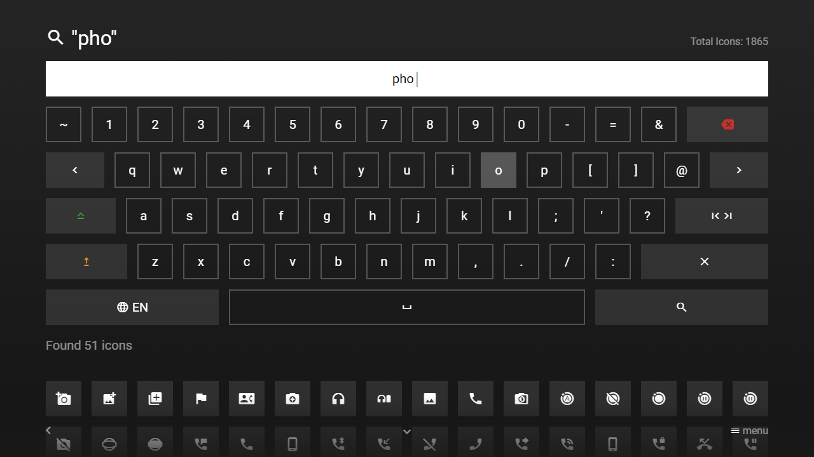

---
title: Input Plugin
category: Experts API - Plugin
summary: Reference for the MSX input plugin, a special interaction plugin for multilingual text entry (default/secret/search types) with paging support for search results.
---

# Input Plugin

This is a special interaction plugin that allows you to handle complex and multilingual inputs for special use cases (e.g. entering user names/emails/passwords, performing search queries, etc.). In order to use this plugin, a corresponding content service must be implemented that processes the entered input (e.g. by evaluating an `input` parameter). The plugin can be used with version **0.1.123** or higher.

## Usage

The plugin must be loaded with a content service URL that is able to process the input (which is generally set as `input` URL parameter). Optionally, a type, a default language, a headline, a background, an extension, a hint, a placeholder, and/or a limit (for paging) can be set. Please see following action syntax examples.

- `content:request:interaction:{URL}@http://msx.benzac.de/interaction/input.html`
- `content:request:interaction:{URL}|{TYPE}@http://msx.benzac.de/interaction/input.html`
- `content:request:interaction:{URL}|{TYPE}|{DEFAULT_LANG}@http://msx.benzac.de/interaction/input.html`
- `content:request:interaction:{URL}|{TYPE}|{DEFAULT_LANG}|{HEADLINE}@http://msx.benzac.de/interaction/input.html`
- `content:request:interaction:{URL}|{TYPE}|{DEFAULT_LANG}|{HEADLINE}|{BACKGROUND}@http://msx.benzac.de/interaction/input.html`
- `content:request:interaction:{URL}|{TYPE}|{DEFAULT_LANG}|{HEADLINE}|{BACKGROUND}|{EXTENSION}@http://msx.benzac.de/interaction/input.html`
- `content:request:interaction:{URL}|{TYPE}|{DEFAULT_LANG}|{HEADLINE}|{BACKGROUND}|{EXTENSION}|{HINT}@http://msx.benzac.de/interaction/input.html`
- `content:request:interaction:{URL}|{TYPE}|{DEFAULT_LANG}|{HEADLINE}|{BACKGROUND}|{EXTENSION}|{HINT}|{PLACEHOLDER}@http://msx.benzac.de/interaction/input.html`
- `content:request:interaction:{URL}|{TYPE}|{DEFAULT_LANG}|{HEADLINE}|{BACKGROUND}|{EXTENSION}|{HINT}|{PLACEHOLDER}|{LIMIT}@http://msx.benzac.de/interaction/input.html`
- `content:request:interaction:{URL}|{TYPE}|{DEFAULT_LANG}|{HEADLINE}|{BACKGROUND}|{EXTENSION}|{HINT}|{PLACEHOLDER}|{LIMIT}|{INIT_INPUT}@http://msx.benzac.de/interaction/input.html`

The `{TYPE}` part can be set to one of the following values.
- `default`: Default input
- `secret`: Secret input (this type can be used for passwords and hides the input by default)
- `search`: Search input (this type can be used for search queries and automatically submits the input after it has been changed)

Optionally, the required submit length can be indicated (by default, it is set to `1`) with the format `{TYPE}:{LENGTH}` (e.g. `search:3`).

The `{DEFAULT_LANG}` part can be set to one of the following values.
- `en`: English keyboard layout
- `fr`: French keyboard layout
- `de`: German keyboard layout
- `es`: Spanish keyboard layout
- `pt`: Portuguese keyboard layout
- `it`: Italian keyboard layout
- `tr`: Turkish keyboard layout
- `ru`: Russian keyboard layout

Please note that the keyboard layout can also be changed at runtime.

The content service URL should contain the keyword `{INPUT}`, which is replaced with the corresponding value. Please see following action syntax examples.

- `content:request:interaction:http://link.to.input.handler?input={INPUT}@http://msx.benzac.de/interaction/input.html`
- `content:request:interaction:http://link.to.input.handler?input={INPUT}|default@http://msx.benzac.de/interaction/input.html`
- `content:request:interaction:http://link.to.input.handler?input={INPUT}|secret|en@http://msx.benzac.de/interaction/input.html`
- `content:request:interaction:http://link.to.input.handler?input={INPUT}|search|fr|Titre@http://msx.benzac.de/interaction/input.html`
- `content:request:interaction:http://link.to.input.handler?input={INPUT}|default:2|de|Überschrift|http://link.to.image@http://msx.benzac.de/interaction/input.html`
- `content:request:interaction:http://link.to.input.handler?input={INPUT}|secret:3|es|Titular|http://link.to.image|Extensión@http://msx.benzac.de/interaction/input.html`
- `content:request:interaction:http://link.to.input.handler?input={INPUT}|search:4|pt|Título|http://link.to.image|Extensão|Texto de dica@http://msx.benzac.de/interaction/input.html`
- `content:request:interaction:http://link.to.input.handler?input={INPUT}||it|Titolo|http://link.to.image|Estensione|Testo di suggerimento|Segnaposto@http://msx.benzac.de/interaction/input.html`
- `content:request:interaction:http://link.to.input.handler?input={INPUT}||tr|Başlık||Eklenti@http://msx.benzac.de/interaction/input.html`
- `content:request:interaction:http://link.to.input.handler?input={INPUT}||ru|Заголовок||||Заполнитель@http://msx.benzac.de/interaction/input.html`

The content service should return either an `action` property (with an optional `data` property) to be executed (e.g. for user logins) or a `template` and `items` property to display the results (e.g. for search queries). Please see this example code how a user login response can look like.

```json
{
    "action": "reload"
}
```

The next example code shows how a search query response can look like.

```json
{
    "headline": "{ico:search} \"Video\"",  
    "hint": "Found 3 items",
    "template": {           
        "type": "separate",
        "layout": "0,0,2,4",
        "icon": "msx-white-soft:movie",
        "color": "msx-glass"
    },
    "items": [{            
            "title": "Video 1",
            "playerLabel": "Video 1",
            "action": "video:http://msx.benzac.de/media/video1.mp4"
        }, {
            "title": "Video 2",
            "playerLabel": "Video 2",
            "action": "video:http://msx.benzac.de/media/video2.mp4"
        }, {
            "title": "Video 3",
            "playerLabel": "Video 3",
            "action": "video:http://msx.benzac.de/media/video3.mp4"
        }]
}
```

Please note that for responses that contain a `template` and `items` property, the properties `headline`, `extension`, `background`, and `hint` will also be used (and will replace potential initial values). Additionally, the properties `preload`, `footer`, and `inserts` will be taken over. Please note that the root content is compressed (i.e. the layout grid size is 16x8). Therefore, for uncompressed content, the `decompress` property in the `template` object is set to `true`. If you want to display compressed content, please ensure the `compress` property is set to `true` in your response data.

Similar to the [Paging Plugin](./paging-plugin.md), the input plugin supports paging if the content service URL contains the keywords `{OFFSET}` and `{LIMIT}` and a limit is indicated (e.g. `content:request:interaction:http://link.to.input.handler?input={INPUT}&offset={OFFSET}&limit={LIMIT}||||||||20@http://msx.benzac.de/interaction/input.html`).

If you would like to use the plugin as reference to implement your own plugin, please have a look at this implementation script: [http://msx.benzac.de/interaction/js/input.js](http://msx.benzac.de/interaction/js/input.js).

**Note: Currently, the input plugin cannot be used with panels. Please also note that all requests to the content service are HTTP GET requests.**

## Syntax

Parameter syntax of content service for input plugin.

| Keyword | Parameter | Type | Default Value | Mandatory | Description |
|---------|-----------|------|---------------|-----------|-------------|
| `{ID}` | `id` | `string` | `null` | No | An automatically generated unique device ID. |
| `{INPUT}` | `input` | `string` | `""` | **Yes** | The input that should be processed. |
| `{LANG}` | `lang` | `string` | `"en"` | No | The currently used keyboard layout (e.g. for auto-completion of search queries). |
| `{OFFSET}` | `offset` | `number` | `0` | No | The paging offset that specifies from which offset the items should start (e.g. for search queries).<br><br>**Note: The initial request from the input plugin will always have the offset `0`. If an offset greater than `0` is requested, the content service only needs to return the `items` property, because the other properties are inherited from the initial request.** |
| `{LIMIT}` | `limit` | `number` | `0` | No | The paging limit that specifies how many items should be returned (e.g. for search queries).<br><br>**Note: If the content service returns less or more items then indicated, no additional items will be requested.** |
| `credentials` | `credentials` | `void` | n/a | No | A keyword that indicates that user credentials (e.g. cookies, authorization headers, etc.) are enabled for content service requests. Technically, this keyword sets the `withCredentials` flag for the `XMLHttpRequest` object to `true`. If the content service uses HTTP sessions and manages them via cookies, you should add this keyword. |

**Note: The parameter column shows the recommended parameter names. Generally, each keyword can be set to any parameter name or integrated into the path of the content service URL.**

## Example

### Screenshot



### Code

```json
{
    "type": "pages",
    "headline": "Input Plugin Test",
    "template": {
        "enumerate": false,
        "type": "button",
        "layout": "0,0,3,3"
    },
    "items": [{
            "icon": "keyboard",
            "label": "Default",
            "action": "content:request:interaction:http://msx.benzac.de/services/input.php?input={INPUT}&type=default|default|en|Default Input Example|||Click on {ico:msx-white:done} to submit input@http://msx.benzac.de/interaction/input.html"
        }, {
            "icon": "password",
            "label": "Secret",
            "action": "content:request:interaction:http://msx.benzac.de/services/input.php?input={INPUT}&type=secret|secret|en|Secret Input Example|||Click on {ico:msx-white:done} to submit secret input@http://msx.benzac.de/interaction/input.html"
        }, {
            "badge": "Compressed",
            "icon": "search",
            "label": "Icon Search",
            "action": "content:request:interaction:http://msx.benzac.de/services/input.php?input={INPUT}&type=search|search|en|{ico:search} {col:msx-white-soft}Search for Icons|||Enter at least one character to start searching|Icon Name@http://msx.benzac.de/interaction/input.html"
        }, {
            "badge": "Decompressed",
            "icon": "search",
            "label": "Image Search",
            "titleFooter": "0.1.155+{br}{br}{br}",
            "alignment": "center",
            "action": "content:request:interaction:http://msx.benzac.de/services/input.php?input={INPUT}&type=pixabay|search|en|{ico:search} {col:msx-white-soft}Search for Images|||Enter at least one character to start searching|Image Name@http://msx.benzac.de/interaction/input.html"
        }, {
            "badge": "Decompressed + Paging",
            "icon": "search",
            "label": "Image Search",
            "titleFooter": "0.1.155+{br}{br}{br}",
            "alignment": "center",
            "action": "content:request:interaction:http://msx.benzac.de/services/input.php?input={INPUT}&offset={OFFSET}&limit={LIMIT}&type=pixabay|search|en|{ico:search} {col:msx-white-soft}Search for Images|||Enter at least one character to start searching|Image Name|36@http://msx.benzac.de/interaction/input.html"
        }, {
            "icon": "login",
            "label": "Login",
            "action": "execute:fetch:http://msx.benzac.de/services/input.php?type=login"
        }, {
            "icon": "build",
            "label": "Execute Action",
            "action": "content:request:interaction:http://msx.benzac.de/services/input.php?input={INPUT}&type=action|default|en|Execute Action Input Example|||Click on {ico:msx-white:done} to execute any action (e.g. '{txt:msx-white:video:http://...}', '{txt:msx-white:audio:http://...}', '{txt:msx-white:image:http://...}', '{txt:msx-white:link:http://...}', etc.)@http://msx.benzac.de/interaction/input.html"
        }]
}
```

### Demo

- [Launch via App](https://msx.benzac.de/?start=content:https://msx.benzac.de/info/xp/data/plugin_test_13.json)
- [Launch via Demo Page](https://msx.benzac.de/info/?start=content:https://msx.benzac.de/info/xp/data/plugin_test_13.json)

## See also

- [Interaction Plugin](./interaction-plugin.md)
- [Plugin API Reference](./plugin-api-reference.md)
- [Cookbook → Interaction & UX](../../reference/cookbook.md#interaction--ux)
