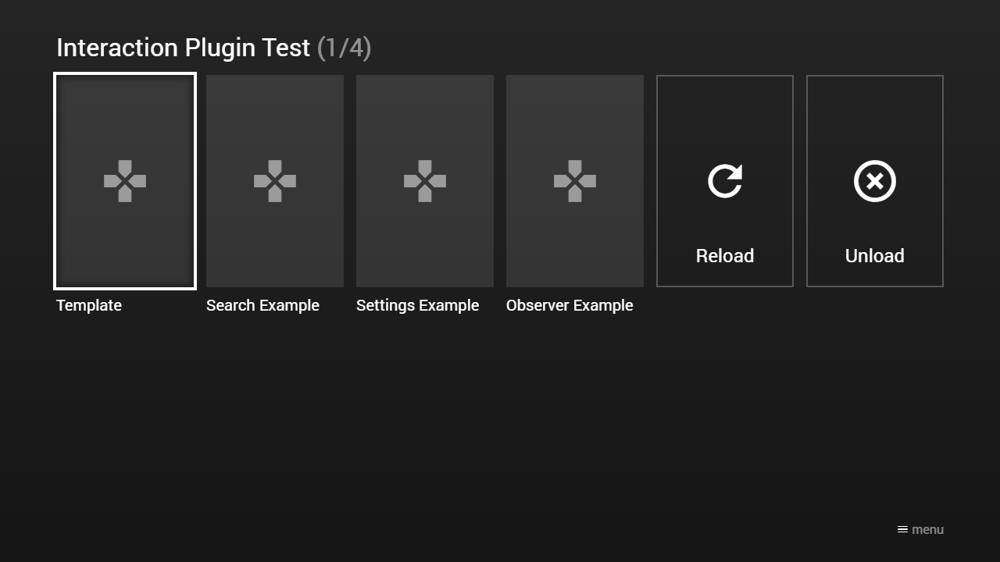

---
title: Interaction Plugin
category: Experts API - Plugin
summary: Reference for creating custom interaction plugins in MSX, including the MyHandler class and event handling.
---

# Interaction Plugin

This is a small plugin guide to create your own interaction plugin. It is designed for developers who have web programming skills (e.g. HTML, JavaScript, CSS, etc.).

**Note: For interaction plugins, version 0.1.82 or higher is needed. Please note that it is recommended to only use the JavaScript ES5 (ECMAScript 2009) syntax for plugins, because most (especially older) TV browsers do not support the newer JavaScript ES6 (ECMAScript 2015) syntax. Please also note that newer JavaScript classes/libraries may not be supported by all TV browsers. Therefore, you should implement a good error handling to detect unsupported platforms.**

## Basics

An interaction plugin is nothing more than a simple HTML page that is loaded into a background iframe. You do not even need to add any JavaScript or CSS file. Therefore, any HTML page can be loaded as an interaction plugin (at least if the page does not refuse it via the `X-Frame-Options` HTTP header). Please see following example screenshot & code.

### Screenshot


**Note: The background color of the iframe is transparent.**

### Code

```html
<!DOCTYPE html>
<html>
    <head>
        <title>My Interaction Plugin</title>
        <style type="text/css">           
            h1 {
                font-family: sans-serif;
                color: white;
            }      
        </style>
    </head>
    <body>
        <h1>My Interaction Plugin</h1>
    </body>
</html>
```

## Tasks

An interaction plugin will not receive any input (i.e. it is not possible to handle key, mouse, or touch events). Therefore, you should not implement any controls or buttons, because they can not be controlled anyway. The only task of an interaction plugin is to handle events, data, or requests (e.g. to load content, playlists, or slideshows from your plugin or to execute specific actions). Generally, an interaction plugin does not contain any UI components. All interactions are managed by the `TVXInteractionPlugin` interface. Add the JavaScript file [http://msx.benzac.de/js/tvx-plugin.min.js](http://msx.benzac.de/js/tvx-plugin.min.js) to your HTML page to make this interface available. Additionally, add some JavaScript lines to interact with this interface. Please see following example code.

### Code

```html
<!DOCTYPE html>
<html>
    <head>
        <title>My Interaction Plugin</title>
        <style type="text/css">           
            h1 {
                font-family: sans-serif;
                color: white;
            }      
        </style>
        <script type="text/javascript" src="//msx.benzac.de/js/tvx-plugin.min.js"></script>
        <script type="text/javascript">
            function MyHandler() {
                this.init = function() {
                    //Init handler
                };
                this.ready = function() {
                    //Handler is ready                    
                };
                this.handleEvent = function(data) {
                    //Handle event
                };
                this.handleData = function(data) {
                    //Handle data
                };
                this.handleRequest = function(dataId, data, callback) {
                    //Handle request
                    callback(null);
                };
            }
            TVXPluginTools.onReady(function() {
                TVXInteractionPlugin.setupHandler(new MyHandler());
                TVXInteractionPlugin.init();
            });
        </script>
    </head>
    <body>
        <h1>My Interaction Plugin</h1>
    </body>
</html>
```

**Note: It is recommended to reference the `tvx-plugin.min.js` file without the protocol prefix (i.e. `http:` or `https:`) to support insecure and secure connections.**

## API

Beside the `TVXInteractionPlugin` interface, the JavaScript file exposes some more classes. Please see [Plugin API Reference](./plugin-api-reference.md) for more information.

## Examples

Here are some examples that you can use as reference to implement your own interaction plugin. Just open the implementation script or the link from the action syntax and analyze it with your browser developer tools (e.g. Chrome Developer Tools).

Alternatively, if you prefer TypeScript, please have a look at this GitHub project: [https://github.com/benzac-de/msx-interaction-plugin-examples](https://github.com/benzac-de/msx-interaction-plugin-examples).

Interaction plugin examples.

| Plugin | Implementation Script | Action Syntax |
|--------|-----------------------|---------------|
| Template | [http://msx.benzac.de/interaction/js/template.js](http://msx.benzac.de/interaction/js/template.js) | `interaction:load:http://msx.benzac.de/interaction/template.html` |
| Search Example | [http://msx.benzac.de/interaction/js/search.js](http://msx.benzac.de/interaction/js/search.js) | `content:request:interaction:init@http://msx.benzac.de/interaction/search.html` |
| Settings Example | [http://msx.benzac.de/interaction/js/settings.js](http://msx.benzac.de/interaction/js/settings.js) | `content:request:interaction:init@http://msx.benzac.de/interaction/settings.html` |
| Observer Example | [http://msx.benzac.de/interaction/js/observer.js](http://msx.benzac.de/interaction/js/observer.js) | `content:request:interaction:init@http://msx.benzac.de/interaction/observer.html` |

### Screenshot



### Code

```json
{
    "type": "list",
    "headline": "Interaction Plugin Test",
    "template": {
        "type": "separate",
        "layout": "0,0,2,4",
        "icon": "msx-white-soft:gamepad",
        "color": "msx-glass"
    },
    "items": [{
            "title": "Template",
            "action": "interaction:load:http://msx.benzac.de/interaction/template.html"
        }, {
            "title": "Search Example",
            "action": "content:request:interaction:init@http://msx.benzac.de/interaction/search.html"
        }, {
            "title": "Settings Example",
            "action": "content:request:interaction:init@http://msx.benzac.de/interaction/settings.html"
        }, {
            "title": "Observer Example",
            "action": "content:request:interaction:init@http://msx.benzac.de/interaction/observer.html"
        }, {            
            "enumerate": false,
            "type": "button",
            "offset": "0,0,0,-1",
            "icon": "refresh",
            "label": "Reload",
            "action": "interaction:reload"
        }, {           
            "enumerate": false,
            "type": "button",
            "offset": "0,0,0,-1",
            "icon": "highlight-off",
            "label": "Unload",
            "action": "interaction:unload"
        }]
}
```

### Demo

- [Launch via App](https://msx.benzac.de/?start=content:https://msx.benzac.de/info/xp/data/plugin_test_2.json)
- [Launch via Demo Page](https://msx.benzac.de/info/?start=content:https://msx.benzac.de/info/xp/data/plugin_test_2.json)

## See also

- [Plugin API Reference](./plugin-api-reference.md)
- [Plugin Events Reference](./plugin-events-reference.md)
- [Cookbook → Deep dive — building an interaction plugin (`plugin_test_2`)](../../reference/cookbook.md#deep-dive--building-an-interaction-plugin-plugin_test_2) — property-by-property walkthrough of this exact example, plus a server-less settings-screen pattern built the same way
- [Common Misconceptions → Plugins](../../reference/common-misconceptions.md#plugins) — plugins are display/logic only, they don't receive key/mouse input directly
