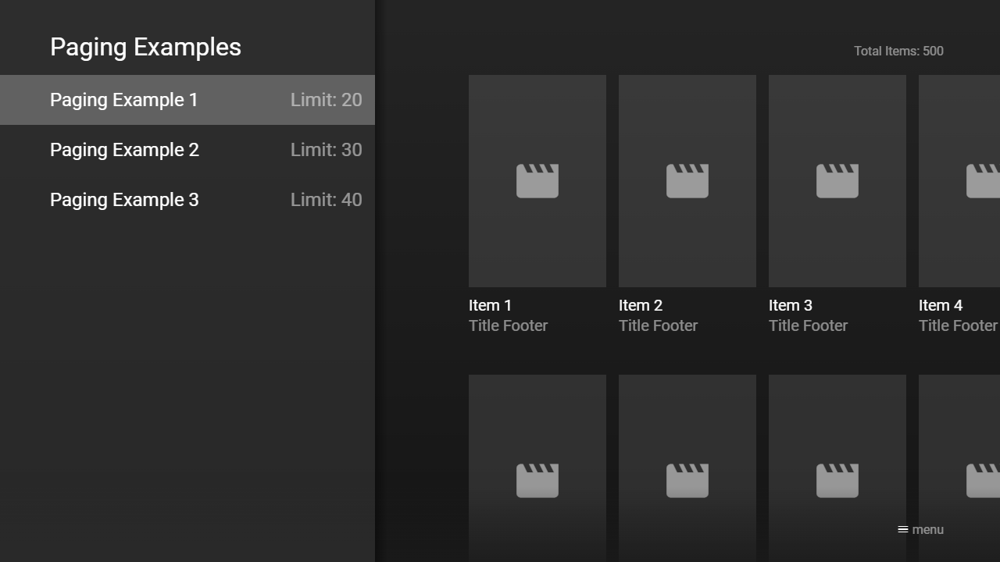

---
title: Paging Plugin
category: Experts API - Plugin
summary: Reference for the MSX paging plugin that enables server-side paged content loading.
---

# Paging Plugin

This is a special interaction plugin that allows you to integrate paging into templated content items (i.e. a Content Root Object that uses the `template` and `items` properties). In order to use this plugin, a corresponding content service must be implemented that processes the requested items (i.e. by evaluating the `offset` and `limit` parameters). The plugin can be used with version **0.1.82** or higher.

## Usage

The plugin must be loaded with a content service URL that is able to evaluate the `offset` and `limit` parameters. Optionally, the requested limit can be indicated (by default, it is set to `20`). Please see following action syntax examples.

- `content:request:interaction:{URL}@http://msx.benzac.de/interaction/paging.html`
- `content:request:interaction:{URL}|{LIMIT}@http://msx.benzac.de/interaction/paging.html`

The content service URL should contain the keywords `{OFFSET}` and `{LIMIT}`, which are replaced with the corresponding values. Please see following action syntax examples.

- `content:request:interaction:http://link.to.content?offset={OFFSET}&limit={LIMIT}@http://msx.benzac.de/interaction/paging.html`
- `content:request:interaction:http://link.to.content?offset={OFFSET}&limit={LIMIT}|40@http://msx.benzac.de/interaction/paging.html`

If you would like to use the plugin as reference to implement your own plugin, please have a look at this implementation script: [http://msx.benzac.de/interaction/js/paging.js](http://msx.benzac.de/interaction/js/paging.js).

**Note: Currently, the paging plugin cannot be used with panels.**

## Syntax

Parameter syntax of content service for paging plugin.

| Keyword | Parameter | Type | Default Value | Mandatory | Description |
|---------|-----------|------|---------------|-----------|-------------|
| `{ID}` | `id` | `string` | `null` | No | An automatically generated unique device ID. |
| `{OFFSET}` | `offset` | `number` | `0` | **Yes** | The offset that specifies from which offset the items should start.<br><br>**Note: The initial request from the paging plugin will always have the offset `0`. If an offset greater than `0` is requested, the content service only needs to return the `items` property, because the other properties are inherited from the initial request.** |
| `{LIMIT}` | `limit` | `number` | `20` | **Yes** | The limit that specifies how many items should be returned.<br><br>**Note: If the content service returns less or more items then indicated, no additional items will be requested.** |
| `credentials` | `credentials` | `void` | n/a | No | A keyword that indicates that user credentials (e.g. cookies, authorization headers, etc.) are enabled for content service requests. Technically, this keyword sets the `withCredentials` flag for the `XMLHttpRequest` object to `true`. If the content service uses HTTP sessions and manages them via cookies, you should add this keyword. |

**Note: The parameter column shows the recommended parameter names. Generally, each keyword can be set to any parameter name or integrated into the path of the content service URL.**

## Example

### Screenshot



### Code

```json
{
    "headline": "Paging Examples",
    "menu": [{
            "label": "Paging Example 1",
            "extensionLabel": "Limit: 20",
            "data": "request:interaction:http://msx.benzac.de/services/paging.php?offset={OFFSET}&limit={LIMIT}|20@http://msx.benzac.de/interaction/paging.html"
        }, {
            "label": "Paging Example 2",
            "extensionLabel": "Limit: 30",
            "data": "request:interaction:http://msx.benzac.de/services/paging.php?offset={OFFSET}&limit={LIMIT}|30@http://msx.benzac.de/interaction/paging.html"
        }, {
            "label": "Paging Example 3",
            "extensionLabel": "Limit: 40",
            "data": "request:interaction:http://msx.benzac.de/services/paging.php?offset={OFFSET}&limit={LIMIT}|40@http://msx.benzac.de/interaction/paging.html"
        }]
}
```

### Demo

- [Launch via App](https://msx.benzac.de/?start=menu:https://msx.benzac.de/info/xp/data/plugin_test_12.json)
- [Launch via Demo Page](https://msx.benzac.de/info/?start=menu:https://msx.benzac.de/info/xp/data/plugin_test_12.json)

## See Also

- [Interaction Plugin](./interaction-plugin.md)
- [Plugin API Reference](./plugin-api-reference.md)
- [Cookbook → Plugins (media, immersive, platform, ads)](../../reference/cookbook.md#plugins-media-immersive-platform-ads)
