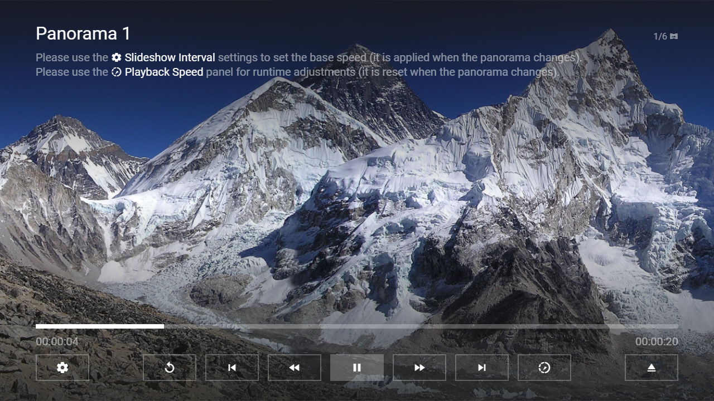

---
title: Panorama Plugin
category: Experts API - Plugin
summary: Reference for the MSX panorama plugin, which displays a wide panorama image as an automatic sliding pan, not an interactive or video view.
---

# Panorama Plugin

This is a special video plugin that displays an image as a sliding panorama. The plugin can be used with version **0.1.74** or higher.

## Usage

The plugin must be loaded with an image URL. Optionally, the sliding duration and the background color of the panorama image can be indicated. Please see following action syntax example.

- `video:plugin:http://msx.benzac.de/plugins/panorama.html?url={URL}&duration={DURATION}&color={COLOR}`

If you would like to use the plugin as reference to implement your own plugin, please have a look at this implementation script: [http://msx.benzac.de/plugins/js/panorama.js](http://msx.benzac.de/plugins/js/panorama.js).

## Syntax

Parameter syntax of panorama plugin.

| Parameter | Type | Default Value | Mandatory | Description |
|-----------|------|---------------|-----------|-------------|
| `url` | `string` | `null` | **Yes** | The URL of the panorama image. It is recommended to encode the value to ensure that it is evaluated correctly (e.g. `"http://msx.benzac.de/media/pano1.jpg"` → `"http%3A%2F%2Fmsx.benzac.de%2Fmedia%2Fpano1.jpg"`).<br><br>**Note: Please note that the panorama image must have an aspect ratio of more than 16:9 (e.g. 2:1) in order for the sliding effect to become visible.** |
| `duration` | `number`\|`string` | `40` | No | The sliding duration of the panorama image in seconds. You can also set this parameter to `"slideshow"` to use the slideshow interval settings from the application (**Settings** → **Slideshow Interval**). The following interval values can be set. Please note that the panorama plugin doubles the interval values.<br><br>- **Very Fast**: 2 sec<br>- **Fast**: 10 sec<br>- **Normal**: 20 sec<br>- **Slow**: 40 sec<br>- **Very Slow**: 80 sec |
| `color` | `string` | `"black"` | No | The background color of the panorama image in CSS syntax. It is recommended to encode the value to ensure that it is evaluated correctly (e.g. `"#000000"` → `"%23000000"`). |

## Example

### Screenshot



### Code

```json
{
    "type": "pages",
    "headline": "Panorama Plugin Test",
    "template": {
        "type": "default",
        "layout": "0,0,6,2",
        "color": "msx-glass",
        "group": "{ico:vrpano}",
        "imageFiller": "height-center",
        "properties": {
            "control:load": "silent",
            "control:type": "extended",
            "control:dim": false,
            "label:extension": "{ico:vrpano}",
            "button:content:action": "settings:slideshow_interval",
            "button:content:icon": "settings",
            "button:speed:enable": true,
            "info:text": "Please use the {ico:msx-white:settings} {txt:msx-white:Slideshow Interval} settings to set the base speed (it is applied when the panorama changes).{br} Please use the {ico:msx-white:slow-motion-video} {txt:msx-white:Playback Speed} panel for runtime adjustments (it is reset when the panorama changes)."
        }
    },
    "items": [{
            "titleFooter": "{col:msx-white}Panorama 1",
            "playerLabel": "Panorama 1",
            "image": "http://msx.benzac.de/media/thumbs/pano1.jpg",
            "action": "video:plugin:http://msx.benzac.de/plugins/panorama.html?url=http://msx.benzac.de/media/pano1.jpg&duration=slideshow"
        }, {
            "titleFooter": "{col:msx-white}Panorama 2",
            "playerLabel": "Panorama 2",
            "image": "http://msx.benzac.de/media/thumbs/pano2.jpg",
            "action": "video:plugin:http://msx.benzac.de/plugins/panorama.html?url=http://msx.benzac.de/media/pano2.jpg&duration=slideshow"
        }, {
            "titleFooter": "{col:msx-white}Panorama 3",
            "playerLabel": "Panorama 3",
            "image": "http://msx.benzac.de/media/thumbs/pano3.jpg",
            "action": "video:plugin:http://msx.benzac.de/plugins/panorama.html?url=http://msx.benzac.de/media/pano3.jpg&duration=slideshow"
        }, {
            "titleFooter": "{col:msx-white}Panorama 4",
            "playerLabel": "Panorama 4",
            "image": "http://msx.benzac.de/media/thumbs/pano4.jpg",
            "action": "video:plugin:http://msx.benzac.de/plugins/panorama.html?url=http://msx.benzac.de/media/pano4.jpg&duration=slideshow"
        }, {
            "titleFooter": "{col:msx-white}Panorama 5",
            "playerLabel": "Panorama 5",
            "image": "http://msx.benzac.de/media/thumbs/pano5.jpg",
            "action": "video:plugin:http://msx.benzac.de/plugins/panorama.html?url=http://msx.benzac.de/media/pano5.jpg&duration=slideshow"
        }, {
            "titleFooter": "{col:msx-white}Panorama 6",
            "playerLabel": "Panorama 6",
            "image": "http://msx.benzac.de/media/thumbs/pano6.jpg",
            "action": "video:plugin:http://msx.benzac.de/plugins/panorama.html?url=http://msx.benzac.de/media/pano6.jpg&duration=slideshow"
        }]
}
```

### Demo

- [Launch via App](https://msx.benzac.de/?start=content:https://msx.benzac.de/info/xp/data/plugin_test_5.json)
- [Launch via Demo Page](https://msx.benzac.de/info/?start=content:https://msx.benzac.de/info/xp/data/plugin_test_5.json)

## See Also

- [Video/Audio Plugin](./video-audio-plugin.md)
- [Plugin API Reference](./plugin-api-reference.md)
- [Cookbook → Plugins (media, immersive, platform, ads)](../../reference/cookbook.md#plugins-media-immersive-platform-ads)
