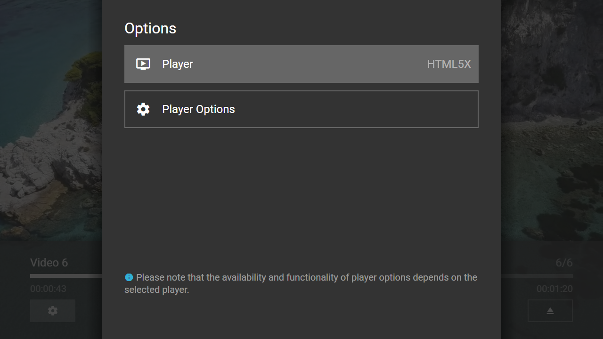

---
title: Play Plugin
category: Experts API - Plugin
summary: Reference for the MSX play plugin that enables platform-compatible player selection at runtime.
---

# Play Plugin

This is a special interaction plugin that allows you to select a platform-compatible player at runtime. Additionally, the settings of the selected player are made available. The plugin can be used with version **0.1.145** or higher.

## Usage

The plugin must be loaded with a video URL. Optionally, the player button (to make the player selection available) can be indicated. Additionally, the related content button can be displayed in the player selection panel (e.g. if the player button is set to the content button). Please see following action syntax examples.

- `video:resolve:request:interaction:{URL}@http://msx.benzac.de/interaction/play.html`
- `video:resolve:request:interaction:{URL}@http://msx.benzac.de/interaction/play.html?button={BUTTON}&related={RELATED}`

If you would like to use the plugin as reference to implement your own plugin, please have a look at this implementation script: [http://msx.benzac.de/interaction/js/play.js](http://msx.benzac.de/interaction/js/play.js).

## Syntax

Parameter syntax of play plugin.

| Parameter | Type | Default Value | Mandatory | Description |
|-----------|------|---------------|-----------|-------------|
| `button` | `string` | `"content"` | No | The player button that should be used to make the player selection available. |
| `related` | `number` | `0` | No | Indicates if the related content button should be displayed in the player selection panel.<br>- `0`: Hides the related content button.<br>- `1`: Shows the related content button. |

## Example

### Screenshot



### Code

```json
{
    "type": "list",
    "headline": "Play Plugin Test",
    "template": {
        "type": "separate",
        "layout": "0,0,2,4",
        "icon": "msx-white-soft:extension",
        "color": "msx-glass",
        "titleFooter": "",
        "progress": -1,
        "live": {
            "type": "playback",            
            "titleFooter": "{progress:time:hh:mm:ss}",  
            "action": "player:show"
        },
        "properties": {
            "resume:key": "url"
        }
    },
    "items": [{
            "title": "Video 1",
            "playerLabel": "Video 1",
            "action": "video:resolve:request:interaction:http://msx.benzac.de/media/video1.mp4@http://msx.benzac.de/interaction/play.html"
        }, {
            "title": "Video 2",
            "playerLabel": "Video 2",
            "action": "video:resolve:request:interaction:http://msx.benzac.de/media/video2.mp4@http://msx.benzac.de/interaction/play.html"
        }, {
            "title": "Video 3",
            "playerLabel": "Video 3",
            "action": "video:resolve:request:interaction:http://msx.benzac.de/media/video3.mp4@http://msx.benzac.de/interaction/play.html"
        }, {
            "title": "Video 4",
            "playerLabel": "Video 4",
            "action": "video:resolve:request:interaction:http://msx.benzac.de/media/video4.mp4@http://msx.benzac.de/interaction/play.html"
        }, {
            "title": "Video 5",
            "playerLabel": "Video 5",
            "action": "video:resolve:request:interaction:http://msx.benzac.de/media/video5.mp4@http://msx.benzac.de/interaction/play.html"
        }, {
            "title": "Video 6",
            "playerLabel": "Video 6",
            "action": "video:resolve:request:interaction:http://msx.benzac.de/media/video6.mp4@http://msx.benzac.de/interaction/play.html"
        }]
}
```

### Demo

- [Launch via App](https://msx.benzac.de/?start=content:https://msx.benzac.de/info/xp/data/plugin_test_10.json)
- [Launch via Demo Page](https://msx.benzac.de/info/?start=content:https://msx.benzac.de/info/xp/data/plugin_test_10.json)

## See Also

- [Interaction Plugin](./interaction-plugin.md)
- [Plugin API Reference](./plugin-api-reference.md)
- [Cookbook → Adaptive & dynamic playback](../../reference/cookbook.md#adaptive--dynamic-playback)
