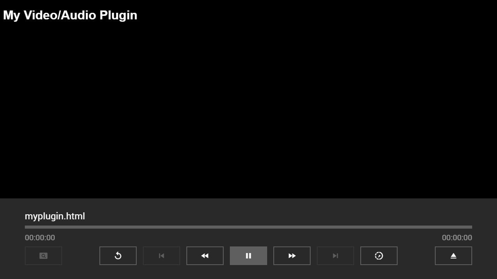
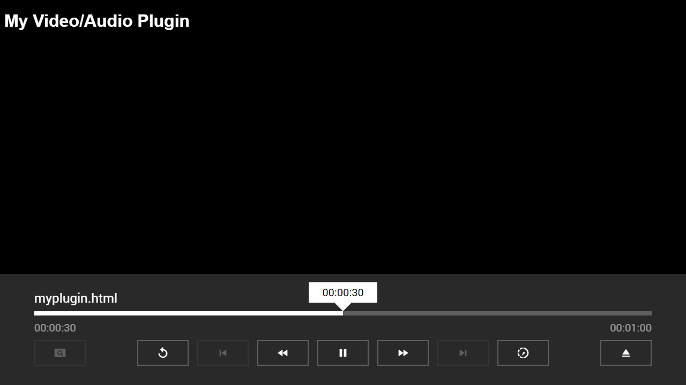
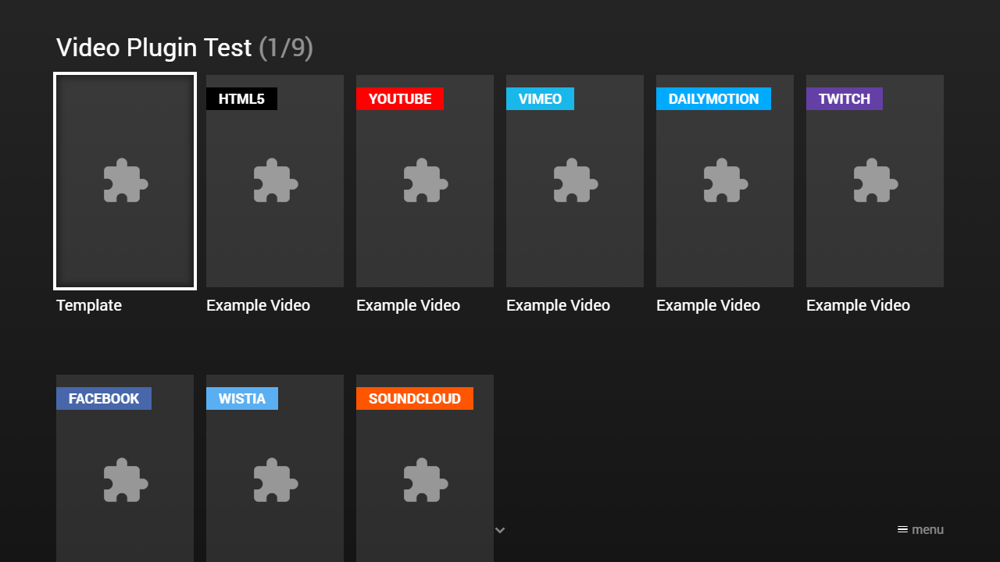

---
title: Video/Audio Plugin
category: Experts API - Plugin
summary: Reference for creating custom video and audio plugins in MSX, including the MyPlayer class and event handling.
---

# Video/Audio Plugin

This is a small plugin guide to create your own video/audio plugin. It is designed for developers who have web programming skills (e.g. HTML, JavaScript, CSS, etc.). By the way, from the technical point of view, there are no differences between a video plugin and an audio plugin. You can load a video plugin as an audio plugin and vice versa. Therefore, there is only one API for both.

**Note: For basic video/audio plugins, version 0.1.40 or higher is needed. For full-featured video/audio plugins, version 0.1.74 or higher is needed. Please note that it is recommended to only use the JavaScript ES5 (ECMAScript 2009) syntax for plugins, because most (especially older) TV browsers do not support the newer JavaScript ES6 (ECMAScript 2015) syntax. Please also note that newer JavaScript classes/libraries may not be supported by all TV browsers. Therefore, you should implement a good error handling to detect unsupported platforms.**

## Basics

A video/audio plugin is nothing more than a simple HTML page that is loaded into an iframe. You do not even need to add any JavaScript or CSS file. Therefore, any HTML page can be loaded as a video/audio plugin (at least if the page does not refuse it via the `X-Frame-Options` HTTP header). Please see following example screenshot & code.

### Screenshot



**Note: The background color of the iframe is black.**

### Code

```html
<!DOCTYPE html>
<html>
    <head>
        <title>My Video/Audio Plugin</title>
        <style type="text/css">           
            h1 {
                font-family: sans-serif;
                color: white;
            }      
        </style>
    </head>
    <body>
        <h1>My Video/Audio Plugin</h1>
    </body>
</html>
```

## Interactions

A video/audio plugin will not receive any input (i.e. it is not possible to handle key, mouse, or touch events). Therefore, you should not implement any controls or buttons, because they can not be controlled anyway. The only task of a video/audio plugin is to show/play the video/audio output. All interactions (e.g. to set/get the current position, to set/get the playback speed, etc.) are managed by the `TVXVideoPlugin` interface. Add the JavaScript file [http://msx.benzac.de/js/tvx-plugin.min.js](http://msx.benzac.de/js/tvx-plugin.min.js) to your HTML page to make this interface available. Additionally, add some JavaScript lines to interact with this interface. Please see following example screenshot & code.

### Screenshot



### Code

```html
<!DOCTYPE html>
<html>
    <head>
        <title>My Video/Audio Plugin</title>
        <style type="text/css">           
            h1 {
                font-family: sans-serif;
                color: white;
            }      
        </style>
        <script type="text/javascript" src="//msx.benzac.de/js/tvx-plugin.min.js"></script>
        <script type="text/javascript">
            function MyPlayer() {
                this.init = function() {
                    //Init player
                };
                this.ready = function() {
                    //Player is ready
                    TVXVideoPlugin.startPlayback();//This will call the play function and will start the update process
                };
                this.play = function() {
                    //Play
                };
                this.pause = function() {
                    //Pause
                };
                this.stop = function() {
                    //Stop
                };
                this.getDuration = function() {
                    //Get duration in seconds
                    return 60;
                };
                this.getPosition = function() {
                    //Get position in seconds
                    return 0;
                };
                this.setPosition = function(position) {
                    //Set position in seconds
                    if (position == 60) {
                        TVXVideoPlugin.stopPlayback();//Generally, this will unload the iframe
                    }
                };
                this.setVolume = function(volume) {
                    //Set volume (0 .. 100)
                };
                this.getVolume = function() {
                    //Get volume (0 .. 100)
                    return 100;
                };
                this.setMuted = function(muted) {
                    //Set muted
                };
                this.isMuted = function() {
                    //Get muted
                    return false;
                };
                this.getSpeed = function() {
                    //Get speed (0.125 .. 8.0)
                    return 1;
                };
                this.setSpeed = function(speed) {
                    //Set speed (0.125 .. 8.0)
                };
                this.getUpdateData = function() {
                    //Get update data (this will be called each second)
                    return {
                        position: this.getPosition(),
                        duration: this.getDuration(),
                        speed: this.getSpeed()
                    };
                };
            }
            TVXPluginTools.onReady(function() {
                TVXVideoPlugin.setupPlayer(new MyPlayer());
                TVXVideoPlugin.init();
            });
        </script>
    </head>
    <body>
        <h1>My Video/Audio Plugin</h1>
    </body>
</html>
```

**Note: It is recommended to reference the `tvx-plugin.min.js` file without the protocol prefix (i.e. `http:` or `https:`) to support insecure and secure connections.**

## API

Beside the `TVXVideoPlugin` interface, the JavaScript file exposes some more classes. Please see [Plugin API Reference](./plugin-api-reference.md) for more information.

## Examples

Here are some examples that you can use as reference to implement your own video/audio plugin. Just open the implementation script or the link from the action syntax and analyze it with your browser developer tools (e.g. Chrome Developer Tools).

Video/Audio plugin examples.

| Plugin | Implementation Script & Related API Link | Action Syntax |
|--------|------------------------------------------|---------------|
| Template | [http://msx.benzac.de/plugins/js/template.js](http://msx.benzac.de/plugins/js/template.js) | `video:plugin:http://msx.benzac.de/plugins/template.html`<br>`audio:plugin:http://msx.benzac.de/plugins/template.html` |
| HTML5 | [http://msx.benzac.de/plugins/js/html5.js](http://msx.benzac.de/plugins/js/html5.js)<br>[https://www.w3.org/TR/2011/WD-html5-20110113/video.html](https://www.w3.org/TR/2011/WD-html5-20110113/video.html) | `video:plugin:http://msx.benzac.de/plugins/html5.html?url={URL}`<br>`audio:plugin:http://msx.benzac.de/plugins/html5.html?url={URL}` |
| Dash | [http://msx.benzac.de/plugins/js/dash.js](http://msx.benzac.de/plugins/js/dash.js)<br>[https://cdn.dashjs.org/latest/jsdoc/index.html](https://cdn.dashjs.org/latest/jsdoc/index.html) | `video:plugin:http://msx.benzac.de/plugins/dash.html?url={URL}`<br>`audio:plugin:http://msx.benzac.de/plugins/dash.html?url={URL}` |
| Shaka | [http://msx.benzac.de/plugins/js/shaka.js](http://msx.benzac.de/plugins/js/shaka.js)<br>[https://shaka-player-demo.appspot.com/docs/api/index.html](https://shaka-player-demo.appspot.com/docs/api/index.html) | `video:plugin:http://msx.benzac.de/plugins/shaka.html?url={URL}`<br>`audio:plugin:http://msx.benzac.de/plugins/shaka.html?url={URL}` |
| HAS | [http://msx.benzac.de/plugins/js/has.js](http://msx.benzac.de/plugins/js/has.js)<br>[https://orange-opensource.github.io/hasplayer.js/latest/doc/jsdoc/index.html](https://orange-opensource.github.io/hasplayer.js/latest/doc/jsdoc/index.html) | `video:plugin:http://msx.benzac.de/plugins/has.html?url={URL}`<br>`audio:plugin:http://msx.benzac.de/plugins/has.html?url={URL}` |
| HLS | [http://msx.benzac.de/plugins/js/hls.js](http://msx.benzac.de/plugins/js/hls.js)<br>[https://github.com/video-dev/hls.js](https://github.com/video-dev/hls.js) | `video:plugin:http://msx.benzac.de/plugins/hls.html?url={URL}`<br>`audio:plugin:http://msx.benzac.de/plugins/hls.html?url={URL}` |
| Video.js | [http://msx.benzac.de/plugins/js/videojs.js](http://msx.benzac.de/plugins/js/videojs.js)<br>[https://docs.videojs.com/player](https://docs.videojs.com/player) | `video:plugin:http://msx.benzac.de/plugins/videojs.html?url={URL}`<br>`audio:plugin:http://msx.benzac.de/plugins/videojs.html?url={URL}` |
| YouTube | [http://msx.benzac.de/plugins/js/youtube.js](http://msx.benzac.de/plugins/js/youtube.js)<br>[https://developers.google.com/youtube/iframe_api_reference](https://developers.google.com/youtube/iframe_api_reference) | `video:plugin:http://msx.benzac.de/plugins/youtube.html?id={ID}`<br>`audio:plugin:http://msx.benzac.de/plugins/youtube.html?id={ID}` |
| Vimeo | [http://msx.benzac.de/plugins/js/vimeo.js](http://msx.benzac.de/plugins/js/vimeo.js)<br>[https://github.com/vimeo/player.js](https://github.com/vimeo/player.js) | `video:plugin:http://msx.benzac.de/plugins/vimeo.html?id={ID}`<br>`audio:plugin:http://msx.benzac.de/plugins/vimeo.html?id={ID}` |
| Dailymotion | [http://msx.benzac.de/plugins/js/dailymotion.js](http://msx.benzac.de/plugins/js/dailymotion.js)<br>[https://developer.dailymotion.com/player](https://developer.dailymotion.com/player) | `video:plugin:http://msx.benzac.de/plugins/dailymotion.html?id={ID}`<br>`audio:plugin:http://msx.benzac.de/plugins/dailymotion.html?id={ID}` |
| Twitch | [http://msx.benzac.de/plugins/js/twitch.js](http://msx.benzac.de/plugins/js/twitch.js)<br>[https://dev.twitch.tv/docs/embed/video-and-clips](https://dev.twitch.tv/docs/embed/video-and-clips) | `video:plugin:http://msx.benzac.de/plugins/twitch.html?id={ID}`<br>`audio:plugin:http://msx.benzac.de/plugins/twitch.html?id={ID}` |
| Facebook | [http://msx.benzac.de/plugins/js/facebook.js](http://msx.benzac.de/plugins/js/facebook.js)<br>[https://developers.facebook.com/docs/plugins/embedded-video-player/api/](https://developers.facebook.com/docs/plugins/embedded-video-player/api/) | `video:plugin:http://msx.benzac.de/plugins/facebook.html?id={ID}`<br>`audio:plugin:http://msx.benzac.de/plugins/facebook.html?id={ID}` |
| Wistia | [http://msx.benzac.de/plugins/js/wistia.js](http://msx.benzac.de/plugins/js/wistia.js)<br>[https://wistia.com/support/developers/player-api](https://wistia.com/support/developers/player-api) | `video:plugin:http://msx.benzac.de/plugins/wistia.html?id={ID}`<br>`audio:plugin:http://msx.benzac.de/plugins/wistia.html?id={ID}` |
| SoundCloud | [http://msx.benzac.de/plugins/js/soundcloud.js](http://msx.benzac.de/plugins/js/soundcloud.js)<br>[https://developers.soundcloud.com/docs/api/html5-widget](https://developers.soundcloud.com/docs/api/html5-widget) | `video:plugin:http://msx.benzac.de/plugins/soundcloud.html?id={ID}`<br>`audio:plugin:http://msx.benzac.de/plugins/soundcloud.html?id={ID}` |

### Screenshot



### Code

```json
{
    "type": "list",
    "headline": "Video Plugin Test",
    "template": {
        "type": "separate",
        "layout": "0,0,2,4",
        "icon": "msx-white-soft:extension",
        "color": "msx-glass"
    },
    "items": [{           
            "title": "Template",
            "playerLabel": "Template",
            "action": "video:plugin:http://msx.benzac.de/plugins/template.html"
        }, {
            "badge": "{txt:msx-white:Html5}",
            "badgeColor": "#000000",
            "title": "Example Video",
            "action": "video:plugin:http://msx.benzac.de/plugins/html5.html?url=http://msx.benzac.de/media/video3.mp4"
        }, {
            "badge": "{txt:msx-white:YouTube}",
            "badgeColor": "#ff0000",
            "title": "Example Video",
            "playerLabel": "YouTube - Example Video",
            "action": "video:plugin:http://msx.benzac.de/plugins/youtube.html?id=PRy2CFVlPOA"
        }, {
            "badge": "{txt:msx-white:Vimeo}",
            "badgeColor": "#1ab7ea",
            "title": "Example Video",
            "playerLabel": "Vimeo - Example Video",
            "action": "video:plugin:http://msx.benzac.de/plugins/vimeo.html?id=54802209"
        }, {
            "badge": "{txt:msx-white:Dailymotion}",
            "badgeColor": "#00aaff",
            "title": "Example Video",
            "playerLabel": "Dailymotion - Example Video",
            "action": "video:plugin:http://msx.benzac.de/plugins/dailymotion.html?id=xz14c1"
        }, {
            "badge": "{txt:msx-white:Twitch}",
            "badgeColor": "#643fa6",
            "title": "Example Video",
            "playerLabel": "Twitch - Example Video",
            "action": "video:plugin:http://msx.benzac.de/plugins/twitch.html?id=499763039"
        }, {
            "badge": "{txt:msx-white:Facebook}",
            "badgeColor": "#4767aa",
            "title": "Example Video",
            "playerLabel": "Facebook - Example Video",
            "action": "video:plugin:http://msx.benzac.de/plugins/facebook.html?id=10152454700553553"
        }, {
            "badge": "{txt:msx-white:Wistia}",
            "badgeColor": "#5aaff2",
            "title": "Example Video",
            "playerLabel": "Wistia - Example Video",
            "action": "video:plugin:http://msx.benzac.de/plugins/wistia.html?id=ve7pzy0d3y"
        }, {
            "badge": "{txt:msx-white:SoundCloud}",
            "badgeColor": "#ff5500",
            "title": "Example Track",
            "playerLabel": "SoundCloud - Example Track",
            "action": "video:plugin:http://msx.benzac.de/plugins/soundcloud.html?id=143041228"
        }]
}
```

### Demo

- [Launch via App](https://msx.benzac.de/?start=content:https://msx.benzac.de/info/xp/data/plugin_test_1.json)
- [Launch via Demo Page](https://msx.benzac.de/info/?start=content:https://msx.benzac.de/info/xp/data/plugin_test_1.json)

## See Also

- [Plugin API Reference](./plugin-api-reference.md)
- [Plugin Events Reference](./plugin-events-reference.md)
- [Cookbook → Plugins (media, immersive, platform, ads)](../../reference/cookbook.md#plugins-media-immersive-platform-ads)
- [Cookbook → Deep dive — building a video plugin (`plugin_test_4`, HTML5X)](../../reference/cookbook.md#deep-dive--building-a-video-plugin-plugin_test_4-html5x) — the full `MyPlayer` contract worked through a real HTML5X example
- [Cookbook → Deep dive — a minimal "resume playback" item](../../reference/cookbook.md#deep-dive--a-minimal-resume-playback-item-live_test_2-pattern) — resume/live progress derive from the position/duration a plugin reports back to MSX, regardless of which action variant started playback
- [Extended Properties](../special/extended-properties.md) — `resume:key`, `control:load`, and other per-item properties that apply equally to plugin-played items
- [Common Misconceptions → Plugins](../../reference/common-misconceptions.md#plugins) — plugins are display/logic only, they don't receive key/mouse input directly
