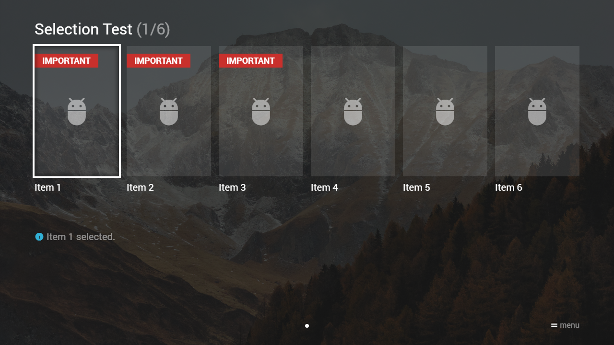
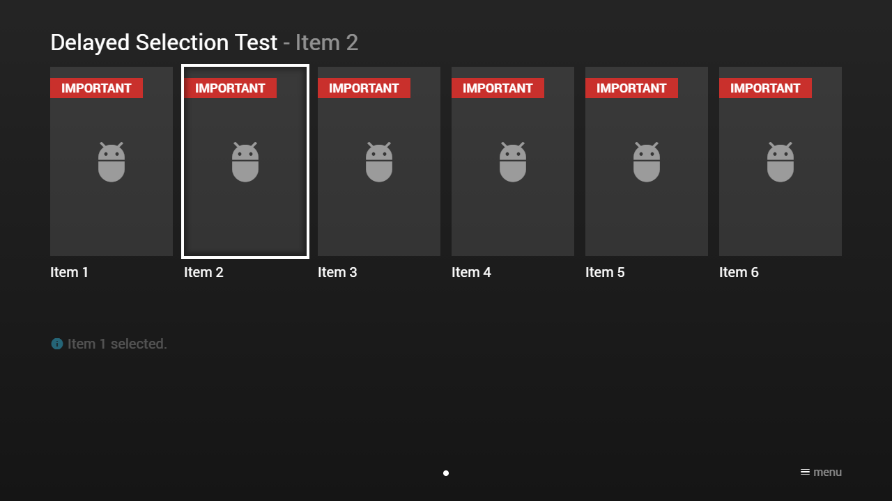

---
title: Selection Examples
category: Experts API - Selection
summary: Code examples demonstrating selection object configurations in MSX.
---

# Selection Examples

## Example 1

### Screenshot



### Code

```json
{
    "type": "pages",
    "headline": "Selection Test",
    "overlay": {
        "items": [{
                "id": "info",
                "type": "space",
                "layout": "0,4,12,2",
                "text": ""
            }]
    },
    "template": {
        "type": "separate",
        "layout": "0,0,2,4",
        "icon": "msx-white-soft:adb",
        "color": "msx-glass"
    },
    "items": [{
            "badge": "{col:msx-white}important",
            "badgeColor": "msx-red",
            "title": "Item 1",
            "action": "info:Item 1 executed.",
            "selection": {
                "important": true,
                "background": "http://msx.benzac.de/img/bg1.jpg",
                "action": "update:content:overlay:info",
                "data": {
                    "text": "{ico:msx-blue:info} Item 1 selected."
                }
            }
        }, {
            "badge": "{col:msx-white}important",
            "badgeColor": "msx-red",
            "title": "Item 2",
            "action": "info:Item 2 executed.",
            "selection": {
                "important": true,
                "background": "http://msx.benzac.de/img/bg2.jpg",
                "action": "update:content:overlay:info",
                "data": {
                    "text": "{ico:msx-blue:info} Item 2 selected."
                }
            }
        }, {
            "badge": "{col:msx-white}important",
            "badgeColor": "msx-red",
            "title": "Item 3",
            "action": "info:Item 3 executed.",
            "selection": {
                "important": true,
                "background": "http://msx.benzac.de/img/bg3.jpg",
                "action": "update:content:overlay:info",
                "data": {
                    "text": "{ico:msx-blue:info} Item 3 selected."
                }
            }
        }, {
            "title": "Item 4",
            "action": "info:Item 4 executed.",
            "selection": {
                "action": "update:content:overlay:info",
                "data": {
                    "text": "{ico:msx-blue:info} Item 4 selected."
                }
            }
        }, {
            "title": "Item 5",
            "action": "info:Item 5 executed.",
            "selection": {
                "action": "update:content:overlay:info",
                "data": {
                    "text": "{ico:msx-blue:info} Item 5 selected."
                }
            }
        }, {
            "title": "Item 6",
            "action": "info:Item 6 executed.",
            "selection": {
                "action": "update:content:overlay:info",
                "data": {
                    "text": "{ico:msx-blue:info} Item 6 selected."
                }
            }
        }]
}
```

### Demo

- [Launch via App](https://msx.benzac.de/?start=content:https://msx.benzac.de/info/xp/data/selection_test_1.json)
- [Launch via Demo Page](https://msx.benzac.de/info/?start=content:https://msx.benzac.de/info/xp/data/selection_test_1.json)

## Example 2 (Delayed)

### Screenshot



### Code

```json
{
    "type": "pages",
    "headline": "Delayed Selection Test",
    "underlay": {
        "action": "[update:content:overlay:info|background:none|delay:selection:cancel]",
        "data": {
            "text": ""
        }
    },
    "overlay": {
        "items": [{
                "id": "info",
                "type": "space",
                "layout": "0,4,12,2",
                "text": ""
            }]
    },
    "template": {
        "enumerate": false,
        "badge": "{col:msx-white}important",
        "badgeColor": "msx-red",
        "type": "separate",
        "layout": "0,0,2,4",
        "icon": "msx-white-soft:adb",
        "color": "msx-glass",        
        "selection": {
            "important": true,
            "headline": "{context:title}",
            "action": "[invalidate:content:overlay:info|delay:selection:1:data]",
            "data": {
                "actions": [{
                        "action": "update:content:overlay:info",
                        "data": {
                            "text": "{ico:msx-blue:info} {context:selectionInfo}"
                        }
                    }, {
                        "action": "background:{context:selectionBackground}"
                    }]
            }
        },
        "action": "data",
        "data": {
            "actions": [{
                    "action": "info:{context:executionInfo}"                    
                }, {
                    "action": "delay:selection:execute"
                }]
        }
    },
    "items": [{
            "title": "Item 1",
            "executionInfo": "Item 1 executed.",
            "selectionInfo": "Item 1 selected.",
            "selectionBackground": "http://msx.benzac.de/img/bg1.jpg"
        }, {
            "title": "Item 2",
            "executionInfo": "Item 2 executed.",
            "selectionInfo": "Item 2 selected.",
            "selectionBackground": "http://msx.benzac.de/img/bg2.jpg"
        }, {
            "title": "Item 3",
            "executionInfo": "Item 3 executed.",
            "selectionInfo": "Item 3 selected.",
            "selectionBackground": "http://msx.benzac.de/img/bg3.jpg"
        }, {
            "title": "Item 4",
            "executionInfo": "Item 4 executed.",
            "selectionInfo": "Item 4 selected.",
            "selectionBackground": "none"
        }, {
            "title": "Item 5",
            "executionInfo": "Item 5 executed.",
            "selectionInfo": "Item 5 selected.",
            "selectionBackground": "none"
        }, {
            "title": "Item 6",
            "executionInfo": "Item 6 executed.",
            "selectionInfo": "Item 6 selected.",
            "selectionBackground": "none"
        }]
}
```

### Demo

- [Launch via App](https://msx.benzac.de/?start=content:https://msx.benzac.de/info/xp/data/selection_test_2.json)
- [Launch via Demo Page](https://msx.benzac.de/info/?start=content:https://msx.benzac.de/info/xp/data/selection_test_2.json)

## See also

- [Selection Object](./selection-object.md)
