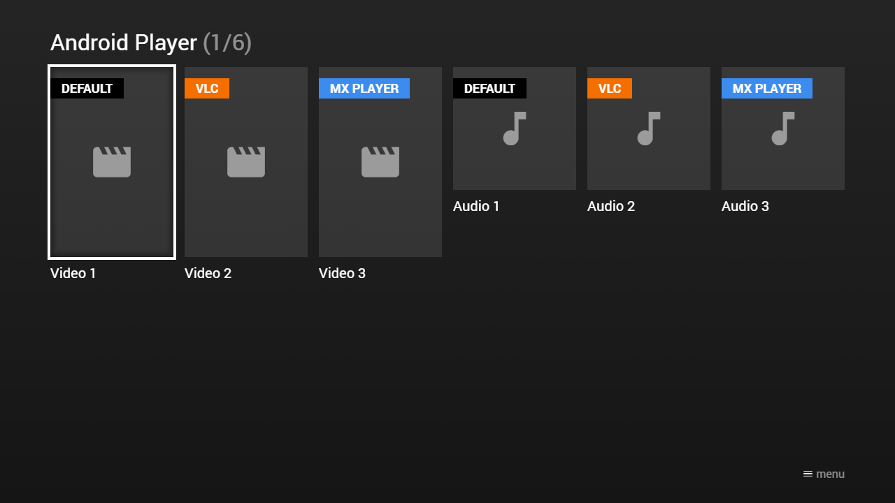

---
title: Android Player
category: Experts API - Special
summary: API reference for launching an external Android player (VLC, MX Player & Co.) from MSX and handling the application result event.
---

# Android Player

It is possible to launch an external Android player (VLC, MX Player & Co.) via a system action (`system:tvx:launch` or `system:tvx:launch:{APP_ID}`) and to handle the result (e.g. the last video/audio position) via an application event (`app:result`). This API is available in Media Station X version **0.1.136** or higher for all Android and FireTV devices.

**Note: Please note that iOS devices also support the TVX system actions. However, the syntax for launching external applications is different. For iOS devices, the `{APP_ID}` part must be replaced with a URL (e.g. `system:tvx:launch:vlc://http://link.to.media`), for Android devices, it must be replaced with a package name (e.g. `system:tvx:launch:org.videolan.vlc`). Additionally, iOS devices do not support extra data, but it is possible to check if the application could be launched.**

## Syntax

```json
{
    "action": "system:tvx:launch:com.example.app",
    "data": {
        "id": "request_id",
        "uri": "http://link.to.media",
        "type": "video/*",
        "component": {
            "package": "com.example.app",
            "class": "com.example.app.player"
        },
        "extra": {
            "extra_string": "Value",        
            "extra_boolean": true,
            "extra_int": 1,
            "extra_long": 1234567890123,
            "extra_double": 1.1,
            "extra_string_array": ["Value 1", "Value 2", "Value 3"],
            "extra_boolean_array": [true, false, true],
            "extra_int_array": [1, 2, 3],
            "extra_long_array": [1234567890123, 1234567890123, 1234567890123],
            "extra_double_array": [1.1, 2.2, 3.3],        
            "extra_uri": {
                "type": "uri",
                "value": "http://link.to.media"
            },
            "extra_string_alt": {
                "type": "string",
                "value": "Value"
            },        
            "extra_boolean_alt": {
                "type": "boolean",
                "value": true
            },
            "extra_byte": {
                "type": "byte",
                "value": 1
            },           
            "extra_short": {
                "type": "short",
                "value": 1
            },            
            "extra_int_alt": {
                "type": "int",
                "value": 1
            },
            "extra_long_alt": {
                "type": "long",
                "value": 1234567890123
            },
            "extra_float": {
                "type": "float",
                "value": 1.1
            },
            "extra_double_alt": {
                "type": "double",
                "value": 1.1
            },
            "extra_string_array_alt": {
                "type": "string",
                "values": ["Value 1", "Value 2", "Value 3"]
            },
            "extra_boolean_array_alt": {
                "type": "boolean",
                "values": [true, false, true]
            },
            "extra_byte_array": {
                "type": "byte",
                "values": [1, 2, 3]
            },           
            "extra_short_array": {
                "type": "short",
                "values": [1, 2, 3]
            },
            "extra_int_array_alt": {
                "type": "int",
                "values": [1, 2, 3]
            },
            "extra_long_array_alt": {
                "type": "long",
                "values": [1234567890123, 1234567890123, 1234567890123]
            },
            "extra_float_array": {
                "type": "float",
                "values": [1.1, 2.2, 3.3]
            },
            "extra_double_array_alt": {
                "type": "double",
                "values": [1.1, 2.2, 3.3]     
            },
            "extra_uri_array": {
                "type": "uri",
                "values": ["http://link.to.media1", "http://link.to.media2", "http://link.to.media3"]
            },
            "extra_string_list": {
                "type": "list:string",
                "values": ["Value 1", "Value 2", "Value 3"]
            },
            "extra_int_list": {
                "type": "list:int",
                "values": [1, 2, 3]
            },
            "extra_uri_list": {
                "type": "list:uri",
                "values": ["http://link.to.media1", "http://link.to.media2", "http://link.to.media3"]
            }
        }
    }
}
```

Property syntax of application launch action data.

| Property | Type | Default Value | Mandatory | Since Version | Description |
|---|---|---|---|---|---|
| `id` | `string` | `null` | No | **0.1.136** | A custom request ID.<br><br>**Note: This property must be set in order to trigger application result events. For iOS devices, the result event is directly triggered. For Android devices, the result event is triggered after the launched application is closed (or the application could not be launched).** |
| `uri` | `string` | `null` | No | **0.1.136** | The data URI. Typically, this property is set to a video/audio URL that should be played.<br><br>**Note: This property is not supported by iOS devices.** |
| `type` | `string` | `null` | No | **0.1.136** | The data mime type. Typically, this property is set to `"video/*"` or `"audio/*"`.<br><br>**Note: This property is not supported by iOS devices.** |
| `component` | `object` | `null` | No | **0.1.136** | The component that should be launched. The object must contain a `package` property (of type `string`) and a `class` property (of type `string`). Typically, this property is not set, because the package name is indicated in the action syntax (i.e. the `{APP_ID}` part) and the appropriate component is determined by the system.<br><br>**Note: This property is not supported by iOS devices.** |
| `extra` | `object` | `null` | No | **0.1.136** | The extra data handled by the launched application.<br><br>**Note: Please note that some applications require special data types (e.g. `android.net.Uri` objects) for the extra data. In such cases, you can use the `type` property to perform the required conversions (please see the syntax examples). This property is not supported by iOS devices.** |

## Result

```json
{
    "event": "app:result",
    "id": "request_id",
    "code": -1,
    "extra": {
        "extra_string": "Value",        
        "extra_boolean": true,
        "extra_int": 1,
        "extra_long": 1234567890123,
        "extra_double": 1.1,
        "extra_string_array": ["Value 1", "Value 2", "Value 3"],
        "extra_boolean_array": [true, false, true],
        "extra_int_array": [1, 2, 3],
        "extra_long_array": [1234567890123, 1234567890123, 1234567890123],
        "extra_double_array": [1.1, 2.2, 3.3],
        "extra_uri": "http://link.to.media",
        "extra_byte": 1,
        "extra_short": 1,
        "extra_float": 1.1,
        "extra_byte_array": [1, 2, 3],
        "extra_short_array": [1, 2, 3],
        "extra_float_array": [1.1, 2.2, 3.3],
        "extra_uri_array": ["http://link.to.media1", "http://link.to.media2", "http://link.to.media3"],
        "extra_string_list": ["Value 1", "Value 2", "Value 3"],
        "extra_int_list": [1, 2, 3],
        "extra_uri_list": ["http://link.to.media1", "http://link.to.media2", "http://link.to.media3"]
    }
}
```

Property syntax of application result event.

| Property | Type | Since Version | Description |
|---|---|---|---|
| `event` | `string` | **0.1.136** | The event type. For application result events, this property is set to `"app:result"`. |
| `id` | `string` | **0.1.136** | The custom request ID. |
| `code` | `number` | **0.1.136** | The result code.<br><br>• `-3`: Internal error occurred.<br>• `-2`: Application could not be launched.<br>• `-1`: Operation succeeded (Android-compliant).<br>• `0`: Operation canceled (Android-compliant).<br>• `1`: All codes of `1` or higher are application-specific (Android-compliant).<br><br>**Note: For iOS devices, only negative codes are possible (i.e. `-1`, `-2`, and `-3`).** |
| `extra` | `object` | **0.1.136** | The extra data returned by the launched application.<br><br>**Note: Please note that the properties of the extra data are converted to the appropriate JSON types (e.g. `byte`/`short`/`int`/`long`/`float`/`double` values are converted to `number` values, `android.net.Uri` objects are converted to `string` values, etc.). This property is always set to `null` for iOS devices.** |

## Example

This example uses an interaction plugin to create the content and to handle the application result events. Please have a look at this implementation script: [https://msx.benzac.de/interaction/js/android.js](https://msx.benzac.de/interaction/js/android.js).

### Screenshot



### Code

```json
{
    "reference": "request:interaction:init@http://msx.benzac.de/interaction/android.html",
    "pages": []
}
```

### Demo

- [Launch via App](https://msx.benzac.de/?start=content:https://msx.benzac.de/info/xp/data/android_test.json)
- [Launch via Demo Page](https://msx.benzac.de/info/?start=content:https://msx.benzac.de/info/xp/data/android_test.json)

**Note: This demo will only work properly on an Android or FireTV device with Media Station X 0.1.136 or higher.**

## See Also

- [Android Plugin](../plugins/android-plugin.md)
