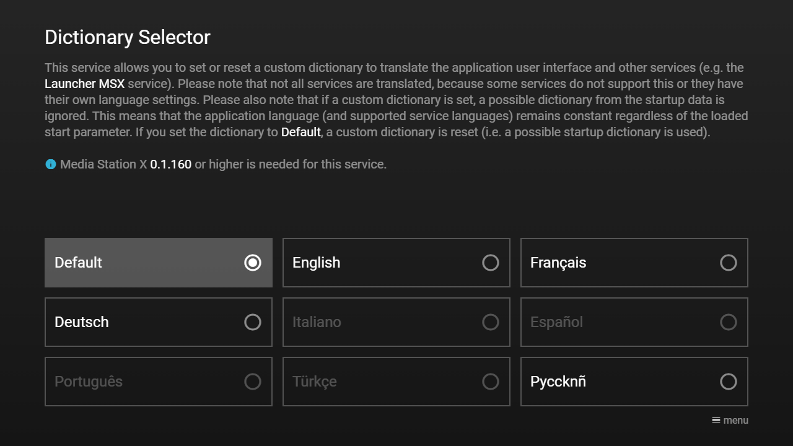

# Dictionary Structure

A dictionary can be used to translate the application user interface and other services (e.g. the **Launcher MSX** service). It is set as URL in the `dictionary` property in the menu or content data. The dictionary data must contain a `name` property (of type `string`), a `version` property (of type `string`), and a `properties` property (of type `object`). Each property is a key-value pair of type `string`. Since version **0.1.160**, a property value can also be an `array` of `string` values (e.g. for longer texts). Optionally, the `dictionary` property can contain a `language` property (of type `string`) that specifies the language code (e.g. `"en"` for English, `"fr"` for French, `"de"` for German, etc.). The currently used dictionary is displayed in the about panel of the Media Station X application.

For more information about the **Launcher MSX** service, please visit: [https://msx.benzac.de/info/?tab=Showcases&section=Showcase11](https://msx.benzac.de/info/?tab=Showcases&section=Showcase11).

**Note: The dictionary is only used if the menu/content data is loaded at startup. If the dictionary only contains parts of the application user interface, the default values are used for the missing entries. For the dictionary support, version 0.1.120 or higher is needed. Since version 0.1.160, it is also possible to set a custom dictionary with the action `dictionary:{URL}`. If a custom dictionary is set, a possible dictionary from the startup data is ignored (unless it is set via the `start` URL parameter).**

## Template

```json
{
    "name": "English",
    "version": "1.0.35",
    "language": "en",
    "properties": {
        "caption:menu": "menu",
        "caption:options": "opt/menu",
        "caption:player": "player",
        "format:date": "mm/dd/yy",
        "format:day": "D mm/dd",
        "format:full_day": "DD, MM d, yyyy",
        "format:long_date": "MM d, yyyy",
        "format:long_day": "D mm/dd/yyyy",
        "format:long_time": "h:mm:ss/ampm",
        "format:number": ",.",
        "format:separator": ", ",
        "format:time": "h:mm/ampm",
        "key:back": "Back",
        "key:blue": "Blue",
        "key:chanel_list": "Channel-List",
        "key:channel_down": "Channel-Down",
        "key:channel_up": "Channel-Up",
        "key:clear": "Clear",
        "key:down": "Down",
        "key:execute": "Execute",
        "key:exit": "Exit",
        "key:forward": "Forward",
        "key:green": "Green",
        "key:guide": "Guide",
        "key:info": "Info",
        "key:key_0": "Number-0",
        "key:key_1": "Number-1",
        "key:key_2": "Number-2",
        "key:key_3": "Number-3",
        "key:key_4": "Number-4",
        "key:key_5": "Number-5",
        "key:key_6": "Number-6",
        "key:key_7": "Number-7",
        "key:key_8": "Number-8",
        "key:key_9": "Number-9",
        "key:left": "Left",
        "key:menu": "Menu",
        "key:mute": "Mute",
        "key:next_track": "Next-Track",
        "key:options": "Options",
        "key:pause": "Pause",
        "key:play": "Play",
        "key:power": "Power",
        "key:previous_track": "Previous-Track",
        "key:record": "Record",
        "key:red": "Red",
        "key:restart": "Restart",
        "key:rewind": "Rewind",
        "key:right": "Right",
        "key:search": "Search",
        "key:settings": "Settings",
        "key:stop": "Stop",
        "key:toggle_mute": "Toggle-Mute",
        "key:toggle_play_pause": "Toggle-Play-Pause",
        "key:unknown": "Unknown",
        "key:unmute": "Unmute",
        "key:up": "Up",
        "key:volume_down": "Volume-Down",
        "key:volume_up": "Volume-Up",
        "key:yellow": "Yellow",
        "label:about": "About",
        "label:animations": "Animations",
        "label:application": "Application",
        "label:apply": "Apply",
        "label:audio": "Audio",
        "label:auto": "Auto",
        "label:auto_and_fixed": "Auto & Fixed",
        "label:auto_eject": "Auto Eject",
        "label:cancel": "Cancel",
        "label:cleaning": "Cleaning",
        "label:cleaning_info": "Clear Cache & Reload",
        "label:clear": "Clear",
        "label:click_and_swipe": "Click & Swipe",
        "label:client": "Client",
        "label:code": "Code",
        "label:complete_start_parameter": "Complete Start Parameter",
        "label:complex": "Complex",
        "label:config_error": "Config Error",
        "label:config_not_available": "Config Not Available",
        "label:confirm": "Confirm",
        "label:contact": "Contact",
        "label:content_guide": "Content Guide",
        "label:content_info": "Content Info",
        "label:content_not_available": "Content Not Available",
        "label:content_server": "Content Server",
        "label:continue": "Continue",
        "label:copyright": "Copyright",
        "label:corner_controls": "Corner Controls",
        "label:current_time": "Current Time",
        "label:custom": "Custom",
        "label:data_load_error": "Data Load Error",
        "label:debug": "Debug",
        "label:default": "Default",
        "label:detected": "Detected",
        "label:detected_and_fixed": "Detected & Fixed",
        "label:device": "Device",
        "label:dictionary": "Dictionary",
        "label:dictionary_validation": "Dictionary Validation",
        "label:disclaimer": "{ico:msx-yellow:warning} Disclaimer",
        "label:drag_and_drop": "Drag & Drop",
        "label:eject_timeout": "Eject Timeout",
        "label:enter_code": "Enter Code",
        "label:error": "{ico:msx-red:error} Error",
        "label:exit": "Exit",
        "label:extended_information": "Extended Information",
        "label:fast": "Fast",
        "label:fixed": "Fixed",
        "label:framework": "Framework",
        "label:full_rotation": "Full Rotation",
        "label:fullscreen": "Fullscreen",
        "label:home": "Home",
        "label:host_server": "Host Server",
        "label:hover_effect": "Hover Effect",
        "label:http_server": "HTTP Server",
        "label:id": "ID",
        "label:image_options": "Image Options",
        "label:immersive_mode": "Immersive Mode",
        "label:info": "{ico:msx-blue:info} Info",
        "label:input_type": "Input Type",
        "label:layout": "Layout",
        "label:leave": "Leave",
        "label:leave_info": "Back To Previous Page",
        "label:left_rotation": "Left Rotation",
        "label:license": "License",
        "label:link_validation": "Link Validation",
        "label:load_error": "Load Error",
        "label:log": "Log",
        "label:menu": "Menu",
        "label:menu_button": "Menu Button",
        "label:menu_not_available": "Menu Not Available",
        "label:minimalistic": "Minimalistic",
        "label:move_and_execute": "Move & Execute",
        "label:name": "Name",
        "label:navigation_frame": "Navigation Frame",
        "label:no": "No",
        "label:no_video_audio_loaded": "No Video/Audio Loaded",
        "label:none": "None",
        "label:normal": "Normal",        
        "label:not_available": "Not Available",
        "label:not_fixed": "Not Fixed",
        "label:not_rotated": "Not Rotated",
        "label:off": "Off",
        "label:ok": "OK",
        "label:on": "On",
        "label:options": "Options",
        "label:parameter": "Parameter",
        "label:pause_slideshow": "Pause Slideshow",
        "label:plain": "Plain",
        "label:platform": "Platform",
        "label:platform_options": "Platform Options",
        "label:play_slideshow": "Play Slideshow",
        "label:player": "Player",
        "label:preselect": "Preselect",
        "label:random_playback": "Random Playback",       
        "label:reload": "Reload",
        "label:reload_info": "Reload Current Page",
        "label:remote_control": "Remote Control",
        "label:remote_only": "Remote Only",
        "label:reset": "Reset",
        "label:reset_rotation": "Reset Rotation",
        "label:reset_settings": "Reset Settings",
        "label:reset_start_parameter": "Reset Start Parameter",
        "label:resolution": "Resolution",
        "label:restart": "Restart",
        "label:restart_info": "Start With First Page",
        "label:right_rotation": "Right Rotation",
        "label:rounded_style": "Rounded Style",
        "label:scale": "Scale Factor",
        "label:screen_saver": "Screen Saver",
        "label:settings": "Settings",
        "label:setup": "Setup",
        "label:setup_start_parameter": "Setup Start Parameter",
        "label:sleep_timeout": "Sleep Timeout",
        "label:slideshow_interval": "Slideshow Interval",
        "label:slow": "Slow",
        "label:start_data_not_available": "Start Data Not Available",
        "label:start_error": "Start Error",
        "label:start_parameter": "Start Parameter",
        "label:success": "{ico:msx-green:check-circle} Success",
        "label:support": "Support",
        "label:transformations": "Transformations",
        "label:tv_control": "TV Control",
        "label:unknown": "Unknown",
        "label:url_parameters": "URL Parameters",
        "label:user_agent": "User Agent",
        "label:validate_links": "Validate Links",
        "label:validate_settings": "Validate Settings",
        "label:version": "Version",
        "label:very_fast": "Very Fast",
        "label:very_slow": "Very Slow",
        "label:video": "Video",
        "label:video_speed": "Playback Speed",
        "label:visual_effects": "Visual Effects",
        "label:visual_execution": "Visual Execution",
        "label:volume": "Volume",
        "label:warning": "{ico:msx-yellow:warning} Warning",
        "label:web": "Web",
        "label:welcome": "Welcome Pages",
        "label:yes": "Yes",
        "label:zoom": "Zoom Factor",
        "list:day_long_names": "Sunday,Monday,Tuesday,Wednesday,Thursday,Friday,Saturday",
        "list:day_names": "Son,Mon,Tue,Wed,Thu,Fri,Sat",
        "list:month_long_names": "January,February,March,April,May,June,July,August,September,October,November,December",
        "list:month_names": "Jan,Feb,Mar,Apr,May,Jun,Jul,Aug,Sep,Oct,Nov,Dec",
        "message:action_error_1": "Execution error: Code is invalid.",
        "message:action_error_2": "Execution error: Action is missing or empty.",
        "message:action_not_available": "No action available.",
        "message:action_not_available_for_platform": "The current platform does not support this action.",
        "message:action_warning_1": "Skip action '{ACTION}', because max action call stack has been reached.",
        "message:action_warning_2": "Unknown action: '{ACTION}'.",
        "message:action_warning_3": "Live action is invalid in this context.",
        "message:action_warning_4": "Invalid data action: Data is missing.",
        "message:action_warning_5": "Invalid data action: Actions are missing.",
        "message:action_warning_6": "Unknown logger action: '{ACTION}'.",
        "message:action_warning_7": "Invalid trigger action: '{ACTION}'.",
        "message:action_warning_8": "Unknown system action: '{ACTION}'.",
        "message:action_warning_9": "Unknown history action: '{ACTION}'.",
        "message:action_warning_10": "Unknown settings action: '{ACTION}'.",
        "message:action_warning_11": "Unknown volume action: '{ACTION}'.",
        "message:action_warning_12": "Unknown player action: '{ACTION}'.",
        "message:action_warning_13": "Unknown player progress action: '{ACTION}'.",
        "message:action_warning_14": "Unknown player label action: '{ACTION}'.",
        "message:action_warning_15": "Unknown player commit action: '{ACTION}'.",
        "message:action_warning_16": "Unknown player speed action: '{ACTION}'.",
        "message:action_warning_17": "Unknown busy action: '{ACTION}'.",
        "message:action_warning_18": "Unknown invalidate action: '{ACTION}'.",
        "message:action_warning_19": "Unknown update action: '{ACTION}'.",
        "message:action_warning_20": "Unknown reload action: '{ACTION}'.",
        "message:action_warning_21": "Unknown resume action: '{ACTION}'.",
        "message:action_warning_22": "Unknown ticking action: '{ACTION}'.",
        "message:action_warning_23": "Unknown release action: '{ACTION}'.",
        "message:action_warning_24": "Unknown time action: '{ACTION}'.",
        "message:action_warning_25": "Unknown slider action: '{ACTION}'.",
        "message:action_warning_26": "Unknown slider labels action: '{ACTION}'.",
        "message:action_warning_27": "Unknown interaction action: '{ACTION}'.",
        "message:action_warning_28": "Unknown interaction commit action: '{ACTION}'.",
        "message:action_warning_29": "Unknown log action: '{ACTION}'.",
        "message:action_warning_30": "Unknown player button action: '{ACTION}'.",
        "message:action_warning_31": "Invalid player button action: '{ACTION}'.",
        "message:action_warning_32": "Unknown player video action: '{ACTION}'.",
        "message:action_warning_33": "Unknown player info action: '{ACTION}'.",
        "message:action_warning_34": "Invalid delay action: '{ACTION}'.",
        "message:action_warning_35": "Unknown replace action: '{ACTION}'.",
        "message:action_warning_36": "Invalid replace action: '{ACTION}'.",
        "message:action_warning_37": "Unknown slider options action: '{ACTION}'.",
        "message:action_warning_38": "Unknown player control action: '{ACTION}'.",
        "message:animate_info": "The type of animations. {dic:submessage:performance_info_singular} {dic:submessage:preset_recommended_singular}",
        "message:animate_set": "Animations have been set to: {txt:msx-white:{ANIMATE}}.",
        "message:animate_set_error": "Set animations failed: Invalid value: {txt:msx-white:'{ANIMATE}'}.",
        "message:audio_not_available": "Audio is not available.",
        "message:audio_url_missing": "Audio URL is missing.",
        "message:auto_eject_info": "Please confirm that the current video/audio/slideshow should remain active, otherwise it is automatically ejected in {col:msx-white}{SECONDS}{col}.",
        "message:cleaning_info": "Do you want to clear the cache (if the platform supports it) and reload the application?",
        "message:complete_start_parameter_info": "Start parameter successfully loaded. Do you want to set it up and reload the application?",
        "message:config_error_1": "Invalid config data.",
        "message:config_error_2": "Missing config data.",
        "message:connection_success": "Network connection has been established.",
        "message:connection_warning": "Network connection has been lost.",
        "message:content_missing": "Content is missing.",
        "message:content_not_available": "No content available.",
        "message:content_warning_1": "Maximum page offset reached: {POSITION}.",
        "message:content_warning_2": "{ITEM}[{REF}] ID is already registered: '{ID}'.",
        "message:content_warning_3": "{ITEM}[{REF}] ID is invalid: '{ID}'.",
        "message:content_warning_4": "{ITEM}[{REF}] type is invalid: '{TYPE}': For the overlay/underlay page, only items of type 'space' are allowed.",
        "message:content_warning_5": "{ITEM}[{REF}] layout is invalid: '{LAYOUT}': Position is already registered.",
        "message:content_warning_6": "{ITEM}[{REF}] layout is invalid: '{LAYOUT}': Values are out of range.",
        "message:content_warning_7": "{ITEM}[{REF}] layout is invalid: '{LAYOUT}': Some values are invalid.",
        "message:content_warning_8": "{ITEM}[{REF}] layout is invalid: '{LAYOUT}'.",
        "message:content_warning_9": "{ITEM}[{REF}] layout is missing.",
        "message:content_warning_10": "Page[{PAGE_INDEX}] has no selectable items.",
        "message:content_warning_11": "Content has no selectable items.",
        "message:content_warning_12": "{ITEM}[{REF}]: Maximum page items reached: {COUNT}.",
        "message:data_load_error": "Data could not be loaded.",
        "message:dialog_warning": "Unknown dialog: '{DIALOG}'.",   
        "message:disclaimer_continue": "Do you want to continue?",
        "message:disclaimer_info": "Media Station X is a neutral, client-side application. It does not host, distribute, verify, or endorse any third-party content. You are solely responsible for the legality, safety, and compliance of any start parameters you enter.{br}{br}Illegal or unauthorized use of third-party content is strictly prohibited. The app is intended for legal usage only, including demonstrations, legal showcases, and personal media access.{br}{br}By continuing, you confirm that you have read and accepted the license terms and disclaimer, available in the {txt:msx-white:License} section at {txt:msx-white:https://msx.benzac.de/info/}.",
        "message:eject_timeout_info": "The idle time (time without any interactions) to wait until the current video/audio/slideshow is automatically ejected. If no video/audio/slideshow is active, this time has no effect.",
        "message:eject_timeout_set": "Eject timeout has been set to: {txt:msx-white:{EJECT_TIMEOUT}}.",
        "message:eject_timeout_set_error": "Set eject timeout failed: Invalid value: {txt:msx-white:'{EJECT_TIMEOUT}'}.",
        "message:exit_info": "Do you want to exit the application?",
        "message:feature_not_available": "This feature is not yet available.",
        "message:hover_effect_info": "The type of the hover effect. If you control the application with a pointer device, this effect helps you to select items. You can ignore this setting if you control the application with a standard remote control or with touch.",
        "message:hover_effect_set": "Hover effect has been set to: {txt:msx-white:{HOVER_EFFECT}}.",
        "message:hover_effect_set_error": "Set hover effect failed: Invalid value: {txt:msx-white:'{HOVER_EFFECT}'}.",
        "message:image_list_missing": "Image list is missing.",
        "message:immersive_mode_info": "The immersive mode can be used for devices that do not have a 16:9 screen ratio (e.g. mobile and desktop devices). If it is enabled, the background and video will be stretched to fill the entire screen. Please note that some plugins may not support this mode.",
        "message:immersive_mode_set": "Immersive mode has been set to: {txt:msx-white:{IMMERSIVE_MODE}}.",
        "message:immersive_mode_set_error": "Set immersive mode failed: Invalid value: {txt:msx-white:'{IMMERSIVE_MODE}'}.",
        "message:input_info": "The type of the on-screen input. If you control the application with a standard remote control, you can ignore this setting. {dic:submessage:reload_required}",
        "message:input_set": "Input type has been set to: {txt:msx-white:{INPUT}}.{br}{dic:submessage:reload_request}",
        "message:input_set_error": "Set input type failed: Invalid value: {txt:msx-white:'{INPUT}'}.",
        "message:interaction_commit_error": "Commit interaction data failed.",
        "message:interaction_commit_warning": "Commit interaction data is not possible, because no interaction plugin is loaded.",
        "message:interaction_error": "Invalid interaction URL: '{SOURCE}': URL must be a valid HTTP(S) URL.",
        "message:interaction_info": "No interaction plugin loaded, please load one to use interaction functions.",
        "message:key_warning_1": "Unknown key: '{KEY}'.",
        "message:key_warning_2": "Invalid key code: '{CODE}'.",
        "message:layout_info": "The resolution of the layout. {dic:submessage:performance_info_singular} {dic:submessage:reload_required} {dic:submessage:preset_recommended_singular}",
        "message:layout_set": "Layout has been set to: {txt:msx-white:{LAYOUT}}.{br}{dic:submessage:reload_request}",
        "message:layout_set_error": "Set layout failed: Invalid value: {txt:msx-white:'{LAYOUT}'}.",
        "message:leave_info": "Do you want to leave the application?",
        "message:live_action_not_available": "No live action available.",
        "message:menu_button_info": "The menu button is used to quickly access all major controls or additional options. By default, the menu {ico:msx-white:menu} and the blue {ico:msx-blue:stop} button is mapped to this function. Additionally, you can define an extra button here. Press {txt:msx-white:OK} to reset the entry.",
        "message:menu_button_set": "Menu button has been set to: {txt:msx-white:{MENU_BUTTON}}.",
        "message:menu_button_set_error_1": "Set menu button failed: Invalid action value: {txt:msx-white:'{MENU_BUTTON_ACTION}'}.",
        "message:menu_button_set_error_2": "Set menu button failed: Invalid key code value: {txt:msx-white:'{MENU_BUTTON_KEY_CODE}'}.",
        "message:menu_missing": "Menu is missing.",
        "message:menu_warning_1": "Maximum menu position reached: {POSITION}.",
        "message:menu_warning_2": "Menu item ID is already registered: '{ID}'.",
        "message:menu_warning_3": "Menu item ID is invalid: '{ID}'.",
        "message:menu_warning_4": "Menu has no selectable items.",
        "message:player_commit_error": "Commit player data failed.",
        "message:player_commit_warning": "Commit player data is not supported.",
        "message:player_error_1": "Video or audio could not be played:{br}{CONTEXT}",
        "message:player_error_2": "Loading of video or audio has been aborted:{br}{CONTEXT}",
        "message:player_error_3": "Video or audio could not be played, because of network issues:{br}{CONTEXT}",
        "message:player_error_4": "An error has occured while playing the video or audio:{br}{CONTEXT}",
        "message:player_error_5": "Video or audio could not be played, because the source is not supported:{br}{CONTEXT}",
        "message:player_info_1": "No video or audio loaded, please load one to open the player.",
        "message:player_info_2": "No video or audio loaded, please load one to use player functions.",
        "message:playlist_empty": "Playlist is empty.",
        "message:playlist_missing": "Playlist is missing.",
        "message:random_playback_info": "Indicates whether playlist items are played in random order.",
        "message:random_playback_set": "Random playback has been set to: {txt:msx-white:{RANDOM_PLAYBACK}}.",
        "message:random_playback_set_error": "Set random playback failed: Invalid value: {txt:msx-white:'{RANDOM_PLAYBACK}'}.",
        "message:reload_info": "Do you want to reload the application?",
        "message:remote_info": "The type of the on-screen remote control. If you control the application with a standard remote control, you can ignore this setting. {dic:submessage:reload_required}",
        "message:remote_set": "Remote control has been set to: {txt:msx-white:{REMOTE}}.{br}{dic:submessage:reload_request}",
        "message:remote_set_error": "Set remote control failed: Invalid value: {txt:msx-white:'{REMOTE}'}.",
        "message:reset_settings_info": "Do you want to reset settings and reload the application?",
        "message:reset_start_parameter_info": "Do you want to reset the start parameter and reload the application?",
        "message:resolution_info": "The resolution settings of the user interface. Please note that these settings do not affect the video resolution (e.g. if the layout resolution is set to 720p, 1080p or higher resolution videos can still be watched). {dic:submessage:preset_recommended_plural}",
        "message:restart_info": "Do you want to restart the application?",
        "message:rounded_style_info": "The rounded style gives the entire application a new look and feel by rounding most of the corners.",
        "message:rounded_style_set": "Rounded style has been set to: {txt:msx-white:{ROUNDED_STYLE}}.",
        "message:rounded_style_set_error": "Set rounded style failed: Invalid value: {txt:msx-white:'{ROUNDED_STYLE}'}.",
        "message:scale_info": "The scale factor of the layout. By default, this is detected automatically. Depending on the platform, the auto-detection may not work correctly. If the layout does not fit into the screen, you can set this factor to a fixed value. {dic:submessage:reload_required}",
        "message:scale_set": "Scale factor has been set to: {txt:msx-white:{SCALE}}.{br}{dic:submessage:reload_request}",
        "message:scale_set_error": "Set scale factor failed: Invalid value: {txt:msx-white:'{SCALE}'}.",
        "message:screen_saver_info": "The application-internal screen saver settings. Please note that these settings do not affect the screen saver settings of the device.",
        "message:see_log": "Please see log for further details.",
        "message:setup_start_parameter_info": "Do you want to set up the following start parameter and reload the application?",
        "message:sleep_timeout_info": "The idle time (time without any interactions) to wait until the screen saver (dark screen with time and date) is displayed. If a video/audio/slideshow is active, this time has no effect.",
        "message:sleep_timeout_set": "Sleep timeout has been set to: {txt:msx-white:{SLEEP_TIMEOUT}}.",
        "message:sleep_timeout_set_error": "Set sleep timeout failed: Invalid value: {txt:msx-white:'{SLEEP_TIMEOUT}'}.",
        "message:slider_info": "No slideshow loaded, please load one to use slider functions.",
        "message:slider_warning": "Image list has no visible items.",
        "message:slideshow_interval_info": "The time until the next image is changed in the slideshow.",
        "message:slideshow_interval_set": "Slideshow interval has been set to: {txt:msx-white:{SLIDESHOW_INTERVAL}}.",
        "message:slideshow_interval_set_error": "Set slideshow interval failed: Invalid value: {txt:msx-white:'{SLIDESHOW_INTERVAL}'}.",
        "message:start_parameter_dictionary_info": "{ico:msx-blue:info} A custom dictionary has been set that replaces a possible startup dictionary.",
        "message:start_parameter_disclaimer_info": "{ico:msx-yellow:warning} Please note that you are solely responsible for the legality, safety, and compliance of this start parameter. Media Station X does not host, distribute, verify, or endorse any third-party content.",
        "message:start_parameter_error_1": "Invalid start parameter: '{PARAMETER}'.{br}Parameter must start with 'menu:' or 'content:'.",
        "message:start_parameter_error_2": "Invalid start parameter: '{PARAMETER}'.{br}Parameter must be a full string.",
        "message:start_parameter_error_3": "Missing start parameter.",
        "message:start_parameter_error_4": "Invalid start parameter name: '{NAME}'.{br}Start parameter name must be a full string.",
        "message:start_parameter_error_5": "Missing start parameter name.",
        "message:start_parameter_error_6": "Invalid start parameter version: '{VERSION}'.{br}Start parameter version must be a full string.",
        "message:start_parameter_error_7": "Missing start parameter version.",
        "message:start_parameter_error_8": "Missing start data.",
        "message:start_parameter_info": "The start parameter specifies which menu or content is loaded at startup. Once you have completed the start parameter setup, your content is loaded every time you start the application. For more information, please visit {txt:msx-white:https://msx.benzac.de/info/}.",
        "message:start_parameter_warning": "Start parameter must be loaded via HTTPS, because the application was loaded in a secure context.{br}Please set the security lock and try it again.",
        "message:start_parameter_welcome_info_1": "{ico:msx-blue:info} This start parameter is also set as welcome pages start action in the settings.",
        "message:start_parameter_welcome_info_2": "{ico:msx-blue:info} This start parameter is also set as welcome pages content in the settings.",
        "message:start_parameter_welcome_info_3": "{ico:msx-blue:info} The start parameter {col:msx-white}{NAME} {VERSION}{col} is also set as welcome pages start action in the settings.",
        "message:start_parameter_welcome_info_4": "{ico:msx-blue:info} The start parameter {col:msx-white}{NAME} {VERSION}{col} is also set as welcome pages content in the settings.",
        "message:start_parameter_welcome_info_5": "{ico:msx-blue:info} This start parameter will also be set as welcome pages start action in the settings.",
        "message:start_parameter_welcome_info_6": "{ico:msx-blue:info} This start parameter will also be set as welcome pages content in the settings.",
        "message:template_warning_1": "Template area is invalid: '{AREA}': Values are out of range.",
        "message:template_warning_2": "Template area is invalid: '{AREA}': Some values are invalid.",
        "message:template_warning_3": "Template layout is invalid: '{LAYOUT}': Values are out of range.",
        "message:template_warning_4": "Template layout is invalid: '{LAYOUT}': Some values are invalid.",
        "message:template_warning_5": "Template layout is invalid: '{LAYOUT}'.",
        "message:template_warning_6": "Template layout is missing.",
        "message:time_success": "Time initialization completed.",
        "message:time_warning_1": "Unexpected timestamp difference: {DIFF}. A time offset is applied to fix this issue.",
        "message:time_warning_2": "Unexpected time zone: {CLIENT} != {SERVER}. A time zone offset is applied to fix this issue.",
        "message:transform_info": "The type of transformations. {dic:submessage:performance_info_singular} {dic:submessage:reload_required} {dic:submessage:preset_recommended_singular}",
        "message:transform_set": "Transformations have been set to: {txt:msx-white:{TRANSFORM}}.{br}{dic:submessage:reload_request}",
        "message:transform_set_error": "Set transformations failed: Invalid value: {txt:msx-white:'{TRANSFORM}'}.",
        "message:validate_dictionary_1": "A custom dictionary should be set that could replace a possible startup dictionary. Do you want to continue and reload the application?{br}{br}Dictionary: {str:msx-white:{DICTIONARY}}{br}{br}{ico:msx-blue:info} You can reset a custom dictionary by resetting the start parameter. Otherwise, a custom dictionary can only be reset or set by a service.",
        "message:validate_dictionary_2": "A custom dictionary should be reset. This allows a startup dictionary to be loaded. Do you want to continue and reload the application?{br}{br}{ico:msx-blue:info} You can also reset a custom dictionary by resetting the start parameter. Otherwise, a custom dictionary can only be reset or set by a service.",
        "message:validate_link": "A link is opened. This can freeze the application, because not every link is suitable for each platform. Additionally, it may happen that it is not possible to return to the current page. Please validate the link and press continue if you want to open it.{br}{br}Link: {str:msx-white:{LINK}}",
        "message:validate_links_info": "Indicates whether links should be checked with a short validation panel. Opening links can freeze the application, because not every link is suitable for each platform. Additionally, it may happen that it is not possible to return to the current page. Therefore, it is recommended to validate links, before they are opened.",
        "message:validate_links_set": "Validate links has been set to: {txt:msx-white:{VALIDATE_LINKS}}.",
        "message:validate_links_set_error": "Set validate links failed: Invalid value: {txt:msx-white:'{VALIDATE_LINKS}'}.",
        "message:validate_settings_info": "Some important settings (e.g. resolution, scaling, input, etc.) have been changed that could make the application inoperable.{br}{br}Please confirm the changes within the next {col:msx-white}{SECONDS}{col}, otherwise the settings will be reset and the application will be reloaded.",
        "message:video_not_available": "Video is not available.",
        "message:video_url_missing": "Video URL is missing.",
        "message:visual_effects_info": "The settings for visual effects. {dic:submessage:performance_info_plural}",
        "message:visual_execution_info": "Indicates whether an execution (when pressing the {txt:msx-white:OK} button) should be visualized with a small animation. Please note that {txt:msx-white:Animations} must also be enabled for this setting to have an effect.",
        "message:visual_execution_set": "Visual execution has been set to: {txt:msx-white:{VISUAL_EXECUTION}}.",
        "message:visual_execution_set_error": "Set visual execution failed: Invalid value: {txt:msx-white:'{VISUAL_EXECUTION}'}.",
        "message:zoom_info": "The zoom factor of the layout. By default, the resolution of the layout is set via the {txt:msx-white:Layout} settings and no additional zooming is performed. If the layout does not fit into the screen, you can set this factor to {txt:msx-white:Auto}. {dic:submessage:reload_required}",
        "message:zoom_set": "Zoom factor has been set to: {txt:msx-white:{ZOOM}}.{br}{dic:submessage:reload_request}",
        "message:zoom_set_error": "Set zoom factor failed: Invalid value: {txt:msx-white:'{ZOOM}'}.",
        "submessage:performance_info_plural": "Depending on the platform, changing these values may increase or decrease the performance.",
        "submessage:performance_info_singular": "Depending on the platform, changing this value may increase or decrease the performance.",
        "submessage:preset_recommended_plural": "It is recommended to keep the preset values.",
        "submessage:preset_recommended_singular": "It is recommended to keep the preset value.",
        "submessage:reload_request": "Please reload the application for the changes to take effect (e.g. {txt:msx-white:Menu} {ico:arrow-forward} {txt:msx-white:Reload}).",
        "submessage:reload_required": "A reload of the application is required, after this value has been changed.",
        "unit:am": " AM",
        "unit:day": " day",
        "unit:days": " days",
        "unit:hours": " hr",
        "unit:minutes": " min",
        "unit:pm": " PM",
        "unit:seconds": " sec",
        "#appendix1": "Next entries are used by playlist (M3U, PLS, MRSS) and cloud storage services (Google Drive, OneDrive & Co.)", 
        "label:24hr_clock": "24-Hour Clock",
        "label:access_code": "Access Code",
        "label:all": "All",
        "label:alphabet_begin": "A",
        "label:alphabet_end": "Z",
        "label:audio_track": "Audio Track",
        "label:audios": "Audios",
        "label:buffer_size": "Buffer Size",
        "label:buffer_size:init": "Init",
        "label:buffer_size:resume": "Resume",
        "label:buffer_timeout": "Buffer Timeout",
        "label:category": "Category",
        "label:content": "Content",
        "label:current_items": "Current Items",
        "label:date": "Date",
        "label:display_area": "Display Area",
        "label:display_mode": "Display Mode",
        "label:display_mode:auto_aspect_ratio": "Auto Aspect Ratio",
        "label:display_mode:fill_screen": "Fill Screen",
        "label:display_mode:fit_screen": "Fit Screen",
        "label:duration": "Duration",
        "label:enter_access_code": "Enter Access Code",
        "label:favorites": "Favorites",
        "label:few": "Few",
        "label:high": "High",
        "label:image": "Image",
        "label:images": "Images",
        "label:items": "Items",
        "label:long": "Long",
        "label:low": "Low",
        "label:many": "Many",
        "label:merged_playlist": "Merged Playlist",
        "label:new": "New",
        "label:old": "Old",
        "label:order": "Order",
        "label:order:modified": "{ico:event} Old{ico:arrow-forward}New",
        "label:order:modified_desc": "{ico:event} New{ico:arrow-forward}Old",
        "label:order:name": "A{ico:arrow-forward}Z",
        "label:order:name_desc": "Z{ico:arrow-forward}A",
        "label:order:size": "{ico:data-usage} Small{ico:arrow-forward}Large",
        "label:order:size_desc": "{ico:data-usage} Large{ico:arrow-forward}Small",
        "label:original": "Original",
        "label:platform_url_dependent": "Platform/URL dependent",
        "label:player_options": "Player Options",
        "label:players": "Players",
        "label:playlist": "Playlist",
        "label:playlist_options": "Playlist Options",
        "label:plugin": "Plugin",
        "label:plugins": "Plugins",
        "label:ratings": "Ratings",
        "label:related_content": "Related Content",
        "label:reload_feed": "Reload Feed",
        "label:reload_folder": "Reload Folder",
        "label:short": "Short",
        "label:subtitle:color": "Subtitle Color",
        "label:subtitle:color:black": "Black",
        "label:subtitle:color:white": "White",
        "label:subtitle:color:yellow": "Yellow",
        "label:subtitle:hidden": "Subtitles Hidden",
        "label:subtitle:size": "Subtitle Size",
        "label:subtitle:size:extra_large": "Extra Large",
        "label:subtitle:size:extra_small": "Extra Small",
        "label:subtitle:size:large": "Large",
        "label:subtitle:size:medium": "Medium",
        "label:subtitle:size:small": "Small",
        "label:subtitle:style": "Subtitle Style",
        "label:subtitle:type": "Subtitle Type",
        "label:subtitle:type:border": "Border",
        "label:subtitle:type:box": "Box",
        "label:subtitle:type:shadow": "Shadow",
        "label:subtitles": "Subtitles",
        "label:system_player": "System Player",
        "label:text_track": "Text Track",
        "label:title": "Title",
        "label:track": "Track",        
        "label:type": "Type",
        "label:videos": "Videos",
        "label:view": "View",
        "label:view:grid": "Grid",
        "label:view:large_grid": "Large Grid",
        "label:view:list": "List",
        "label:view:preview1": "Preview 1",
        "label:view:preview2": "Preview 2",
        "label:view:row_grid": "Row Grid",
        "label:view:small_grid": "Small Grid",       
        "label:views": "Views",
        "playlist:extension": "{ico:msx-white:event} {now:date:D, M d, yyyy}{tb}{ico:msx-white:access-time} {now:time:hh:mm}",
        "playlist:format:date:number": "{num:{#1}:date:D, M d, yyyy}",
        "playlist:format:time:number": "{num:{#1}:time:hh:mm}",
        "playlist:headline:access_code_required": "{ico:msx-yellow:lock} Access Code Required",
        "playlist:headline:empty_folder": "{ico:msx-blue:info} Empty Folder",
        "playlist:headline:function_not_available": "{ico:msx-yellow:warning} Function Not Available",
        "playlist:headline:no_favorite_items": "{ico:msx-blue:info} No Favorite Items",
        "playlist:label:clear_favorite_items": "Clear all favorite items",
        "playlist:label:go_to_item": "Go to item",
        "playlist:label:go_to_next_items": "Go to next items",
        "playlist:label:go_to_player": "Go to player",
        "playlist:label:go_to_previous_items": "Go to previous items",
        "playlist:label:go_up_in_list": "Go up in list",
        "playlist:label:lock_access": "Lock playlist access",
        "playlist:label:remove_favorite_item": "Remove favorite item",
        "playlist:label:show_favorite_items": "Show all favorite items",
        "playlist:label:toggle_favorite_item": "Toggle favorite item",
        "playlist:message:access_code_required": "This playlist is protected.{br}{br}Please press {txt:msx-white:OK} and enter the access code to continue.",
        "playlist:message:access_denied": "Access denied. The entered code was incorrect.",
        "playlist:message:access_granted": "Access granted. The entered code was correct.",
        "playlist:message:empty_folder": "No videos, audios, images, MSX files, or subfolders were found in this folder.",
        "playlist:message:function_not_available": "This function is currently not available.",
        "playlist:message:go_back": "Please press {txt:msx-white:OK} to go back.",       
        "playlist:message:max_favorites_warning": "Maximum number of playlist favorites ({#1}) has been reached.",
        "playlist:message:no_favorite_items": "You currently have no favorite items.",      
        "playlist:message:player_options": "{ico:msx-blue:info} Please note that the availability and functionality of player options depends on the selected player.",
        "playlist:message:player_options_not_available": "The currently active player does not provide any options.",
        "playlist:message:reload": "Please press {txt:msx-white:OK} to reload.",
        "playlist:message:session_warning": "Playlist session could not be started.{br}If this problem occurs frequently, please try to load the playlist service via HTTPS.",
        "playlist:shortcut:clear": "Clear",
        "playlist:shortcut:favorites": "Fav.",
        "playlist:shortcut:go_to": "Go to",
        "playlist:shortcut:lock": "Lock",
        "playlist:shortcut:next": "Next",
        "playlist:shortcut:player": "Player",
        "playlist:shortcut:previous": "Prev.",
        "#appendix2": "Next entries are used by the Launcher MSX service",
        "launcher:caption:edit_menu": "edit/menu",
        "launcher:caption:move": "move",
        "launcher:caption:remove": "remove",
        "launcher:extension:24hr": "{ico:msx-white:event} {now:date:D, M d, yyyy}{tb}{ico:msx-white:access-time} {now:time:hh:mm}",
        "launcher:extension:default": "{ico:msx-white:event} {now:date:D, M d, yyyy}{tb}{ico:msx-white:access-time} {now:time:h:mm/ampm}",
        "launcher:headline:list_not_initialized": "{ico:msx-yellow:warning} List Not Initialized",
        "launcher:headline:unknown_content_request": "{ico:msx-yellow:warning} Unknown Content Request",
        "launcher:headline:version_not_supported": "{ico:msx-yellow:warning} Version Not Supported",
        "launcher:label:about": "About",
        "launcher:label:add_start_parameter": "Add Start Parameter",
        "launcher:label:compact_list": "Compact List",
        "launcher:label:compact_pages": "Compact Pages",
        "launcher:label:content": "Content",
        "launcher:label:edit_start_parameter": "Edit Start Parameter",
        "launcher:label:edit_start_parameters": "Edit Start Parameters",
        "launcher:label:link": "Link",
        "launcher:label:list": "List",
        "launcher:label:menu": "Menu",
        "launcher:label:name": "Name",
        "launcher:label:pages": "Pages",
        "launcher:label:position": "Position",
        "launcher:label:reference": "Reference",
        "launcher:label:remove_start_parameter": "Remove Start Parameter",
        "launcher:label:reset_start_parameters": "Reset Start Parameters",        
        "launcher:label:server": "Server",
        "launcher:label:settings": "Settings",
        "launcher:label:settings:date_time": "Display of Date and Time",
        "launcher:label:settings:view": "View of Start Parameters",
        "launcher:label:start": "Start",
        "launcher:label:start_parameters": "Start Parameters",
        "launcher:label:type": "Type",
        "launcher:label:update_start_parameter": "Update Start Parameter",
        "launcher:label:version": "Version",
        "launcher:message:about": "{NAME} is a service that helps you to manage various start parameters. Once the launcher has been set up, it is available via the settings ({txt:msx-white:Settings} {ico:arrow-forward} {txt:msx-white:Welcome Pages}). The start parameters are stored on the {HOST_SERVER} server for each specific device by using a unique device ID. Initially, the {txt:msx-white:MSX Showcases} are added. If you reset the start parameters, they will be permanently deleted from the server until you change/add any again.",
        "launcher:message:about:appendix": "{ico:msx-white:play-arrow} For more information about the {txt:msx-white:MSX Showcases}, please visit: {txt:msx-white:https://msx.benzac.de/info/}.{br}{ico:msx-white:play-arrow} For more information about the data privacy, please see {txt:msx-white:Data Privacy} on: {txt:msx-white:https://msx.benzac.de/info/}.{br}{br}{ico:msx-blue:info} Media Station X {txt:msx-white:{MIN_APP_VERSION}} or higher is needed for this service.",
        "launcher:message:add_start_parameter": "Start parameter successfully loaded. Do you want to add it?",
        "launcher:message:control_warning": "Unknown start parameter control: '{CONTROL}'.",
        "launcher:message:edit_start_parameter": "Please use the actions below to set up the start parameter, change the position, update the data, or remove it from the list.",
        "launcher:message:edit_warning": "Unknown interaction edit message: '{MESSAGE}'.",
        "launcher:message:hint:launch": "Start parameter could not be launched.",
        "launcher:message:hint:move_end": "Start parameter is already at the last position.",
        "launcher:message:hint:move_home": "Start parameter is already at the first position.",
        "launcher:message:hint:move_left": "Start parameter cannot be moved to the left, because it is at the first position.",
        "launcher:message:hint:move_right": "Start parameter cannot be moved to the right, because it is at the last position.",
        "launcher:message:hint:remove": "Start parameter could not be removed.",
        "launcher:message:hint:start": "Start parameter could not be set up. Please note that links can only be launched directly.",    
        "launcher:message:info:edit_start": "{ico:msx-blue:info} Start editing start parameters.",
        "launcher:message:info:edit_stop": "{ico:msx-blue:info} Stop editing start parameters.",
        "launcher:message:info:move_end": "{ico:msx-blue:info} Move start parameter to the last position.",
        "launcher:message:info:move_home": "{ico:msx-blue:info} Move start parameter to the first position.",
        "launcher:message:info:move_left": "{ico:msx-blue:info} Move start parameter one position to the left.",
        "launcher:message:info:move_right": "{ico:msx-blue:info} Move start parameter one position to the right.",
        "launcher:message:info:remove": "{ico:msx-blue:info} Remove start parameter from the list.",
        "launcher:message:info:setup": "{ico:msx-blue:info} For possible start parameters, please visit: {txt:msx-white:https://msx.benzac.de/info/}.{br}{ico:msx-yellow:warning} Please note that you are solely responsible for any content accessed via third-party start parameters.",
        "launcher:message:info:start": "{ico:msx-blue:info} Set up start parameter (to be loaded at application startup).",       
        "launcher:message:info:update": "{ico:msx-blue:info} Update start parameter by reloading the data from the server.",
        "launcher:message:interaction_dialog_warning": "Unknown interaction dialog message: '{DIALOG}'.",
        "launcher:message:interaction_warning": "Unknown interaction message: '{MESSAGE}'.",
        "launcher:message:list_not_initialized": "No start parameter list has been initialized.{br}{br}Please restart Media Station X and try it again.",
        "launcher:message:reload": "Please press {txt:msx-white:OK} to reload the application.",
        "launcher:message:remove_start_parameter": "Do you want to remove the following start parameter from the list? You can re-add it by adding the server again.",
        "launcher:message:reset_completed": "Start parameters have been reset.",
        "launcher:message:reset_start_parameters": "Do you want to reset all start parameters and to add the initial ones? Please note that this action cannot be undone.",
        "launcher:message:update_start_parameter": "Start parameter successfully loaded. Do you want to update it?",
        "launcher:message:validation_error_1": "Start parameter validation failed: Input is invalid.",
        "launcher:message:validation_error_2": "Start parameter validation failed: Result is null.",
        "launcher:message:validation_error_3": "Start parameter validation failed: Parameter name must be a full string.",
        "launcher:message:validation_error_4": "Start parameter validation failed: Parameter version must be a full string.",
        "launcher:message:validation_error_5": "Start parameter validation failed: Parameter must be a full string.",
        "launcher:message:validation_error_6": "Start parameter validation failed: Parameter must start with 'menu:', 'content:', or 'link:'.",       
        "launcher:message:version_not_supported": "Media Station X version {txt:msx-white:{MIN_APP_VERSION}} or higher is needed for this service.{br}{br}Please update Media Station X and try it again.",
        "#appendix3": "Next entries are used by the dictionary selector service",
        "dictionary:headline": "Dictionary Selector",
        "dictionary:message": [
            "This service allows you to set or reset a custom dictionary to translate the application user interface and other services (e.g. the {txt:msx-white:Launcher MSX} service).",
            " Please note that not all services are translated, because some services do not support this or they have their own language settings.",
            " Please also note that if a custom dictionary is set, a possible dictionary from the startup data is ignored.",
            " This means that the application language (and supported service languages) remains constant regardless of the loaded start parameter.",
            " If you set the dictionary to {txt:msx-white:Default}, a custom dictionary is reset (i.e. a possible startup dictionary is used).",
            "{br}{br}{ico:msx-blue:info} Media Station X {txt:msx-white:{#1}} or higher is needed for this service."
        ],
        "#appendix4": "Next entries are used by the web version loader service",
        "loader:headline": "Web Version Loader",
        "loader:label:load_http": "Load Web Version via HTTP",
        "loader:label:load_https": "Load Web Version via HTTPS",
        "loader:message:hint": "{br}{br}{ico:msx-yellow:info} You are currently using Media Station X version {txt:msx-white:{#1}}.",
        "loader:message:info": [
            "This service allows you to use the latest version of Media Station X ({txt:msx-white:{#1}}) by loading the web version (either via {txt:msx-white:HTTP} or {txt:msx-white:HTTPS}).",
            " Please note that the web version has a different start parameter and different settings than the current version.",
            " Therefore, you have to reconfigure the start parameter and the settings after the web version is loaded.",
            " Please also note that if the web version is loaded via {txt:msx-white:HTTPS}, the security lock {ico:msx-white:lock} must always be set and all JSON files and plugins must be provided via {txt:msx-white:HTTPS} (the application will automatically update the protocol from {txt:msx-white:http://} to  {txt:msx-white:https://} for these URLs).",
            "{br}{br}{ico:msx-blue:info} If you want to leave the web version, please select {txt:msx-white:Leave} from the context menu.",
            "{br}{br}{ico:msx-blue:info} If this service is set up as start parameter, the web version will be automatically loaded at startup.",
            " The icon {ico:msx-yellow:directions} indicates which version would be automatically loaded.",
            " If you want to cancel an automatic loading process, please press {txt:msx-white:Back} or {txt:msx-white:Menu} on the remote control while the Media Station X logo is visible and navigate to {txt:msx-white:Home}.",
            " This will take you back to this content."
        ],
        "loader:message:warning_1": "{br}{br}{ico:msx-yellow:warning} You are already using a web version of Media Station X via {txt:msx-white:HTTP}, therefore, this version is disabled and automatic loading has been prevented.",
        "loader:message:warning_2": "{br}{br}{ico:msx-yellow:warning} You are already using a web version of Media Station X via {txt:msx-white:HTTPS}, therefore, this version is disabled and automatic loading has been prevented.",
        "loader:message:warning_3": "{br}{br}{ico:msx-yellow:warning} You are already using the latest version of Media Station X, therefore, loading the web version is not necessary in most cases."
    }
}
```

## AI-generated Dictionaries

The following dictionaries were generated from the template using AI (Artificial Intelligence) tools. They are kept up to date when the template is expanded or when users suggest improvements. You can simply reference them as a link in your startup data or use the [Dictionary Selection Service](#dictionary-selection-service) to set one of these dictionaries as your custom dictionary.

Dictionary variants generated from the template using AI tools.

| Name | Version | Language Code | Link | Remarks |
|---|---|---|---|---|
| English | 1.0.35 | `en` | [http://msx.benzac.de/dic/en.json](http://msx.benzac.de/dic/en.json) | The template dictionary |
| Français (French) | 1.0.35 | `fr` | [http://msx.benzac.de/dic/fr.json](http://msx.benzac.de/dic/fr.json) | - |
| Deutsch (German) | 1.0.35 | `de` | [http://msx.benzac.de/dic/de.json](http://msx.benzac.de/dic/de.json) | - |
| Italiano (Italian) | - | `it` | - | Not yet available |
| Español (Spanish) | 1.0.35 | `es` | [http://msx.benzac.de/dic/es.json](http://msx.benzac.de/dic/es.json) | - |
| Português (Portuguese) | - | `pt` | - | Not yet available |
| Türkçe (Turkish) | - | `tr` | - | Not yet available |
| Pyccknñ (Russian) | 1.0.35 | `ru` | [http://msx.benzac.de/dic/ru.json](http://msx.benzac.de/dic/ru.json) | - |

## Dictionary Selection Service

The dictionary selection service allows you to set or reset a custom dictionary. Enter the start parameter `id:dic` to set it up. It is recommended to register the service via the **Launcher MSX** service so that you can use this service alongside the actual content services. The service can be used with version **0.1.160** or higher.

### Screenshot



## See also

- [Common Misconceptions → Dictionary file](../../reference/common-misconceptions.md#dictionary-file) — confirms the structure is not a flat key-value map, and that a `dictionary` property only takes effect when loaded at startup
- [In-App Settings Reference → What is not covered by any native setting](../../reference/settings-reference.md#6-what-is-not-covered-by-any-native-setting) — why language selection is handled through this Dictionary mechanism instead of a native app setting
