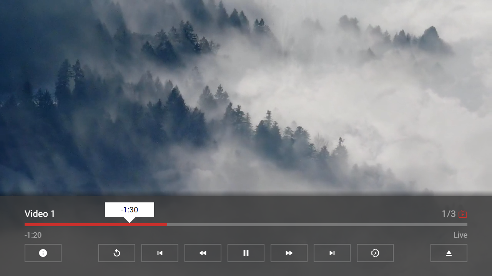

---
title: Extended Properties
category: Experts API - Special
summary: Reference for MSX extended properties set in a Content Item Object's `properties` bag for special use cases.
---

# Extended Properties

These properties can be used for special use cases and are only valid for version **0.1.58+**. Each property is a key-value pair of type `string` and can be set in the `properties` property of a [Content Item Object](../../main-api/content/content-item-object.md). The dynamic properties can also be set via an action at runtime. For more information, please see [Internal Actions](./internal-actions.md).

**Note: It is also possible to set values of type `boolean` or `number` as non-`string` values (e.g. `"true"` → `true` or `"123"` → `123`).**

## Syntax

Property syntax of extended properties.

| Property | Value | Example | Dynamic | Since Version | Description |
|---|---|---|---|---|---|
| `button:{BUTTON_ID}:action` | `{ACTION}` | `"button:content:action": "info:Custom content action executed."`<br>`"button:restart:action": "info:Custom restart action executed."`<br>`"button:prev:action": "info:Custom prev action executed."`<br>`"button:rewind:action": "info:Custom rewind action executed."`<br>`"button:play_pause:action": "info:Custom play/pause action executed."`<br>`"button:forward:action": "info:Custom forward action executed."`<br>`"button:next:action": "info:Custom next action executed."`<br>`"button:speed:action": "info:Custom speed action executed."` | **Yes** | **0.1.111** | Sets up a custom player button action (all buttons except the eject button are supported). Please see [Internal Actions](./internal-actions.md) for possible values. By default, the following actions are executed.<br><br>- `content`: `player:content`<br>- `restart`: `player:restart`<br>- `prev`: `player:prev`<br>- `rewind`: `player:rewind`<br>- `play_pause`: `player:play_pause`<br>- `forward`: `player:forward`<br>- `next`: `player:next`<br>- `speed`: `player:speed`<br><br>**Note: To use this property, the corresponding `button:{BUTTON_ID}:icon` property must also be set, otherwise this property is ignored. If you set the action to `"default"`, the default action is used. For property actions, it is not possible to provide an action-related `data` property. If you want to execute a property data action, please use the `execute:fetch:{URL}` action, alternatively.** |
| `button:{BUTTON_ID}:display` | `{BOOLEAN_VALUE}` | `"button:content:display": "true"`<br>`"button:restart:display": "true"`<br>`"button:prev:display": "true"`<br>`"button:rewind:display": "true"`<br>`"button:play_pause:display": "true"`<br>`"button:forward:display": "true"`<br>`"button:next:display": "true"`<br>`"button:speed:display": "true"` | No | **0.1.130** | Shows/Hides a player button (all buttons except the eject button are supported). |
| `button:{BUTTON_ID}:enable` | `{BOOLEAN_VALUE}` | `"button:content:enable": "true"`<br>`"button:restart:enable": "true"`<br>`"button:prev:enable": "true"`<br>`"button:rewind:enable": "true"`<br>`"button:play_pause:enable": "true"`<br>`"button:forward:enable": "true"`<br>`"button:next:enable": "true"`<br>`"button:speed:enable": "true"` | **Yes** | **0.1.111** | Enables/Disables a player button (all buttons except the eject button are supported). |
| `button:{BUTTON_ID}:focus` | `{BOOLEAN_VALUE}` | `"button:content:focus": "true"`<br>`"button:restart:focus": "true"`<br>`"button:prev:focus": "true"`<br>`"button:rewind:focus": "true"`<br>`"button:play_pause:focus": "true"`<br>`"button:forward:focus": "true"`<br>`"button:next:focus": "true"`<br>`"button:speed:focus": "true"`<br>`"button:eject:focus": "true"`<br>`"button:none:focus": "true"` | **Yes** | **0.1.111** | Focuses a player button (if the player is loaded). If the button `none` is used, no button is focused (i.e. the last selected button is retained) if the player is loaded via an execution event.<br><br>**Note: By default, the button `play_pause` is focused if the player is loaded via an execution event (e.g. if the OK key is pressed while the video/audio is in foreground).** |
| `button:{BUTTON_ID}:icon` | `{ICON}` | `"button:content:icon": "pageview"`<br>`"button:restart:icon": "replay"`<br>`"button:prev:icon": "skip-previous"`<br>`"button:rewind:icon": "fast-rewind"`<br>`"button:play_pause:icon": "play-arrow\|pause"`<br>`"button:forward:icon": "fast-forward"`<br>`"button:next:icon": "skip-next"`<br>`"button:speed:icon": "slow-motion-video"` | **Yes** | **0.1.111** | Sets up a custom player button icon (all buttons except the eject button are supported). Please see [Icons](../../main-api/common/icons.md) for possible values. By default, the following icons are used.<br><br>- `content`: `pageview`<br>- `restart`: `replay`<br>- `prev`: `skip-previous`<br>- `rewind`: `fast-rewind`<br>- `play_pause`: `play-arrow`\|`pause`<br>- `forward`: `fast-forward`<br>- `next`: `skip-next`<br>- `speed`: `slow-motion-video`<br><br>**Note: To use this property, the corresponding `button:{BUTTON_ID}:action` property must also be set, otherwise this property is ignored. If you set the icon to `"default"`, the default icon is used. For the `play_pause` button, you can also set two icons by using the separator `\|` (e.g. `"play-arrow\|pause"`).** |
| `button:{BUTTON_ID}:key` | `{KEY}` | `"button:content:key": "1"`<br>`"button:restart:key": "2"`<br>`"button:prev:key": "3"`<br>`"button:rewind:key": "4"`<br>`"button:play_pause:key": "5"`<br>`"button:forward:key": "6"`<br>`"button:next:key": "7"`<br>`"button:speed:key": "8"`<br>`"button:eject:key": "9"` | **Yes** | **0.1.132** | Sets up a player button shortcut key. |
| `control:action` | `{ACTION}` | `"control:action": "info:Custom player control action executed."` | **Yes** | **0.1.140** | Sets up a custom player control action (replacement for the action that is executed if the OK key is pressed while the video/audio is in foreground). Please see [Internal Actions](./internal-actions.md) for possible values. By default, the action `player:default` is executed.<br><br>**Note: For property actions, it is not possible to provide an action-related `data` property. If you want to execute a property data action, please use the `execute:fetch:{URL}` action, alternatively.** |
| `control:dim` | `{BOOLEAN_VALUE}` | `"control:dim": "true"`<br>`"control:dim": "false"` | No | **0.1.148** | Indicates if the application background should be dimmed when this video is playing. By default, the application background is dimmed to provide a better user experience for videos on devices that do not have a 16:9 screen ratio (by setting the gray background to black). However, if this video is a plugin that displays images or renders objects, this property can be set to `"false"` to keep the gray background.<br><br>**Note: This property only affects mobile and desktop devices, because all current TV devices have a 16:9 screen ratio. Please also note that this property only has an effect if zoom or scale settings are used.** |
| `control:load` | `{LOAD_MODE}` | `"control:load": "default"`<br>`"control:load": "silent"` | No | **0.1.111** | Sets up the player control load mode. If the mode is set to `"silent"`, the player is not shown if the video/audio is loaded in auto mode (e.g. if the action `player:auto:next` is executed). |
| `control:retune` | `{RETUNE_MODE}` | `"control:retune": "default"`<br>`"control:retune": "retain"`<br>`"control:retune": "play"`<br>`"control:retune": "restart"` | No | **0.1.145** | Sets up the player control retune mode. If the mode is set to `"retain"`, `"play"`, or `"restart"` and the (resolved) video/audio URL matches the active one, the active video/audio URL is reused. In case of `"retain"`, the active video/audio play/pause state is retained. In case of `"play"`, the active video/audio is played again (if it was paused). In case of `"restart"`, the active video/audio is restarted. By default, the active video/audio URL is never reused and the new URL is retuned. If the active video/audio has already been ended, this property is ignored.<br><br>**Note: Please note that if the active video/audio URL is reused (in contrast to the `control:reuse` property), all extended properties of the video/audio data (e.g. `"control:type"`, `"progress:type"`, `"trigger:{TRIGGER_KEY}"`, etc.) are applied. Additionally, all properties that were set at runtime are cleared.** |
| `control:return` | `{RETURN_MODE}` | `"control:return": "default"`<br>`"control:return": "silent"` | No | **0.1.140** | Sets up the player control return mode. If the mode is set to `"silent"`, the player is not shown if returning from a content page. |
| `control:reuse` | `{REUSE_MODE}` | `"control:reuse": "default"`<br>`"control:reuse": "retain"`<br>`"control:reuse": "play"`<br>`"control:reuse": "restart"` | No | **0.1.142** | Sets up the player control reuse mode. If the mode is set to `"retain"`, `"play"`, or `"restart"` and the video/audio base data matches the active one (i.e. `id`, `index`, `number`, `type`, `url`, `label`, `background` etc. are the same), the active video/audio data is reused. In case of `"retain"`, the active video/audio play/pause state is retained. In case of `"play"`, the active video/audio is played again (if it was paused). In case of `"restart"`, the active video/audio is restarted. By default, the active video/audio data is never reused and the new data is applied and the video/audio is retuned. If the active video/audio has already been ended, this property is ignored.<br><br>**Note: Please note that if the active video/audio data is reused (in contrast to the `control:retune` property), all extended properties of the new data (e.g. `"control:type"`, `"progress:type"`, `"trigger:{TRIGGER_KEY}"`, etc.) are ignored, because the active ones are reused. Additionally, all properties that were set at runtime are retained.** |
| `control:transparent` | `{BOOLEAN_VALUE}` | `"control:transparent": "true"`<br>`"control:transparent": "false"` | No | **0.1.142** | Indicates if a corresponding content background can be transparent when this video/audio is active. By default, the content background is set to a semi-transparent gray to darken the underlying video/audio and make the content more visible. If this video/audio is suitable for transparent mode (e.g. dark atmospheric background videos), this property can be set to `"true"`.<br><br>**Note: To use this property, the `transparent` property of the corresponding content must be set to `2`, otherwise this property is ignored.** |
| `control:type` | `{CONTROL_TYPE}` | `"control:type": "default"`<br>`"control:type": "extended"` | No | **0.1.130** | Sets up the player control type. If the type is set to `"extended"`, the player is displayed in fullscreen mode, it will not disappear in pause mode, and it is possible to use the `info:headline`, `info:text`, `info:image`, `progress:display`, and related info properties. |
| `image:action` | `{ACTION}` | `"image:action": "info:Custom image action executed."` | **Yes** | **0.1.111** | Sets up a custom slideshow image action (replacement for the default slideshow image action). Please see [Internal Actions](./internal-actions.md) for possible values. By default, the action `slider:default` is executed.<br><br>**Note: For property actions, it is not possible to provide an action-related `data` property. If you want to execute a property data action, please use the `execute:fetch:{URL}` action, alternatively.** |
| `image:extension` | `{LABEL}` | `"image:extension": "Custom image extension label"` | **Yes** | **0.1.111** | Sets up an additional slideshow image extension label (displayed in the slideshow labels). This property supports [Inline Expressions](../../main-api/common/inline-expressions.md). |
| `image:icon` | `{ICON}` | `"image:icon": "info"` | **Yes** | **0.1.145** | Sets up a custom slideshow image icon (displayed in the slideshow labels on the left side). Please see [Icons](../../main-api/common/icons.md) for possible values. This icon should be used to give a hint of the custom slideshow image action. If this property is set to `"slider:options"`, the icon of the selected image options item is used (unless the default item is selected).<br><br>**Note: To use this property, the `image:action` property must also be set, otherwise this property is ignored.** |
| `image:options` | `{BOOLEAN_VALUE}` | `"image:options": "true"`<br>`"image:options": "false"` | No | **0.1.145** | Activates/Deactivates slideshow image options (e.g. to rotate the current slideshow image). The availability of image options for the current image is indicated in the slideshow labels on the right side. By default, slideshow image options are deactivated.<br><br>**Note: If slideshow image options are activated, you can also use the remote control buttons `REWIND` and `FORWARD` to rotate the image to left and right.** |
| `image:rotation:trigger` | `{ACTION}` | `"image:rotation:trigger": "info:Image has been rotated."` | No | **0.1.145** | Sets up a slideshow image rotation trigger. Please see [Internal Actions](./internal-actions.md) for possible values.<br><br>**Note: For property actions, it is not possible to provide an action-related `data` property. If you want to execute a property data action, please use the `execute:fetch:{URL}` action, alternatively.** |
| `image:rotation:value` | `{ROTATION_VALUE}` | `"image:rotation:value": "-270"`<br>`"image:rotation:value": "-180"`<br>`"image:rotation:value": "-90"`<br>`"image:rotation:value": "0"`<br>`"image:rotation:value": "90"`<br>`"image:rotation:value": "180"`<br>`"image:rotation:value": "270"` | **Yes** | **0.1.145** | Sets up a slideshow image rotation value in degrees.<br><br>**Note: The rotation value must be divisible by 90, otherwise `"0"` is used.** |
| `image:trigger` | `{ACTION}` | `"image:trigger": "info:Image is visible."` | No | **0.1.111** | Sets up a slideshow image trigger. Please see [Internal Actions](./internal-actions.md) for possible values.<br><br>**Note: For property actions, it is not possible to provide an action-related `data` property. If you want to execute a property data action, please use the `execute:fetch:{URL}` action, alternatively.** |
| `info:headline` | `{HEADLINE}` | `"info:headline": "Additional video/audio information headline"`<br>`"info:headline": "default"` | **Yes** | **0.1.154** | Sets up a player info headline. This property supports [Inline Expressions](../../main-api/common/inline-expressions.md).<br><br>**Note: To use this property, the `control:type` property must be set to `"extended"`, otherwise this property is ignored.** |
| `info:image` | `{URL}` | `"info:image": "http://msx.benzac.de/img/icon.png"`<br>`"info:image": "default"` | **Yes** | **0.1.130** | Sets up a player info image. Please see property `"info:size"` for the size of the area.<br><br>**Note: To use this property, the `control:type` property must be set to `"extended"`, otherwise this property is ignored.** |
| `info:overlay` | `{OVERLAY}` | `"info:overlay": "full"`<br>`"info:overlay": "default"` | **Yes** | **0.1.146** | Sets up the player info overlay. By default, only the top and bottom edges have an overlay. If you want to show a lot of text (i.e. by using the `info:text` property), it is recommended to use the `"full"` overlay.<br><br>**Note: To use this property, the `control:type` property must be set to `"extended"`, otherwise this property is ignored.** |
| `info:round` | `{BOOLEAN_VALUE}` | `"info:round": "true"`<br>`"info:round": "false"` | **Yes** | **0.1.156** | Enables/Disables rounded corners of the info image if the rounded style is used. By default, the info image corners are rounded for this style. Disabling rounded corners can be useful when using transparent logos that use some corners.<br><br>**Note: To use this property, the `control:type` property must be set to `"extended"`, otherwise this property is ignored.** |
| `info:size` | `{SIZE}` | `"info:size": "small"`<br>`"info:size": "medium"`<br>`"info:size": "large"`<br>`"info:size": "extra-large"`<br>`"info:size": "default"` | **Yes** | **0.1.146** | Sets up the size of the player info image area. By default, the size is set to `"medium"`.<br><br>- `"small"`: The area of the image is 64x416 (WxH) pixels at layout resolution 720p (96x624 at 1080p).<br>- `"medium"`: The area of the image is 128x416 (WxH) pixels at layout resolution 720p (192x624 at 1080p).<br>- `"large"`: The area of the image is 256x416 (WxH) pixels at layout resolution 720p (384x624 at 1080p).<br>- `"extra-large"`: The area of the image is 512x416 (WxH) pixels at layout resolution 720p (768x624 at 1080p).<br><br>The image is sized to fill the entire width (by keeping the ratio) and is positioned at the top.<br><br>**Note: To use this property, the `control:type` property must be set to `"extended"`, otherwise this property is ignored.** |
| `info:text` | `{TEXT}` | `"info:text": "Additional video/audio information text."`<br>`"info:text": "default"` | **Yes** | **0.1.130** | Sets up a player info text. This property supports [Inline Expressions](../../main-api/common/inline-expressions.md).<br><br>**Note: To use this property, the `control:type` property must be set to `"extended"`, otherwise this property is ignored.** |
| `label:duration` | `{LABEL}` | `"label:duration": "Custom duration label"`<br>`"label:duration": "Custom duration label ({VALUE})"`<br>`"label:duration": "default"` | **Yes** | **0.1.111** | Sets up the player duration label (overrides the default duration value of the video/audio player with a custom value). If the custom value contains the `{VALUE}` keyword, it is replaced with the default value. This property supports [Inline Expressions](../../main-api/common/inline-expressions.md). |
| `label:extension` | `{LABEL}` | `"label:extension": "{ico:live-tv}"`<br>`"label:extension": "default"` | **Yes** | **0.1.111** | Sets up an additional player extension label. This property supports [Inline Expressions](../../main-api/common/inline-expressions.md) and [Live Inline Expressions](../live/live-inline-expressions.md). |
| `label:position` | `{LABEL}` | `"label:position": "Custom position label"`<br>`"label:position": "Custom position label ({VALUE})"`<br>`"label:position": "default"` | **Yes** | **0.1.111** | Sets up the player position label (overrides the default position value of the video/audio player with a custom value). If the custom value contains the `{VALUE}` keyword, it is replaced with the default value. This property supports [Inline Expressions](../../main-api/common/inline-expressions.md). |
| `label:speed` | `{LABEL}` | `"label:speed": "Custom speed label"`<br>`"label:speed": "Custom speed label ({VALUE})"`<br>`"label:speed": "default"` | **Yes** | **0.1.130** | Sets up the player speed label (overrides the default speed value of the video/audio player with a custom value). If the custom value contains the `{VALUE}` keyword, it is replaced with the default value. This property supports [Inline Expressions](../../main-api/common/inline-expressions.md). |
| `progress:color` | `{COLOR}` | `"progress:color": "msx-red"`<br>`"progress:color": "default"` | **Yes** | **0.1.111** | Sets up the player progress color. Please see [Colors](../../main-api/common/colors.md) for possible values. |
| `progress:display` | `{BOOLEAN_VALUE}` | `"progress:display": "true"`<br>`"progress:display": "false"` | No | **0.1.161** | Shows/Hides the player progress bar. By default, the progress bar is always visible. Hiding the progress bar can be useful for very special plugins that do not display any video or audio, but instead display an animated canvas, for example.<br><br>**Note: To use this property, the `control:type` property must be set to `"extended"`, otherwise this property is ignored.** |
| `progress:duration` | `{PROGRESS_DURATION}` | `"progress:duration": "60"`<br>`"progress:duration": "-1"` | **Yes** | **0.1.146** | Sets up the player progress duration in seconds (overrides the default duration value of the video/audio player with a custom value). The duration `-1` is default and uses the value of the video/audio player.<br><br>**Note: Please note that this duration is only used in the player controls (it is not used for trigger and resume functions, nor for live playback objects).** |
| `progress:marker:enable` | `{BOOLEAN_VALUE}` | `"progress:marker:enable": "true"`<br>`"progress:marker:enable": "false"` | **Yes** | **0.1.111** | Enables/Disables the player progress marker.<br><br>**Note: If the `control:type` property is set to `"extended"` and the `progress:display` property is set to `"false"`, this property is ignored.** |
| `progress:position` | `{PROGRESS_POSITION}` | `"progress:position": "0"`<br>`"progress:position": "-1"` | **Yes** | **0.1.146** | Sets up the player progress position (overrides the default position value of the video/audio player with a custom value). The position `-1` is default and uses the value of the video/audio player.<br><br>**Note: Please note that this position is only used in the player controls (it is not used for trigger and resume functions, nor for live playback objects).** |
| `progress:type` | `{PROGRESS_TYPE}` | `"progress:type": "position"`<br>`"progress:type": "position:{POSITION} {ico:image}"`<br>`"progress:type": "number"`<br>`"progress:type": "number:{NUMBER} {ico:image}"`<br>`"progress:type": "percentage"`<br>`"progress:type": "time:{LIVE_DURATION_FORMAT}"`<br>`"progress:type": "text:{LIVE_DURATION_TEXT}"`<br>`"progress:type": "reverse:position"`<br>`"progress:type": "reverse:position:{POSITION} {ico:image}"`<br>`"progress:type": "reverse:number"`<br>`"progress:type": "reverse:number:{NUMBER} {ico:image}"`<br>`"progress:type": "reverse:percentage"`<br>`"progress:type": "reverse:time:{LIVE_DURATION_FORMAT}"`<br>`"progress:type": "reverse:text:{LIVE_DURATION_TEXT}"`<br>`"progress:type": "difference:position"`<br>`"progress:type": "difference:position:{POSITION} {ico:image}"`<br>`"progress:type": "difference:number"`<br>`"progress:type": "difference:number:{NUMBER} {ico:image}"`<br>`"progress:type": "difference:percentage"`<br>`"progress:type": "difference:time:{LIVE_DURATION_FORMAT}"`<br>`"progress:type": "difference:text:{LIVE_DURATION_TEXT}"`<br>`"progress:type": "fix:Fix progress label"`<br>`"progress:type": "default"` | **Yes** | **0.1.111** | Sets up the player progress type (`"default"` is like `"time:hh:mm:ss"`). For the type that starts with (or contains) `position:`, the `{POSITION}` part is automatically replaced with the corresponding position value. For the type that starts with (or contains) `number:`, the `{NUMBER}` part is automatically replaced with the corresponding number value (which is the incremented position value). By the way, you can set the progress type to `"fix:"` to hide all progress values. |
| `resume:context` | `{RESUME_CONTEXT}` | `"resume:context": "custom_resume_context"` | No | **0.1.153** | Sets up a resume context for the corresponding resume key. The context can be used to clear multiple resume keys at once (e.g. for a specific service or series).<br><br>**Note: To use this property, the `resume:key` property must also be set, otherwise this property is ignored. The context is stored as hash code on the local device to the corresponding resume key.** |
| `resume:key` | `{RESUME_KEY}` | `"resume:key": "id"`<br>`"resume:key": "url"`<br>`"resume:key": "custom_resume_key"` | No | **0.1.111** | Sets up a resume key to store/restore the content position. If the key is set to `"id"`, the corresponding content item ID is used as key. If the key is set to `"url"`, the corresponding content video/audio URL is used as key. In all other cases, the key is used as is.<br><br>**Note: The key is stored as hash code on the local device. Stored keys can be cleared with the `resume:clear` actions. If the `resume:position` property is also set, the content position is only stored.** |
| `resume:position` | `{RESUME_POSITION}` | `"resume:position": "10"`<br>`"resume:position": "10%"`<br>`"resume:position": "none"` | **Yes** | **0.1.111** | Sets up a fix resume position in seconds or percentage to start the content from there. If the resume position is set to `"none"`, no resuming is performed. |
| `trigger:{TRIGGER_KEY}` | `{ACTION}` | `"trigger:load": "info:Video loaded."`<br>`"trigger:ready": "info:Video ready."`<br>`"trigger:start": "info:Video started."`<br>`"trigger:ending": "info:Video is ending (video is playing and 10 seconds or less are remaining)."`<br>`"trigger:end": "info:Video ended."`<br>`"trigger:complete": "info:Video completed."`<br>`"trigger:10": "info:10 seconds of video passed."`<br>`"trigger:10%": "info:10% of video passed."`<br>`"trigger:10t": "info:10 ticks of video passed."`<br>`"trigger:-10": "info:Last 10 seconds of video passed."`<br>`"trigger:20": "shot:info:20 seconds of video passed (shot)."`<br>`"trigger:20%": "shot:info:20% of video passed (shot)."`<br>`"trigger:20t": "shot:info:20 ticks of video passed (shot)."`<br>`"trigger:-20": "shot:info:Last 20 seconds of video passed (shot)".`<br>`"trigger:quartile1": "info:First quartile of video entered."`<br>`"trigger:quartile2": "info:Second quartile of video entered."`<br>`"trigger:quartile3": "info:Third quartile of video entered."`<br>`"trigger:quartile4": "info:Fourth quartile of video entered."`<br>`"trigger:first_quartile": "info:First quartile of video reached."`<br>`"trigger:midpoint": "info:Midpoint of video reached."`<br>`"trigger:third_quartile": "info:Third quartile of video reached."`<br>`"trigger:play": "info:Video is playing."`<br>`"trigger:pause": "info:Video paused."`<br>`"trigger:stop": "info:Video stopped."`<br>`"trigger:active": "info:Video player is visible or video moved to foreground."`<br>`"trigger:inactive": "info:Video moved to background."`<br>`"trigger:player": "info:Video player is visible."`<br>`"trigger:foreground": "info:Video moved to foreground."`<br>`"trigger:background": "info:Video moved to background."`<br>`"trigger:back": "info:Video back executed."` | **Yes** | **0.1.58** | Sets up a video/audio trigger. Please see [Internal Actions](./internal-actions.md) for possible values.<br><br>**Note: For trigger key `complete`, the action `player:auto:next` is automatically set (please use trigger key `end` if you want to keep the default complete action). For property actions, it is not possible to provide an action-related `data` property. If you want to execute a property data action, please use the `execute:fetch:{URL}` action, alternatively.** |
| `video:duration` | `{VIDEO_DURATION}` | `"video:duration": "60"` | **Yes** | **0.1.128** | Sets up a custom video duration in seconds. If a custom duration is set, only that duration is displayed (and used for trigger and resume functions, as well as live playback objects) during playback. It can be used for live data or ads to disable/override the progress feature. The duration `-1` is default and enables the display feature. |
| `video:position` | `{VIDEO_POSITION}` | `"video:position": "0"` | **Yes** | **0.1.128** | Sets up a custom video position in seconds. If a custom position is set, only that position is displayed (and used for trigger and resume functions, as well as live playback objects) during playback and it is not possible to seek to another position (instead a `custom:video:seek` event is triggered). It can be used for live data or ads to disable/override the progress feature. The position `-1` is default and enables the display and seek feature. The position `-2` only enables the display feature (it is not possible to seek to another position). |
| `video:speed` | `{VIDEO_SPEED}` | `"video:speed": "1"` | **Yes** | **0.1.128** | Sets up a custom video speed. If a custom speed is set, only that speed is displayed during playback and it is not possible to change it (instead a `custom:video:speed` event is triggered). It can be used for live data or ads to disable/override the speed feature. The speed `-1` is default and enables the display and change feature. The speed `-2` only enables the display feature (it is not possible to change it).<br><br>**Note: The actual video speed is not changed. For example, if the custom video speed is set to x0.5, the actual video may still be playing at normal speed.** |
| `video:state` | `{VIDEO_STATE}` | `"video:state": "2"` | **Yes** | **0.1.128** | Sets up a custom video state. If a custom state is set, only that state is displayed during playback and it is not possible to change it (instead a `custom:video:play` or `custom:video:pause` event is triggered). It can be used for live data or ads to disable/override the play/pause feature.<br><br>- `-2`: Read-only (only enables the display feature)<br>- `-1`: Clear (default value that enables the display and change feature)<br>- `1`: Stopped (not supported)<br>- `2`: Playing<br>- `3`: Paused<br><br>**Note: The actual video state is not changed. For example, if the custom video state is paused, the actual video may still be in the playing state.** |

## Example

### Screenshot



### Code

```json
{
    "type": "list",
    "headline": "Extended Properties Test",
    "template": {
        "type": "separate",
        "layout": "0,0,2,4",
        "icon": "msx-white-soft:movie",
        "color": "msx-glass"
    },
    "items": [{
            "title": "Video 1",
            "playerLabel": "Video 1",
            "action": "video:http://msx.benzac.de/media/video1.mp4",
            "properties": {
                "button:content:icon": "info",
                "button:content:action": "info:Live info executed.",
                "label:duration": "Live",
                "label:extension": "{ico:msx-red:live-tv}",
                "progress:color": "msx-red",
                "progress:type": "reverse:time:[H:]M:ss"
            }
        }, {
            "title": "Video 2",
            "playerLabel": "Video 2",
            "action": "video:http://msx.benzac.de/media/video2.mp4",
            "properties": {
                "button:content:icon": "info",
                "button:content:action": "info:Ad info executed.",
                "button:forward:enable": "false",
                "button:rewind:enable": "false",
                "button:restart:enable": "false",
                "button:speed:enable": "false",
                "label:extension": "{txt:msx-yellow:Ad}",
                "progress:color": "msx-yellow",
                "progress:type": "text:s",
                "progress:marker:enable": "false"
            }
        }, {
            "title": "Video 3",
            "playerLabel": "Video 3",
            "action": "video:http://msx.benzac.de/media/video4.mp4",
            "properties": {
                "button:content:icon": "info",
                "button:content:action": "info:Video info executed.",
                "label:extension": "{ico:msx-blue:local-play}",
                "progress:color": "msx-blue",
                "progress:type": "percentage",
                "trigger:midpoint": "info:Midpoint of video reached.",
                "trigger:third_quartile": "dialog:none"
            }
        }, {
            "badge": "Extended",
            "title": "Video 4",
            "titleFooter": "0.1.130+",
            "playerLabel": "Video 4",
            "action": "video:http://msx.benzac.de/media/video5.mp4",
            "properties": {
                "button:content:icon": "info",
                "button:content:action": "info:Video info executed.",  
                "button:rewind:icon": "thumb-down",
                "button:rewind:action": "info:Thumb down executed.",  
                "button:forward:icon": "thumb-up",
                "button:forward:action": "info:Thumb up executed.",  
                "button:restart:display": "false",
                "button:speed:display": "false",      
                "label:extension": "{ico:msx-white:ondemand-video} Extended",
                "progress:type": "time:[H:]M:ss",
                "control:type": "extended",
                "info:image": "http://msx.benzac.de/img/icon.png",
                "info:text": "Placeholder for additional video information."
            }
        }, {
            "badge": "Extended",
            "title": "Video 5",
            "titleFooter": "0.1.130+",
            "playerLabel": "Video 5",
            "action": "video:http://msx.benzac.de/media/video3.mp4",
            "properties": {
                "button:content:icon": "info",
                "button:content:action": "panel:request:interaction:program@http://msx.benzac.de/interaction/live.html",  
                "button:restart:display": "false",  
                "button:rewind:display": "false",               
                "button:play_pause:display": "false",
                "button:forward:display": "false",
                "button:speed:display": "false",                  
                "label:extension": "{ico:msx-white:access-time} {now:time:hh:mm:ss}",
                "label:position": "...",
                "label:duration": "...",               
                "control:type": "extended",
                "trigger:load": "interaction:load:http://msx.benzac.de/interaction/live.html",   
                "trigger:complete": "player:auto:restart",
                "info:text": "This video is controlled by an interaction plugin to simulate a live stream.",
                "live:channel": "0",
                "live:program": "-1"
            }
        }, {
            "badge": "Extended",
            "title": "Video 6",
            "titleFooter": "0.1.140+",
            "playerLabel": "Video 6",
            "action": "video:http://msx.benzac.de/media/video6.mp4",
            "properties": {
                "control:type": "extended",
                "control:action": "[player:show:execute|player:pause]",
                "trigger:foreground": "player:auto:play",
                "button:play_pause:icon": "default",
                "button:play_pause:action": "[player:play_pause|player:hide_play]",
                "info:text": "This video shows a quick play/pause function.{br}{ico:msx-white:play-arrow} If you press {txt:msx-white:OK} while the video is in foreground, it is paused.{br}{ico:msx-white:play-arrow} If you return to foreground, it is resumed.{br}"                
            }
        }, {
            "badge": "Extended",
            "title": "Video 7",
            "titleFooter": "0.1.146+",
            "playerLabel": "Video 7",
            "action": "video:http://msx.benzac.de/media/video7.mp4",
            "properties": {
                "control:type": "extended",
                "info:image": "http://msx.benzac.de/media/thumbs/video7.jpg",
                "info:size": "large",
                "info:overlay": "full",              
                "info:text": "This video shows a next video selection when the video is ending (i.e. the video is playing and 10 seconds or less are remaining).",
                "trigger:ending": "content:http://msx.benzac.de/info/xp/data/next_video_test.json",
                "trigger:complete": "[]" 
            }
        }]
}
```

### Demo

- [Launch via App](https://msx.benzac.de/?start=content:https://msx.benzac.de/info/xp/data/properties_test.json)
- [Launch via Demo Page](https://msx.benzac.de/info/?start=content:https://msx.benzac.de/info/xp/data/properties_test.json)

## Related Hidden Features

- [Key Property](../hidden-features/key-property.md)
- [Option Shortcut](../hidden-features/option-shortcut.md)
- [Image Options](../hidden-features/image-options.md)

## See Also

- [Best Practices & Good to Know → Video/audio keeps playing in the background after `back`](../../reference/best-practices.md#videoaudio-keeps-playing-in-the-background-after-back-by-default) — why `trigger:back`/`player:stop` is the opt-out for the default background-playback behavior
- [Cookbook → Deep dive — a minimal "resume playback" item (`live_test_2` pattern)](../../reference/cookbook.md#deep-dive--a-minimal-resume-playback-item-live_test_2-pattern) — `resume:key`/`resume:position` used together with a Live Object
- [Actions Reference → Actions That Mirror a "Dynamic" Extended Property](../../reference/actions-reference.md#actions-that-mirror-a-dynamic-extended-property) — the complete cross-reference of which internal action sets which `Dynamic: Yes` property above at runtime, and why it shares that property's since-version instead of the internal-actions blanket `0.1.160+`
- [Tizen Player](tizen-player.md) — platform-specific `tizen:*` properties (with their own `Dynamic` column) are not listed on this page at all; they're documented only there, due to how narrow/platform-specific they are
- [Glossary → Trigger](../../reference/glossary.md#trigger) — what the `shot:` prefix inside a `trigger:{TRIGGER_KEY}` action does (fires once instead of repeatedly)
- [Cookbook → Interaction & UX](../../reference/cookbook.md#interaction--ux) — `xp/properties_test.json`, a broad showcase of these properties in a real page
- [Best Practices & Good to Know → The player UI shows for several seconds by default](../../reference/best-practices.md#the-player-ui-shows-for-several-seconds-by-default-when-starting-videoaudio--several-mechanisms-shorten-or-suppress-it) — how `control:load`, `trigger:load`, and `trigger:start` combine to suppress or shorten it
