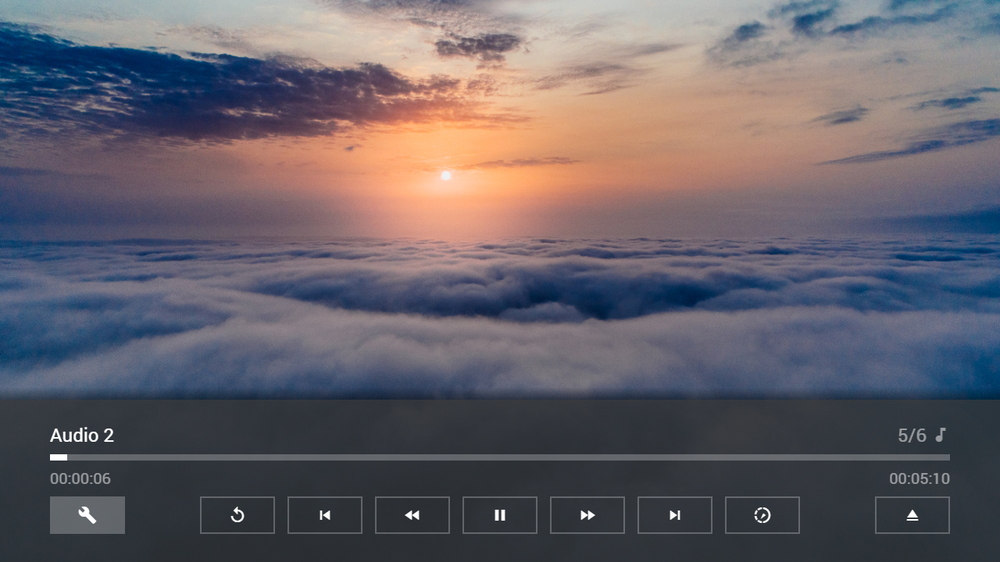

---
title: NetCast Menu
category: Experts API - Special
summary: Details about the LG NetCast platform-specific menu integration in MSX, available from version 0.1.136.
---

# NetCast Menu

The NetCast Menu is available in Media Station X version **0.1.136** or higher for all LG NetCast TVs (2011-2014 models).

## Example

### Screenshot



### Code

```json
{
    "type": "list",
    "headline": "NetCast Menu Test",
    "template": {       
        "type": "separate",
        "layout": "0,0,2,4",       
        "color": "msx-glass",
        "properties": {       
            "button:content:icon": "build",
            "button:content:action": "system:netcast:menu"			
        }
    },
    "items": [{
            "icon": "msx-white-soft:movie",
            "title": "Video 1",
            "playerLabel": "Video 1",
            "action": "video:http://msx.benzac.de/media/video1.mp4"
        }, {
            "icon": "msx-white-soft:movie",
            "title": "Video 2",
            "playerLabel": "Video 2",
            "action": "video:http://msx.benzac.de/media/video2.mp4"
        }, {
            "icon": "msx-white-soft:movie",
            "title": "Video 3",
            "playerLabel": "Video 3",
            "action": "video:http://msx.benzac.de/media/video3.mp4"
        }, {
            "offset": "0,0,0,-1",
            "icon": "msx-white-soft:music-note",
            "background": "http://msx.benzac.de/img/bg1.jpg",
            "title": "Audio 1",
            "playerLabel": "Audio 1",
            "action": "audio:http://msx.benzac.de/media/audio1.mp3"
        }, {
            "offset": "0,0,0,-1",
            "icon": "msx-white-soft:music-note",
            "background": "http://msx.benzac.de/img/bg2.jpg",
            "title": "Audio 2",
            "playerLabel": "Audio 2",
            "action": "audio:http://msx.benzac.de/media/audio2.mp3"
        }, {
            "offset": "0,0,0,-1",
            "icon": "msx-white-soft:music-note",
            "background": "http://msx.benzac.de/img/bg3.jpg",
            "title": "Audio 3",
            "playerLabel": "Audio 3",
            "action": "audio:http://msx.benzac.de/media/audio3.mp3"
        }]
}
```

### Demo

- [Launch via App](https://msx.benzac.de/?start=content:https://msx.benzac.de/info/xp/data/netcast_test.json)
- [Launch via Demo Page](https://msx.benzac.de/info/?start=content:https://msx.benzac.de/info/xp/data/netcast_test.json)

**Note: This demo will only work properly on a LG NetCast TV (2011-2014 models) with Media Station X 0.1.136 or higher.**
