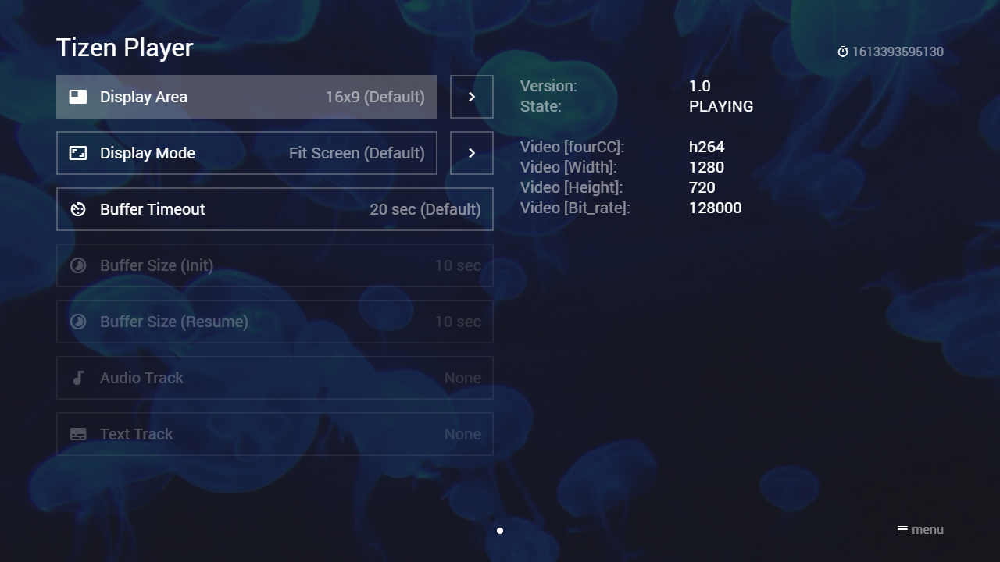

# Tizen Player

The Tizen player is used in Media Station X version **0.1.128** or higher for all Samsung TVs (2016+ models). In previous versions, the HTML5 player is used. The Tizen player works similar to the HTML5 player, but supports more video formats (e.g. 4k/8k formats) and can be configured via the [Extended Properties](./extended-properties.md) of a content item to setup display, buffer, and/or stream settings. Additionally, you can interact with it using the `player:commit` actions to get the current stream information and/or to select a specific audio/text track. Please see [Runtime Usage](#runtime-usage) for more information. Some extended properties are dynamic and can also be set via an action at runtime.

Most of the extended properties are directly mapped to a corresponding Tizen (i.e. `AVPlay` API) function. For more information, please visit following links.

- `AVPlay` API: [https://developer.samsung.com/smarttv/develop/api-references/samsung-product-api-references/avplay-api.html](https://developer.samsung.com/smarttv/develop/api-references/samsung-product-api-references/avplay-api.html)
- Using `AVPlay`: [https://developer.samsung.com/smarttv/develop/guides/multimedia/media-playback/using-avplay.html](https://developer.samsung.com/smarttv/develop/guides/multimedia/media-playback/using-avplay.html)

**Note: All properties are reset if a new video/audio is played. Please also note that you can still use the HTML5 player with a plugin (see [Video/Audio Plugin](../plugins/video-audio-plugin.md)). It should be mentioned here that setting the speed only works with the HTML5 player, because the `AVPlay` API does not support the required speed values.**

## Syntax

Property syntax of extended properties for Tizen player.

| Property | Value | Example | Tizen Function | Dynamic | Since Version | Description |
|---|---|---|---|---|---|---|
| `tizen:buffer:size` | `{SECONDS}` | `"tizen:buffer:size": "10"` | `setBufferingParam("PLAYER_BUFFER_FOR_PLAY", "PLAYER_BUFFER_SIZE_IN_SECOND", {SECONDS});`<br>`setBufferingParam("PLAYER_BUFFER_FOR_RESUME", "PLAYER_BUFFER_SIZE_IN_SECOND", {SECONDS});` | No | **0.1.128** | Sets up the initial and resume buffer size in seconds. The default buffer size is `"10"`. Please see `AVPlay` API for possible values. |
| `tizen:buffer:size:init` | `{SECONDS}` | `"tizen:buffer:size:init": "10"` | `setBufferingParam("PLAYER_BUFFER_FOR_PLAY", "PLAYER_BUFFER_SIZE_IN_SECOND", {SECONDS});` | No | **0.1.128** | Sets up the initial buffer size in seconds. The default buffer size is `"10"`. Please see `AVPlay` API for possible values. |
| `tizen:buffer:size:resume` | `{SECONDS}` | `"tizen:buffer:size:resume": "10"` | `setBufferingParam("PLAYER_BUFFER_FOR_RESUME", "PLAYER_BUFFER_SIZE_IN_SECOND", {SECONDS});` | No | **0.1.128** | Sets up the resume buffer size in seconds. The default buffer size is `"10"`. Please see `AVPlay` API for possible values. |
| `tizen:buffer:timeout` | `{SECONDS}` | `"tizen:buffer:timeout": "20"` | `setTimeoutForBuffering({SECONDS});` | **Yes** | **0.1.128** | Sets up the buffer timeout in seconds. The default buffer timeout is `"20"`. Please see `AVPlay` API for possible values. |
| `tizen:display:area` | `{REL_X},{REL_Y},{REL_W},{REL_H}` | `"tizen:display:area": "0,0,1,1"`<br>`"tizen:display:area": "0.125,0,0.75,1"`<br>`"tizen:display:area": "0,0.119,1,0.762"` | `setDisplayRect({ABS_X}, {ABS_Y}, {ABS_W}, {ABS_H});` | **Yes** | **0.1.128** | Sets up the display area with relative coordinates. The default area is `"0,0,1,1"`, which fills the entire screen. Please see `AVPlay` API for possible values.<br><br>**Note: If this property is set, the property `tizen:display:mode` will be set to `"PLAYER_DISPLAY_MODE_FULL_SCREEN"`, which fills the entire area (by stretching the video image).** |
| `tizen:display:mode` | `{DISPLAY_MODE}` | `"tizen:display:mode": "PLAYER_DISPLAY_MODE_LETTER_BOX"`<br>`"tizen:display:mode": "PLAYER_DISPLAY_MODE_FULL_SCREEN"`<br>`"tizen:display:mode": "PLAYER_DISPLAY_MODE_AUTO_ASPECT_RATIO"` | `setDisplayMethod({DISPLAY_MODE});` | **Yes** | **0.1.128** | Sets up the display mode. The default mode is `"PLAYER_DISPLAY_MODE_LETTER_BOX"`, which fills the entire screen (by keeping the video aspect ratio). Please see `AVPlay` API for possible values.<br><br>**Note: If this property is set, the property `tizen:display:area` will be set to `"0,0,1,1"`.** |
| `tizen:load` | `{ACTION}` | `"tizen:load": "info:Tizen player loaded."` | n/a | No | **0.1.128** | Sets up an action that is executed if the player is loaded (i.e. the internal state is `"IDLE"`). Please see `AVPlay` API for more information. |
| `tizen:ready` | `{ACTION}` | `"tizen:ready": "info:Tizen player ready."` | n/a | **Yes** | **0.1.128** | Sets up an action that is executed if the player is ready (i.e. the internal state is `"READY"`). Please see `AVPlay` API for more information. |
| `tizen:start` | `{ACTION}` | `"tizen:start": "info:Tizen player started."` | n/a | **Yes** | **0.1.128** | Sets up an action that is executed if the player is started (i.e. the internal state is `"PLAYING"` or `"PAUSED"`). Please see `AVPlay` API for more information. |
| `tizen:stream:{STREAM_TYPE}` | `{STREAM_VALUE}` | `"tizen:stream:PREBUFFER_MODE": "5000"`<br>`"tizen:stream:ADAPTIVE_INFO": "FIXED_MAX_RESOLUTION=7680X4320"`<br>`"tizen:stream:ADAPTIVE_INFO": "BITRATES=5000~10000\|STARTBITRATE=HIGHEST\|SKIPBITRATE=LOWEST"` | `setStreamingProperty({STREAM_TYPE}, {STREAM_VALUE});` | No | **0.1.128** | Sets up a stream specific property. Please see `AVPlay` API for possible values. |
| `tizen:subtitle:delay` | `{MILLISECONDS}` | `"tizen:subtitle:delay": "500"` | `setSubtitlePosition({MILLISECONDS});` | **Yes** | **0.1.141** | Sets up a subtitle delay in milliseconds to adjust the synchronization with the video/audio. The default delay is `"0"`. Please see `AVPlay` API for more information. |
| `tizen:subtitle:hidden` | `{BOOLEAN_VALUE}` | `"tizen:subtitle:hidden": "true"` | n/a | **Yes** | **0.1.145** | Shows/Hides the in-app subtitles. The default value is `"false"`. |
| `tizen:subtitle:silent` | `{BOOLEAN_VALUE}` | `"tizen:subtitle:silent": "true"` | `setSilentSubtitle({BOOLEAN_VALUE});` | **Yes** | **0.1.141** | Shows/Hides the subtitles. The default value is `"false"`. Please see `AVPlay` API for more information.<br><br>**Note: If the `tizen:subtitle:url` or `tizen:track:text` property is set, this property will be set to `"false"`.** |
| `tizen:subtitle:style:color` | `{STYLE_COLOR}` | `"tizen:subtitle:style:color": "white"`<br>`"tizen:subtitle:style:color": "yellow"`<br>`"tizen:subtitle:style:color": "black"` | n/a | **Yes** | **0.1.153** | Sets up the in-app subtitle style color. The default value is `"white"`. |
| `tizen:subtitle:style:size` | `{STYLE_SIZE}` | `"tizen:subtitle:style:size": "extra-small"`<br>`"tizen:subtitle:style:size": "small"`<br>`"tizen:subtitle:style:size": "medium"`<br>`"tizen:subtitle:style:size": "large"`<br>`"tizen:subtitle:style:size": "extra-large"` | n/a | **Yes** | **0.1.153** | Sets up the in-app subtitle style size. The default value is `"medium"`. |
| `tizen:subtitle:style:type` | `{STYLE_TYPE}` | `"tizen:subtitle:style:type": "border"`<br>`"tizen:subtitle:style:type": "shadow"`<br>`"tizen:subtitle:style:type": "box"` | n/a | **Yes** | **0.1.153** | Sets up the in-app subtitle style type. The default value is `"border"`. |
| `tizen:subtitle:type` | `{SUBTITLE_TYPE}` | `"tizen:subtitle:type": "html"`<br>`"tizen:subtitle:type": "plain"` | n/a | **Yes** | **0.1.145** | Sets up the in-app subtitle type. By default, Samsung TVs provide subtitles in the HTML format, therefore, the default type is `"html"` (which means that subtitles will not be HTML-escaped). However, it is not clear whether this applies to all subtitle files and all TV models. Therefore, it is also possible to set the type to `"plain"` (which means that subtitles will be HTML-escaped). |
| `tizen:subtitle:url` | `{SUBTITLE_URL}` | `"tizen:subtitle:url": "http://msx.benzac.de/media/sintel/en.srt"` | `setExternalSubtitlePath({SUBTITLE_FILE});` | **Yes** | **0.1.141** | Sets up an external subtitle file. Please see `AVPlay` API for more information.<br><br>**Note: Subtitle files should be specified in the SubRip Text (SRT) format.** |
| `tizen:track:audio` | `{TRACK_INDEX}` | `"tizen:track:audio": "1"` | `setSelectTrack("AUDIO", {TRACK_INDEX});` | **Yes** | **0.1.128** | Selects an audio track by indicating the index. Please see `AVPlay` API for more information. |
| `tizen:track:text` | `{TRACK_INDEX}` | `"tizen:track:text": "1"` | `setSelectTrack("TEXT", {TRACK_INDEX});` | **Yes** | **0.1.128** | Selects a text track by indicating the index. Please see `AVPlay` API for more information. |

## Runtime Usage

It is possible to request data from the Tizen player (e.g. from an interaction plugin) and/or to set some extended properties via an action at runtime.

### Actions

Action syntax for Tizen player. Because the `player:commit` action requires a JSON data block, all actions are listed as labeled entries below.

---

**Syntax & Example:** `player:commit:message:{PROPERTY}:{VALUE}`

- `player:commit:message:tizen:buffer:timeout:20`
- `player:commit:message:tizen:display:area:0,0,1,1`
- `player:commit:message:tizen:subtitle:hidden:true`
- `player:commit:message:tizen:subtitle:silent:true`
- `player:commit:message:tizen:subtitle:style:size:large`
- `player:commit:message:tizen:subtitle:url:http://msx.benzac.de/media/sintel/en.srt`
- `player:commit:message:tizen:track:audio:1`
- `player:commit:message:tizen:track:text:1`

**Data:** n/a

**Tizen Function:** n/a

**Since Version:** **0.1.128**

**Description:** Sets up an extended property during runtime.

**Note: Only the dynamic properties can be set at runtime.**

Please see [Syntax](#syntax) for more information.

---

**Syntax & Example:** `player:commit`

**Data:**

```json
{
   "key": "{PROPERTY}",
   "value": "{VALUE}",
   "action": "{ACTION}",
   "data": null
}
```

**Tizen Function:** n/a

**Since Version:** **0.1.128**

**Description:** Sets up an extended property during runtime and optionally executes an action on completion.

**Note: Only the dynamic properties can be set at runtime.**

Please see [Syntax](#syntax) for more information.

---

**Syntax & Example:**

- `interaction:commit:response:request:player:tizen:info`
- `interaction:commit:response:request:player:tizen:info:base`
- `interaction:commit:response:request:player:tizen:info:display`
- `interaction:commit:response:request:player:tizen:info:buffer`
- `interaction:commit:response:request:player:tizen:info:subtitle`
- `interaction:commit:response:request:player:tizen:info:stream`
- `interaction:commit:response:request:player:tizen:info:tracks`

**Data:** n/a

**Tizen Function:**

- `getVersion();`
- `getState();`
- `getCurrentStreamInfo();`
- `getTotalTrackInfo();`

**Since Version:** **0.1.128**

**Description:** Requests info data from the player and commits the response to an interaction plugin. Please see `AVPlay` API for more information. For the response data structure, please see [Response Examples](#response-examples).

---

**Syntax & Example:** `interaction:commit:response:request:player:tizen:property:{STREAM_TYPE}`

- `interaction:commit:response:request:player:tizen:property:IS_LIVE`
- `interaction:commit:response:request:player:tizen:property:AVAILABLE_BITRATE`
- `interaction:commit:response:request:player:tizen:property:GET_LIVE_DURATION`
- `interaction:commit:response:request:player:tizen:property:CURRENT_BANDWIDTH`

**Data:** n/a

**Tizen Function:** `getStreamingProperty({STREAM_TYPE});`

**Since Version:** **0.1.128**

**Description:** Requests a stream specific property from the player and commits the response to an interaction plugin. Please see `AVPlay` API for more information. For the response data structure, please see [Response Examples](#response-examples).

---

**Syntax & Example:** `interaction:commit:response:request:player:tizen:properties:{STREAM_TYPE}|{STREAM_TYPE}|{STREAM_TYPE}`

- `interaction:commit:response:request:player:tizen:properties:IS_LIVE|AVAILABLE_BITRATE|GET_LIVE_DURATION`

**Data:** n/a

**Tizen Function:** `getStreamingProperty({STREAM_TYPE});`

**Since Version:** **0.1.128**

**Description:** Requests multiple stream specific properties from the player and commits the response to an interaction plugin. Please see `AVPlay` API for more information. For the response data structure, please see [Response Examples](#response-examples).

---

### Response Examples

**Note: Please note that no action-related `data` property is used for all response examples. Therefore, the committed `data` property is always `null`.**

#### Action: `interaction:commit:response:request:player:tizen:info`

**Response:**

```json
{
    "response": {
        "tizen": {
            "info": {
                "version": "1.0",
                "state": "PLAYING",
                "display": {
                    "area": "0,0,1,1",
                    "mode": "PLAYER_DISPLAY_MODE_LETTER_BOX"
                },
                "buffer": {
                    "timeout": 20,
                    "size": {
                        "init": 10,
                        "resume": 10
                    }
                },
                "subtitle": {
                    "delay": 0,
                    "silent": false,
                    "hidden": false,
                    "type": "html",
                    "style": {
                        "size": "medium",
                        "color": "white",
                        "type": "border"
                    },
                    "url": null
                },
                "stream": {
                    "video": {
                        "index": 0,
                        "info": {
                            "fourCC": "H264",
                            "Width": 1920,
                            "Height": 1080,
                            "Bit_rate": 477000
                        }
                    },
                    "audio": {
                        "index": 1,
                        "info": {
                            "language": "eng",
                            "channels": 2,
                            "sample_rate": 44100,
                            "bit_rate": 96000,
                            "fourCC": "AACL"
                        }
                    },
                    "text": {
                        "index": 2,
                        "info": {
                            "track_num": 0,
                            "track_lang": "eng",
                            "subtitle_type": -1,
                            "fourCC": "TTML"
                        }
                    }
                },
                "tracks": {
                    "video": [{
                            "index": 0,
                            "info": {
                                "fourCC": "H264",
                                "Width": 1920,
                                "Height": 1080,
                                "Bit_rate": 477000
                            }
                        }],
                    "audio": [{
                            "index": 1,
                            "info": {
                                "language": "eng",
                                "channels": 2,
                                "sample_rate": 44100,
                                "bit_rate": 96000,
                                "fourCC": "AACL"
                            }
                        }],
                    "text": [{
                            "index": 2,
                            "info": {
                                "track_num": 0,
                                "track_lang": "eng",
                                "subtitle_type": -1,
                                "fourCC": "TTML"
                            }
                        }]
                }
            }
        }
    },
    "error": null,
    "data": null
}
```

#### Action: `interaction:commit:response:request:player:tizen:property:IS_LIVE`

**Response:**

```json
{
    "response": {
        "tizen": {
            "property": {
                "type": "IS_LIVE",
                "value": "0"
            }
        }
    },
    "error": null,
    "data": null
}
```

#### Action: `interaction:commit:response:request:player:tizen:properties:IS_LIVE|AVAILABLE_BITRATE|GET_LIVE_DURATION`

**Response:**

```json
{
    "response": {
        "tizen": {
            "properties": [{
                    "type": "IS_LIVE",
                    "value": "0"
                }, {
                    "type": "AVAILABLE_BITRATE",
                    "value": ""
                }, {
                    "type": "GET_LIVE_DURATION",
                    "value": ""
                }]
        }
    },
    "error": null,
    "data": null
}
```

## Example

This example uses an interaction plugin to interact with the Tizen player. You can use it as is or integrate it into your existing interaction plugin. Please have a look at following implementation scripts.

- [https://msx.benzac.de/interaction/js/tizen.js](https://msx.benzac.de/interaction/js/tizen.js)
- [https://msx.benzac.de/interaction/js/tizen-player.js](https://msx.benzac.de/interaction/js/tizen-player.js)

### Screenshot



### Code

```json
{
    "type": "list",
    "headline": "Tizen Player Test",
    "template": {       
        "type": "separate",
        "layout": "0,0,2,4",       
        "color": "msx-glass",
        "properties": {
            "tizen:buffer:size": "10",
            "tizen:buffer:timeout": "20",          
            "tizen:load": "logger:debug:Tizen player loaded.",
            "tizen:ready": "logger:debug:Tizen player ready.",
            "tizen:start": "logger:debug:Tizen player started.",            
            "button:content:icon": "build",
            "button:content:action": "content:request:interaction:init@http://msx.benzac.de/interaction/tizen.html"			
        }
    },
    "items": [{
            "icon": "msx-white-soft:movie",
            "title": "Video 1",
            "playerLabel": "Video 1",
            "action": "video:http://msx.benzac.de/media/video1.mp4"
        }, {
            "icon": "msx-white-soft:movie",
            "title": "Video 2",
            "playerLabel": "Video 2",
            "action": "video:http://msx.benzac.de/media/video2.mp4"
        }, {
            "icon": "msx-white-soft:movie",
            "title": "Video 3",
            "playerLabel": "Video 3",
            "action": "video:http://msx.benzac.de/media/video3.mp4"
        }, {
            "offset": "0,0,0,-1",
            "icon": "msx-white-soft:music-note",
            "background": "http://msx.benzac.de/img/bg1.jpg",
            "title": "Audio 1",
            "playerLabel": "Audio 1",
            "action": "audio:http://msx.benzac.de/media/audio1.mp3"
        }, {
            "offset": "0,0,0,-1",
            "icon": "msx-white-soft:music-note",
            "background": "http://msx.benzac.de/img/bg2.jpg",
            "title": "Audio 2",
            "playerLabel": "Audio 2",
            "action": "audio:http://msx.benzac.de/media/audio2.mp3"
        }, {
            "offset": "0,0,0,-1",
            "icon": "msx-white-soft:music-note",
            "background": "http://msx.benzac.de/img/bg3.jpg",
            "title": "Audio 3",
            "playerLabel": "Audio 3",
            "action": "audio:http://msx.benzac.de/media/audio3.mp3"
        }, {
            "icon": "msx-white-soft:subtitles",
            "title": "Sintel",      
            "titleFooter": "0.1.145+",
            "playerLabel": "Sintel © copyright Blender Foundation | durian.blender.org",
            "action": "video:http://msx.benzac.de/media/sintel/sintel.mp4",
            "properties": {
                "resume:position": "102",
                "label:extension": "{ico:msx-white:subtitles} EN",
                "tizen:subtitle:url": "http://msx.benzac.de/media/sintel/en.srt",          
                "button:content:icon": "build",
                "button:content:action": "content:request:interaction:init@http://msx.benzac.de/interaction/tizen.html",          
                "button:speed:icon": "subtitles",
                "button:speed:action": "panel:http://msx.benzac.de/info/xp/data/tizen_test_subtitles.json"
            }
        }]
}
```

### Demo

- [Launch via App](https://msx.benzac.de/?start=content:https://msx.benzac.de/info/xp/data/tizen_test.json)
- [Launch via Demo Page](https://msx.benzac.de/info/?start=content:https://msx.benzac.de/info/xp/data/tizen_test.json)

**Note: This demo will only work properly on a Samsung TV (2016+ model) with Media Station X 0.1.128 or higher.**

## See also

- [Cookbook → Plugins (media, immersive, platform, ads)](../../reference/cookbook.md#plugins-media-immersive-platform-ads)
- [Actions Reference → Plugin-Commit Actions (`player:commit`, `interaction:commit:response:...`) and Tizen Player](../../reference/actions-reference.md#plugin-commit-actions-playercommit-interactioncommitresponse-and-tizen-player) — the `player:commit`/`player:commit:message:`/`interaction:commit:response:request:player:` actions used on this page predate the Tizen Player (built originally for video/audio plugins in general, confirmed back to `0.1.74` via Image Plugin) and are `0.1.128` here as the confirmed floor for their Tizen-specific forms, not the internal-actions blanket `0.1.160+`; also cross-references this page's own `Dynamic` column for `tizen:*` properties (since `0.1.128`–`0.1.153`, per property)
