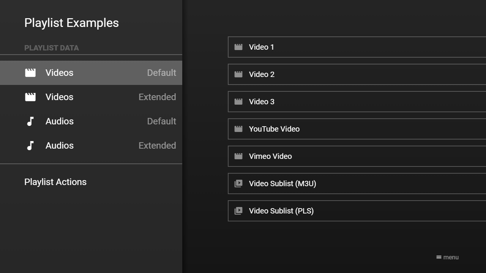

---
title: M3U/PLS Files
category: Extended API
summary: Explains how to use M3U and PLS playlist files with a special MSX backend service.
---

# M3U/PLS Files

It is possible to convert M3U/PLS files to JSON files (i.e. Media Station X content pages) with following URLs.

- M3U: `http://msx.benzac.de/services/m3u.php?headline={HEADLINE}&background={BACKGROUND}&type={TYPE}&mode={MODE}&url={URL}`
- PLS: `http://msx.benzac.de/services/pls.php?headline={HEADLINE}&background={BACKGROUND}&type={TYPE}&mode={MODE}&url={URL}`

There is also a launcher service that allows you to launch the Media Station X application directly with an M3U playlist: [https://msx.benzac.de/info/m3u.html](https://msx.benzac.de/info/m3u.html).

**Note: For HTTP Live Streaming (HLS) files (i.e. M3U8 files), please use the video/audio action (e.g. `video:http://link.to.hls.m3u8`), because these URLs are only suitable for converting simple playlist files. Please note that this is an online service. Therefore, only publicly available playlist files can be converted. Please also note that no URLs or playlist files are stored persistently on MSX servers. There is only a session-based storage for performance reasons. Please also note that for performance and storage reasons, only files up to 25 MB are permitted (larger files will be truncated). For the favorites function, a cookie-based storage is used. The cookie (and the associated favorites) will be deleted after one year of non-usage.**

## Syntax

Parameter syntax of playlist converter.

| Parameter | Type | Default Value | Mandatory | Since Version | Description |
|---|---|---|---|---|---|
| `headline` | `string` | `"Playlist"` | No | **0.1.30** | The headline of the content page. It is recommended to encode the value to ensure that it is evaluated correctly (e.g. `"My Playlist"` → `"My%20Playlist"`). |
| `background` | `string` | `null` | No | **0.1.30** | The background image of the content page. It is recommended to encode the value to ensure that it is evaluated correctly (e.g. `"http://msx.benzac.de/img/bg1.jpg"` → `"http%3A%2F%2Fmsx.benzac.de%2Fimg%2Fbg1.jpg"`). |
| `type` | `string` | `"audio"` | No | **0.1.30** | The type of the content page items.<br><br>• `"video"`: Video items.<br>• `"audio"`: Audio items.<br>• `"image"`: Image items.<br>• `"plugin"`: Plugin items. This is a special type that allows you to create playlists with plugin items. For this type, version **0.1.40** or higher is needed. The playlist items must be indicated in the syntax `{PLATFORM}:{ID}`. The `{PLATFORM}` part must be replaced with the video/audio hosting platform name (i.e. `youtube`, `vimeo`, `dailymotion`, `twitch`, `facebook`, `wistia`, or `soundcloud`). The `{ID}` part must be replaced with the corresponding platform content ID (e.g. the YouTube video ID). Please see [YouTube, Vimeo & Co.](youtube-vimeo-co.md) for more information about the plugin feature. |
| `mode` | `string` | `"default"` | No | **0.1.30** | The mode of the content page.<br><br>• `"default"`: Default mode.<br>• `"extended"`: Extended mode. This mode adds features like view selection, order selection, category selection, playlist options, resume functions, and more. It uses HTTP sessions and cookies and therefore needs the `user:` prefix for loading. For this mode, version **0.1.145** or higher is needed. |
| `context` | `string` | `"default"` | No | **0.1.30** | The context of the content page. This parameter is used internally, but can also be used to load a specific context.<br><br>• `"default"`: Default context.<br>• `"favorites"`: Favorites context. If this context is set, the favorites are loaded. The `mode` parameter will be automatically set to `"extended"`, because it is required for this context. Therefore, it also needs the `user:` prefix for loading and can only be used with version **0.1.145** or higher.<br><br>**Note: Currently, this parameter is only valid for M3U files.** |
| `url` | `string` | `null` | **Yes** | **0.1.30** | The URL of the M3U/PLS file. It is recommended to encode the value to ensure that it is evaluated correctly (e.g. `"http://msx.benzac.de/info/data/m3u/audios.m3u"` → `"http%3A%2F%2Fmsx.benzac.de%2Finfo%2Fdata%2Fm3u%2Faudios.m3u"`). |

## Example

### Screenshot



### Code

```json
{
    "headline": "Playlist Examples",
    "menu": [{
            "type": "separator",
            "label": "Playlist Data"
        }, {
            "icon": "movie",
            "label": "Videos",
            "extensionLabel": "Default",
            "data": "http://msx.benzac.de/services/m3u.php?type=video&url=http://msx.benzac.de/info/data/m3u/videos.m3u"
        }, {
            "icon": "movie",
            "label": "Videos",
            "extensionLabel": "Extended",
            "data": "user:http://msx.benzac.de/services/m3u.php?type=video&mode=extended&url=http://msx.benzac.de/info/data/m3u/videos.m3u"
        }, {
            "icon": "music-note",
            "label": "Audios",
            "extensionLabel": "Default",
            "data": "http://msx.benzac.de/services/m3u.php?type=audio&url=http://msx.benzac.de/info/data/m3u/audios.m3u"
        }, {
            "icon": "music-note",
            "label": "Audios",
            "extensionLabel": "Extended",
            "data": "user:http://msx.benzac.de/services/m3u.php?type=audio&mode=extended&url=http://msx.benzac.de/info/data/m3u/audios.m3u"
        }, {
            "type": "separator"
        }, {            
            "label": "Playlist Actions",
            "data": {  
                "template": {
                    "type": "control",
                    "layout": "0,0,12,1",
                    "color": "msx-glass"
                },
                "items": [{
                        "icon": "msx-white-soft:movie",
                        "label": "Show video playlist",
                        "action": "content:http://msx.benzac.de/services/m3u.php?type=video&url=http://msx.benzac.de/info/data/m3u/videos.m3u"
                    }, {     
                        "icon": "msx-white-soft:movie",
                        "label": "Start video playlist",
                        "action": "playlist:http://msx.benzac.de/services/m3u.php?type=video&url=http://msx.benzac.de/info/data/m3u/videos.m3u"
                    }, {
                        "icon": "msx-white-soft:music-note",
                        "label": "Show audio playlist",
                        "action": "content:http://msx.benzac.de/services/m3u.php?type=audio&url=http://msx.benzac.de/info/data/m3u/audios.m3u"
                    }, {     
                        "icon": "msx-white-soft:music-note",
                        "label": "Start audio playlist",
                        "action": "playlist:http://msx.benzac.de/services/m3u.php?type=audio&url=http://msx.benzac.de/info/data/m3u/audios.m3u"
                    }, {     
                        "icon": "msx-white-soft:image",
                        "label": "Show slideshow",
                        "action": "content:http://msx.benzac.de/services/m3u.php?type=image&url=http://msx.benzac.de/info/data/m3u/images.m3u"
                    }, {    
                        "icon": "msx-white-soft:image",
                        "label": "Start slideshow",
                        "action": "slideshow:http://msx.benzac.de/services/m3u.php?type=image&url=http://msx.benzac.de/info/data/m3u/images.m3u"
                    }]
            }
        }]
}
```

### Demo

- [Launch via App](https://msx.benzac.de/?start=menu:https://msx.benzac.de/info/data/playlist.json)
- [Launch via Demo Page](https://msx.benzac.de/info/?start=menu:https://msx.benzac.de/info/data/playlist.json)

## See also

- [Cookbook → M3U/PLS vs. MRSS](../reference/cookbook.md#m3upls-vs-mrss-two-different-playlist-import-mechanisms) — how this compares to MRSS Feeds, including the CORS and launcher-service differences
