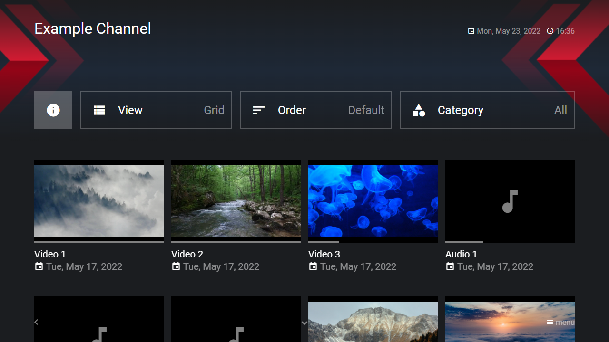

---
title: MRSS Feeds
category: Extended API
summary: Explains how to load MRSS feeds via a special MSX interaction plugin.
---

# MRSS Feeds

It is possible to load MRSS feeds via a special interaction plugin. The plugin can be used with version **0.1.146** or higher.

## Usage

The plugin must be loaded with an MRSS feed URL. Please see following action syntax example.

- `content:request:interaction:{MRSS_URL}@http://msx.benzac.de/interaction/mrss.html`

Optionally, a banner and/or background image can be set. The area of the banner is 1328x296 (WxH) pixels at layout resolution 720p (1992x444 at 1080p). The banner image is sized to fill the entire width (by keeping the ratio) and is positioned in the center. The area of the background is 1280x720 (WxH) pixels at layout resolution 720p (1920x1080 at 1080p). The background image is stretched to fill the entire size. Additionally, it is possible to set a plugin URL to customize the playback of video/audio items (e.g. to integrate ads and/or tracking). The plugin URL can contain the keywords `{URL}`, `{TYPE}`, and `{GUID}`, which are replaced with the corresponding item values. Last but not least, it is possible to set a dictionary URL to adapt the plugin user interface to the MRSS feed language. With the latest plugin version another feature was added that allows you to set a brandcolor that is used for progress and tag colors. Please see following action syntax examples.

- `content:request:interaction:{MRSS_URL}|{BANNER_URL}@http://msx.benzac.de/interaction/mrss.html`
- `content:request:interaction:{MRSS_URL}|{BANNER_URL}|{BACKGROUND_URL}@http://msx.benzac.de/interaction/mrss.html`
- `content:request:interaction:{MRSS_URL}|{BANNER_URL}|{BACKGROUND_URL}|{PLUGIN_URL}@http://msx.benzac.de/interaction/mrss.html`
- `content:request:interaction:{MRSS_URL}|{BANNER_URL}|{BACKGROUND_URL}|{PLUGIN_URL}|{DICTIONARY_URL}@http://msx.benzac.de/interaction/mrss.html`
- `content:request:interaction:{MRSS_URL}|{BANNER_URL}|{BACKGROUND_URL}|{PLUGIN_URL}|{DICTIONARY_URL}|{BRAND_COLOR}@http://msx.benzac.de/interaction/mrss.html`
- `content:request:interaction:{MRSS_URL}||{BACKGROUND_URL}@http://msx.benzac.de/interaction/mrss.html`
- `content:request:interaction:{MRSS_URL}|||{PLUGIN_URL}@http://msx.benzac.de/interaction/mrss.html`
- `content:request:interaction:{MRSS_URL}||||{DICTIONARY_URL}@http://msx.benzac.de/interaction/mrss.html`
- `content:request:interaction:{MRSS_URL}|||||{BRAND_COLOR}@http://msx.benzac.de/interaction/mrss.html`

If you would like to use the plugin as reference to implement your own plugin, please have a look at this implementation script: [http://msx.benzac.de/interaction/js/mrss.js](http://msx.benzac.de/interaction/js/mrss.js).

There is also a launcher service that allows you to launch the Media Station X application directly with an MRSS feed: [https://msx.benzac.de/info/mrss.html](https://msx.benzac.de/info/mrss.html).

## Example

Please note that this example also shows an usage example of the [Ad Plugin](../experts-api/plugins/ad-plugin.md) and [IMA Plugin](../experts-api/plugins/ima-plugin.md).

**Note: The ad plugins will only work properly if ad blockers are disabled.**

### Screenshot



### Code

```json
{
    "headline": "MRSS Examples",
    "menu": [{
            "icon": "rss-feed",
            "label": "Example Channel 1",
            "extensionLabel": "Banner 1",
            "data": "request:interaction:http://msx.benzac.de/info/data/mrss/example.xml|http://msx.benzac.de/media/banner.png|http://msx.benzac.de/media/banner_background.png@http://msx.benzac.de/interaction/mrss.html"
        }, {
            "icon": "rss-feed",
            "label": "Example Channel 2",
            "extensionLabel": "Banner 2",
            "data": "request:interaction:http://msx.benzac.de/info/data/mrss/example.xml|https://picsum.photos/1992/444#msx-shadow@http://msx.benzac.de/interaction/mrss.html"
        }, {
            "icon": "rss-feed",
            "label": "Example Channel 3",
            "extensionLabel": "Ad Plugin",
            "data": "request:interaction:http://msx.benzac.de/info/data/mrss/example.xml|||http://msx.benzac.de/plugins/ad.html?url={URL}&type={TYPE}&guid={GUID}@http://msx.benzac.de/interaction/mrss.html"
        }, {
            "icon": "rss-feed",
            "label": "Example Channel 4",
            "extensionLabel": "IMA Plugin",
            "data": "request:interaction:http://msx.benzac.de/info/data/mrss/example.xml|||http://msx.benzac.de/plugins/ima.html?url={URL}&ad=https%3A%2F%2Fpubads.g.doubleclick.net%2Fgampad%2Fads%3Fiu%3D%2F21775744923%2Fexternal%2Fsingle_ad_samples%26sz%3D640x480%26cust_params%3Dsample_ct%253Dlinear%26ciu_szs%3D300x250%252C728x90%26gdfp_req%3D1%26output%3Dvast%26unviewed_position_start%3D1%26env%3Dvp%26impl%3Ds%26correlator%3D@http://msx.benzac.de/interaction/mrss.html"
        }]
}
```

### Demo

- [Launch via App](https://msx.benzac.de/?start=menu:https://msx.benzac.de/info/data/mrss.json)
- [Launch via Demo Page](https://msx.benzac.de/info/?start=menu:https://msx.benzac.de/info/data/mrss.json)

## See Also

- [Cookbook → M3U/PLS vs. MRSS](../reference/cookbook.md#m3upls-vs-mrss-two-different-playlist-import-mechanisms) — how this compares to M3U/PLS Files, including the CORS and launcher-service differences
