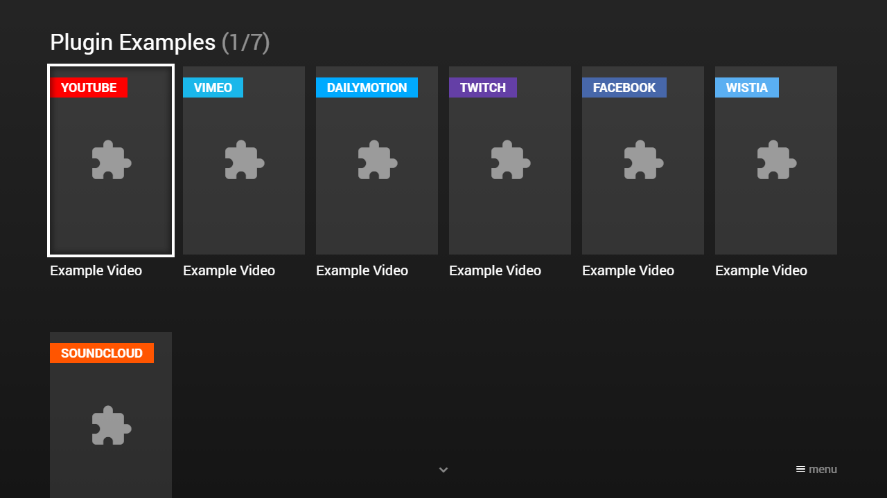

---
title: YouTube, Vimeo & Co.
category: Extended API
summary: Describes the integration of YouTube, Vimeo, and other video platforms in MSX.
---

# YouTube, Vimeo & Co.

It is possible to play YouTube, Vimeo, and similar content with the video/audio plugin actions. Currently, a plugin for **YouTube**, **Vimeo**, **Dailymotion**, **Twitch**, **Facebook**, **Wistia**, and **SoundCloud** is available. In the future, more video/audio hosting platforms could be added. There is also a JavaScript plugin API that lets you create your own video/audio plugin. If you are a developer and you would like to create your own plugin, please see [Video/Audio Plugin](../experts-api/plugins/video-audio-plugin.md).

- For more information about **YouTube**, please visit: [https://www.youtube.com](https://www.youtube.com).
- For more information about **Vimeo**, please visit: [https://vimeo.com](https://vimeo.com).
- For more information about **Dailymotion**, please visit: [https://www.dailymotion.com](https://www.dailymotion.com).
- For more information about **Twitch**, please visit: [https://www.twitch.tv](https://www.twitch.tv).
- For more information about **Facebook**, please visit: [https://www.facebook.com](https://www.facebook.com).
- For more information about **Wistia**, please visit: [https://wistia.com](https://wistia.com).
- For more information about **SoundCloud**, please visit: [https://soundcloud.com](https://soundcloud.com).

**Note: There is no guarantee that all content can be played on each platform.**

## Syntax

Action syntax of plugin actions.

| Syntax | Example | Since Version | Description |
|---|---|---|---|
| `video:plugin:{URL}` | `video:plugin:http://msx.benzac.de/plugins/youtube.html?id={ID}`<br>`video:plugin:http://msx.benzac.de/plugins/vimeo.html?id={ID}`<br>`video:plugin:http://msx.benzac.de/plugins/dailymotion.html?id={ID}`<br>`video:plugin:http://msx.benzac.de/plugins/twitch.html?id={ID}`<br>`video:plugin:http://msx.benzac.de/plugins/facebook.html?id={ID}`<br>`video:plugin:http://msx.benzac.de/plugins/wistia.html?id={ID}`<br>`video:plugin:http://msx.benzac.de/plugins/soundcloud.html?id={ID}` | **0.1.40** | Plays a plugin video. The `{ID}` part must be replaced with the corresponding platform content ID (e.g. the YouTube video ID).<br><br>**Note: Also for audio hosting platforms (e.g. SoundCloud) it makes sense to use the video plugin action, because they also provide a visual output.** |
| `audio:plugin:{URL}` | `audio:plugin:http://msx.benzac.de/plugins/youtube.html?id={ID}`<br>`audio:plugin:http://msx.benzac.de/plugins/vimeo.html?id={ID}`<br>`audio:plugin:http://msx.benzac.de/plugins/dailymotion.html?id={ID}`<br>`audio:plugin:http://msx.benzac.de/plugins/twitch.html?id={ID}`<br>`audio:plugin:http://msx.benzac.de/plugins/facebook.html?id={ID}`<br>`audio:plugin:http://msx.benzac.de/plugins/wistia.html?id={ID}`<br>`audio:plugin:http://msx.benzac.de/plugins/soundcloud.html?id={ID}` | **0.1.40** | Plays a plugin audio. The `{ID}` part must be replaced with the corresponding platform content ID (e.g. the YouTube video ID). This action works in the same way as `video:plugin:{URL}`, except that the video screen is not displayed. Instead, the background screen is displayed. If the corresponding content item provides a background property, it is used, otherwise the next available background property (at higher level) is used. |

## Example

### Screenshot



### Code

```json
{
    "type": "list",
    "headline": "Plugin Examples",
    "template": {
        "type": "separate",
        "layout": "0,0,2,4",
        "icon": "msx-white-soft:extension",
        "color": "msx-glass"
    },
    "items": [{
            "badge": "{txt:msx-white:YouTube}",
            "badgeColor": "#ff0000",
            "title": "Example Video",
            "playerLabel": "YouTube - Example Video",
            "action": "video:plugin:http://msx.benzac.de/plugins/youtube.html?id=PRy2CFVlPOA"
        }, {
            "badge": "{txt:msx-white:Vimeo}",
            "badgeColor": "#1ab7ea",
            "title": "Example Video",
            "playerLabel": "Vimeo - Example Video",
            "action": "video:plugin:http://msx.benzac.de/plugins/vimeo.html?id=54802209"
        }, {
            "badge": "{txt:msx-white:Dailymotion}",
            "badgeColor": "#00aaff",
            "title": "Example Video",
            "playerLabel": "Dailymotion - Example Video",
            "action": "video:plugin:http://msx.benzac.de/plugins/dailymotion.html?id=xz14c1"
        }, {
            "badge": "{txt:msx-white:Twitch}",
            "badgeColor": "#643fa6",
            "title": "Example Video",
            "playerLabel": "Twitch - Example Video",
            "action": "video:plugin:http://msx.benzac.de/plugins/twitch.html?id=344341752"
        }, {
            "badge": "{txt:msx-white:Facebook}",
            "badgeColor": "#4767aa",
            "title": "Example Video",
            "playerLabel": "Facebook - Example Video",
            "action": "video:plugin:http://msx.benzac.de/plugins/facebook.html?id=10152454700553553"
        }, {
            "badge": "{txt:msx-white:Wistia}",
            "badgeColor": "#5aaff2",
            "title": "Example Video",
            "playerLabel": "Wistia - Example Video",
            "action": "video:plugin:http://msx.benzac.de/plugins/wistia.html?id=ve7pzy0d3y"
        }, {
            "badge": "{txt:msx-white:SoundCloud}",
            "badgeColor": "#ff5500",
            "title": "Example Track",
            "playerLabel": "SoundCloud - Example Track",
            "action": "video:plugin:http://msx.benzac.de/plugins/soundcloud.html?id=143041228"
        }]
}
```

### Demo

- [Launch via App](https://msx.benzac.de/?start=content:https://msx.benzac.de/info/data/plugins.json)
- [Launch via Demo Page](https://msx.benzac.de/info/?start=content:https://msx.benzac.de/info/data/plugins.json)
