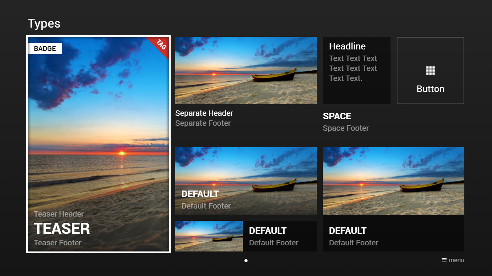
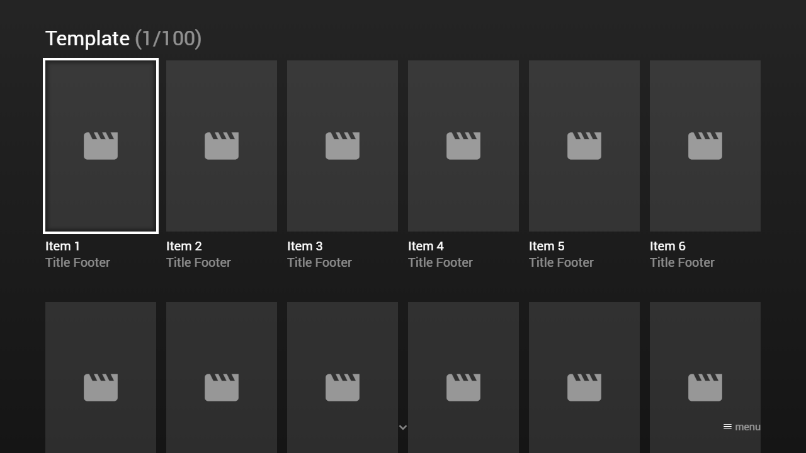

---
title: Content Examples
category: Main API - Content
summary: Two worked JSON examples of content items — non-templated (manual pages) and templated (template + items).
---

# Content Examples

## Example 1 (Non-Templated Items)

### Screenshot



### Code

```json
{
    "type": "pages",
    "headline": "Types",
    "pages": [{    
            "items": [{
                    "type": "teaser",
                    "layout": "0,0,4,6",                   
                    "badge": "Badge",                  
                    "tag": "Tag",
                    "tagColor": "msx-red",
                    "titleHeader": "Teaser Header",
                    "title": "Teaser",
                    "titleFooter": "Teaser Footer",                 
                    "image": "http://msx.benzac.de/img/test.jpg",
                    "imageFiller": "height-left"
                }, {
                    "type": "button",
                    "layout": "10,0,2,2",
                    "label": "Button",                   
                    "icon": "apps",
                    "iconSize": "small"
                }, {
                    "type": "default",
                    "layout": "4,3,4,2",
                    "titleFooter": "Default Footer",
                    "title": "Default",                   
                    "image": "http://msx.benzac.de/img/test.jpg",
                    "imageFiller": "width-center"                            
                }, {
                    "type": "default",
                    "layout": "8,3,4,3",
                    "titleFooter": "Default Footer",
                    "title": "Default",                 
                    "image": "http://msx.benzac.de/img/test.jpg",
                    "imageFiller": "width-center",
                    "imageHeight": 1.83
                }, {
                    "type": "default",
                    "layout": "4,5,4,1",
                    "titleFooter": "Default Footer",
                    "title": "Default",                  
                    "image": "http://msx.benzac.de/img/test.jpg",
                    "imageFiller": "width-center",
                    "imageWidth": 1.83
                }, {
                    "type": "space",                  
                    "layout": "8,2,4,1", 
                    "title": "Space",
                    "titleFooter": "Space Footer"                  
                }, {
                    "type": "default",                 
                    "layout": "8,0,2,2",             
                    "headline": "Headline",
                    "text": "Text Text Text Text Text Text Text Text."                                  
                }, {
                    "type": "separate",
                    "layout": "4,0,4,3",
                    "titleFooter": "Separate Footer",
                    "titleHeader": "Separate Header",                    
                    "image": "http://msx.benzac.de/img/test.jpg",                 
                    "imageFiller": "width-center"
                }]
        }]
}
```

### Demo

- [Launch via App](https://msx.benzac.de/?start=content:https://msx.benzac.de/info/data/guide/types.json)
- [Launch via Demo Page](https://msx.benzac.de/info/?start=content:https://msx.benzac.de/info/data/guide/types.json)

## Example 2 (Templated Items)

### Screenshot



### Code

```json
{
    "type": "list",
    "headline": "Template",
    "template": {
        "type": "separate",
        "layout": "0,0,2,4",
        "color": "msx-glass",
        "icon": "msx-white-soft:movie",
        "iconSize": "medium",
        "title": "Title",
        "titleFooter": "Title Footer"
    },
    "items": [{
            "title": "Item 1"
        }, {
            "title": "Item 2"
        }, {
            "title": "Item 3"
        }, {
            "title": "Item 4"
        }, {
            "title": "Item 5"
        }, {
            "title": "Item 6"
        }, {
            "title": "Item 7"
        }, {
            "title": "Item 8"
        }, {
            "title": "Item 9"
        }, {
            "title": "Item 10"
        }, {
            "title": "Item 11"
        }, {
            "title": "Item 12"
        }]
}
```

### Demo

- [Launch via App](https://msx.benzac.de/?start=content:https://msx.benzac.de/info/data/guide/template_list.json)
- [Launch via Demo Page](https://msx.benzac.de/info/?start=content:https://msx.benzac.de/info/data/guide/template_list.json)

## See also

- [Content Root Object](content-root-object.md)
- [Content Page Object](content-page-object.md)
- [Content Item Object](content-item-object.md)
- [Content Guide](content-guide.md)
