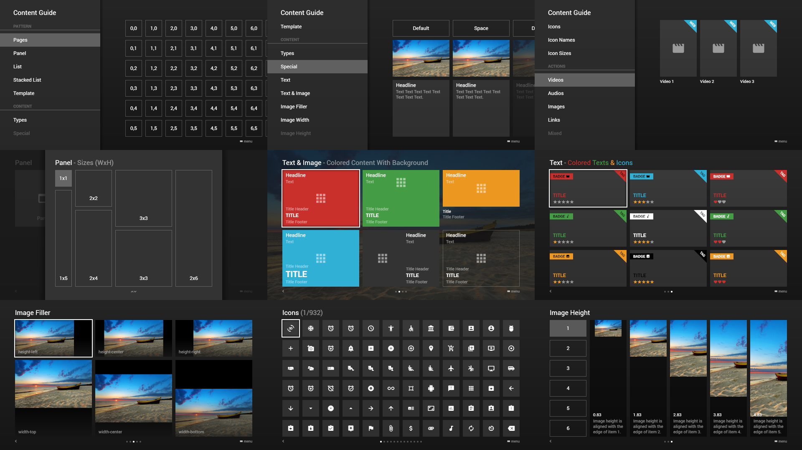
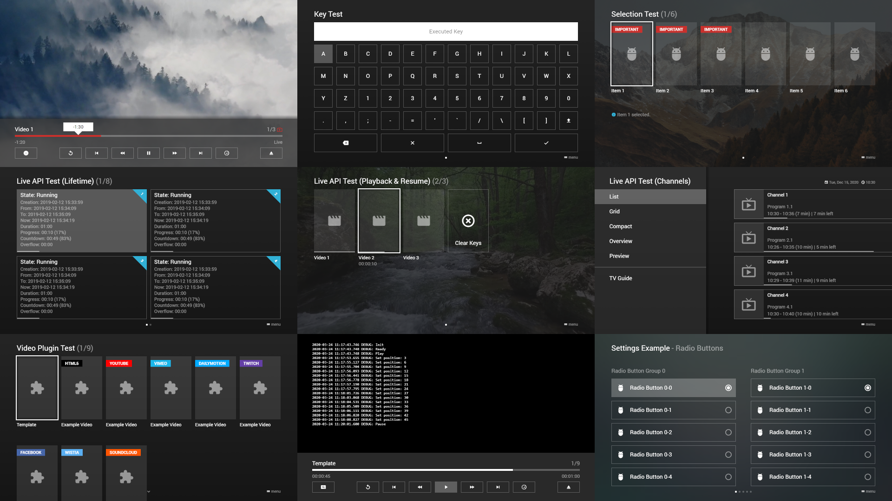

# Content Guide

The content guide contains examples of all major API properties and is available in the Media Station X application via the **Welcome Pages** or the **Settings**. Additionally, you will find all examples of the content guide on the demo page.

- [Demo Page](https://msx.benzac.de/info/?tab=Demo)

## Experts Content Guide

The experts content guide contains demos of the extended properties, the live API, the selection API, the plugin API, and more. It is designed for experts who have well experiences with the main API (i.e. the demos from the content guide). Enter the start parameter **`xp.msx.benzac.de`** to set it up.

- [Launch Demo](https://msx.benzac.de/?start=menu:https://xp.msx.benzac.de/msx/start.json)

## See Also

- [Content Root Object](content-root-object.md)
- [Content Page Object](content-page-object.md)
- [Content Item Object](content-item-object.md)
- [Content Examples](content-examples.md)
