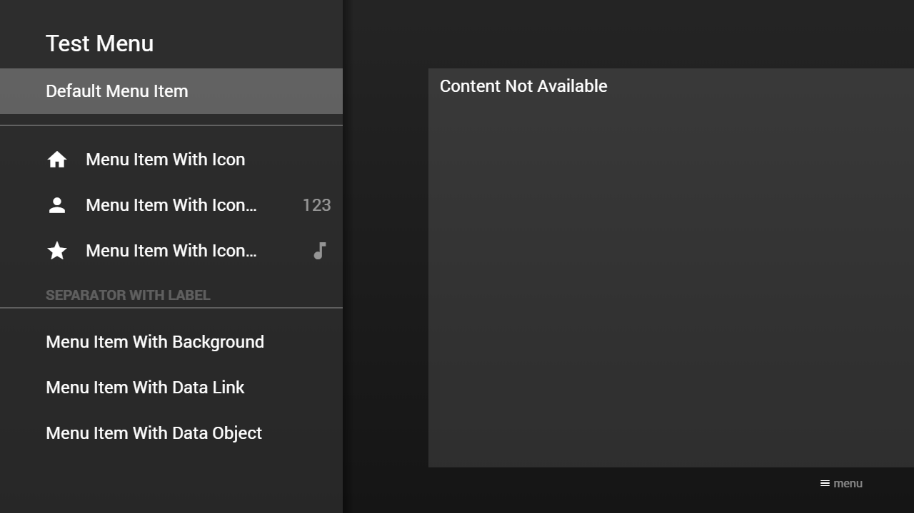
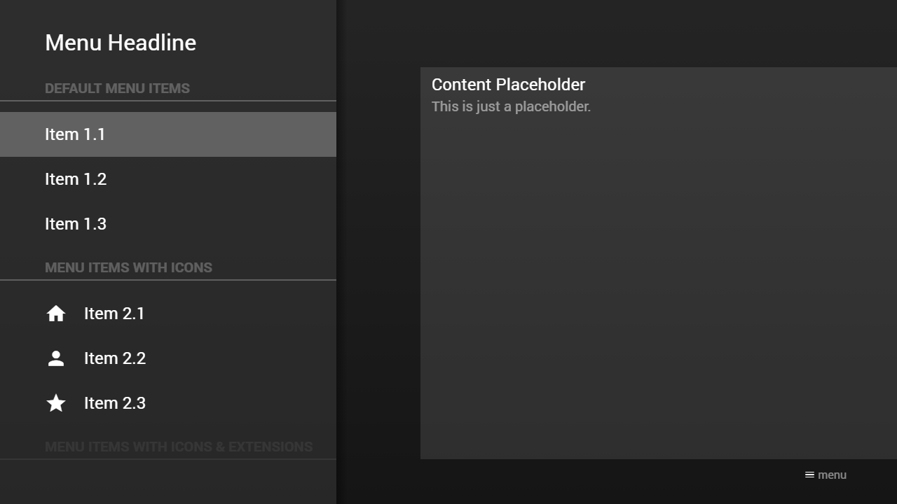
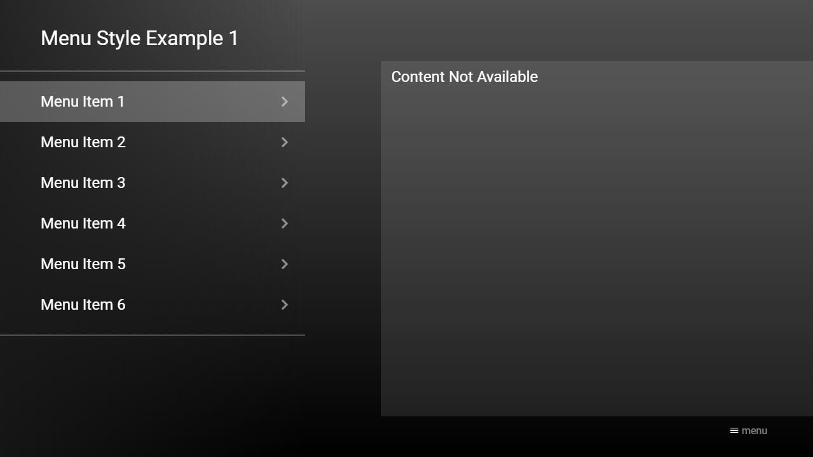
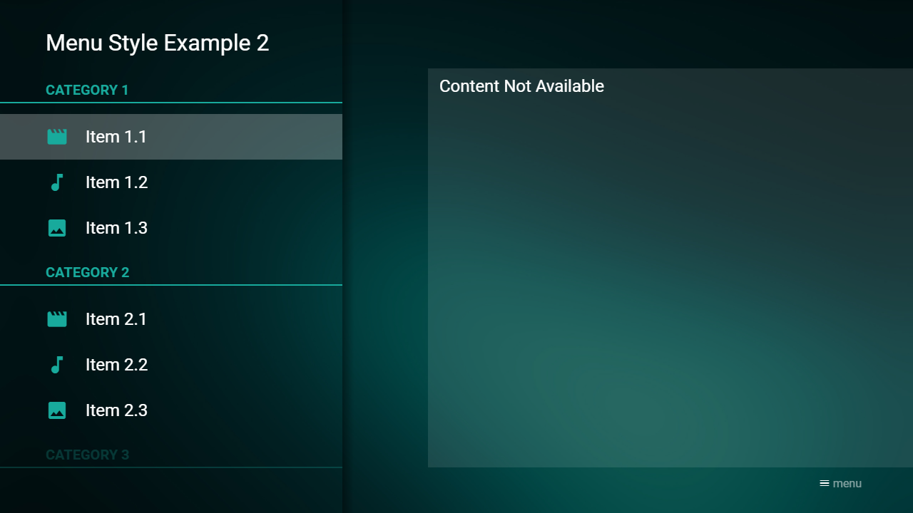

---
title: Menu Examples
category: Main API - Menu
summary: Code examples demonstrating menu configurations in MSX.
---

# Menu Examples

## Example 1

### Screenshot



### Code

```json
{
    "headline": "Test Menu",
    "menu": [{
            "label": "Default Menu Item"
        }, {
            "type": "separator"
        }, {
            "icon": "home",
            "label": "Menu Item With Icon"
        }, {
            "icon": "person",
            "label": "Menu Item With Icon & Extension Label",
            "extensionLabel": "123"
        }, {
            "icon": "star",
            "label": "Menu Item With Icon & Extension Icon",
            "extensionIcon": "music-note"
        }, {
            "type": "separator",
            "label": "Separator With Label"
        }, {            
            "label": "Menu Item With Background",
            "background": "http://msx.benzac.de/img/bg1.jpg"
        }, {            
            "label": "Menu Item With Data Link",
            "data": "http://msx.benzac.de/info/data/content_placeholder.json"
        }, {            
            "label": "Menu Item With Data Object",
            "data": {               
                "pages": [{  
                        "items": [{
                                "layout": "0,0,12,6",
                                "color": "msx-glass",
                                "headline": "Content Placeholder",
                                "text": "This is just a placeholder."
                            }]
                    }]
            }
        }]
}
```

### Demo

- [Launch via App](https://msx.benzac.de/?start=menu:https://msx.benzac.de/info/data/example_menu_1.json)
- [Launch via Demo Page](https://msx.benzac.de/info/?start=menu:https://msx.benzac.de/info/data/example_menu_1.json)

## Example 2

### Screenshot



### Code

```json
{
    "headline": "Menu Headline",
    "menu": [{
            "type": "separator",
            "label": "Default Menu Items"
        }, {
            "label": "Item 1.1",
            "data": "http://msx.benzac.de/info/data/content_placeholder.json"
        }, {
            "label": "Item 1.2",
            "data": "http://msx.benzac.de/info/data/content_placeholder.json"
        }, {
            "label": "Item 1.3",
            "data": "http://msx.benzac.de/info/data/content_placeholder.json"
        }, {
            "type": "separator",
            "label": "Menu Items With Icons"
        }, {
            "icon": "home",
            "label": "Item 2.1",
            "data": "http://msx.benzac.de/info/data/content_placeholder.json"
        }, {
            "icon": "person",
            "label": "Item 2.2",
            "data": "http://msx.benzac.de/info/data/content_placeholder.json"
        }, {
            "icon": "star",
            "label": "Item 2.3",
            "data": "http://msx.benzac.de/info/data/content_placeholder.json"
        }, {
            "type": "separator",
            "label": "Menu Items With Icons & Extensions"
        }, {
            "icon": "home",
            "label": "Item 3.1",
            "extensionLabel": "123",
            "data": "http://msx.benzac.de/info/data/content_placeholder.json"
        }, {
            "icon": "person",
            "label": "Item 3.2",
            "extensionIcon": "music-note",
            "data": "http://msx.benzac.de/info/data/content_placeholder.json"
        }, {
            "icon": "star",
            "label": "Item 3.3",
            "extensionLabel": "{ico:favorite}{ico:favorite}{ico:favorite}",
            "data": "http://msx.benzac.de/info/data/content_placeholder.json"
        }, {
            "type": "separator",
            "label": "Colored Menu Items"
        }, {
            "icon": "msx-red:home",
            "label": "{txt:msx-red:Item 4.1}",
            "extensionLabel": "{txt:msx-blue:123}",
            "data": "http://msx.benzac.de/info/data/content_placeholder.json"
        }, {
            "icon": "msx-green:person",
            "label": "{txt:msx-green:Item 4.2}",
            "extensionIcon": "msx-blue:music-note",
            "data": "http://msx.benzac.de/info/data/content_placeholder.json"
        }, {
            "icon": "msx-yellow:star",
            "label": "{txt:msx-yellow:Item 4.3}",
            "extensionLabel": "{ico:msx-blue:favorite}{ico:msx-blue:favorite}{ico:msx-blue:favorite}",
            "data": "http://msx.benzac.de/info/data/content_placeholder.json"
        }, {
            "type": "separator",            
            "label": "Menu Items With Backgrounds"
        }, {
            "label": "Item 5.1",          
            "background": "http://msx.benzac.de/img/bg1.jpg",
            "data": "http://msx.benzac.de/info/data/content_placeholder.json"
        }, {
            "label": "Item 5.2",          
            "background": "http://msx.benzac.de/img/bg2.jpg",
            "data": "http://msx.benzac.de/info/data/content_placeholder.json"
        }, {
            "label": "Item 5.3",          
            "background": "http://msx.benzac.de/img/bg3.jpg",
            "data": "http://msx.benzac.de/info/data/content_placeholder.json"
        }, {
            "type": "separator"
        }, {            
            "label": "Item 6",
            "data": {               
                "pages": [{  
                        "items": [{
                                "type": "button",
                                "icon": "list",
                                "layout": "0,0,3,3",                                            
                                "label": "Menu",
                                "action": "menu:http://msx.benzac.de/info/data/example_menu_1.json"
                            }, {
                                "type": "button",
                                "icon": "apps",
                                "layout": "3,0,3,3",                          
                                "label": "Content",
                                "action": "content:http://msx.benzac.de/info/data/content_placeholder.json"
                            }, {
                                "type": "button",
                                "icon": "web-asset",
                                "layout": "6,0,3,3",                          
                                "label": "Panel",
                                "action": "panel:http://msx.benzac.de/info/data/panel_placeholder.json"
                            }]
                    }]
            }
        }]
}
```

### Demo

- [Launch via App](https://msx.benzac.de/?start=menu:https://msx.benzac.de/info/data/example_menu_2.json)
- [Launch via Demo Page](https://msx.benzac.de/info/?start=menu:https://msx.benzac.de/info/data/example_menu_2.json)

## Example 3 (Style Example 1)

### Screenshot



### Code

```json
{
    "headline": "Menu Style Example 1",
    "style": "overlay",
    "transparent": 2,
    "menu": [{
            "type": "separator"
        }, {
            "label": "Menu Item 1",
            "extensionIcon": "keyboard-arrow-right"
        }, {
            "label": "Menu Item 2",
            "extensionIcon": "keyboard-arrow-right"
        }, {
            "label": "Menu Item 3",
            "extensionIcon": "keyboard-arrow-right"
        }, {
            "label": "Menu Item 4",
            "extensionIcon": "keyboard-arrow-right"
        }, {
            "label": "Menu Item 5",
            "extensionIcon": "keyboard-arrow-right"
        }, {
            "label": "Menu Item 6",
            "extensionIcon": "keyboard-arrow-right"
        }, {
            "type": "separator"
        }]
}
```

### Demo

- [Launch via App](https://msx.benzac.de/?start=menu:https://msx.benzac.de/info/data/example_menu_3.json)
- [Launch via Demo Page](https://msx.benzac.de/info/?start=menu:https://msx.benzac.de/info/data/example_menu_3.json)

## Example 4 (Style Example 2)

### Screenshot



### Code

```json
{
    "headline": "Menu Style Example 2",
    "style": "flat-separator",
    "transparent": 2,
    "background": "http://msx.benzac.de/media/wallpaper1.jpg",
    "menu": [{
            "type": "separator",
            "label": "{col:#18aa9c}Category 1",
            "lineColor": "#18aa9c"
        }, {
            "icon": "#18aa9c:movie",
            "label": "Item 1.1"
        }, {
            "icon": "#18aa9c:music-note",
            "label": "Item 1.2"
        }, {
            "icon": "#18aa9c:image",
            "label": "Item 1.3"
        }, {
            "type": "separator",
            "label": "{col:#18aa9c}Category 2",
            "lineColor": "#18aa9c"
        }, {
            "icon": "#18aa9c:movie",
            "label": "Item 2.1"
        }, {
            "icon": "#18aa9c:music-note",
            "label": "Item 2.2"
        }, {
            "icon": "#18aa9c:image",
            "label": "Item 2.3"
        }, {
            "type": "separator",
            "label": "{col:#18aa9c}Category 3",
            "lineColor": "#18aa9c"
        }, {
            "icon": "#18aa9c:movie",
            "label": "Item 3.1"
        }, {
            "icon": "#18aa9c:music-note",
            "label": "Item 3.2"
        }, {
            "icon": "#18aa9c:image",
            "label": "Item 3.3"
        }]
}
```

### Demo

- [Launch via App](https://msx.benzac.de/?start=menu:https://msx.benzac.de/info/data/example_menu_4.json)
- [Launch via Demo Page](https://msx.benzac.de/info/?start=menu:https://msx.benzac.de/info/data/example_menu_4.json)

## See Also

- [Menu Root Object](menu-root-object.md)
- [Menu Item Object](menu-item-object.md)
