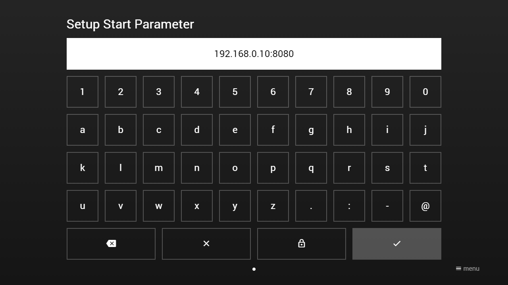
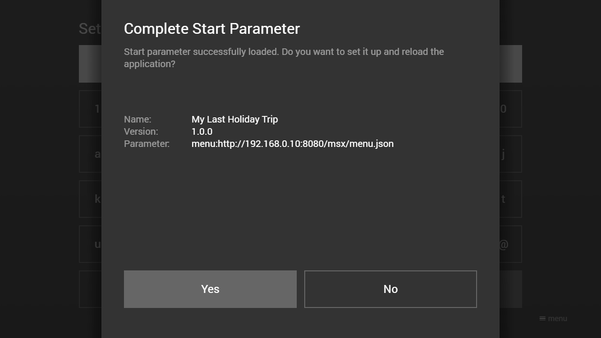
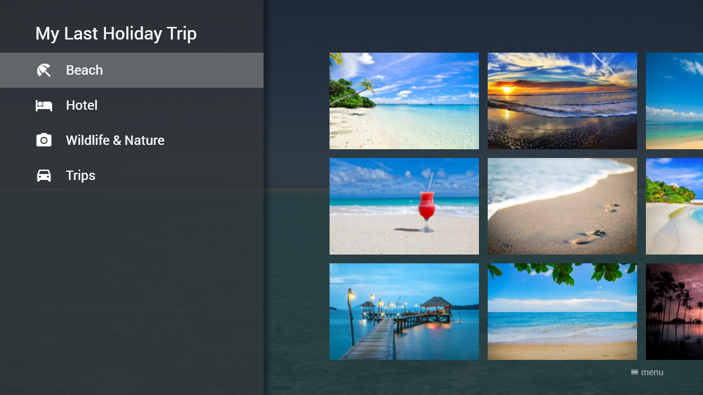

# Setup Start Parameter

Create a JSON file with the [Start Object](./start-object.md) and host it under URL `http://{SERVER}/msx/start.json`. The `{SERVER}` part is entered via the Media Station X application as hostname or IP address.

**Note: Since version 0.1.88, you can also load the start parameter via HTTPS (i.e. `https://{SERVER}/msx/start.json`) by setting the security lock during setup. Please note that the security lock is only applied to the start parameter file, for the other JSON files, you must always indicate full URLs that have to start with the protocol (i.e. `http://` or `https://`). Please also note that if the Media Station X application is loaded via HTTPS (i.e. [https://msx.benzac.de](https://msx.benzac.de)), the security lock must always be set and all JSON files and plugins must be provided via HTTPS (the application will automatically update the protocol from `http://` to `https://` for these URLs). In a secure context, it is also recommended to provide all media content (i.e. videos, audios, and images) via HTTPS to avoid mixed content issues (the application will not update the protocol for these URLs). Since version 0.1.140, you can adjust the protocol update settings with a URL parameter. Please see the `secure` parameter from the [URL Parameters](../../experts-api/special/url-parameters.md).**

If the JSON file is hosted, please go to your corresponding application store, install and launch the **Media Station X** application, navigate to **Settings** → **Start Parameter** → **Setup**, and follow the setup instructions. Once you have completed the start parameter setup, your content is loaded every time you start the application.

For corresponding application stores, please visit: [https://msx.benzac.de/info/?tab=PlatformSupport](https://msx.benzac.de/info/?tab=PlatformSupport).

## Example Screenshot (Setup Start Parameter)

*For this example screenshot, the requested URL is `http://192.168.0.10:8080/msx/start.json`.*

## Example Screenshot (Complete Start Parameter)

*After the start parameter has been successfully loaded, you can set it up. For this example screenshot, the start parameter is a menu with URL `http://192.168.0.10:8080/msx/menu.json`.*

## Example Screenshot (Configured Start Parameter)

*After the start parameter has been set up, your content is loaded every time you start the application. If your content can not be loaded, you will get an error message at startup. You can change or reset the start parameter at any time via the settings.*

## Content Examples

*Some example screenshots of how you can customize your content.*

## URL Shortener Services

If you would like to host the [Start Object](./start-object.md) under a specific path (e.g. `http://example.com/path/to/start/object`) or you need a specific query (e.g. `http://example.com/msx/start.php?key1=value1&key2=value2`), you can use a URL shortener service and the special start parameter ID syntax `id:{SERVICE_ID}:{ALIAS}` (e.g. `id:bly:example`) to set it up. This feature can be used with version **0.1.97** or higher. Currently, following free URL shortener services are supported.

| Service | Link | ID | Shortened URL Example | Start Parameter Example | Remarks |
|---|---|---|---|---|---|
| Bitly | [https://bitly.com](https://bitly.com) | `bly` | [https://bit.ly/example](https://bit.ly/example) | `id:bly:example` | This service only supports auto-generated aliases. |
| Cuttly | [https://cutt.ly](https://cutt.ly) | `cly` | [https://cutt.ly/example](https://cutt.ly/example) | `id:cly:example` | This service only supports auto-generated aliases. |
| T.LY | [https://t.ly](https://t.ly) | `tly` | [https://t.ly/example](https://t.ly/example) | `id:tly:example` | This service only supports auto-generated aliases. |
| Rebrandly | [https://www.rebrandly.com](https://www.rebrandly.com) | `rly` | [https://rb.gy/example](https://rb.gy/example) | `id:rly:example` | This service only supports auto-generated aliases. |
| is.gd | [https://is.gd](https://is.gd) | `igd` | [https://is.gd/example](https://is.gd/example) | `id:igd:example` | This service supports auto-generated and custom aliases. |
| v.gd | [https://v.gd](https://v.gd) | `vgd` | [https://v.gd/example](https://v.gd/example) | `id:vgd:example` | This service supports auto-generated and custom aliases. |
| TinyURL | [https://tinyurl.com](https://tinyurl.com) | `trl` `tny` `rtf` | [https://tinyurl.com/example](https://tinyurl.com/example) [https://tiny.io/example](https://tiny.io/example) [https://rotf.lol/example](https://rotf.lol/example) | `id:trl:example` `id:tny:example` `id:rtf:example` | This service supports auto-generated and custom aliases. |
| PHP-Redirect | n/a | `php` | n/a | `id:php:example.com` | This service is not a URL shortener, but a simple PHP redirect service. It can be used to load the [Start Object](./start-object.md) from a PHP instead of a JSON file (e.g. `id:php:example.com` → `http://example.com/msx/start.php`). |

**Note: Please note that no URLs are stored or cached on MSX servers. Each URL is stored exclusively on the used service. It is recommended to read the privacy policy of the used service before registering URLs. Please also note that the start parameter input only supports numbers (`0` to `9`) and lowercase letters (`a` to `z`). If the alias contains uppercase letters (`A` to `Z`), you have to put a dash (`-`) before each uppercase letter (e.g. `eXaMpLe` → `e-xa-mp-le`). Please also note that if the security lock is set during setup, the protocol from the registered URL is automatically updated from `http://` to `https://`.**

It is also possible to register URLs that contain the `start` URL parameter (please see [URL Parameters](../../experts-api/special/url-parameters.md)). In these cases, the `start` URL parameter is extracted and used as start parameter (e.g. `http://msx.benzac.de/?start=menu:user:http://sc.msx.benzac.de/msx/service.php` → `menu:user:http://sc.msx.benzac.de/msx/service.php`). This feature allows you to create short URLs that are launchable (via browser) and registerable (via application). Please see following examples.

- SoundCloud MSX: [https://bit.ly/3Oys4Xx](https://bit.ly/3Oys4Xx) (`id:bly:3-oys4-xx`)
- Experts Content Guide: [https://bit.ly/3b5000l](https://bit.ly/3b5000l) (`id:bly:3b5000l`)
- MRSS Example Channel: [https://bit.ly/3zzxOvK](https://bit.ly/3zzxOvK) (`id:bly:3zzx-ov-k`)

If the `start` URL parameter is set, you can also set an `alias` URL parameter, which is then displayed when setting up the start parameter (e.g. `http://msx.benzac.de/?start=menu:user:http://sc.msx.benzac.de/msx/service.php&alias=SoundCloud%20MSX` → `SoundCloud MSX`). Otherwise, the used service with the entered alias is displayed (e.g. `Bitly MSX | 3-oys4-xx`).

The special start parameter ID syntax is also supported by the **Launcher MSX** service. For this service, you can (if the `start` URL parameter is set) set additional URL parameters (`type`, `icon`, `image`, and `color`) that are also extracted and used as launcher properties. Please see [Tips & Tricks — Launcher MSX](../../overview/tips-tricks.md#launcher-msx) for more information.

## See Also

- [Start Object](./start-object.md)
- [Setup Precondition](./setup-precondition.md)
- [In-App Settings Reference → Other Settings-scene entries](../../reference/settings-reference.md#5-other-settings-scene-entries-and-safety-mechanisms) — the `settings:start` panel that runs this setup from inside the app
