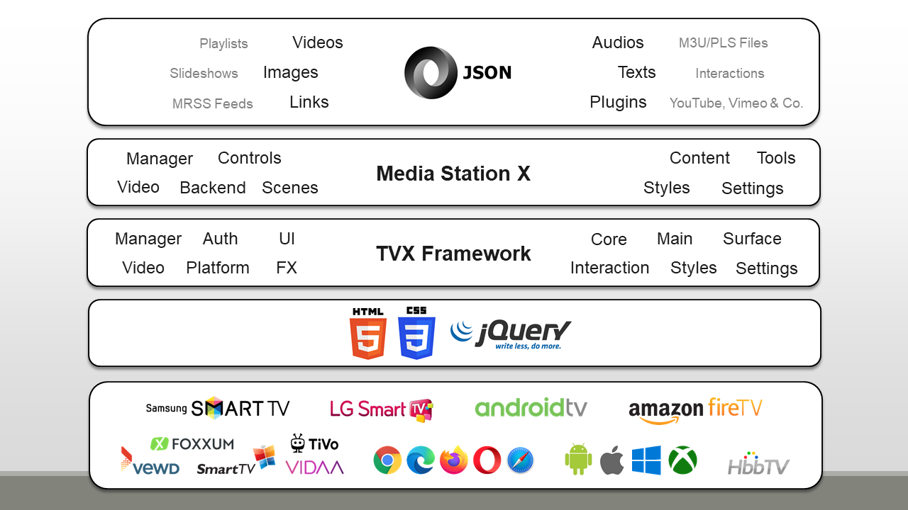

# About

My name is Benjamin Zachey and I have been developing web applications for TV and embedded devices for over 15 years. Starting with the first CE-HTML models from Philips (2008) to the first HbbTV specification draft (2009) up to the current smart TV devices. I have constantly followed and applied the media development and have implemented many prototypes in various projects and teams. Media Station X was started in 2017 as side project to my regular activities. The main goal was to distribute a freely available and highly configurable launcher to test different videos/audios and other web applications on different TV platforms. Now it has become a powerful application with many features and use cases. I hope you enjoy using it and I would be very happy to receive feedback and suggestions for improvement.

### Technology Stack

Media Station X is built on the TVX Framework that has been developed for this application. The TVX Framework is a composition of tools and services to build high-performance and high-compatible TV (and mobile-usable) applications. It is based on plain HTML5 and CSS3, uses jQuery as its core library, and handles all platform-specific implementations. It has been tested on all major TV platforms with excellent stability and compatibility.

### Release History

| Date | Version | Description |
|------|---------|-------------|
| Dec 18, 2017 | 0.1.0 | First version online on the web. |
| Jan 5, 2018 | 0.1.5 | First version online in the Google Play Store. |
| Jan 8, 2018 | 0.1.6 | First version online in the Amazon App Store. |
| Apr 10, 2018 | 0.1.36 | First version online in the Apple App Store (for iOS devices). |
| Apr 24, 2018 | 0.1.37 | First version online in the Samsung Smart Hub (for 2015+ models). |
| May 29, 2018 | 0.1.42 | First version online in the LG Content Store (for 2014+ models). |
| Sep 9, 2018 | 0.1.43 | First version online in the Samsung Smart Hub (for 2014 models). |
| Jan 11, 2019 | 0.1.68 | First version online in the Vewd App Store. |
| Jan 24, 2019 | 0.1.70 | First version online in the TP Vision App Gallery. |
| Jun 4, 2020 | 0.1.113 | First version online in the Microsoft Store. |
| Sep 5, 2020 | 0.1.117 | First version online in the Apple App Store (for macOS devices). |
| Jun 8, 2021 | 0.1.136 | First version online in the LG Content Store (for 2011-2014 models). |
| Oct 25, 2021 | 0.1.141 | First version online in the Foxxum App Store. |
| May 12, 2022 | 0.1.145 | First version online in the VIDAA App Store. |
| May 8, 2026 | 0.1.166 | Latest version released in stores. |

## See also

- [In-App Settings Reference → Other Settings-scene entries](../reference/settings-reference.md#5-other-settings-scene-entries-and-safety-mechanisms) — `settings:about` is a separate, in-app content/session info panel, not this page
