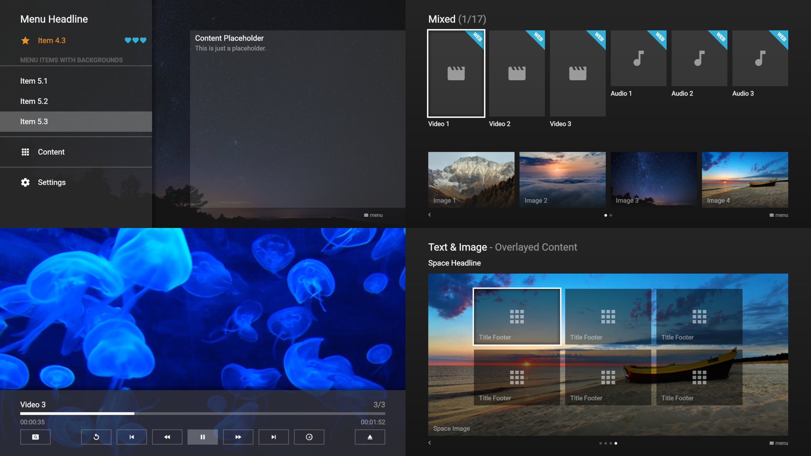
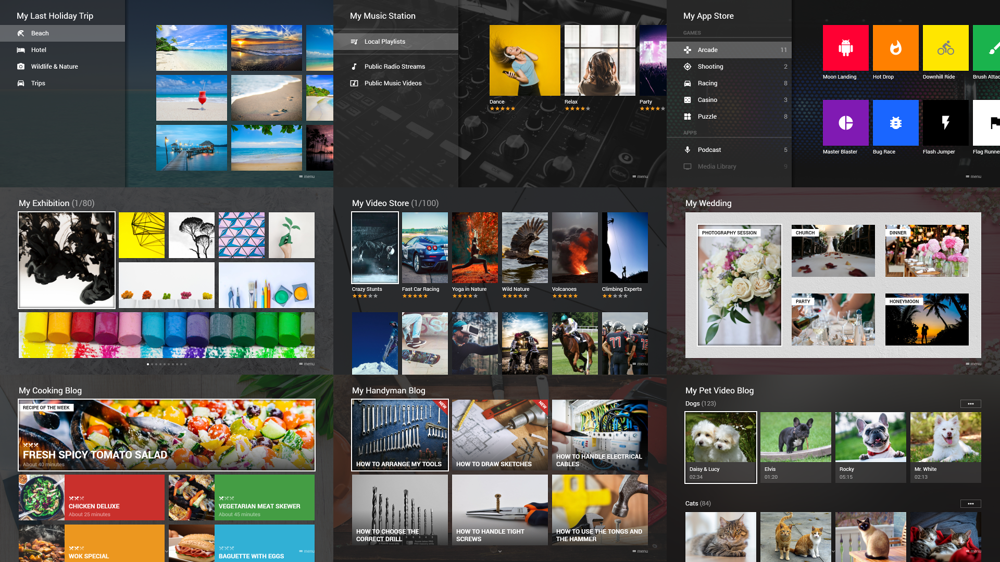
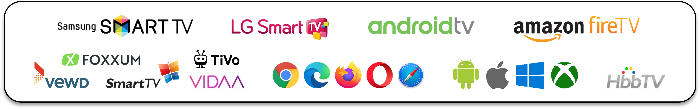

# Media Station X - Home

Media Station X is designed to run on any TV device (e.g. smart TVs, set-top boxes, HDMI dongles, and HbbTV devices). However, it can also run on mobile and desktop devices, because it supports various input controls (e.g. remote controls, keyboards, mice, pointer and touch devices). The application itself does not contain any content and is a so-called **White Label Application**. You can either create your own content or open existing and shared content from other people. All content is written in **JSON** (JavaScript Object Notation) format with a simple and easy-to-use structure. The created JSON files can be hosted on any HTTP server that supports **CORS** (Cross-Origin Resource Sharing).

---

## Use Cases

Enjoy videos, audios, and images on your TV, mobile, or desktop device in the same look & feel...

- ...from your local or public HTTP server.
- ...from your NAS (Network Attached Storage) server or device that supports web server functionality.
- ...from your cloud storage service (Google Drive, OneDrive & Co.).
- ...from any HTTP server that provides access to shared content.

Create your own...

- ...video store with local or public videos.
- ...music station with local or public audios.
- ...slideshow with local or public images.
- ...app store with links to existing HTML5 games or apps.
- ...developer portal with links to your created HTML5 games or apps.
- ...media blog with videos from different video hosting platforms (YouTube, Vimeo & Co.).

---

## Screenshots

---

## API

### Wiki

The wiki pages contain all information about the various JSON structures with examples and screenshots as well as descriptions and source code examples of the different plugin possibilities.

See: [Wiki](https://msx.benzac.de/wiki/)

### Demo

The demo page contains various JSON examples that you can load, edit, and test directly in your browser.

See: [Demo](https://msx.benzac.de/info/?tab=Demo)

### Quick Start Guide

The quick start guide shows how you can setup a local Media Station X server with example content.

See: [Quick Start Guide](quick-start-guide.md)

---

## Showcases

The showcases show turnkey services that you can use right away. They have been primarily developed to show examples of how Media Station X can be used.

See: [Showcases](showcases.md)

---

## Platform Support

Media Station X is available on all major TV platforms (including **Samsung TVs**, **LG TVs**, **Android TVs**, and **Fire TVs**). Additionally, an application for **Android** tablets/phones, **iPads/iPhones**, **Mac** devices, **Windows** desktops/tablets/phones, and **Xboxes** is available. Please see **Platform Support** for corresponding application stores.

See: [Platform Support](platform-support.md)