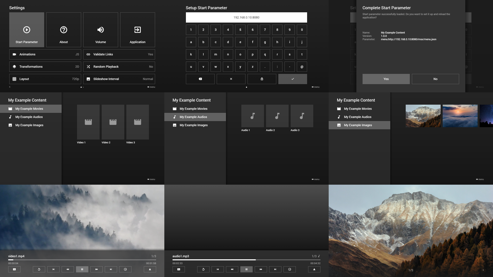

# Quick Start Guide

#### Introduction

This is a quick start guide to setup a local Media Station X server with example content by using **Node.js** and the **http-server** package.

Alternatively, if you have Media Station X **0.1.123** or higher, please see the showcase **Node Browser MSX**. This showcase is based on the same technology, but simplifies and speeds up the setup process.

See: [Node Browser MSX](showcases.md#node-browser-msx)

#### 1) Setup HTTP Server

- Download and install **Node.js**: [https://nodejs.org](https://nodejs.org).
- Install the **http-server** package (via npm): [https://www.npmjs.com/package/http-server](https://www.npmjs.com/package/http-server).
- Create the folder **http-server** on your local machine (e.g. `c:\http-server`).
- Create the subfolder **msx** in this folder (e.g. `c:\http-server\msx`).

#### 2) Create Example Start Parameter

- Create the following **start.json** file in the **msx** folder (e.g. `c:\http-server\msx\start.json`).

```json
{
    "name": "My Example Content",
    "version": "1.0.0",
    "parameter": "menu:http://{SERVER}/msx/menu.json"
}
```

**Note: Since version `0.1.65`, the `{SERVER}` part is automatically replaced with the entered server. If you use an older version of Media Station X, you will need to do this manually. Please note that the auto-replacement feature only works for the start parameter file, for the other JSON files, you must always indicate full URLs (to avoid errors in cross-references). Since version `0.1.97`, you can also indicate a `{PREFIX}` to automatically replace the used prefix (i.e. `http://` or `https://`) (e.g. `"menu:{PREFIX}{SERVER}/msx/menu.json"` → `"menu:http://192.168.0.10:8080/msx/menu.json"`).**

#### 3) Create Example Menu

- Create the following **menu.json** file in the **msx** folder (e.g. `c:\http-server\msx\menu.json`).

```json
{
    "headline": "My Example Content",
    "menu": [{
            "icon": "movie",
            "label": "My Example Movies",
            "data": {
                "type": "pages",               
                "template": {                  
                    "type": "separate",
                    "layout": "0,0,2,4",
                    "icon": "msx-white-soft:movie",
                    "color": "msx-glass"                    
                },
                "items": [{
                        "title": "Video 1",                        
                        "action": "video:http://msx.benzac.de/media/video1.mp4"
                    }, {
                        "title": "Video 2",                       
                        "action": "video:http://msx.benzac.de/media/video2.mp4"
                    }, {
                        "title": "Video 3",                       
                        "action": "video:http://msx.benzac.de/media/video3.mp4"
                    }]
            }
        }, {
            "icon": "music-note",
            "label": "My Example Audios",
            "data": {
                "type": "pages",
                "template": {                   
                    "type": "separate",
                    "layout": "0,0,2,3",
                    "icon": "msx-white-soft:music-note",
                    "color": "msx-glass"
                },
                "items": [{
                        "title": "Audio 1",
                        "action": "audio:http://msx.benzac.de/media/audio1.mp3"
                    }, {
                        "title": "Audio 2",                          
                        "action": "audio:http://msx.benzac.de/media/audio2.mp3"
                    }, {
                        "title": "Audio 3",
                        "action": "audio:http://msx.benzac.de/media/audio3.mp3"
                    }]
            }
        }, {
            "icon": "image",
            "label": "My Example Images",
            "data": {
                "type": "pages",
                "template": {
                    "type": "default",
                    "layout": "0,0,3,2",
                    "color": "msx-glass",
                    "imageFiller": "cover",
                    "action": "image:context"
                },
                "items": [{
                        "image": "http://msx.benzac.de/img/bg1.jpg"                      
                    }, {
                        "image": "http://msx.benzac.de/img/bg2.jpg"                       
                    }, {
                        "image": "http://msx.benzac.de/img/bg3.jpg"                       
                    }]
            }
        }]
}
```

#### 4) Start HTTP Server

- Open a command-line interface (e.g. Windows PowerShell).
- Navigate to the folder **http-server** (e.g. `cd c:\http-server`).
- Enter `http-server --cors` to start the server.
- Note the displayed **IP address and port** (e.g. `192.168.0.10:8080`).

```text
PS C:\> cd c:\http-server
PS C:\http-server> http-server --cors
Starting up http-server, serving ./
Available on:
  http://192.168.0.10:8080
  http://127.0.0.1:8080
Hit CTRL-C to stop the server
```

#### 5) Setup Start Parameter

- Install and launch the **Media Station X** application.
- Navigate to **Settings → Start Parameter → Setup**.
- Enter the noted **IP address and port** (e.g. `192.168.0.10:8080`).
- Complete the setup.
- Browse and enjoy your content.



**Note: Please make sure the device running the Media Station X application and your local machine are connected to the same network. Additionally, please make sure that your local machine has not configured a firewall that blocks incoming connections on the used port.**
