# Showcases

### **SoundCloud® MSX**

SoundCloud® MSX is a service that provides basic access to **SoundCloud®** tracks via the Media Station X application. It uses the **SoundCloud® Developer APIs** to browse charts, search content, and play tracks. It has been primarily developed to show an example of how Media Station X lets you create nice and powerful TV UIs from existing media hosting platforms.

- For more information about **SoundCloud®**, please visit: [https://soundcloud.com](https://soundcloud.com).
- For more information about the **SoundCloud® Developer APIs**, please visit: [https://developers.soundcloud.com](https://developers.soundcloud.com).

For this service, Media Station X **0.1.97** or higher is needed. Enter the start parameter **`sc.msx.benzac.de`** to set it up.

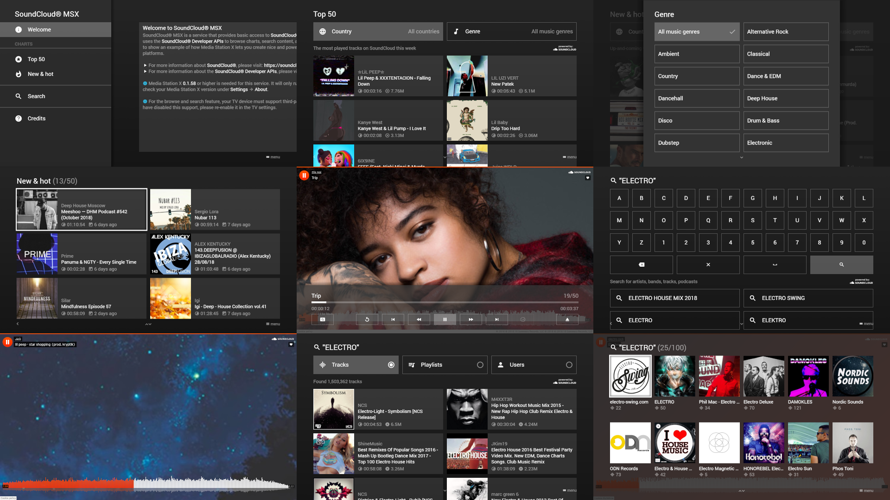

- [Show Video](https://www.youtube.com/watch?v=FEmDx1XiusE)
- [Launch Demo](https://msx.benzac.de/?start=menu:https://sc.msx.benzac.de/msx/service.php)

---

### **Google Drive MSX**

Google Drive MSX is a service that provides access to your **Google Drive** files (i.e. videos, audios, and images) via the Media Station X application. It uses the **Google OAuth 2.0** protocol for authorization and the **Google Drive API** to browse and access files. It has been primarily developed to show an example of how Media Station X can be used with existing cloud storage services.

- For more information about **Google Drive**, please visit: [https://www.google.com/drive/](https://www.google.com/drive/).
- For more information about the **Google OAuth 2.0** protocol, please see **Data Privacy** on: [https://gd.msx.benzac.de?tab=DataPrivacy](https://gd.msx.benzac.de?tab=DataPrivacy).
- For more information about the **Google Drive API**, please visit: [https://developers.google.com/drive/](https://developers.google.com/drive/).

For this service, Media Station X **0.1.130** or higher is needed. Enter the start parameter **`gd.msx.benzac.de`** to set it up.

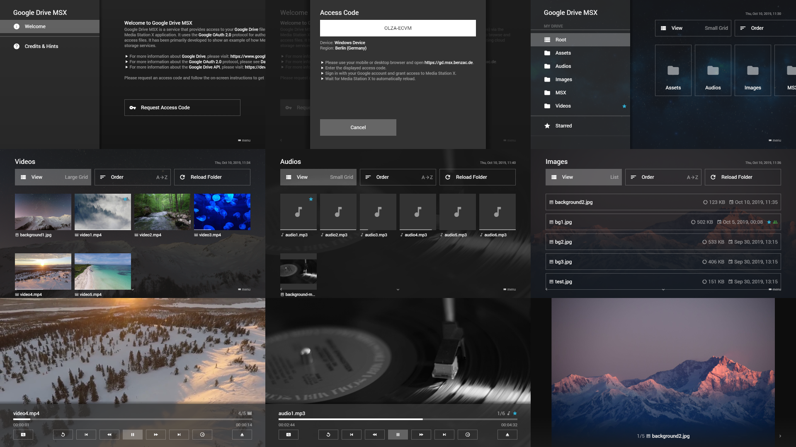

- [Show Video](https://www.youtube.com/watch?v=iLJUYM-foY8)
- [Launch Demo](https://msx.benzac.de/?start=menu:request:interaction:init@https://gd.msx.benzac.de/interaction)

---

### **OneDrive MSX**

OneDrive MSX is a service that provides access to your **OneDrive** files (i.e. videos, audios, and images) via the Media Station X application. It uses the **Microsoft OAuth 2.0** protocol for authorization and the **Microsoft Graph API** and **OneDrive API** to browse and access files. It has been primarily developed to show an example of how Media Station X can be used with existing cloud storage services.

- For more information about **OneDrive**, please visit: [https://onedrive.live.com](https://onedrive.live.com).
- For more information about the **Microsoft OAuth 2.0** protocol, please see **Data Privacy** on: [https://od.msx.benzac.de?tab=DataPrivacy](https://od.msx.benzac.de?tab=DataPrivacy).
- For more information about the **Microsoft Graph API**, please visit: [https://docs.microsoft.com/en-us/graph/](https://docs.microsoft.com/en-us/graph/).
- For more information about the **OneDrive API**, please visit: [https://docs.microsoft.com/en-us/onedrive/developer/](https://docs.microsoft.com/en-us/onedrive/developer/).

For this service, Media Station X **0.1.130** or higher is needed. Enter the start parameter **`od.msx.benzac.de`** to set it up.

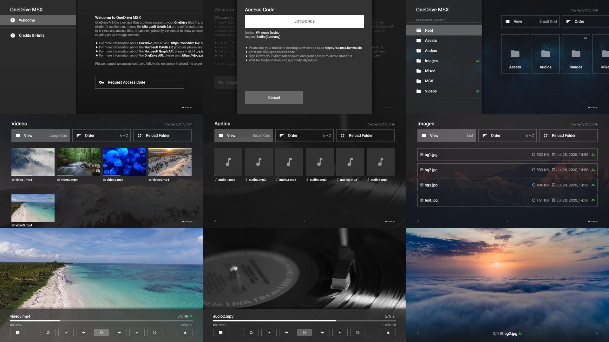

- [Show Video](https://www.youtube.com/watch?v=DOQd7UMVWMg)
- [Launch Demo](https://msx.benzac.de/?start=menu:request:interaction:init@https://od.msx.benzac.de/interaction)

---

### **Dropbox MSX**

Dropbox MSX is a service that provides access to your **Dropbox** files (i.e. videos, audios, and images) via the Media Station X application. It uses the **Dropbox OAuth 2.0** protocol for authorization and the **Dropbox API** to browse and access files. It has been primarily developed to show an example of how Media Station X can be used with existing cloud storage services.

- For more information about **Dropbox**, please visit: [https://www.dropbox.com](https://www.dropbox.com).
- For more information about the **Dropbox OAuth 2.0** protocol, please see **Data Privacy** on: [https://db.msx.benzac.de?tab=DataPrivacy](https://db.msx.benzac.de?tab=DataPrivacy).
- For more information about the **Dropbox API**, please visit: [https://www.dropbox.com/developers/](https://www.dropbox.com/developers/).

For this service, Media Station X **0.1.130** or higher is needed. Enter the start parameter **`db.msx.benzac.de`** to set it up.

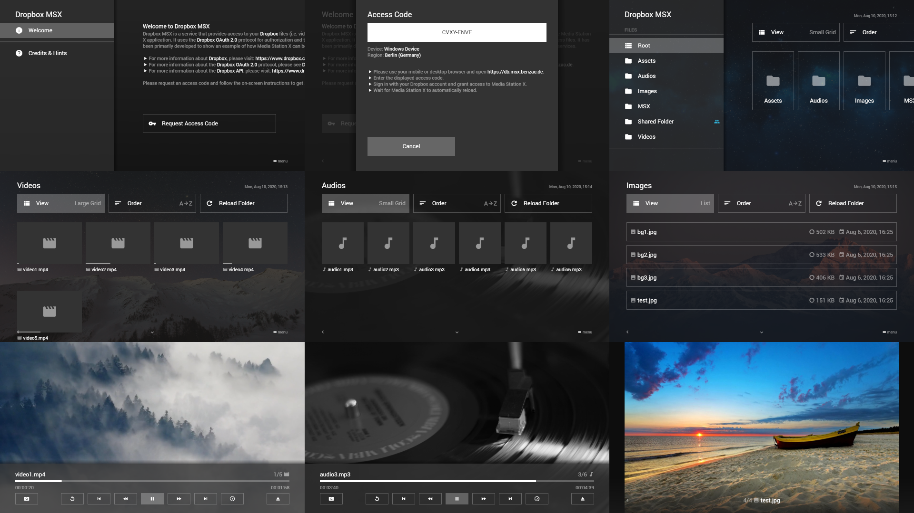

- [Show Video](https://www.youtube.com/watch?v=8T5XjKig6Jw)
- [Launch Demo](https://msx.benzac.de/?start=menu:request:interaction:init@https://db.msx.benzac.de/interaction)

---

### **Node Browser MSX**

Node Browser MSX is a service that provides access to your local **Node.js** server files (i.e. videos, audios, and images) via the Media Station X application. It uses the directory listing function of the **http-server** package to browse and access files. It has been primarily developed to show an example of how Media Station X can be used with simple HTTP servers.

- For more information about **Node.js**, please visit: [https://nodejs.org](https://nodejs.org).
- For more information about the **http-server** package, please visit: [https://www.npmjs.com/package/http-server](https://www.npmjs.com/package/http-server).

For this service, Media Station X **0.1.130** or higher is needed. Enter the start parameter **`nb.msx.benzac.de`** to set it up.

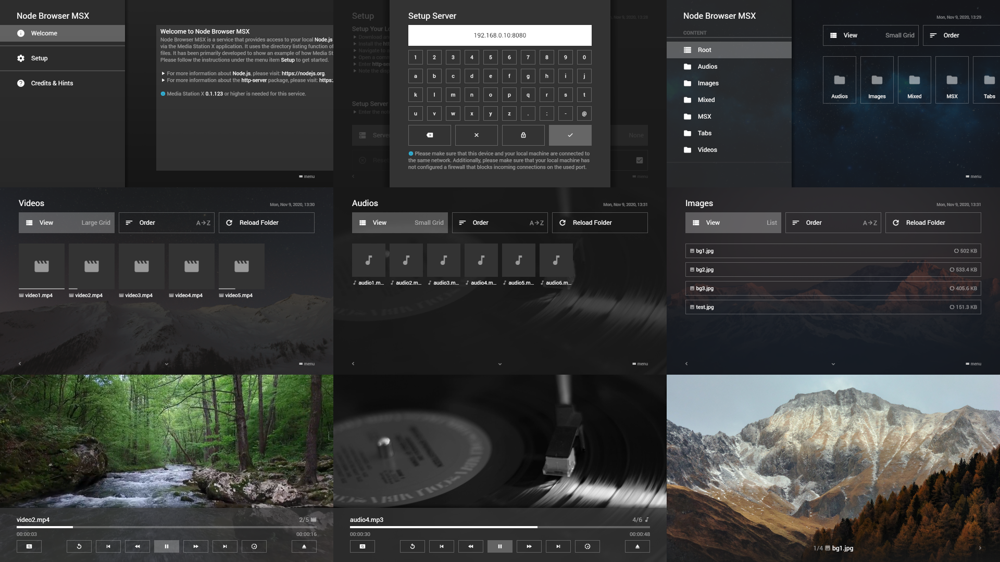

- [Show Video](https://www.youtube.com/watch?v=61CFhMvAbFU)
- [Launch Demo](https://msx.benzac.de/?start=menu:request:interaction:init@https://nb.msx.benzac.de/interaction)

---

### **THE MOVIE DB MSX**

THE MOVIE DB MSX is a service that provides access to **The Movie Database (TMDb)** content via the Media Station X application. It uses the **The Movie Database API** to browse movies and their related information (e.g. description, actors, images, videos, etc.). It has been primarily developed to show an example of how Media Station X can be used to create a full-featured movie library.

- For more information about **The Movie Database (TMDb)**, please visit: [https://www.themoviedb.org](https://www.themoviedb.org).
- For more information about the **The Movie Database API**, please visit: [https://www.themoviedb.org/documentation/api](https://www.themoviedb.org/documentation/api).

For this service, Media Station X **0.1.97** or higher is needed. Enter the start parameter **`tmdb.msx.benzac.de`** to set it up.

Please note that this service uses the TMDb API but is not endorsed or certified by TMDb.

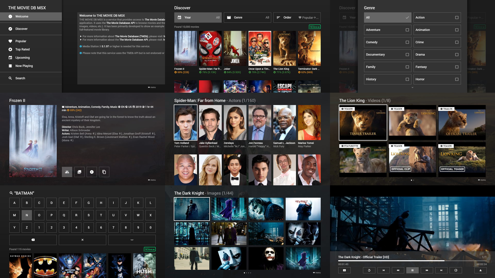

- [Launch Demo](https://msx.benzac.de/?start=menu:https://tmdb.msx.benzac.de/msx/service.php)

---

### **Twitch MSX**

Twitch MSX is a service that provides basic access to **Twitch** content via the Media Station X application. It uses the **Twitch Developer APIs** to browse categories and play channels and videos. It has been primarily developed to show an example of how Media Station X lets you create nice and powerful TV UIs from existing media hosting platforms.

- For more information about **Twitch**, please visit: [https://twitch.tv](https://twitch.tv).
- For more information about the **Twitch Developer APIs**, please visit: [https://dev.twitch.tv/docs/api/](https://dev.twitch.tv/docs/api/).

For this service, Media Station X **0.1.110** or higher is needed. Enter the start parameter **`ttv.msx.benzac.de`** to set it up.

**Note: Please note that this service can currently only be used via the web version of Media Station X, which must be loaded via HTTPS (i.e. `https://msx.benzac.de`).**

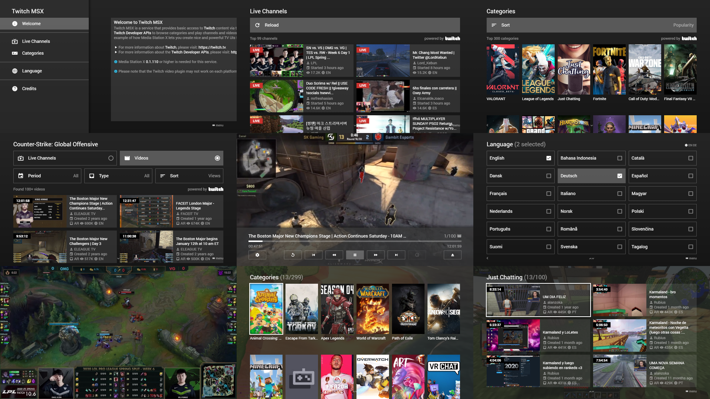

- [Show Video](https://www.youtube.com/watch?v=PsBXM3ZytVs)
- [Launch Demo](https://msx.benzac.de/?start=menu:request:interaction:init@https://ttv.msx.benzac.de/interaction)

---

### **Lorem Picsum MSX**

Lorem Picsum MSX is a service designed to inspire you to create media pages in different styles and for different purposes using the Media Station X application. It uses the latest **MSX APIs** to create the content and the **Lorem Picsum API** to fill it with random images.

- For more information about the **MSX APIs**, please see the **API** section in the navigation menu.
- For more information about the **Lorem Picsum API**, please visit: [https://picsum.photos](https://picsum.photos).

For this service, Media Station X **0.1.112** or higher is needed. Enter the start parameter **`lp.msx.benzac.de`** to set it up.

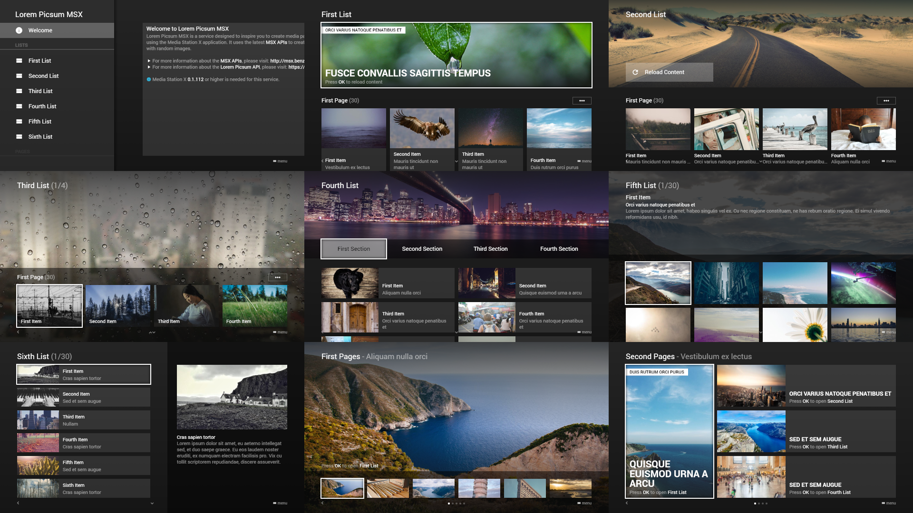

- [Show Video](https://www.youtube.com/watch?v=xIWYN7oOavw)
- [Launch Demo](https://msx.benzac.de/?start=menu:user:https://lp.msx.benzac.de/msx/service.php)

---

### **RBTV MSX**

RBTV MSX is a service that provides access to the media library of **Rocket Beans TV** (RBTV) via the Media Station X application. It uses the **Rocket Beans TV API** to browse and play RBTV content.

- For more information about **Rocket Beans TV**, please visit: [https://rocketbeans.tv](https://rocketbeans.tv).
- For more information about the **Rocket Beans TV API**, please visit: [https://github.com/rocketbeans/rbtv-apidoc/](https://github.com/rocketbeans/rbtv-apidoc/).
- For checking out the source code of this service, please visit: [https://github.com/benzac-de/rbtv-msx/](https://github.com/benzac-de/rbtv-msx/).

For this service, Media Station X **0.1.150** or higher is needed. Enter the start parameter **`rbtv.msx.benzac.de`** to set it up.

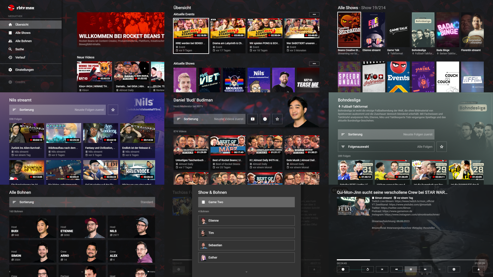

- [Show Video](https://www.youtube.com/watch?v=e-l7Wy70nbE)
- [Launch Demo](https://rbtv.msx.benzac.de)

---

### **Euronews MSX**

Euronews MSX is a service that provides access to **Euronews** MRSS feeds via the Media Station X application. It has been primarily developed to show an example of how Media Station X lets you create nice and powerful TV UIs from existing MRSS feeds.

- For more information about **Euronews**, please visit: [https://www.euronews.com](https://www.euronews.com).

For this service, Media Station X **0.1.146** or higher is needed. Enter the start parameter **`en.msx.benzac.de`** to set it up.

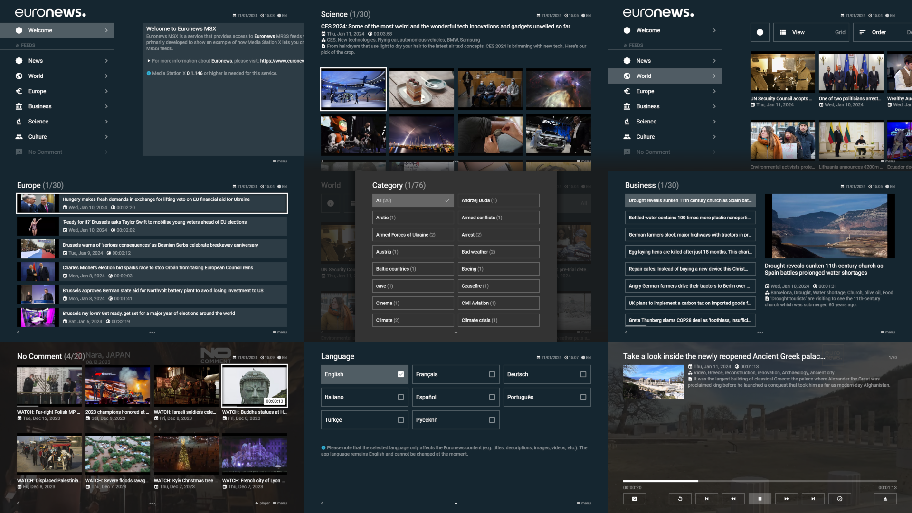

- [Show Video](https://www.youtube.com/watch?v=6Ruzubq4hAU)
- [Launch Demo](https://msx.benzac.de/?start=menu:https://en.msx.benzac.de/msx/service.php%3Fid%3D%7BID%7D)

---

### **YT Channel Feeds MSX**

YT Channel Feeds MSX is a service that provides access to selected **YouTube** channel feeds from various categories via the Media Station X application. It has been primarily developed to show an example of how Media Station X lets you create nice and powerful TV UIs from existing YouTube channel feeds.

- For more information about **YouTube**, please visit: [https://www.youtube.com](https://www.youtube.com).
- For creating your own Media Station X launcher with your favorite YouTube channels, please visit: [https://yt.msx.benzac.de](https://yt.msx.benzac.de).

For this service, Media Station X **0.1.146** or higher is needed. Enter the start parameter **`yt.msx.benzac.de`** to set it up.

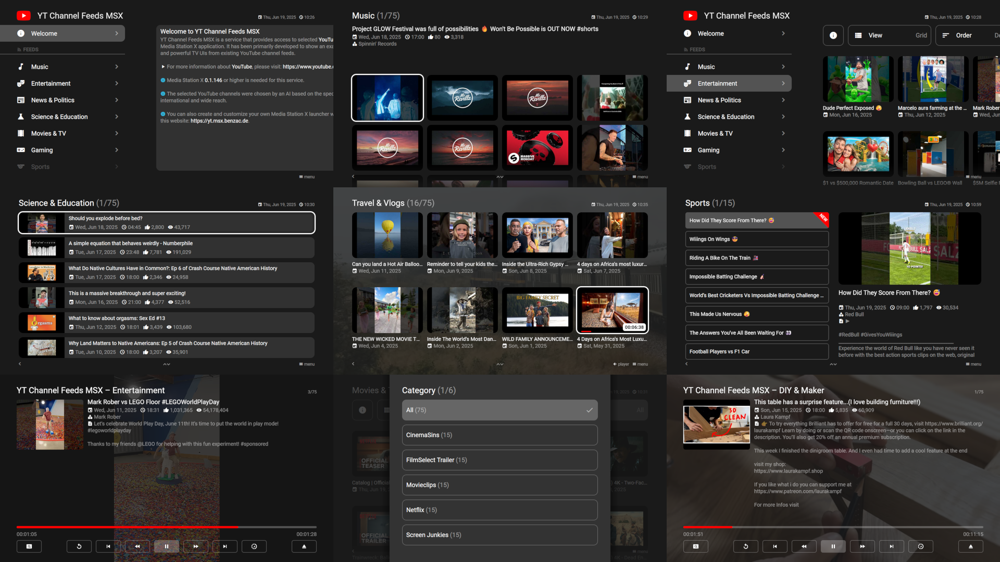

- [Show Video](https://www.youtube.com/watch?v=x_qR3KEsBHU)
- [Launch Demo](https://msx.benzac.de/?start=menu:https://yt.msx.benzac.de/services/content.php%3Fid%3D%7BID%7D)

---

### **Launcher MSX**

Launcher MSX is a service that helps you to manage various start parameters. Once the launcher has been set up, it is available via the settings (**Settings → Welcome Pages**). The start parameters are stored on the launcher.msx.benzac.de server for each specific device by using a unique device ID. Initially, the **MSX Showcases** (shown on this page) are added. If you reset the start parameters, they will be permanently deleted from the server until you change/add any again.

- For more information about the data privacy, please see **Data Privacy**.

For this service, Media Station X **0.1.132** or higher is needed. Enter the start parameter **`id:x`** or **`msx.benzac.de`** or **`launcher.msx.benzac.de`** to set it up.

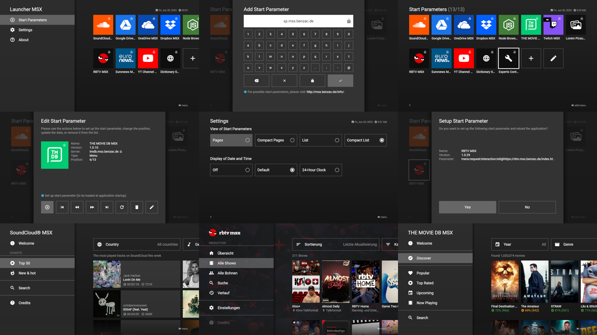

- [Show Video](https://www.youtube.com/watch?v=9Xapp9Kc1ok)
- [Launch Demo](https://msx.benzac.de/?start=menu:request:interaction:init@https://launcher.msx.benzac.de/interaction)

## See also

- [Common Misconceptions → Licensing, authorship & open source](../reference/common-misconceptions.md#licensing-authorship--open-source) — these Showcases are not generally open source; only RBTV MSX is
