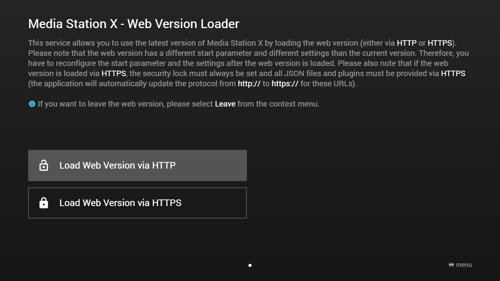
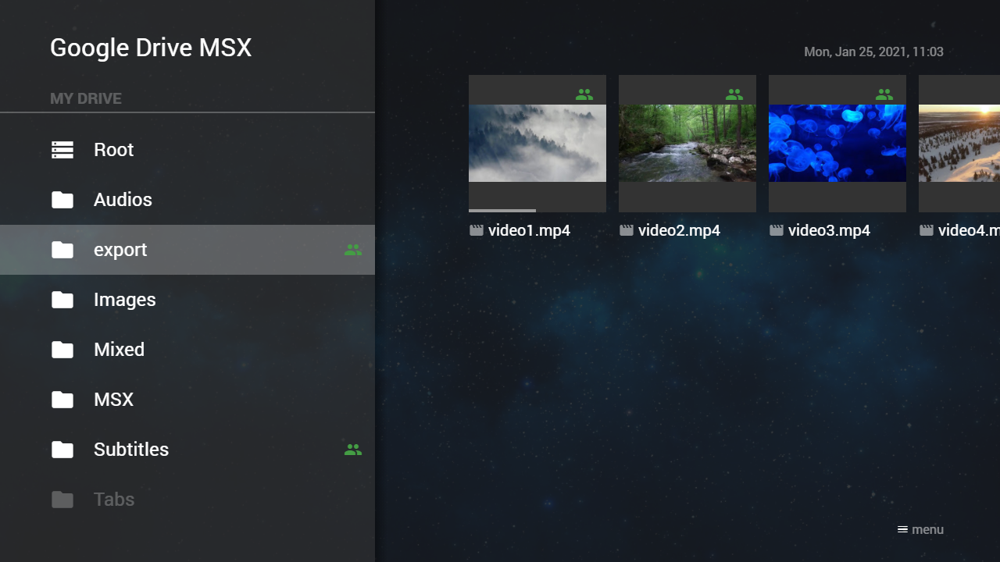
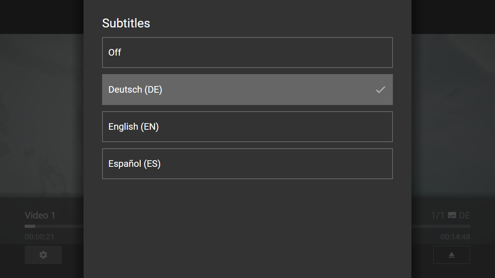
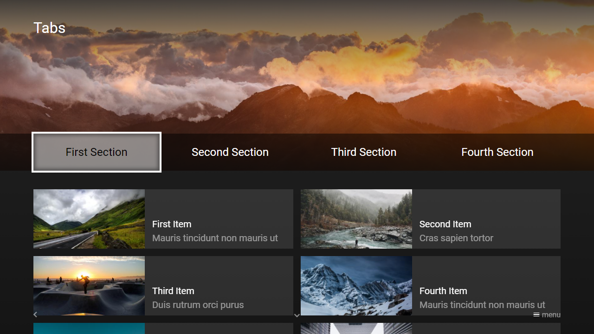
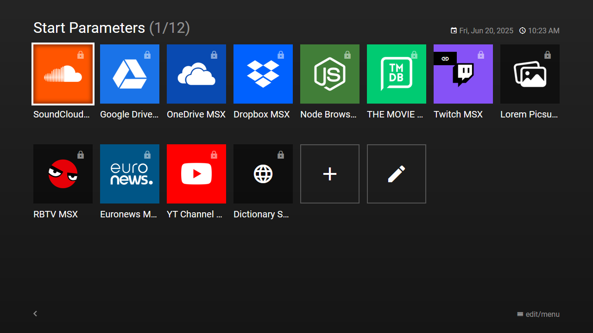

# Tips & Tricks

## Distributed Versions

Distributed versions were mainly developed for legacy/outdated TV devices that no longer have an official support. However, they can also be used to test the latest features before the official version is released in stores. Please note that these versions differ from official versions in downloading all scripts and styles from the web. Therefore, the application version is always up-to-date. However, the package version can change over time (e.g. to activate required platform features in the manifest file). Therefore, these versions are only recommended for experts who know how to install and use them.

**Note: Please note that HTTPS connections often cause problems on legacy/outdated devices.**

| Platform | Supported Devices | Required Framework/OS Version | Current Package Version | Package Link | Remarks |
|---|---|---|---|---|---|
| Samsung TVs (Legacy) | 2011-2014 models | WebApi 1.0+ | dist10 | [samsung.zip](https://msx.benzac.de/dist/samsung.zip) | - |
| Samsung TVs (Legacy) | 2011-2014 models | WebApi 1.0+ | launcher2 | [samsung_launcher.zip](https://msx.benzac.de/dist/samsung_launcher.zip) | Loads directly the Launcher MSX service (workaround for local storage issues) |
| Samsung TVs (Current & Outdated) | 2015+ models | Tizen 2.3+ | dist11 | [tizen.wgt](https://msx.benzac.de/dist/tizen.wgt) | - |
| LG TVs (Legacy) | 2011-2014 models | NetCast 2.0+ | dist12 | [netcast.zip](https://msx.benzac.de/dist/netcast.zip) | - |
| LG TVs (Current) | 2014+ models | webOS 1.0+ | dist13 | [lg.ipk](https://msx.benzac.de/dist/lg.ipk) | - |

For official versions, please see: [Platform Support](platform-support.md).

Alternatively, you can try to use the [Web Version Loader](#web-version-loader) service.

## Web Version Loader

If you have an older version of Media Station X, you can use the web version loader service to load the latest version from the web. Additionally, this service allows you to load the entire Media Station X application in a secure context (i.e. via `https://`) to be able to use services like **Twitch MSX**.
Enter the start parameter **`web.msx.benzac.de`** to set it up.
Alternatively, enter the start parameter **`id:web`**, which will set up a new version of the web version loader that allows automatic loading (i.e. by setting a [Start Action](../experts-api/hidden-features/start-action.md)).

For more information about the **Twitch MSX** service, please see: [Twitch MSX](showcases.md#twitch-msx).

### Screenshot



## Google Drive MSX

### Export Feature

Please note that the Google Drive API currently does not support a proper way of streaming files. Therefore, the entire file must be downloaded into the memory. Some TV devices have problems with this (especially if the file is too large and/or if the file is a video/audio file) and will abort the process. There are two ways to fix this problem.

1. If the video/audio file is smaller than **100 MB**, share the file (or the containing folder) publicly and let the file (or folder) name start with **"export"** (e.g. **"export"**, **"export.mp4"**, **"export_My_Video.mp4"**, etc.). This will cause the Google Drive MSX service to open the file via the export link. Because export links are streamed, it should work with every TV device.
1. You can use the **OneDrive MSX** or **Dropbox MSX** service for video/audio files, because these services have functions for streaming content.

For more information about the **Google Drive MSX**, **OneDrive MSX**, and **Dropbox MSX** service, please see: [Showcases](showcases.md).

#### Screenshot



### External Subtitles

It is possible to add external subtitles with the `index.json` file feature and the [HTML5X Plugin](../experts-api/plugins/html5x-plugin.md) syntax. Please see following example code.

```json
{
    "type": "pages",
    "headline": "Videos With External Subtitles",
    "template": {
        "type": "separate",
        "layout": "0,0,2,4",
        "icon": "msx-white-soft:movie",
        "color": "msx-glass"
    },
    "items": [{
            "title": "Video 1",
            "playerLabel": "Video 1",
            "action": "video:{asset:video:video1.mp4}",
            "properties": {
                "button:content:icon": "settings",
                "button:content:action": "panel:request:player:options",	
                "html5x:subtitle": "de",
                "html5x:subtitle:de:Deutsch": "{asset:id:video1_de.vtt}",
                "html5x:subtitle:en:English": "{asset:id:video1_en.vtt}",
                "html5x:subtitle:es:Español": "{asset:id:video1_es.vtt}"				
            }
        }]
}
```

Copy this code into a file named `index.json` and place it in a Google Drive folder that contains the corresponding files (i.e. `video1.mp4`, `video1_de.vtt`, `video1_en.vtt`, and `video1_es.vtt`). In the Google Drive MSX service, this folder should now display your video item and 3 subtitles should be available. Please modify and extend this example according to your needs.

This feature also works in other cloud storage services (i.e. **OneDrive MSX**, **Dropbox MSX**, and **Node Browser MSX**). However, you should replace the action `video:{asset:video:video1.mp4}` with `video:plugin:http://msx.benzac.de/plugins/html5x.html?id={asset:id:video1.mp4}` for these services to ensure that the HTML5X plugin is used (by default, these services use the [Tizen Player](../experts-api/special/tizen-player.md) if it is available).

**Note: Please note that all referenced file names may only consist of letters, numbers, and the special characters "_", "-", ".".**

#### Screenshot



## Node Browser MSX

It is possible to use the Node Browser MSX service with other HTTP servers (instead of Node.js). To do so, you simply have to enable the directory listing function and CORS on the used server. For example, by using the following `.htaccess` file.

```bash
Header set Access-Control-Allow-Origin "*"
Header set Access-Control-Allow-Headers "Origin, Content-Type, Accept"
Header set Access-Control-Allow-Methods "GET, OPTIONS"
Options +Indexes
```

If the browser folder should not be the root folder, you can initiate a redirect in the loaded index file with the help of an HTML `meta` tag. Please see this example code of a redirected browser folder.

```html
<!DOCTYPE html>
<html>
    <head>
        <title>Node Browser Test</title>
        <meta charset="UTF-8"/>
        <meta name="node-browser-folder" content="path/to/folder"/>
    </head>
    <body>
        <h1>Node Browser Test</h1>
    </body>
</html>
```

**Note: Please note that the CORS HTTP headers must also be present for the loaded index file.**

It is also possible to integrate the Node Browser MSX service directly in your menu or content by using the following action syntax.

- `content:request:interaction:access:{SERVER}@http://nb.msx.benzac.de/interaction`

The `{SERVER}` part must be replaced with the server IP + port or hostname (e.g. `192.168.0.10:8080`).

For more information about the **Node Browser MSX** service, please see: [Node Browser MSX](showcases.md#node-browser-msx).

## Cloud Storage Service Tabs

All cloud storage services (i.e. **Google Drive MSX**, **OneDrive MSX**, **Dropbox MSX**, and **Node Browser MSX**) support the `index.json` file feature. This feature allows you to display a folder as MSX content. It is also possible to exchange the `index.json` with another JSON file (e.g. `section2.json`) via the `interaction:commit:message:index:{FILE}` action. This allows you to implement tabs in the corresponding folder. Please see following example code.

Example code of exchanging `index.json` with `section2.json` file to implement tabs (file differences are highlighted):

#### `index.json`

```json
{
    "type": "list",
    "headline": "Tabs",
    "preload": "next",
    "pages": [{
            "important": true,
            "offset": "0,0,0,0.25",
            "items": [{
                    "type": "space",
                    "layout": "0,0,12,3",
                    "offset": "-1.25,-1,2,1",
                    "color": "msx-glass",
                    "image": "https://picsum.photos/seed/msx_665e1e1c_bg/1992/552",
                    "imageFiller": "cover",
                    "imageOverlay": 4
                }, {
                    "type": "space",
                    "layout": "0,1,12,1",
                    "offset": "-1.25,1,2,0",
                    "color": "msx-black-soft"
                }, {
                    "type": "default",
                    "layout": "0,2,3,1",
                    "focus": true,
                    "color": "msx-white-soft",
                    "label": "{col:msx-black}First Section",
                    "action": "interaction:commit:message:index:default"
                }, {
                    "type": "default",
                    "layout": "3,2,3,1",
                    "color": "transparent",
                    "label": "Second Section",
                    "action": "interaction:commit:message:index:section2.json"
                }, {
                    "type": "default",
                    "layout": "6,2,3,1",
                    "color": "transparent",
                    "label": "Third Section",
                    "action": "interaction:commit:message:index:section3.json"
                }, {
                    "type": "default",
                    "layout": "9,2,3,1",
                    "color": "transparent",
                    "label": "Fourth Section",
                    "action": "interaction:commit:message:index:section4.json"
                }]
        }]
}
```

#### `section2.json`

```json
{
    "type": "list",
    "headline": "Tabs",
    "preload": "next",
    "pages": [{
            "important": true,
            "offset": "0,0,0,0.25",
            "items": [{
                    "type": "space",
                    "layout": "0,0,12,3",
                    "offset": "-1.25,-1,2,1",
                    "color": "msx-glass",
                    "image": "https://picsum.photos/seed/msx_470ca6ad_bg/1992/552",
                    "imageFiller": "cover",
                    "imageOverlay": 4
                }, {
                    "type": "space",
                    "layout": "0,1,12,1",
                    "offset": "-1.25,1,2,0",
                    "color": "msx-black-soft"
                }, {
                    "type": "default",
                    "layout": "0,2,3,1",
                    "color": "transparent",
                    "label": "First Section",
                    "action": "interaction:commit:message:index:default"
                }, {
                    "type": "default",
                    "layout": "3,2,3,1",
                    "focus": true,
                    "color": "msx-white-soft",
                    "label": "{col:msx-black}Second Section",
                    "action": "interaction:commit:message:index:section2.json"
                }, {
                    "type": "default",
                    "layout": "6,2,3,1",
                    "color": "transparent",
                    "label": "Third Section",
                    "action": "interaction:commit:message:index:section3.json"
                }, {
                    "type": "default",
                    "layout": "9,2,3,1",
                    "color": "transparent",
                    "label": "Fourth Section",
                    "action": "interaction:commit:message:index:section4.json"
                }]
        }]
}
```

Please note that you can also load JSON files inside the corresponding folder with the `menu:{asset:menu:{FILE}}` and `content:{asset:content:{FILE}}` action.

For more information about the **Google Drive MSX**, **OneDrive MSX**, **Dropbox MSX**, and **Node Browser MSX** service, please see: [Showcases](showcases.md).

### Screenshot



## External HTML5 Games/Apps

It is possible to open external HTML5 games or apps with the `link:{URL}` action. However, in most cases you will not be able to return to the Media Station X application due to the lack of an exit function in the loaded game/app. The only way out in this case is to exit and restart the entire application. For this reason, the link validation is enabled by default in the Media Station X settings (**Settings** → **Validate Links**).

If you would like to open your own HTML5 game or app from the Media Station X application, you should also include an exit button in your game/app to give users the chance to return to the Media Station X application. For example, this can be done by using the following JavaScript function.

```js
function exitToRootApp() {
    window.history.go(1 - window.history.length);
}
```

For external portal/playlist apps that also support opening links, you can add the following entry: [http://msx.benzac.de/exit.html](http://msx.benzac.de/exit.html). This link does nothing more than executing the `exitToRootApp` function described above.

## External Platform Games/Apps

It is possible to launch external games or apps (which are installed on the current platform) with the `system:{PLATFORM}:launch` or `system:{PLATFORM}:launch:{APP_ID}` action. Please note that the syntax for launching external games/apps is different for each platform. Please see following examples.

Examples of launching external platform games/apps:

#### HbbTV

```json
{
    "action": "system:hbbtv:launch:{APP_ID}"
}
```

The `{APP_ID}` part must be replaced with an HbbTV-compatible URL (e.g. `http://msx.benzac.de/hbbtv.html`).

#### LG TVs

```json
{
    "action": "system:lg:launch:{APP_ID}",
    "data": {
        "properties": {
            "customKey1": "customValue1",
            "customKey2": "customValue2" 
        }
    }
}
```

The `{APP_ID}` part must be replaced with an LG-specific application identifier (e.g. `com.example.app`).

**Note: All properties in the `data` object are optional.**

#### Samsung TVs

```json
{
    "action": "system:samsung:launch:{APP_ID}"
}
```

The `{APP_ID}` part must be replaced with a Samsung-specific application identifier (e.g. `ExampleApp`).

#### Tizen

```json
{
    "action": "system:tizen:launch:{APP_ID}",
    "data": {        
        "operation": "{OPERATION}",
        "uri": "{URI}",
        "type": "{MIME_TYPE}",
        "category": "{CATEGORY}",
        "mode": "{MODE}",
        "properties": {
            "customKey1": "customValue1",
            "customKey2": "customValue2" 
        }
    }
}
```

The `{APP_ID}` part must be replaced with a Tizen-specific application identifier (e.g. `ExamplePackage.ExampleApp`).

The `{OPERATION}` part must be replaced with a Tizen-specific operation (e.g. `http://tizen.org/appcontrol/operation/view`).

The `{URI}` part must be replaced with an action-specific URI (e.g. `http://link.to.media`).

The `{MIME_TYPE}` part must be replaced with an action-specific mime type (e.g. `video/*`).

The `{CATEGORY}` part must be replaced with a Tizen-specific category (e.g. `video`).

The `{MODE}` part must be replaced with a Tizen-specific launch mode (i.e. `SINGLE` or `GROUP`).

**Note: All properties in the `data` object are optional. It is also possible to omit the `:{APP_ID}` part in order to perform an implicit launch (i.e. `"system:tizen:launch"`).**

#### Android/iOS (TVX)

```json
{
    "action": "system:tvx:launch:{APP_ID}",
    "data": {
        "id": "{REQUEST_ID}",
        "uri": "{URI}",
        "type": "{MIME_TYPE}",
        "component": {
            "package": "{PACKAGE}",
            "class": "{CLASS}"
        },
        "extra": {
            "customKey1": "customValue1",
            "customKey2": "customValue2" 
        }
    }
}
```

For iOS devices, the `{APP_ID}` part must be replaced with an iOS-specific URL (e.g. `example://http://link.to.media`).

For Android devices, the `{APP_ID}` part must be replaced with an Android-specific package name (e.g. `com.example.app`).

The `{REQUEST_ID}` part must be replaced with a custom request ID (e.g. `request_id`).

For Android devices, the `{URI}` part must be replaced with an action-specific URI (e.g. `http://link.to.media`).

For Android devices, the `{MIME_TYPE}` part must be replaced with an action-specific mime type (e.g. `video/*`).

For Android devices, the `{PACKAGE}` part must be replaced with an Android-specific package name (e.g. `com.example.app`).

For Android devices, the `{CLASS}` part must be replaced with an Android-specific class name (e.g. `com.example.app.player`).

**Note: All properties in the `data` object are optional. For Android devices, it is also possible to omit the `:{APP_ID}` part in order to perform an implicit launch (i.e. `"system:tvx:launch"`).**

#### Universal Windows Platform (UWP)

```json
{
    "action": "system:uwp:launch:{APP_ID}"
}
```

The `{APP_ID}` part must be replaced with any URL (e.g. `http://msx.benzac.de`).

## Unique Device ID

It is tricky to get a unique device ID for every platform, because some platforms do not provide such kind of information. Please see the [Attached Data Examples](../experts-api/special/attached-data-examples.md) (specifically, `execute:info:extended:{URL}`). It shows which information can be read out from the Media Station X application. The information under `info.system` contains platform-specific data and can contain a `macAddress` or `deviceId`, which can be used as unique device ID. If this information is missing, the platform does not provide a unique device ID. Since version **0.1.142**, you can use the property `info.id` as fallback. This is an automatically generated unique ID when the application is used for the first time. However, this ID will change if you uninstall and reinstall the application or if the application data is completely cleared.

If you are implementing a video/audio or interaction plugin, you can use the `getDeviceId(data)` or `requestDeviceId(callback)` function, which returns a unique device ID based on the information provided by the platform. Please see [Plugin API Reference](../experts-api/plugins/plugin-api-reference.md) for more information.

## Launcher MSX

It is possible to add a `launcher` object (that can contain a `type`, `icon`, `image`, and/or `color` property) to the [Start Object](../main-api/start/start-object.md) to change the behavior and/or appearance of the start parameter item in the **Launcher MSX** service. Please see following example code.

```json
{
    "name": "SoundCloud® MSX",
    "version": "1.0.14",
    "parameter": "menu:user:{PREFIX}{SERVER}/msx/service.php",
    "launcher": {
        "type": "default",
        "icon": "music-note",
        "image": "none",
        "color": "#f75219"
    }
}
```

The `type` property can have the following values (by default, it is set to `"default"`).

- `"start"`: This start parameter can only be loaded at application startup (it is not possible to launch it directly)
- `"reference"`: This start parameter can contain a reference (it is resolved before it is launched directly; optionally, it can be be loaded at application startup)
- `"default"`: This start parameter is launched directly (optionally, it can be be loaded at application startup)

It is also possible to override the `name`, `version`, and/or `parameter` property inside the `launcher` object to use different values for the **Launcher MSX** service. The `parameter` property inside the `launcher` object can also contain a `link:{URL}` action. Please see following example code.

```json
{
    "name": "Twitch MSX",
    "version": "1.0.5",
    "parameter": "menu:request:interaction:init@{PREFIX}{SERVER}/interaction",
    "launcher": {
        "parameter": "link:https://msx.benzac.de/?start=menu:request:interaction:init@{PREFIX}{SERVER}/interaction&leave=1",
        "icon": "videogame-asset",
        "image": "none",
        "color": "#8c45f7"
    }
}
```

For more information about the **Launcher MSX** service, please see: [Launcher MSX](showcases.md#launcher-msx).

### Screenshot



## Common Errors

### Server responded with status: 0

If you get this error message, it means that there is no valid server response. The most common reason for an invalid server response is if no CORS headers are set (please see [Setup Precondition](../main-api/start/setup-precondition.md)) or the HTTPS certificate cannot be verified by the current platform. In the latter case, you can try (if you get this error while setting up a start parameter) to unset the security lock in order to try to connect via HTTP.

In general, it is recommended to test the content on different TV and mobile devices to identify the cause of the error. In this regard, please see the following hints.

- If you are getting this error on mobile but not on TV devices, the CORS headers are probably missing or incorrect (some older TV devices ignore CORS headers and allow any content).
- If you are getting this error on TV but not on mobile devices, the HTTPS certificate can probably not be verified (some older TV devices cannot verify newer HTTPS certificates).

### The application cannot be started because a UI component could not be loaded

There are currently a lot of requests on the server and the trend is increasing. Unfortunately, the current server does not have enough power to answer all requests. Therefore, errors can occur more frequently. If you are getting this error, please wait a few minutes and try it again.

## Well Known Issues

### Storage on iOS devices

On iOS devices the `window.localStorage` object is not persistent within plugins (all data will be cleared when the application is closed). Please use the `TVXServices.storage` object instead, which is basically a wrapper for the `window.localStorage` object, but also includes workarounds for specific platforms. Please ensure that the `TVXServices.storage` object is accessed after the `TVXPluginTools.onReady` callback. Please see following example codes.

#### Video/Audio Plugin Example

```js
//TVXServices.storage should not be accessed
function MyPlayer() {
    //TVXServices.storage can be accessed
}

//TVXServices.storage should not be accessed
TVXPluginTools.onReady(function() {
    //TVXServices.storage can be accessed
    TVXVideoPlugin.setupPlayer(new MyPlayer());
    TVXVideoPlugin.init();
});
```

#### Interaction Plugin Example

```js
//TVXServices.storage should not be accessed
function MyHandler() {
    //TVXServices.storage can be accessed
}

//TVXServices.storage should not be accessed
TVXPluginTools.onReady(function() {
    //TVXServices.storage can be accessed
    TVXInteractionPlugin.setupHandler(new MyHandler());
    TVXInteractionPlugin.init();
});
```

### Cookies on Android devices

Android devices (and most modern browsers) follow the `SameSite` cookie policy ([SameSite cookies explained](https://developers.google.com/search/blog/2020/01/get-ready-for-new-samesitenone-secure)). Therefore, please set cookies via HTTPS with `SameSite=None` and the `Secure` flag (e.g. `Set-Cookie: key=value; SameSite=None; Secure`) to ensure that cookies are working on all platforms.

### Links on Universal Windows Platform (UWP) devices

For security reasons, it is not possible to open external links on UWP devices within the application (i.e. by using the `link:{URL}` action). Depending on the used device, an external link is not opened at all or it is opened with the standard web browser.

### Storage on legacy Samsung devices (2011-2012 models)

On legacy Samsung devices (2011-2012 models) the local storage is not persistent within the application (all data will be cleared when the application is closed). It is recommended to install the **launcher1** package from the [Distributed Versions](#distributed-versions) for these devices, which loads directly the Launcher MSX service that stores all start parameters on a server.

## Emergency Combination

On some platforms it is possible to set any layout resolution and/or scaling in the application settings. This is necessary to adjust incorrectly recognized screen values. However, this could also lead to incorrect values being set, making the app unusable. If the screen becomes too small/large after reloading, you can enter the emergency combination (`911` or `↑↑↓↓←→←→` followed by `OK`) to reset the settings. This feature is available since version **0.1.153**.

## MSX Editor Plugin

This plugin can be used with any online web code editing tool (e.g. **CodePen**, **JSFiddle**, **PlayCode**, etc.). You just have to setup the **HTML** template ([https://msx.benzac.de/info/xp/editor.html](https://msx.benzac.de/info/xp/editor.html)) inside the tool and use the following **JS** functions to show menus, contents, or panels or to execute actions. Additionally, there is an option to export the data as base64-encoded JSON and to open it in an external window.

- `showMenu(data);`
- `showContent(data);`
- `showPanel(data);`
- `exexuteAction(action, data);`
- `exportData(icon, alias);`

Please see following templates.

- **CodePen**: [codepen.io/benzac-de/pen/gOQJZGX](https://codepen.io/benzac-de/pen/gOQJZGX)
- **JSFiddle**: [jsfiddle.net/fnL3pzqd/](https://jsfiddle.net/fnL3pzqd/)

## See Also

- [In-App Settings Reference](../reference/settings-reference.md) — the Context Menu (Home/Player/Volume/Settings/Exit) reachable via the menu key, referenced from the External HTML5 Games/Apps and Emergency Combination sections above
